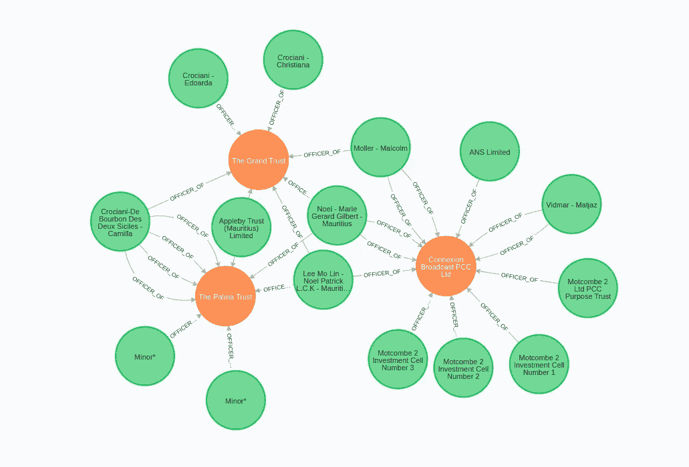
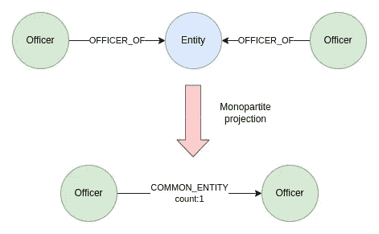

# Neo4j 中的批处理事务

> 原文：<https://towardsdatascience.com/batching-transactions-in-neo4j-1001d12c9a4a>

## 了解 APOC 和本地 Cypher 批处理事务方法的区别


在 [Unsplash](https://unsplash.com?utm_source=medium&utm_medium=referral) 上由 [Bernd Dittrich](https://unsplash.com/@hdbernd?utm_source=medium&utm_medium=referral) 拍摄的照片

当在 Neo4j 中处理大量图形和更大范围的更新时，如果不采用批处理事务，您可能会耗尽堆内存。虽然您可以使用自己喜欢的脚本语言来批处理事务，但是您也可以直接在 Cypher 中或者在 APOC 库的帮助下将一个 Cypher 查询拆分成多个事务。
本文旨在演示后者，也就是说我们将只看如何将一个 Cypher 查询拆分成多个事务。

我们将使用由国际调查记者联盟(ICIJ)提供的 [ICIJ 天堂文件数据集](https://sandbox.neo4j.com/?usecase=icij-paradise-papers)。ICIJ 在出版引人注目的研究方面有着悠久的历史，如《巴拿马》、《天堂》和最新的《潘多拉文件》。如果你感兴趣，你可以在他们的网站上探索[数据集，或者下载数据(在开放数据库许可下授权)并用你最喜欢的数据挖掘工具探索。幸运的是，数据集可以作为 Neo4j 沙盒项目使用。Neo4j 沙盒是 Neo4j 的一个免费云实例，附带一个预填充的数据库。点击](https://offshoreleaks.icij.org/)[下面的链接](https://sandbox.neo4j.com/?usecase=icij-paradise-papers)来创建你自己的 Paradise Papers 数据集的沙盒实例。

虽然图模型稍微复杂一点，但是我们将只使用图的以下子集来进行演示。



天堂论文图的子集。图片由作者提供。

我们只对军官(绿色)和实体(橙色)以及两者之间的军官 _ 关系感兴趣。这实质上是一个包含两种类型节点的双向网络。为了分析二部网络，作为分析的第一步，我们经常把它们转换成一个单部网络。在这个例子中，我们将使用上面的两部分网络，并设计一个代表官员的单部分网络，他们之间的关系将定义他们是否有以及有多少个实体是共同的。



军官的单方投射。图片由作者提供。

这是 Cypher 中一个简单的操作。我们简单地匹配原始模式并计算出现的次数，并可选地将结果存储为官员之间的关系。但是，这些类型的操作很可能会导致行数激增。

```
MATCH (n:Officer)-[:OFFICER_OF]->(:Entity)<-[:OFFICER_OF]-(m)// avoid duplication
WHERE id(n) < id(m)// count the number of occurrences per pair of node
WITH n,m, count(*) AS common// return the total number of rows
RETURN count(*) AS numberOfRows
```

在我们的示例中，我们需要创建 1.313.187 关系，以投射一个由官员组成的单一参与者网络，并将公共实体的数量存储为关系权重。如果两个官员没有共同的实体，则不会创建关系。

不幸的是，Neo4j 沙盒实例只有 1GB 的堆内存。因此，在单个事务中创建超过一百万个关系可能会遇到内存问题。在继续之前，我们需要增加事务超时设置。默认情况下，沙盒实例的事务超时为 30 秒，这意味着如果事务持续时间超过 30 秒，它将自动终止。我们可以通过设置以下事务超时配置来避免这种情况。

```
CALL dbms.setConfigValue(‘dbms.transaction.timeout’,’0');
```

对于那些对 Neo4j 和批处理有一些经验的人来说，您可能熟悉`apoc.periodic.iterate`过程，它经常用于批处理事务。

```
CALL apoc.periodic.iterate( // first statement
  "MATCH (n:Officer)-[:OFFICER_OF]->()<-[:OFFICER_OF]-(m)
   WHERE id(n) < id(m)
   WITH n,m, count(*) AS common
   RETURN n,m, common",
  // second statement
  "MERGE (n)-[c:COMMON_ENTITY_APOC]->(m)
   SET c.count = common", 
  // configuration
  {batchSize:50000})
```

在第一个语句中，我们提供了要操作的数据流。数据流可以由数百万行组成。第二条语句执行实际的更新。在我们的例子中，它将在一对军官之间创建一个新的关系，并将计数存储为关系权重。通过在配置中定义`batchSize`参数，我们描述了在单个事务中提交的行数。例如，通过将`batchSize`设置为 50.000，事务将在第二条语句执行 50.000 次后提交。在我们的例子中，第一条语句产生 130 万行，这意味着更新将被分成 26 个事务。

在 Neo4j 4.4 中，批处理事务作为一个本地 Cypher 特性被引入。要只使用 Cypher 对事务进行批处理，您必须定义一个更新图形的[子查询](https://neo4j.com/docs/cypher-manual/current/clauses/call-subquery/)，然后是`IN TRANSACTIONS OF X ROWS`。

```
:auto MATCH (n:Officer)-[:OFFICER_OF]->()<-[:OFFICER_OF]-(m)
WHERE id(n) < id(m)
WITH n,m, count(*) AS common
CALL {
 WITH n,m,common
 MERGE (n)-[c:COMMON_ENTITY_CYPHER]->(m)
 SET c.count = common} IN TRANSACTIONS OF 50000 ROWS
```

如果在 Neo4j 浏览器中执行上述 Cypher 语句，必须在前面加上`:auto`命令。否则，在用您喜欢的脚本语言执行这个 Cypher 查询时，您可以省略它。逻辑与 APOC 配料相同。我们首先定义数据流(第一条语句)，然后使用子查询(第二条语句)来批量处理大量更新。

## 什么时候用哪个？

那么有什么区别呢，什么时候应该用哪个呢？

我认为最大的区别在于他们处理错误的方式。首先，如果一个批处理中的一次执行失败，那么整个批处理都会失败，不管您是使用 APOC 还是 Cypher 来批处理事务。但是，在单个批处理失败后，Cypher 变体将不会继续操作，并且之前成功提交的所有事务都不会回滚。因此，如果第三个事务失败，前两个成功提交的事务将不会回滚。
相反，如果一个中间批次失败，APOC 变体没有问题，并且不管怎样都会遍历所有批次。此外，APOC 还可以定义批处理失败时的重试次数，这是本机 Cypher 事务批处理所缺乏的。

例如，当您想通过外部 API 更新节点时，我建议使用值为 1 的`apoc.periodic.iterate`。由于外部 API 是不可预测的，并且可能成本很高，所以我们希望存储从 API 收集的所有信息，并遍历所有节点，不管中间是否有更新失败。

`apoc.periodic.iterate`的另一个特性是可以选择并行运行更新语句。我们需要确保在进行并行更新时不会遇到任何死锁。否则，事务执行将失败。根据经验，在创建关系时不能使用并行执行，因为查询可能会尝试创建从同一节点开始或结束的多个关系，这将导致节点死锁和执行失败。然而，当您更新单个节点属性一次时，您可以确信您不会遇到任何死锁。例如，如果您想将节点度数存储为节点属性，您可以使用并行执行。

```
CALL apoc.periodic.iterate(
  "MATCH (o:Officer)
   RETURN o",
   "WITH o, size((o)--()) AS degree
    SET o.degree = degree", 
   {batchSize:10000, parallel: true})
```

## 结论

总而言之，`apoc.periodic.iterate`似乎是事务程序家族中年龄更大、更成熟的兄弟。到目前为止，我更倾向于使用 APOC 批处理，而不是本地 Cypher 批处理。我认为 Cypher 方法的唯一优点是，如果你想在一个批次失败后终止操作，否则我仍然建议使用 APOC。

*附:如果你对图形分析感兴趣，我已经准备了一个 s* [*以前天堂论文数据集的充足图形分析*](https://tbgraph.wordpress.com/2018/02/19/paradise-papers-analysis-with-neo4j/) *s*