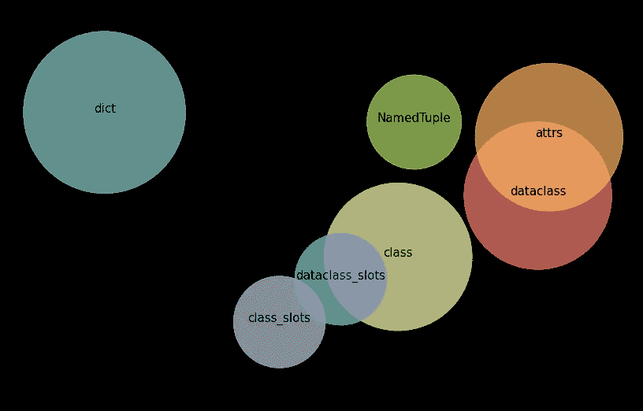
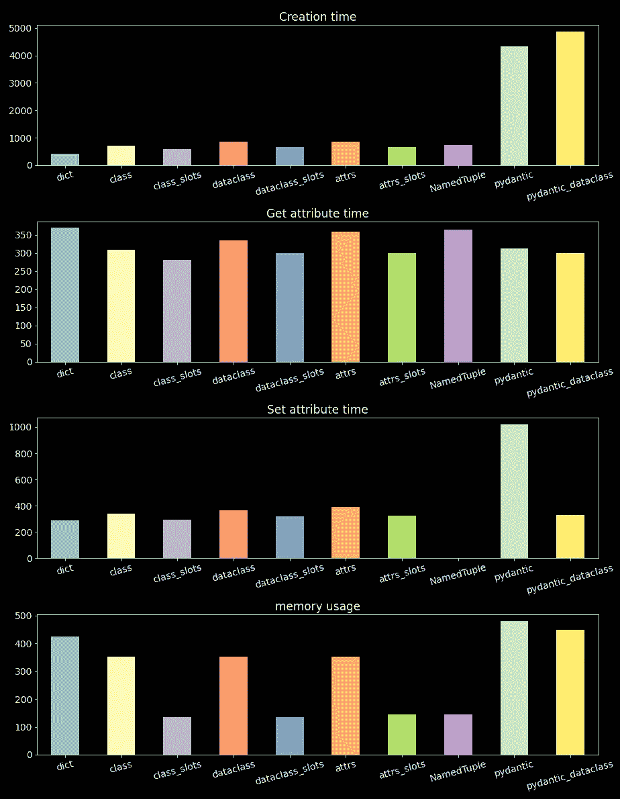
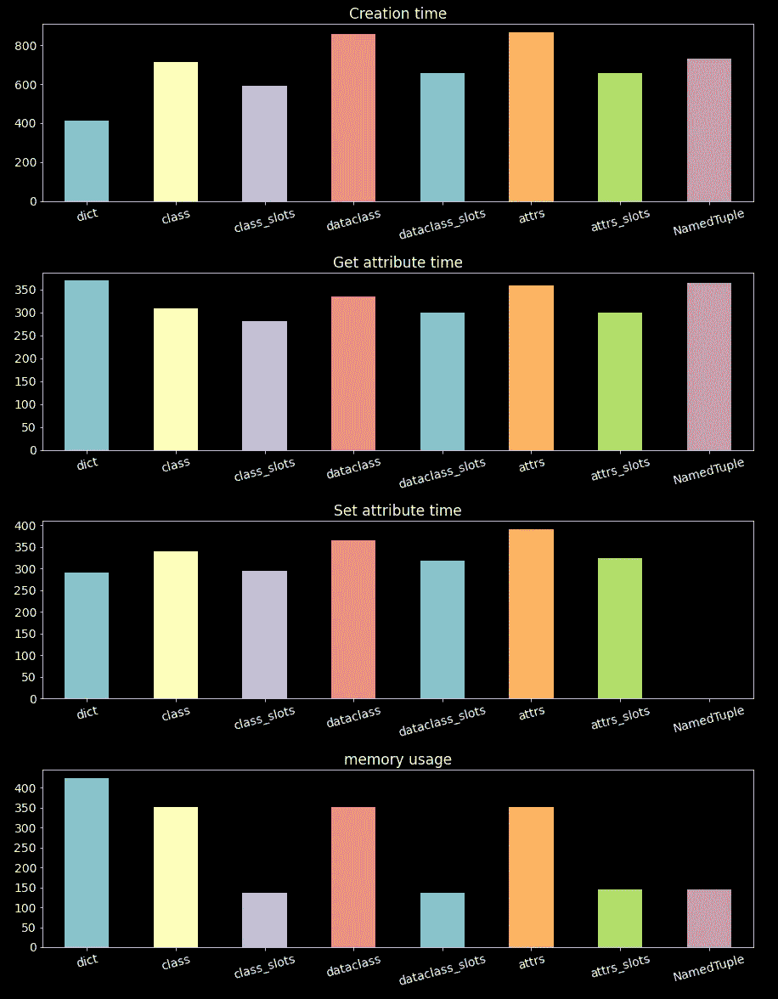
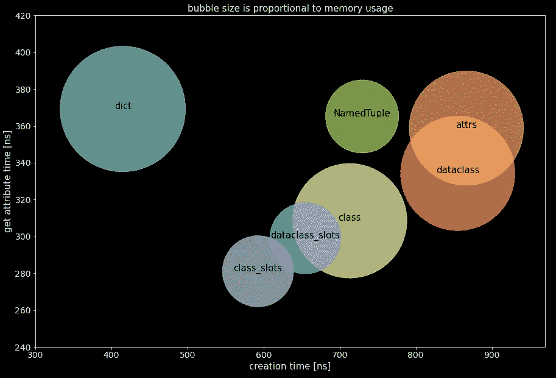

# 数据容器之战——哪种 Python 类型的结构是最好的？

> 原文：<https://towardsdatascience.com/battle-of-the-data-containers-which-python-typed-structure-is-the-best-6d28fde824e>

## Class，dataclass，attrs，pydantic 还是 NamedTuple，哪个容器最适合你的项目？让我们找出答案。

图片作者。

我们开始了一个全新的项目，积极性很高。在基本规划完成后，我们开始对我们的应用程序进行初始分类，我们即将构建将通过我们的应用程序管道流动的数据模型。

突然我们碰了壁，我们必须在项目的早期做出妥协的选择，**我们应该选择什么样的数据容器，静态输入信息？**

十年前，选择会更简单。那时候没有打字模块。数据容器是非常基本的。十年过去了，情况有了很大的不同，Python 作为一种语言已经有了巨大的发展，它的社区也是如此。**大多数 ide 都支持静态类型，这使得类型提示成为大型项目的必备条件和所有代码的最佳实践。**

所以回到我们的问题，我们应该选择哪个容器？有许多选择，事实上是伟大的选择。没有明确的目标，但是在这个故事中，我们将测试和比较一些最流行的容器。在故事的结尾，选择应该更简单，你应该能够根据我们项目的需求来选择。

## 目录

*   关于 __slots__ 的快速注释
*   编写测试代码
*   普通班
*   数据类
*   属性
*   Pydantic
*   命名元组
*   控制，字典
*   试验结果
*   结论

## 关于 __slots__ 的快速注释

插槽是一种让类更有效的内存和更快的方法。通过使用槽，我们显式地定义(硬编码)了类的属性。

标准 Python 类在 __dict__ dunder 方法中存储属性(在幕后)，顾名思义，这是一个字典。这允许我们在运行时设置新的属性。如果我们不想在运行时设置新的属性，这不是很有效。

另一个选择是使用 __slots__ dunder 方法，它覆盖 __dict__。在标准类中，我们必须对属性进行硬编码，但是有一些数据容器提供了像布尔标志这样简单的插槽功能(将在接下来的部分中显示)。

## 编写测试代码

时间是关键，性能是大多数应用程序的关键。

因此，在我们开始测试之前，我们创建了一个小的 *Timer* 类来测量纳秒级的时间。该类使用来自*时间*标准模块的“perf_counter_ns”方法，这是测量两个事件之间时间的最精确方法(来自*时间*模块)。

这个*定时器*非常简单，它公开了一个“start()”方法和一个“stop()”方法，以及一个“time”属性来检索定时器的结果。

所有将被测试的容器都应该实现这个简单的协议(接口):

我们将执行的测试包括:

*   创建对象所花费的时间，“时间 _ 人员 _ 创建”
*   从类“time_person_get”中获取属性所花费的时间
*   在类“time_person_set”中设置属性所花费的时间(注意，这只适用于可变对象)
*   对象使用的内存(以字节为单位)(为此我们使用 Pympler，一个简洁的内存分析第三方库)

下面的代码将我们的四个测试封装到一个函数(“test_person_container”)中，该函数运行测试的 *n_trials* 并报告每个测试的平均值。该函数有一个布尔标志参数 *test_set* ，其中*T5 表示是否测试 set 属性(对于不可变对象，应该设置为 *False* )。*

测试结果在一个*PersonTestResult*object*中返回(注意，尽管这是一个 dataclass，但它不是测试的一部分)。*

## *普通班*

*我们的第一个容器是普通的旧类。我们用 __dict__ 方法( *PersonClass* )测试标准类，用 slots(*person class slots)*测试另一个类。*

*就可读性而言，注意单词“name”和“age”在每个类定义中出现的次数。这是使用常规类的一个巨大缺点。*

*另一个缺点是当我们打印一个类的实例时会发生什么，对于一个普通的类，会打印一个内存地址。这对于数据容器来说不是很方便。要解决这个问题，我们必须用我们想要打印的信息编写一个 __repr__ dunder 方法。这将进一步增加单词“姓名”和“年龄”被书写的次数。*

*对数据使用通用类还有许多其他注意事项。*

*所以总的来说，将常规类用作包含输入信息的数据容器并不是最好的主意，但仍然是可行的。*

## *数据类*

*在 Python 3.7 中引入了 dataclasses，它们解决了上一节中讨论的许多问题。我只想说，**数据类很棒**。我一直在使用它们，只是喜欢使用它们。然而，这不会使测试有偏差。*

*数据类(直到 Python 3.10)的一个主要问题是没有简单的方法来使用槽。但是如果你使用的是 Python 3.10+你是 golden，你可以使用 slots 布尔标志作为参数。使用数据类是如此简单，这不是很好吗？*

## *属性*

*很棒的第三方库。事实上，数据类是基于属性功能的。因此，它是一个非常成熟和健壮的库。*

*就我个人而言，我不经常使用 attrs，但它的功能非常棒。如果你希望你的项目有一些功能，attrs 可能会满足你。*

*然而，在我看来，与 dataclasses 相比，语法并不简单或优雅，但这只是我的看法。*

## *Pydantic*

*又一个很棒的第三方库。然而，与测试中的其他容器相比，pydantic 可能属于不同的类别。Pydantic 的主要目的是解析和使用 ORM，也就是说，它更适合对数据进行净化/验证，而不仅仅是一个容器。*

*我喜欢 pydantic，也有很多功能。但是，在使用 pydantic 之前，您必须确保实际上您需要整理数据，因为这会影响性能，您将在下面几节中看到这一点。*

*顺便说一下，还有止痛药。BaseModel 是 pydantic 的旗舰产品，但也有一个 pydantic 数据类，隐藏在库中。我们也会测试它。*

## *命名元组*

*我可能应该更多地使用 NamedTuple。这是一个非常简单的类型化元组实现。因此，也许我应该使用 NamedTuple，而不是将函数返回的多个值包装在 dataclass 中(如果这是一个借口，我喜欢 decorators)。*

*抛开所有的乐趣不谈，当你需要一个不可变的容器时，NamedTuple 是一个很好的选择，它继承了 Tuple。因此，这是一种在代码中清楚表明某些东西不应该被弄乱的干净方式。*

*因此，如果您确定想要一个不可变的对象，那么就选择 NamedTuple。如果你想改变一些东西，你必须创建另一个实例，这将导致性能下降。*

## *控制，字典*

*为了能够比较容器，我们还将测试普通字典，即它将是我们的控制。十年前，dict 将是我们的通用数据容器。*

*我们将为 *dict* 编写一个单独的测试，因为 dict 没有实现我们为一般测试定义的接口:*

## *试验结果*

*下图显示了创建时间、获取属性时间、设置属性时间(如果适用)和内存使用的结果。*

*似乎 pydantic 在创建时间和设置属性时间上是一个异常值。正如我们前面提到的，pydantic 的主要功能是净化/验证，在解析时非常有用。然而，这需要付出性能成本。所以我不会将 pydantic 作为通用数据容器。*

**

*图片作者。所有容器的结果。越低越好。*

*在下面的图中，我们给出了相同的结果，但没有 pydantic 的测试，图的比例现在更适合于比较其他容器。*

**

*图片作者。不包括 pydantic 的容器结果。越低越好。*

*正如我们所预料的，使用插槽时，无论是在使用插槽的常规类、使用插槽的数据类还是使用插槽的属性中，性能都会有所提高。*

*下图总结了结果。为了避免比例问题，省略了 Pydantic。需要注意的是，带槽的数据类和带槽的属性几乎完全重叠，所以出于可视化的目的，带槽的属性没有显示出来。*

**

*图片作者。气泡图摘要。带插槽的属性被省略，因为它与带插槽的数据类几乎完全重叠。x 越低越好，y 越低越好，气泡越小越好。*

## *结论*

*从人数上来看，有空位的班级是明显的赢家。然而，正如我们之前讨论的，使用常规类作为数据容器并不方便。如果我们包含了 attrs 或 dataclass 的方法，那么我们的常规类将不会是轻量级和高性能的。*

*所以我们继续宣布并列第一，带槽的属性和带槽的数据类是赢家。*

*最后的裁决是:*

*   *如果您使用 Python 3.10+并且不希望任何第三方依赖，请使用 dataclasses(可能的话使用插槽)。*
*   *如果你想要功能上的灵活性和健壮性，不管是 Python 版本还是第三方依赖，都可以使用 attrs。*
*   *如果你低于 Python 3.10，不想依赖第三方，想要简单和不可变的东西，那么 NamedTuple 适合你。*

*我希望这个故事对你有用。如果我错过了什么，请让我知道。如果你想知道更多这样的故事，请关注我。*

*  

喜欢这个故事吗？通过我的推荐链接成为媒体会员，可以无限制地访问我的故事和许多其他内容。

 *