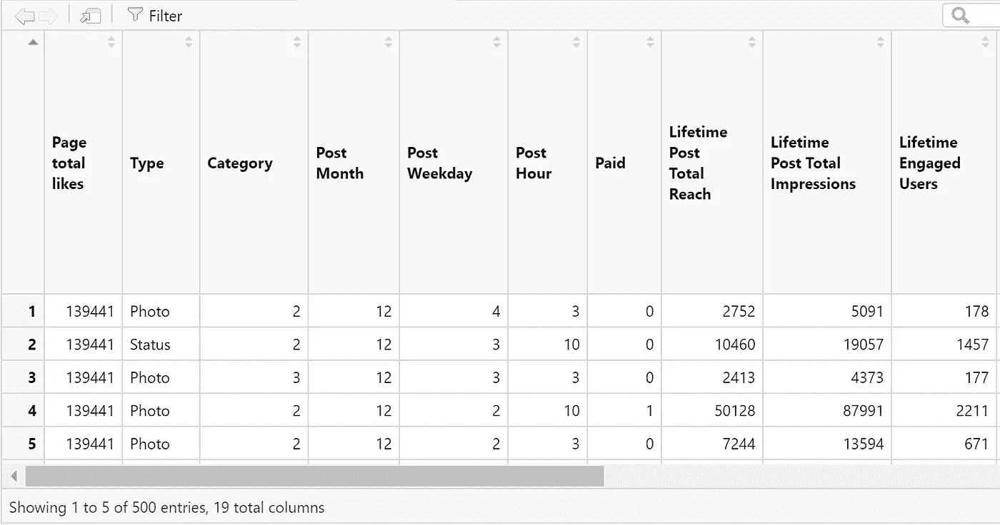
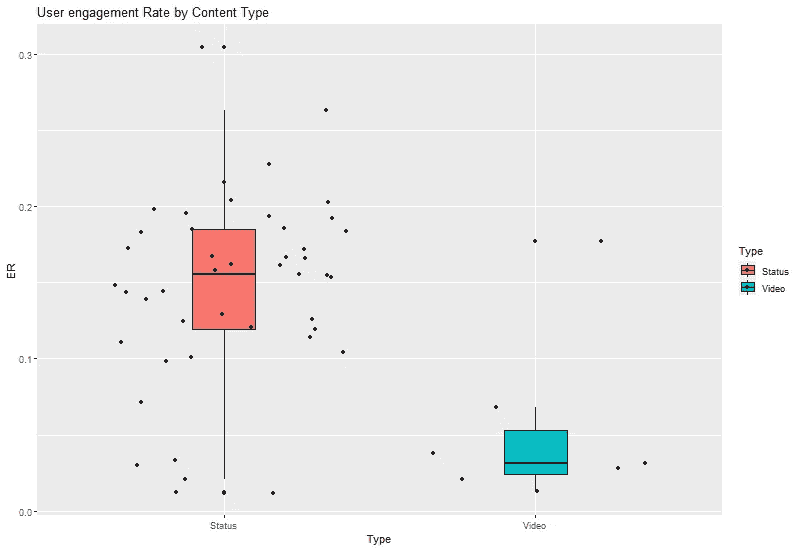
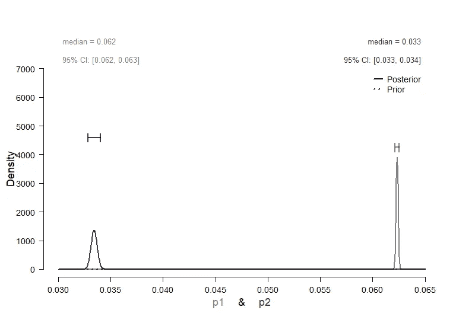
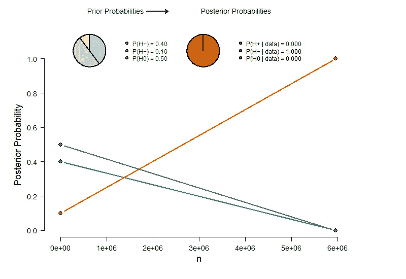

# R 中的贝叶斯 A/B 检验

> 原文：<https://towardsdatascience.com/bayesian-a-b-testing-in-r-4c6471e2e10e>

## 使用贝叶斯统计和频率统计分析社交媒体表现


在 [Unsplash](https://unsplash.com/s/photos/social-media?utm_source=unsplash&utm_medium=referral&utm_content=creditCopyText) 上[Adem may](https://unsplash.com/@ademay?utm_source=unsplash&utm_medium=referral&utm_content=creditCopyText)拍摄的照片

专业人士总是想知道如何改进他们的产品和服务。营销从业者通常会质疑，对他们网站的修改会如何改变网上购买，从而最大限度地提高销售额。类似地，科学家们相互测试不同的药物版本，以确定对未来患者最有效的药物。每当需要对可比较的选项进行相互测试时，我们可以运行一个小实验来回答以下问题:版本 A 与版本 B 有何不同？

## 什么是 A/B 测试？

A/B 测试只是一个经典假设测试的花哨术语，其中 A 和 B 只是代表一个事物的不同变量。例如，他们可以参考来自临床试验数据的对照条件(A)和治疗条件(B)。另一个广泛采用 A/B 测试的领域是市场营销。

专业人士通常想知道有多少客户使用了 A)原始版本和 B)稍有改动的版本。为了找到答案，他们设计了一个随机实验:人们被随机分配到两个组，分别展示两个版本中的任何一个。为了找出哪一个更好，他们测试哪一个在特定的成功指标上得分更高。例如，这可以是转换率之类的东西；这是已经完成期望动作的用户的百分比，即点击广告的用户数量除以观众的总体规模。点击广告被认为是成功的，而不点击则是失败的。

最终目标是做出数据驱动的决策来改进网站:无论哪个版本吸引更多的用户，都将被采用。为了确保他们开发自己的潜力并获得近乎完美的最终结果，他们多次重复这个过程:收集关于当前版本的数据，并针对潜在的进步进行测试。

## 本文的内容

通常，这一过程是由一种叫做 NHST(零假设显著性检验)的统计学方法支持的，也称为频率主义统计学，这是世界各地教授的传统方法。然而，这种范式因其误导性的解释而受到从业者和科学家的批评。为了寻找更直接的方法来检验假设，人们经常求助于贝叶斯统计。当营销活动背后有如此多的资金处于风险中时，我们应该对我们的选择非常有信心，最好是建立在以前的数据基础上。贝叶斯方法符合它吗？我也这么认为

在本文中，您将找到关于以下内容的实用信息:

*   Bayesian 和 Frequentist A/B 测试在理论和实践上的主要区别。
*   计划你的实验的步骤和指定先验，测试假设和评估证据的数量。
*   A/B 测试的实践方面，通过在真实数据集上比较视频和照片帖子的用户参与度。

# 假设检验的痛苦——频率主义者与贝叶斯主义者

贝叶斯统计是关于随着新信息的出现而更新一个人对某事的信念。它允许分析师整合先前的知识(例如，基于先前的数据，我们可以预期不同类型的出版物在用户参与度上有多大差异？).随着新数据的到来，我们不断地在不同选项之间重新分配可信度，直到我们有足够的证据。这种方法是科学中的元分析和商业环境中的连续分析的理想候选方法——它可能会节省你花费在分析上的资源，这些分析无论如何都不会有结果。这在效率方面是一个很大的优势！

这两种范式之间最根本的区别似乎是对概率的反向理解。 *frequentist* 这个词的意思是，概率是指模拟数据的抽样分布。在引擎盖下，如果我们假设 A 和 B 之间没有差异，那么 p 值的计算依赖于假想测试统计量(例如，t 值)的分布。因此，我们可以说，根据零假设观察到这样的数据是多么的不可能。通过观察样本留下的结果比例，我们可以评估我们的观察结果有多极端或不寻常。事实上，这就是著名的 p 值估计值:在给定零假设的情况下观察数据的估计概率。相比之下，贝叶斯概率是基于在给定数据的情况下对特定假设的合理信任程度。所以，解读正好反过来。

你可能会同意，这种对重要性的解释更直观，也符合我们的自然思维方式:我们从数据出发，对自然中存在的影响做出推断，而不是反过来。另一方面，根据零假设，我们通常对数据的可能性不感兴趣——事实上我们也不相信这一点。没有必要为贝叶斯统计进行这些心理体操。此外，它有点卑微，因为我们接受了每一个统计估计带来的不确定性程度。这背后的原因在于所谓的概率分布。如果我们以用户参与度为例，分析是基于关于它通常采用的特定值和概率的信息。我们对一项事业(例如，社交媒体内容)的成功有一个想法，这是基于我们的专业知识和收集数据来更新我们的信念。

> B 亚洲人分析数据的方式与学习的方式完全一样:我们在观察的同时调整我们的信念，从而不断增长我们的知识。

如果你对这个话题的更多理论细节感兴趣，请阅读我的[文章](/better-done-bayesian-a7759e295355)关于频率主义者与贝叶斯统计预测我婚礼上的天气。

# 简而言之，关键区别在于

贝叶斯 A/B 测试…

*   … **量化**A 和 b 的成功之间的差异。相比之下，频率主义者的方法只是说了一些关于是否存在差异的事情。
*   …区分不同的假设，并根据数据证明**不存在影响**(例如，A 和 B 没有不同)。然而，低 p 值只是间接证据，表明数据太不确定或不够奇怪，不足以拒绝零假设。
*   …通知**经济决策**。因为 frequentist 统计不估计参数的概率(例如，A 对 B 的转换率)，我们不能将其转换回相关的业务成果，如预期利润或存活率。
*   …对非统计人员来说是真正的**直观或直接的**。它自然补充了人类对证据的思考方式。对于常客来说，概率的解释是颠倒的，这使得直接理解很痛苦。
*   …需要的**数据更少** **数据更省时**。与 frequentist 统计不同，Bayesians 不遵循在达到全部样本量之前会使现有数据分析不合法的抽样计划。

## 关于 R 包的一个简短注记

到目前为止，R 中有两个专门研究贝叶斯 A/B 测试的包，它们基于不同的假设。 [bayesAB](https://github.com/FrankPortman/bayesAB) 包(Portman，2017)基于“独立贝塔估算”(IBE)方法，该方法假设:

*   A 和 B 的成功概率是独立的，因此了解一个实验条件的成功率不会影响我们对另一个实验条件的成功率的了解。
*   一种效应的存在，所以实验操作必须在某种程度上是有效的，我们无法获得支持零假设的证据。

Logit 转换测试(LTT)方法克服了这些限制，该方法由 R (R 核心团队，2020)中的(Gronau，2019)在 [abtest](https://cran.r-project.org/web/packages/abtest/abtest.pdf) 包中实现。这是我们将在即将到来的案例研究中使用的，以产生更丰富的结果，如果您对技术细节感兴趣，我建议您阅读 Hoffmann，Hoffman&wagen makers(2020)的论文。


照片由[罗宾·沃拉尔](https://unsplash.com/@robin_rednine?utm_source=unsplash&utm_medium=referral&utm_content=creditCopyText)在 [Unsplash](https://unsplash.com/s/photos/social-media?utm_source=unsplash&utm_medium=referral&utm_content=creditCopyText) 拍摄

# 基准社交媒体性能

营销领域的一个典型例子是分析公司网站的用户参与度，以提高其受欢迎程度。在本案例研究中，我们将只关注这一点。从技术上来说，用户或客户参与被定义为对一家公司的自愿和潜在的盈利行为。例如，它可以表现为这样一个事实，即一个人愿意通过口口相传、写评论、分享信息或提及产品来吸引对一家公司以及潜在客户的注意。这应该给营销人员敲响了警钟，因为用户参与本质上是免费的，创造了一个对品牌有益的关系，从长远来看可能会增加销售额。但是为什么不简单的用点击率，那么实际点击过帖子或者广告的用户数呢？

因为用户参与度是我们的社交媒体内容引发某种兴趣的程度的更强指标**，这需要用户关注**。具体来说，我们想知道视频是否比照片更能吸引用户。Databox 甚至表示，视频需要用户更加专注，因为它们不像照片那样容易被消化，因此会产生两倍的点击量和 20-30%的转化率。

我们将使用的数据集来自 Moro 和 Rita (2016)的一篇开源论文，其中包括 2014 年 1 月 1 日至 12 月 31 日期间收集的全球知名化妆品品牌脸书页面的 500 篇帖子。作者分析了 12 个结果变量，如下所示:

*   终身帖子总到达人数:看到页面帖子的人数(唯一用户)。
*   终身帖子总浏览量:浏览量是页面中某个帖子被显示的次数，无论该帖子是否被点击。
*   终身参与用户:点击帖子任意位置的人数(独立用户)。
*   总互动:帖子的“喜欢”、“评论”和“分享”的总和。

为了进一步描述我们处理的帖子的特征，还有五个其他变量可用:

*   类型:分类为帖子是链接、照片、状态还是视频。
*   类别:分类为帖子是指一个行为(特别优惠和竞赛)、产品(直接广告、明确的品牌内容)还是灵感(非明确的品牌相关内容)。
*   付费:品牌是否向脸书支付广告费用的分类(是/否)。

## 加载数据并查看描述性统计数据

在定义了一个 R-project 之后，我们可以使用简洁的 here-package 以一种简单的方式来设置我们的路径，这种方式更能抵抗本地机器上的变化(Müller & Bryan，2020)。我推荐使用 [data.table](https://cran.r-project.org/web/packages/data.table/data.table.pdf) 的`fread()`函数来加载数据，因为它比`read_csv()`函数快得多，并且更频繁地获得正确的数据格式(Dowle，2021)。让我们看看我们的原始数据。

> 声明:所有图片均由作者制作，除非另有说明。



只有 5 个观察值缺失，`skim()`函数给出的摘要显示了一些描述性统计数据，包括平均值、标准偏差、百分位数以及每个变量的直方图(18 个数值；1 因子)。

为了了解发布了多少出版物，我们加载了 dplyr 包，并按类型统计了观察的数量。

```
# A tibble: 4 x 2
# Groups:   Type [4]
  Type       n
  <fct>  <int>
1 Link      22
2 Photo    426
3 Status    45
4 Video      7
```

事实证明，绝大多数内容由照片(426 张)组成，而链接(22 张)、状态更新(45 张)和视频(7 张)则不太常见。现在，这不应该让你气馁，因为重要的是每篇帖子背后的观察次数——通过尝试次数获得的成功次数，或者换句话说:通过 reach 获得的每种内容类型的参与用户数量，我们将在以后保存。

## 如何计算参与度

现在，参与帖子的原始用户数量可能会根据其覆盖范围而有很大波动，所以我们需要一种标准化的方法来衡量性能。因此，我们将创建一个百分比来表示参与用户的数量相对于看过帖子的总人数。Hootsuite 写了一整本关于计算参与度的不同方法的指南，我强烈推荐你阅读。脸书给你提供了各种营销人员可能感兴趣的[指标](https://www.socialmediaexaminer.com/facebook-page-metrics/)，但为了简单起见，我们将坚持一个指标。

## 利用先验知识设计实验

由于 frequentist 统计高度依赖于数据，我们需要首先运行功效分析，以找出哪些数量的数据点足以捕捉感兴趣的效果。我们将使用 R (Qiu，2021)中的 [powerMediation](https://cran.r-project.org/web/packages/powerMediation/powerMediation.pdf) 包将其应用于我们的问题，因为我们稍后将运行逻辑回归。

该函数采用以下参数

*   基线值—当前质控条件的值
*   期望值—测试条件的期望值
*   测试条件下的数据比例(理想情况下为 0.5)
*   显著性阈值/alpha——我们认为影响为(通常为 0.05)的水平
*   幂/1—β—正确拒绝零假设的概率(通常为 0.8)

根据 [Hootsuite](https://blog.hootsuite.com/de/aussagekraeftige-social-media-kennzahlen/#4_Engagement-Rate) 发布的分析结果，脸书社交媒体内容的平均参与度为 0.06%。这个参与度不是根据看过帖子的人数计算的，而是根据关注者的数量计算的。然而，我们将此作为基线条件(照片的参与度)的基准。让我们假设视频比照片吸引了 50%的用户，这将导致 0.09%的参与率(期望值)。之前，我们已经计算了每种类型的内容范围，因此我们知道逻辑回归将基于的观察值的数量。不幸的是，我们没有相等的组大小，但是来自测试条件的数据的比例是 0.06%。显著性水平和功效被设置为默认值。

根据功效分析，我们需要总共 9947 个独立用户的样本量。理论上，这将使正确剔除空值的概率保持在 80%。因为我们总共有 5，955，149 个用户的样本，这些用户通过社交媒体帖子访问了这两种类型，超过了最小样本量。所以，我们很好！

现在让我们为贝叶斯 A/B 测试指定我们的先验。如前所述，我们假设视频内容比照片内容吸引多 50%的用户。假设 50%的收益对应于先前的中值，该预期对应于 0.03 的中值绝对风险(即，成功概率的差异)。我们构建了一个 95%的不确定性区间，范围从 0.01(几乎没有差别)到 0.12(成功的两倍)。

## 测试你的假设，更新你的知识

对于我们的假设检验的频率主义方法，我们想运行一个逻辑回归。但是因为我们加载的数据集不包含二元结果变量(是/否)，所以我们首先需要创建一个。我们将使用的`rbinom()`函数要求我们知道每种内容类型的成功比例(1 而不是 0 ),因此我们可以使用之前创建的项目摘要。

```
> ER_summary
# A tibble: 4 x 4
  Type   Engagement   Reach     ER
  <fct>       <int>   <int>  <dbl>
1 Link         7542  407981 0.0185
2 Photo      348871 5596709 0.0623
3 Status      91810  588550 0.156 
4 Video       11949  358440 0.0333
```

啊？看起来好像视频实际上导致了比照片更低的**参与度。让我们将这些值插入到 rbinom()函数中，以生成两个表示这个分布的对象。然后，我们向每个对象添加一个字符串来跟踪内容类型，并将两个对象合并到一个大的数据帧中。**

我们使用`glm()`(广义线性模型)函数并将 family-argument 设置为二项式来运行逻辑回归。为了获得更清晰的模型输出，我们使用了扫帚包中的`tidy()`函数。

```
# A tibble: 2 x 5
  term        estimate std.error statistic p.value
  <chr>          <dbl>     <dbl>     <dbl>   <dbl>
1 (Intercept)   -2.75    0.00178   -1546\.        0
2 TypeVideo     -0.703   0.00986     -71.3       0
```

我们可以看到，与视频的曝光相比，视频的曝光使得成功的概率(用户参与度)更低。具体来说，与照片相比，用户参与内容**的对数几率显著降低**0.7。通过取指数，我们可以将对数比值转换回一个更容易解释的值——比值比。成功几率被定义为成功概率与失败概率之比。我们得到的比值比为 0.5 比 1，这表明——与照片相比——视频内容降低了用户参与的几率，降低了 0.5 倍。相比之下，如果成功的概率在两种情况下随机分布，那么成功的几率将是 1 比 1(优势比为 1)。

我们的 p 值低于 0.05 这一事实意味着零假设——照片和视频内容同样成功——似乎与数据有些不符。不多也不少。根据数据，它没有说明替代假设(例如，版本之间的差异)是否为真。因此，让我们转向贝叶斯 A/B 测试来回答这个问题。

从我们的 ER_summary 中我们知道，观察到的成功概率对于照片是`p1 = .062`,对于视频内容是`p2 = .033`。因此，观察到的成功概率表明，接触 0.3%的视频会产生负面影响。为了查明这在统计上是否有说服力，使用了 abtest 包中的贝叶斯 A/B 检验:

```
> print(ab)
Bayesian A/B Test Results:Bayes Factors:BF10: Inf
BF+0: 0.0001890052
BF-0: InfPrior Probabilities Hypotheses:H+: 0.4
H-: 0.1
H0: 0.5Posterior Probabilities Hypotheses:H+: 0
H-: 1
H0: 0
```

输出的第一部分给出了支持假设 H1、H+和 H-的贝叶斯因子，其中参考假设(即贝叶斯因子的分母)是 H0。贝叶斯因子估计可信度从先验分布向后验分布重新分配的程度。换句话说，它告诉我们有多少需要根据新数据更新我们的信念。具体来说，贝叶斯因子是数据中支持两个假设之一的相对证据。换句话说，它是一个假设比另一个假设更好地预测观察到的数据的程度。请注意，贝叶斯因素是**而不是**在看到数据后一个假设相对于另一个假设的似然性(这将是[后验概率](https://stats.stackexchange.com/questions/229852/why-is-the-bayes-factor-sometimes-considered-more-important-than-the-posterior-o))。

由于正效应(H1)的贝叶斯因子假设小于 1，这表明有证据支持无效应的零假设。但我们在这里得到了一个更微妙的画面:当我们假设视频内容对用户参与度有负面影响时，H-的无限高的贝叶斯因子表明了反对零假设的有力证据。输出的下一部分显示了假设的先验概率:之前，我们假设 H1 和 H0 的概率相等，但是我们基于我们的先验知识，给了积极影响的存在更多的可信度。

如果我们观察后验概率，一幅非常清晰的画面出现了:根据这些数据，我们必须完全刷新我们对 H-的理解，因为负面效应的似然性已经从 0.1 增加到 1。相反，这意味着 H+和 H0 都不太可能出现。

## 估计证据的大小

我们的逻辑回归不允许对每种内容类型的成功概率进行任何推断；它只让模型适合我们的样本数据，留给我们一个点估计。我们只能描述观察到的参与率，并尝试观察两种类型之间的实际差异。让我们绘制数据以获得一个粗略的印象:



好的，我们可以看到不同帖子的内容类型之间的差异，并得到一个实际的感觉，补充我们已经知道的数字。我们还可以直接看到，与照片内容相比，视频内容备份的数据要少得多。

然而，这些只是描述性的统计数字。相比之下，我们实际上可以**用我们的贝叶斯框架推断**后验成功概率，从而对证据的大小和效果的方向做出陈述:



在我们的示例中，p1 和 p2 分别对应于用户参与照片和视频内容的概率。该图表明 p1(照片)的后验中值为 0.062，95%可信区间为 0.062 至 0.063，p2(视频)的后验中值为 0.033，95%可信区间为 0.033 至 0.034。我们还可以看到 p2(视频)的可信区间实际上更宽，这没有反映在裸数字中，因为默认情况下我们只有三个十进制值。其原因可能是，与基线相比，对于相对较少的数据，成功的估计更不确定。

总之，我们的数据为另一个假设提供了有力的证据，即与照片相比，视频对用户参与度有负面影响。此外，我们有强有力的证据反对零假设，即两种内容类型之间没有影响，以及反对正影响的假设。

## 看看证据的出现

对于我们的 frequentist 分析，没有办法测试证据实际上是如何在试验中出现的，因为零假设显著性测试假设我们在分析任何结果之前首先完成数据收集。但我们能做的是改变样本计划，并允许临时分析，以节省我们的资源并防止 p-hacking，同时仍保持我们对假警报的(不)容忍度。因此，我们需要定义特定的停止规则来运行顺序分析。这是一个在收集数据时随着时间的推移重复进行统计测试(如逻辑回归)的过程。每次观察后，对累积数据进行分析，并做出以下三个决定之一:

*   停止数据收集，拒绝零假设，宣称“统计显著性”(如数据有说服力)。
*   停止数据收集，不要拒绝零假设，并声明结果不具有统计学意义(例如，数据是非决定性的)。
*   继续收集数据，因为迄今为止累积的数据仍不足以得出结论。

我们可以使用 [gsDesign 软件包](https://cran.r-project.org/web/packages/gsDesign/gsDesign.pdf) (Anderson，2022)来找出我们需要如何调整指示显著 p 值的阈值，以及在数据收集的哪些点上我们可以达到结果的峰值。

假设我们要运行三次中期分析并运行一个单侧显著性测试，我们应该在总共有 1，985，050，3，970，099 和 5，955，149 个用户看过内容后停止。此外，我们需要将 alpha 级别调整为 0.0232，而不是更自由的显著性阈值`p < .05`，以证明我们查看中间数据的事实。

现在让我们看看，随着数据进入贝叶斯框架，支持和反对每个假设的证据是如何演变的。



这将按时间顺序追踪任一假设的证据。在大约 30 万用户看过各自的内容后，H-的证据超过了 H+和 H0 的证据。在大约 600，000 次试验后，H-的证据变得非常有力，所以我们可能已经停止了数据收集。在现实生活的营销活动中，这将为我们节省 400，000 额外的用户内容将被广告。

假设的后验概率也显示为图顶部的概率轮。对于先验概率，绿色区域显示备选假设的后验概率，灰色区域显示无效假设的后验概率。数据将 H-的似然性从 0.1 增加到几乎 1，而零假设和 H+的后验似然性相应地降低到几乎 0。

# a 还是 B？再想想。

## 限制

在总结之前，让我们面对用户参与案例研究的局限性。首先，我们没有随机对照实验，无法确定 a)用户只看到了 b)完全相同的产品或灵感的照片或视频内容，而 c)用户之间的分组是均等的。相反，我们有一个高度不平衡的群体规模和视频内容，使只有一小部分的意见可用于照片。因此，问题仍然是，在社交媒体上营销内容时，视频是否真的是一个糟糕的选择。我们也不知道是否相同的独特用户甚至可能已经看到了照片和视频，这将给我们一个主题内的设计，也应该建模。如果这个例子是一个真正的数据科学项目，那么应该鼓励该公司在决定更多地关注不同类型的内容之前，收集更多关于视频帖子的数据，以达成更公平的比较。

## 贝叶斯 A/B 测试告诉我们更多关于用户参与度的信息

然而，我们在 A/B 测试的两个框架之间有一个很好的比较:频率主义者的方法让我们拒绝了零假设，样本估计指出了视频内容对用户参与度的负面影响。但我们没有办法知道数据是否支持替代假设——事实上，p 值无法区分证据不存在(即数据太乱)和证据不存在(即没有影响)(Keysers et al .，2020；罗宾逊，2019)。然而这才是我们真正感兴趣的，对吗？

贝叶斯 A/B 检验为负面影响提供了明确的证据，而根据数据，其他两个假设似乎不可信。有趣的是，这两种方法都提出了一个相似的最小样本量来捕捉效果，即使需求不同:我们可以通过贝叶斯框架很好地监控数据积累的证据，我们可以在 600，000 次查看后停止我们的活动。对于 frequentist 框架，功效分析给了我们一个非常相似的最小样本量，但是关注数据是有害的:我们需要通过调整 p 值来校正多重比较。最后，如果没有贝叶斯框架，我们将无法谈论典型的用户参与价值。老实说，这是贝叶斯框架代表分析师做更多工作的地方，因为我们在这个问题上有更好的专家，因为它本身。与传统方法相比，之前的规范要求我更深入地参与用户参与度和社交媒体指标。

由于我是一名行为科学家，而不是营销人员，我不得不做一些研究，找出哪些假设是合理的，哪些参数值在实践中是合理的。与简单地运行逻辑回归相比，我通过这种方式学到了更多关于用户参与度的知识。你可能喜欢数据科学的计算部分，我也是。然而，这不应该分散我们对我们想要解决的实际问题的注意力。

在旅程的最后，我们有一个非常有针对性和方便的测试程序。我相信贝叶斯框架包含了我们定制假设检验所需的工具，并成为我们领域中更好的专家。

# 参考

[1] F. Portman，[bayesAB:A/B 测试的快速贝叶斯方法](https://cran.r-project.org/web/packages/bayesAB/index.html) (2017)， *R 包。*

[2] Q. F .格罗瑙， [Abtest:贝叶斯 A/B 测试](https://CRAN.R-project.org/package=abtest) (2019)， *R 包。*

[3] T. Hoffmann，A . Hoffman & e . j . wagen makers，[关于用 R 和 JASP 进行 A/B 检验的贝叶斯推断的教程](https://psyarxiv.com/z64th/download?format=pdf) (2021)， *Psyarxiv。*

[4] S. Moro，P. Rita 和 B. Vala，[预测社交媒体绩效指标和评估对品牌建设的影响:一种数据挖掘方法。](https://www.sciencedirect.com/science/article/abs/pii/S0148296316000813) (2016)，*《商业研究杂志》*，69(9)，3341–3351。

[5] K. Müller & J. Bryan，[这里:找到你的文件的更简单的方法](https://cran.r-project.org/web/packages/here/index.html) (2020)， *R 包*。

[6] M. Dowle， [data.table:【数据.框架】的扩展](https://cran.r-project.org/web/packages/data.table/index.html) (2021)， *R 包。*

[7] W .邱， [powerMediation:用于中介分析的功效/样本量计算](https://cran.r-project.org/web/packages/powerMediation/index.html) (2021)， *R 包。*

[8] R. Morey，[“什么是贝叶斯因子？”](http://bayesfactor.blogspot.com/2014/02/the-bayesfactor-package-this-blog-is.html) (2014)，BayesFactor 博客。

[9] K. Anderson， [gsDesign:成组序贯设计](https://cran.r-project.org/web/packages/gsDesign/index.html) (2022)， *R 包。*

[10] C. Keysers，V. Gazzola 和 E.-J. Wagenmakers，[在神经科学中使用贝叶斯因子假设检验来建立缺失的证据](https://www.nature.com/articles/s41593-020-0660-4) (2020)，*自然神经科学*，23，788–799。

[11] G. K. Robinson，[可以合理地期望统计推断具有什么性质？—统计推断中的危机与解决](https://www.tandfonline.com/doi/10.1080/00031305.2017.1415971) (2019)，*美国统计学家*，73，243–252。