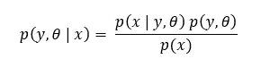
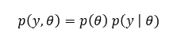
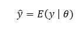
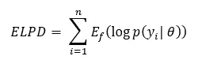
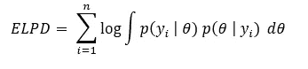
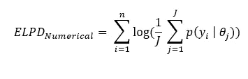
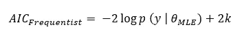
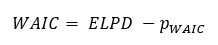
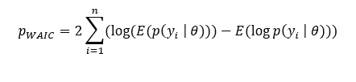
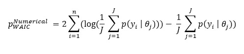

# 贝叶斯方法和模型评估

> 原文：<https://towardsdatascience.com/bayesian-approach-and-model-evaluation-371ad669cf2c>

## 概率，贝叶斯统计

## 使用贝叶斯度量评估和比较模型，通过贝叶斯建模方法的介绍确定正确的参数

纳赛尔·塔米米在 [Unsplash](https://unsplash.com?utm_source=medium&utm_medium=referral) 上的照片

贝叶斯方法和其他方法有什么不同？它是基于信仰的。关于我们感兴趣的系统的信念。在本文中，我们将探讨如何在模型构建和测量其性能中利用这一概念。

# 关于贝叶斯模型比较的先决条件

机器学习或统计模型经历了开发生命周期的几个阶段。其中之一是测量它的准确性。下面描述的几种情况会带来挑战:

1.  很多时候我们没有足够的训练数据。除此之外，保留其中的一小部分作为验证数据集可能会由于数据不足而影响模型的准确性。
2.  对于具有高训练时间问题的模型，采用交叉验证方法将增加更多的训练时间。
3.  对于无监督学习，可能不存在检查准确性的直接技术，因为学习本身不基于标记数据集。

贝叶斯模型比较方法试图缓解上述问题。这些不仅有助于检查准确性，而且有助于逐步建立模型。这些方法主要针对训练数据本身来处理数据短缺问题。但是，请记住，正如您所知，这与在训练数据集上计算*训练准确度*并不完全相同。像任何其他统计技术一样，他们试图给出一个关于准确性的*近似&替代*想法，而不是完全万无一失。为了更清楚地理解事情，我们将从一个关于模型建立的贝叶斯方法的简短描述开始。

# 贝叶斯建模方法

我们需要从贝叶斯的角度来看统计模型的一般陈述。它有两个主要术语:先验和后验。先验是我们对数据的信念。它可能来自我们感兴趣的系统的领域知识或先前的知识。非贝叶斯或频率主义方法在其计算中不考虑“先验”。而“后验”就是我们期望从模型中得到的输出。“后验”不断更新，最终得出结论。

让我们假设一个模型由概率分布(实际上，它可能比单个分布复杂得多)、参数θ、作为属性的随机变量 *x* 和作为输出的 *y* 来表示。 *y* 的分布以θ为参数。通过贝叶斯方法， *y* 的概率可由下式给出:

如果θ是常数，那么联合分布 *p(y，θ)* 将只取决于*y。*例如，正态分布由两个参数& σ定义，用 N(，σ)表示。如果= 5 & σ = 10，那么分布就是 N(5，10)。这里的参数是常数。 *Frequentist* 方法没有先验概念，总是将参数视为常数。但是如果他们不是呢？

贝叶斯方法出现了。参数也是*贝叶斯设置中的随机变量*。这意味着*意味着*()或*标准差* (σ)可以为正态分布。“先验”是关于这些参数的初始假设。上式中的 *p(y，θ)* 是一个先验，关于θ的假设& *y* 两者都有。基本上 *p(y，θ)* 只需要关于θ的假设就可以完全推导出来。

*p(y，θ)* 和 *p(y，θ | x)* 分别称为 ***【先验预测分布】*** 和 ***【后验预测分布】*** 。 *p(y，θ)* 可以进一步分解如下:

现在，你应该清楚了。对θ做一些初步的猜测&由此得到 *p(θ)。*实际上 *θ* 可以相当复杂，可以表示一个参数向量，而不是单个参数。

说了这么多，我们现在的目标是什么？明确找到对 *θ* 的良好估计，并确定 *y.* 的预测分布，一旦获得 *p(y，θ)* ，我们就可以获得一个图(最大先验值)即模式或分布的平均值作为输出。我们可以得到如下结果:

> 由于这些先验思想，贝叶斯方法提供了自动正则化，并减轻了过拟合问题，这与 Frequentist 方法不同。

## **最大似然估计 vs 贝叶斯估计**

Frequentist 方法使用 MLE 来获得对 *θ* 的估计，因为它没有先验&后验的概念。它只是最大化似然函数 *p(x | y，θ)。*最优值 *θ* 为给定为 ***点估计*** *。不同的最大化技术超出了讨论的范围。*

贝叶斯方法采用迭代程序来确定 *θ。*它是一个 ***分布估计*** 而不是一个 ***点估计*** 。它从初始先验开始，计算后验，再次使用 *θ* 的后验估计作为先验，并继续迭代。当观察到 *θ* 没有明显变化时停止。迭代发生在整个训练数据集中。

这是两者在高层次上的不同。感兴趣的读者可以在一本贝叶斯统计的书中详细浏览。贝叶斯方法的认知构建需要时间，当然也需要很大的耐心。

# 模型评估

现在，让我们进入模型评估和比较部分。如前所述，一般来说，模型评估的贝叶斯方法不需要验证数据集。我们可以在构建模型本身时近似模型性能。

理论上，计算所有数据点的 ***后验预测密度*** 的对数给出了模型性能的总体估计。值越高，表示模型越好。让我们讨论一些指标。

## 预期测井预测密度(ELPD)

这是一个理论度量，由下式给出:

其中有 n 个数据点。 *f* 是不可见数据的数据生成分布。它有两个问题。

> 首先，在实际情况中，如果模型对你来说是黑箱，知道 *θ* 的正确值可能是不可能的。我们甚至不知道 *θ* 是如何从内部影响模型的。
> 
> 第二，我们不知道 *f* ，因为我们不使用验证数据集。

因此，在实践中，我们可以使用如下的边际分布 *p(y | θ)* :

但是，第一个问题仍然没有解决。我们还有未知的θ。模拟就是答案。我们可以使用不同的 *θ* 值，做一个后验模拟。任何概率编程语言都支持后验模拟。这导致了用于数值计算 ELPD 的以下表达式:

这在任何编程语言中都是可行的。请记住，这 n 个数据点来自训练数据集。

## 信息标准— AIC 和 WAIC

上面讨论的预测准确性的测量被称为 ***信息标准。*** 为方便起见，将其乘以 2 并求反。但是，有一个问题。由于我们不使用验证数据集，该指标存在过度拟合的问题。减轻它的一种方法是用模型中用于 frequentist 设置的一些参数来调整它。

***阿凯克信息标准(AIC)*** 是非贝叶斯或频率主义指标的调整指标。它使用最大似然估计作为点估计。它被定义为:

其中 k 是参数的数量。AIC 值越低表示模型越好。

**渡边赤池信息标准(WAIC)**

这是 AIC 的贝叶斯对应。它在理论上定义为:

*pWAIC* 是避免过拟合的校正项，如前所述。理论上 *pWAIC* 给出为:

如前所述，使用模拟，我们可以解码这些表达式，因为我们不知道 *θ。*相同的表达式然后变成:

> 渐近地 *pWAIC* 收敛于模型中使用的参数的数量。

最终，WAIC 变成了 AIC 的贝叶斯等价物。像 AIC 一样，WAIC 的值越低，表示模型越好。

> 再次，记住不同之处:AIC 条件是点估计，而 WAIC 是后验分布的平均值。

这种贝叶斯模型评估方法还有助于为特定的无监督学习用例逐步构建模型。它也可能有助于超高仪调谐。

要完全掌握所有这些概念，你真的需要扎实的概率和估计方法基础。

> 注:最近我的《Python 生存分析》一书由 CRC 出版社出版。
> 
> 链接:

 [## 用 Python 进行生存分析

### 生存分析使用统计数据来计算无故障时间。Python 的生存分析以全新的视角看待…

www.routledge.com](https://www.routledge.com/Survival-Analysis-with-Python/Nag/p/book/9781032148267)