# 贝叶斯共轭先验简单解释

> 原文：<https://towardsdatascience.com/bayesian-conjugate-priors-simply-explained-747218be0f70>

## 执行贝叶斯统计的一种计算有效的方法


希瑟·吉尔在 [Unsplash](https://unsplash.com?utm_source=medium&utm_medium=referral) 上拍摄的照片

# 介绍

在 [**贝叶斯统计**](https://en.wikipedia.org/wiki/Bayesian_probability) 中， [**共轭先验**](https://en.wikipedia.org/wiki/Conjugate_prior) 是当后验和先验分布属于同一分布时。这种现象允许更简单的后验计算，使得 [**贝叶斯推断**](https://en.wikipedia.org/wiki/Bayesian_inference) 容易得多。

在本文中，我们将深入了解共轭先验。我们将展示它的必要性，从基本原理中推导出一个例子，最后将它应用到现实世界的问题中。

# 贝叶斯推理概述

## 贝叶斯定理

让我们快速回顾一下 [**贝叶斯定理**](https://en.wikipedia.org/wiki/Bayes%27_theorem) **:**


作者在 LaTeX 中生成的方程。

*   ***P(H):***<https://en.wikipedia.org/wiki/Prior_probability>****。**假设的概率， ***H.*****
*   *****P(D | H):***[**可能性**](https://en.wikipedia.org/wiki/Likelihood_function) **。**数据的概率，*，给定我们当前的假设，***
*   *******P(H | D):***[**后路**](https://en.wikipedia.org/wiki/Posterior_probability) 。当前假设的概率， ***H，*** ，给定数据， ***D.*******
*   *******P(D):***[**归一化常数**](https://en.wikipedia.org/wiki/Normalizing_constant#Bayes'_theorem) **。**这个是可能性和先验的乘积之和，也就是所谓的 [**全概率定律**](https://en.wikipedia.org/wiki/Law_of_total_probability) :****

********

****作者在 LaTeX 中生成的方程。****

****如果你想更深入地推导和理解贝叶斯定理，可以在这里查阅我以前的文章:****

****<https://pub.towardsai.net/conditional-probability-and-bayes-theorem-simply-explained-788a6361f333>  

## 贝叶斯更新

当我们收到更多关于某个事件的数据时，我们使用贝叶斯定理来更新我们的信念。

一般来说，我们按如下方式进行更新:


作者在 LaTeX 中生成的方程。

然后，当新数据到达时，后验数据成为新的先验数据。这个过程随着新数据不断重复，因此被称为贝叶斯更新。这就是贝叶斯推理的本质。

您可以在此阅读有关贝叶斯更新的更多信息:

</bayesian-updating-simply-explained-c2ed3e563588>  

然而，如果我们想要获得有效的概率，我们需要计算 ***P(D)*** 。如上所示，这是可能性和先验的乘积之和。描述求和的另一种方式是通过积分:


作者在 LaTeX 中生成的方程。

这种积分往往是<https://www.reddit.com/r/askmath/comments/cghi5c/what_is_an_intractable_integral_and_why_this/>**。这基本上意味着它在计算上非常昂贵，或者它没有一个 [**封闭形式的解**](https://en.wikipedia.org/wiki/Closed-form_expression) 。我在这里链接了<https://stats.stackexchange.com/questions/202917/why-is-computing-the-bayesian-evidence-difficult>**一个 StatExchange 线程，解释了为什么它很难处理。****

# ****共轭先验****

## ****背景****

****共轭先验是避免贝叶斯推理中棘手的积分问题的一种方法。这是当先验分布和后验分布相同时。这允许我们简化计算后验概率的表达式。在下一节中，我们将从数学上展示这一现象。****

## ****二项式和贝塔权变****

****最简单和常见的共轭分布对之一是<https://en.wikipedia.org/wiki/Beta_distribution>**(先验)和<https://en.wikipedia.org/wiki/Binomial_distribution>**(似然)。********

********贝塔分布**:******

*   ****被称为概率分布的**，因为它的定义域介于 0 和 1 之间。******
*   ****传达事件成功的最大可能性。****

****其 [**概率密度函数**](https://en.wikipedia.org/wiki/Probability_density_function) **(PDF)** 写成:****

********

****作者在 LaTeX 中生成的方程。****

****这里 ***x*** 有界为 ***0 ≤ x ≤ 1，*** 所以很容易解释为概率和 ***B(α，β)*** 是[**β函数**](https://en.wikipedia.org/wiki/Beta_function) **。******

****如果您想全面了解 Beta 发行版，您应该浏览一下我以前关于它的文章:****

****</beta-distribution-simply-explained-839b3acde6e9>  

**二项分布:**

*   传达来自 ***n*** 试验的一定数量的成功概率 ***k*** ，其中成功概率为 ***x*** 。

PDF:

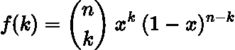

作者在 LaTeX 中生成的方程。

**关键点**

*   二项式分布和贝塔分布的主要区别在于，对于贝塔分布来说，**概率、 *x* 、是一个随机变量，而对于二项式分布来说，**概率、 *x* 是一个固定参数。****

## 与贝叶斯的关系

现在让我们来做一些有趣的数学！

我们可以使用成功的概率重写贝叶斯定理， ***x*** ，对于事件和数据， ***k*** ，这是我们观察到的成功次数:

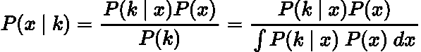

作者在 LaTeX 中生成的方程。

我们的后验基本上是成功率所有可能概率的概率分布。换句话说，后验分布是贝塔分布。

我们可以使用二项式分布作为我们的可能性，使用贝塔分布作为我们的先验来表达上面的等式:

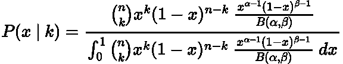

作者在 LaTeX 中生成的方程。

是啊，看起来没那么好。然而，我们现在要简化它:

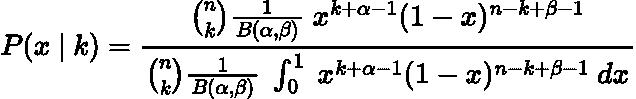

作者在 LaTeX 中生成的方程。

有些人可能会注意到这个积分的特别之处。它的定义是 [**贝塔函数**](https://en.wikipedia.org/wiki/Beta_function) **！**

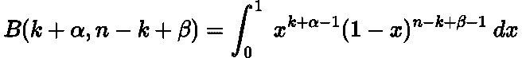

作者在 LaTeX 中生成的方程。

因此，我们后路的最终形式是:

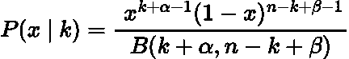

作者在 LaTeX 中生成的方程。

> 一个测试版！

瞧，我们刚刚从β先验到β后验，因此我们有了共轭先验！

> 如果你对β-二项式共轭先验更感兴趣，有一本很棒的在线书籍深入描述了它们的关系 [**这里**](https://www.bayesrulesbook.com/chapter-3.html#ch3-bbmodel) 。

## 为什么有用？

你可能会挠头，想知道为什么我带你经历这个可怕的推导，只是为了得到另一个版本的测试版？

这个漂亮的结果告诉我们，要做贝叶斯更新，我们不再需要计算可能性和先验的乘积。正如我前面所讨论的，这在计算上是昂贵的，有时是不可行的。我们现在可以只使用简单的加法！

# 例如:棒球击球平均数

## 问题背景

在美国职业棒球大联盟(MLB)中，击球手击球的比率除以他们投出的球数被称为平均击球率。[2021 年 MLB 的击球率为 0.244 (24.4%)](https://www.baseball-reference.com/leagues/majors/bat.shtml) 。

一名球员在赛季开始时表现很好，并打出了他的第一个 **3** 球。他的平均击球率会是多少？一个 [**常客**](https://en.wikipedia.org/wiki/Frequentist_inference) 会说是 **100%** ，然而我们贝叶斯人会得出不同的结论。

## 在先的；在前的

我们知道击球率是 0.244，但是可能的取值范围呢？一个[好的平均值被认为在 0.3](https://en.wikipedia.org/wiki/Batting_average_(baseball)) 左右，这是较高的范围，一个低于 [0.2 的平均值被认为相当差。](https://en.wikipedia.org/wiki/Batting_average_(baseball))

使用这些值，我们可以构建一个合适的贝塔先验分布:

```
from scipy.stats import beta as beta_dist
import matplotlib.pyplot as plt
import numpy as npalpha = 49
beta = 151
probability = np.arange (0, 1, 0.001)
prior = beta_dist.pdf(probability, alpha, beta)plt.figure(figsize=(12,6))
plt.plot(probability, prior, linewidth=3)
plt.xlabel('Batting Average', fontsize=20)
plt.ylabel('PDF', fontsize=20)
plt.xticks(fontsize=18)
plt.yticks(fontsize=18)
plt.axvline(0.244,  linestyle = 'dashed', color='black', label='Average')
plt.legend(fontsize=18)
plt.show()
```

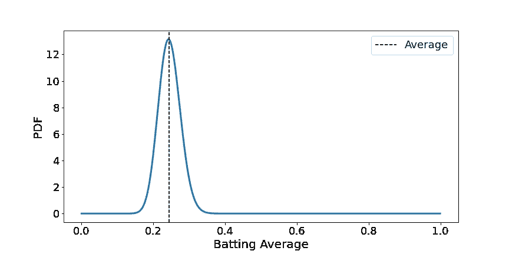

作者用 Python 生成的图。

这看起来很合理，因为我们的范围很小，在 0.2 到 0.3 之间。我选择 ***α=49*** 和 ***β=151，*** 的值并没有什么特别的原因，它们只是满足了我们对先验分布的了解。

然而，这往往是反对贝叶斯统计的论点。既然先验是主观的，那么后验也是如此。这意味着概率不再是客观的，而是一种个人信念。

## 可能性和后验概率

数据的可能性是新玩家从 **3** 击中了 **3** ，因此他们有额外的 **3 成功**和 **0 失败**。

利用我们的共轭先验知识，我们可以简单地将一个**额外的 3** 加到 ***α*** 和 **0** 到 ***β:***

```
alpha = 49
beta = 151
new_alpha = 49+3
new_beta = 151
probability = np.arange (0, 1, 0.001)
prior = beta_dist.pdf(probability, alpha, beta)
posterior = beta_dist.pdf(probability, new_alpha, new_beta)plt.figure(figsize=(12,6))
plt.plot(probability, prior, linewidth=3, label='Prior')
plt.plot(probability, posterior, linewidth=3, label='Posterior')
plt.xlabel('Batting Average', fontsize=20)
plt.ylabel('PDF', fontsize=20)
plt.xticks(fontsize=18)
plt.yticks(fontsize=18)
plt.axvline(0.244,  linestyle = 'dashed', color='black', label='Average')
plt.legend(fontsize=18)
plt.show()
```

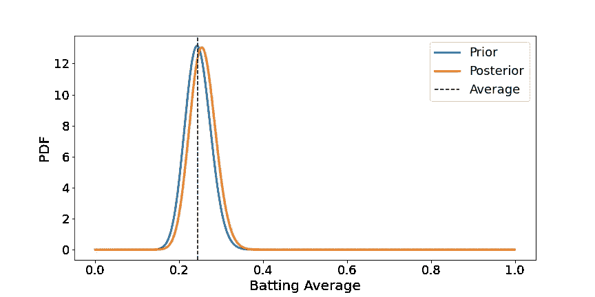

作者用 Python 生成的图。

三个球并不多，为什么平均值几乎没有变化，这是有道理的。如果我们现在说这名球员从 **50** 个球中击出了 **40** 个球，那么他的后路会是什么样子？

```
alpha = 49
beta = 151
new_alpha = 49+40
new_beta = 151+10
probability = np.arange (0, 1, 0.001)
prior = beta_dist.pdf(probability, alpha, beta)
posterior = beta_dist.pdf(probability, new_alpha, new_beta)plt.figure(figsize=(12,6))
plt.plot(probability, prior, linewidth=3, label='Prior')
plt.plot(probability, posterior, linewidth=3, label='Posterior')
plt.xlabel('Batting Average', fontsize=20)
plt.ylabel('PDF', fontsize=20)
plt.xticks(fontsize=18)
plt.yticks(fontsize=18)
plt.axvline(0.244,  linestyle = 'dashed', color='black', label='Average')
plt.legend(fontsize=18)
plt.show()
```

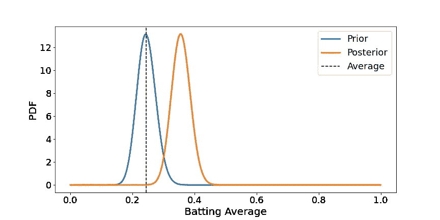

作者用 Python 生成的图。

我们看到了更大的变化，因为我们现在有了更多的数据。

## 没有共轭先验

如果没有共轭先验，我们将不得不使用可能性和先验的乘积来计算后验概率。为了完整起见，我们来看一下这个过程。

我们将使用一个例子，玩家在 50 个球中击中了 40 个。在这种情况下，我们的可能性是:

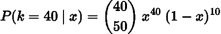

作者用 Python 生成的图。

这里我们使用了二项式**[**【PMF】**](https://en.wikipedia.org/wiki/Probability_mass_function)**概率质量函数。****

**执行贝叶斯更新并绘制后验概率图:**

```
alpha = 49
beta = 151probability = np.arange(0, 1, 0.001)
prior = beta_dist.pdf(x, alpha, beta)
likelihood = 10272278170*probability**40*(1-probability)**10
posterior = prior*likelihood
posterior = posterior/sum(posterior)plt.figure(figsize=(12,6))
plt.plot(probability, posterior, linewidth=3, label='Posterior')
plt.xlabel('Batting Average', fontsize=20)
plt.ylabel('Probability', fontsize=20)
plt.xticks(fontsize=18)
plt.yticks(fontsize=18)
plt.axvline(0.244,  linestyle = 'dashed', color='black', label='Average')
plt.legend(fontsize=18)
plt.show()
```

**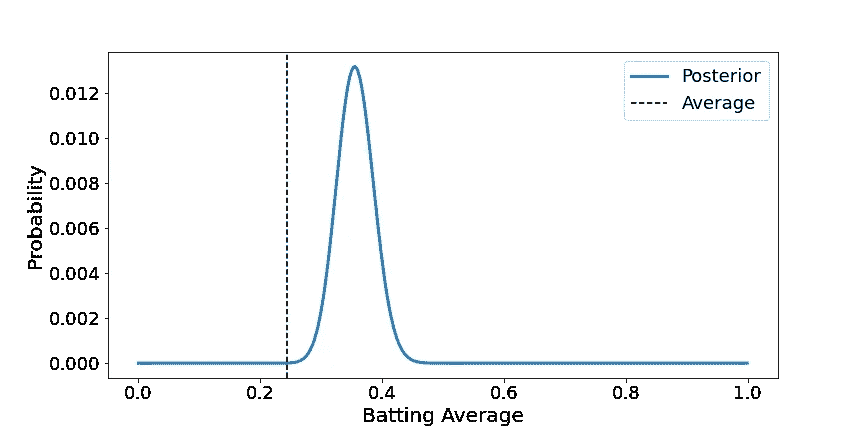**

**作者用 Python 生成的图。**

**我们到达和以前一样的分布！**

**眼尖的你可能会注意到一个不同，y 轴是不同的。这与返回 PDF 的 SciPy Beta 函数有关，而这里我们使用的是 PMF。**

# **其他共轭分布**

**贝塔二项分布并不是唯一的共轭分布:**

*   **[贝塔-**伯努利**](https://en.wikipedia.org/wiki/Bernoulli_distribution)**
*   **<https://en.wikipedia.org/wiki/Gamma_distribution>**-[-**阿松**](https://en.wikipedia.org/wiki/Poisson_distribution)****
*   ****[**狄利克雷**](https://en.wikipedia.org/wiki/Dirichlet_distribution)-[-**多项式**](https://en.wikipedia.org/wiki/Multinomial_distribution)****

****仅举几个例子。****

****可悲的是，并不是所有的问题，事实上很少，都可以用共轭先验来解决。****

****然而，还有更一般的替代方案如 [**马尔可夫链蒙特卡罗**](https://en.wikipedia.org/wiki/Markov_chain_Monte_Carlo) **，**为棘手的积分提供了另一种解决方案。****

# ****结论****

****在这篇文章中，我们描述了共轭先验如何让我们通过简单的加法计算后验概率。这非常有用，因为它消除了计算可能性和先验的乘积的需要，这可能导致难以处理的积分。****

****本文中使用的完整代码可以在我的 GitHub 上找到:****

****<https://github.com/egorhowell/Medium-Articles/blob/main/Statistics/Conjugate_Priors.ipynb>  

# 和我联系！

*   要在媒体上阅读无限的故事，请务必在此注册！T17*💜*
*   [*要想在我发帖注册时得到更新的邮件通知就在这里！*](/subscribe/@egorhowell) 😀
*   [*LinkedIn*](https://www.linkedin.com/in/egor-howell-092a721b3/)*👔*
*   *[*推特*](https://twitter.com/EgorHowell) 🖊*
*   *[*github*](https://github.com/egorhowell)*🖥**
*   **<https://www.kaggle.com/egorphysics>**🏅****

> ***(所有表情符号都是由 [OpenMoji](https://openmoji.org/) 设计的——开源的表情符号和图标项目。许可证: [CC BY-SA 4.0](https://creativecommons.org/licenses/by-sa/4.0/#)***************