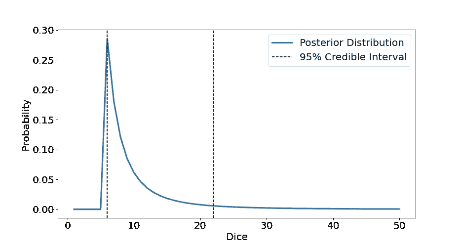

# 贝叶斯可信区间简单解释

> 原文：<https://towardsdatascience.com/bayesian-credible-intervals-simply-explained-24989c9259a3>

## 贝叶斯可信区间的简明描述及其在 Python 中的实现


在 [Unsplash](https://unsplash.com?utm_source=medium&utm_medium=referral) 上由 [aceofnet](https://unsplash.com/@aceofnet?utm_source=medium&utm_medium=referral) 拍摄的照片

# 介绍

在我之前的一篇文章中，我讨论过 [**置信区间**](https://en.wikipedia.org/wiki/Confidence_interval) **的想法。你可以在这里查看这个博客:**

[](/confidence-intervals-simply-explained-58b0b11e985f)  

置信区间基本上是一种给估计参数分配不确定性的方法。置信区间是一种 [**频率主义者**](https://en.wikipedia.org/wiki/Frequentist_inference) 的方法，而 [**可信区间**](https://en.wikipedia.org/wiki/Credible_interval) 是类似的 [**贝叶斯**](https://en.wikipedia.org/wiki/Bayesian_statistics) 版本。

在本文中，我想探究这两种类型的区间之间的差异，展示一个可信区间的例子以及如何用 Python 计算它。

# 置信区间与可信区间

尽管置信区间和可信区间传达了相似的信息，但它们的计算方式却大不相同。

## 置信区间

置信区间是两者中较为复杂的一个，实际上经常被误解为可信区间。

置信区间是具有“置信度”的参数值的范围，用于测量真实参数位于样本范围内的确定性。置信水平是指置信区间将包含来自大量随机样本的真实参数的“确定性”。最常见的一种选级是 95% ***。*** 这意味着 95% 的随机样本，从 95% 的置信区间中抽取，将包含真实参数。这也意味着 5%的样本不包含真参数。

> 如果你想知道更多关于置信区间的细节，一定要看看我之前在上面链接的文章。

## 可信区间

然而，人们通常将置信区间解释为随机样本有 95%的机会包含真实参数。这其实更符合贝叶斯可信区间推断的东西。

可信区间更直观，基本上描述了哪些参数位于给定的概率范围内。例如，95%可信区间将只是占后验分布 95%的参数/值范围。

为了更深入地理解后验分布和贝叶斯定理，请查看我以前的帖子:

[](https://pub.towardsai.net/conditional-probability-and-bayes-theorem-simply-explained-788a6361f333)  [](/bayesian-updating-simply-explained-c2ed3e563588)  

# 例子

现在我们将通过一个简单的例子来把这个理论付诸实践。

## 问题是

在我之前的文章中，我用 Python 实现了贝叶斯更新。你可以在这里查看帖子:

[](/bayesian-updating-in-python-8bbd0e7e30cc)  

我解决的问题是:给定一些不同数字范围的骰子，我们随机选择一个骰子，然后掷几次。使用我们从掷骰子中得到的数据，我们可以建立一个后验分布来确定我们最有可能选择哪个骰子。

## 代码

下面是我上一篇文章中的一个函数，它接收一组骰子和数据(掷骰子),并返回后验分布:

```
**def** bayesian_dice_updating(data, dice):
    """ Compute the posterior distribution for given dice and data.

    :param data: The numbers that have been rolled from the dice
    :type data: list, np.array

    :param dice: The range of dices where the number represents 
                 the maximum value that die can take.
    :type dice: list, np.array

    :returns: Posterior distribution of the dice given the data
    :rtype: list

    """

    prior **=** [1**/**len(dice) **for** _ **in** np**.**arange(len(dice))]

    posterior **=** prior

    **for** roll **in** data:
        likelihood **=** [1**/**i **if** i **>=** roll **else** 0 **for** i **in** dice]
        posterior **=** np**.**array(likelihood) ***** np**.**array(posterior)

    **return** list(posterior**/**sum(posterior))
```

完整代码可从我的 GitHub 获得，网址是:

[](https://github.com/egorhowell/Medium-Articles/blob/main/Statistics/Bayesian_Updating.ipynb)  

现在，假设我们有 50 个不同的骰子，其中它们的相关数字是该骰子的最高值。例如，骰子 20 的值从 1 到 20。

我们拿起一个骰子，用那个骰子掷出 2、4 和 6。跨可能骰子的所得后验分布为:

```
# Generate our dice
dice = np.arange(1,51)# Some rolls
data = [2,4,6]# Plot the probability distribution using our function
plt.figure(figsize=(13,7))
plt.xlabel('Dice', fontsize=20)
plt.ylabel('Probability', fontsize=20)
plt.plot(dice, bayesian_dice_updating(data, dice))
plt.xticks(fontsize=20)
plt.yticks(fontsize=20)
plt.savefig('plot.png')
plt.show()
```


作者用 Python 生成的图。

我们看到最有可能死的[**最大后验估计**](https://en.wikipedia.org/wiki/Maximum_a_posteriori_estimation) **(图)**，就是区间 1–6 的那个，死 6。同样，骰子 1 到 5 是零，因为这些骰子不可能产生值 6。

## 可信区间

我们可以使用一个简单的 for 循环和一个滚动总计来构建此地图值周围的可信区间:

```
credible_interval_dice =[]
credible_interval = 0.95
total = 0
posterior = bayesian_dice_updating(data, dice)for prob in posterior:
    total += prob
    if total < credible_interval:
        credible_interval_dice.append(prob)
```

在这种情况下我们计算的是 95%可信区间，即 [**正态分布**](https://en.wikipedia.org/wiki/Normal_distribution) **中两个 [**标准差**](https://en.wikipedia.org/wiki/Standard_deviation) 捕捉到的数据量。**

通过返回位于可信区间列表长度索引处的骰子，我们可以找到属于该可信区间的骰子范围:

```
dice[(len(credible_interval_dice))]Output: 22
```

因此，我们可以说我们捡到的骰子在 6–22 之间，可信区间为 95%。

绘制可信区间:

```
plt.figure(figsize=(13,7))
plt.xlabel('Dice', fontsize=20)
plt.ylabel('Probability', fontsize=20)
plt.plot(dice, posterior, linewidth=3, label='Posterior Distribution')
plt.xticks(fontsize=20)
plt.yticks(fontsize=20)
plt.axvline(6, color='black', linestyle='dashed', label='95% Credible Interval')
plt.axvline(22, color='black', linestyle='dashed')
plt.legend(fontsize=20)
plt.show()
```



作者用 Python 生成的图。

有趣的是，这也是 [**密度最高的区间**](https://stats.stackexchange.com/questions/148439/what-is-a-highest-density-region-hdr) 为 95%。HDI 基本上是对应于某一可信水平的最小区间。

生成这些图并计算可信区间的完整代码可从我的 GitHub 获得:

[](https://github.com/egorhowell/Medium-Articles/blob/main/Statistics/Credible_Interval.ipynb)  

# 结论

在本文中，我们描述并解释了频率主义置信区间和贝叶斯可信区间之间的主要区别。此外，我们通过一个简单的例子展示了如何用 Python 计算给定后验分布的可信区间。

# 和我联系！

*   要在媒体上阅读无限的故事，请务必在此注册！ 💜
*   [*当我在这里发布注册邮件通知时获得更新！*](/subscribe/@egorhowell) 😀
*   [*LinkedIn*](https://www.linkedin.com/in/egor-howell-092a721b3/)*👔*
*   *[*碎碎念*](https://twitter.com/EgorHowell) 🖊*
*   *[*github*](https://github.com/egorhowell)*🖥**
*   **[](https://www.kaggle.com/egorphysics)**🏅****

> ***(所有表情符号由 [OpenMoji](https://openmoji.org/) 设计——开源表情符号和图标项目。许可证: [CC BY-SA 4.0](https://creativecommons.org/licenses/by-sa/4.0/#)***