# 基于 PyMC3 的贝叶斯客户终身价值建模

> 原文：<https://towardsdatascience.com/bayesian-customer-lifetime-values-modeling-using-pymc3-d770676f5c06>

## 实现 BG-NBD 概率分层模型，使用 PyMC3 分析客户购买行为

来源: [Unsplash](https://unsplash.com/photos/pQyTChJwEDI)

C 客户终身价值(CLV)是客户在其关系存续期间对公司的总价值。一个公司的客户群的集体 CLV 反映了它的经济价值，并且经常被用来评估它的未来前景。

虽然存在许多估计 CLV 的方法，但在过去几十年中出现的最有影响力的模型之一是贝塔几何负二项分布(BG-NBD)。**该框架使用** [**Gamma**](https://en.wikipedia.org/wiki/Gamma_distribution) **和**[**Beta**](https://en.wikipedia.org/wiki/Beta_distribution)**分布对客户的重复购买行为进行建模。本系列文章的第 1 部分已经探讨了这个模型背后的数学原理。同时，[第 2 部分](https://medium.com/towards-data-science/modeling-customer-lifetime-value-with-lifetimes-71171a35f654)介绍了 [*寿命*](https://lifetimes.readthedocs.io/en/latest/) ，这是一个允许我们方便地拟合 BG-NBD 模型并获得其最大似然估计(MLEs)参数的库。如果您还没有阅读这些部分，我建议您阅读它们，因为接下来的内容是建立在它们之上的。**

本系列的最后一部分介绍了实现 BG-NBD 的另一种方法——一种基于贝叶斯原理的方法。我们将使用 [*PyMC3*](https://docs.pymc.io/en/v3/) 来编码这个实现。虽然本文的主要目的是通过贝叶斯透镜来阐明 BG-NBD，但也将提出贝叶斯世界观和 *PyMC3* 框架的一些一般观点。这是我们的议程:

1.  首先，我们将论证贝叶斯实现比频率主义者提供了一些优势。
2.  其次，我们将提供一个实现“蓝图”来指导我们的编码步骤。
3.  第三，我们将花一些时间研究优先选择**——贝叶斯建模中的一个关键组件。**
4.  **接下来，我们将回顾一下 *PyMC3* 代码及其复杂性，包括著名的蒙特卡罗马尔可夫链(MCMC)算法。**
5.  **最后，我们将分析贝叶斯 BG-NBD 模型的输出，并将其与*寿命*的输出进行比较。**

**我们开始吧！**

# **为什么是贝叶斯？**

**你可能想知道如果我们已经有了用户友好的*生命周期*，为什么还需要另一个实现。答案在于频率主义者和贝叶斯推理之间的对比以及后者所提供的优势。**

**为了说明这些差异，让我们把 frequentist 和 Bayesian 框架想象成两个试图对统计问题(如 CLV 估计)建模的编程函数。我们会看到这些函数在输入和输出上有着重要的不同。**

**这两个函数都将数据集(观察值)作为输入。**然而，贝叶斯函数需要在分布之前*形式的额外输入。***先验反映了我们对模型参数的初始假设，并将在考虑观察结果后进行更新。**

**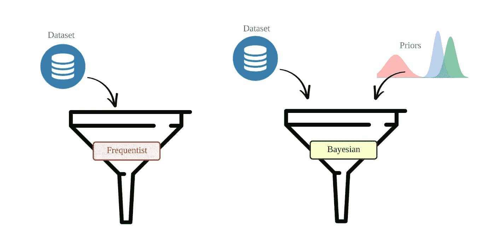**

**包含先验知识是一把双刃剑。**一方面，先验为用户提供了一种使用其领域知识“引导”模型找到正确参数的方法。**例如，在 BG-NBD，如果我们确定我们的大多数客户以每周 4 次交易的比率λ进行购买，我们可以提供导致平均值为 4 的伽马分布的先验。如果这种直觉只是略有偏差(例如，如果真实的λ是 3.5 笔交易/周)，贝叶斯框架将允许我们仅用很少的数据点来得出正确的值。**

> ****另一方面，由于没有单一的“正确”方法来选择先验，贝叶斯建模过程是主观的和可变的。两个统计学家共享相同的数据，但使用不同的先验知识，最终可能会得到完全不同的结果。这种主观性是一些从业者避开贝叶斯的主要原因之一。然而，随着更多的数据点被包括在建模中，先验的影响减少了。****

**这两个函数的输出也不同。它们都返回模型的参数估计，但形式不同。frequentist 将它们作为点估计返回。例如，我们已经看到 frequentist 库[*寿命*](https://lifetimes.readthedocs.io/en/latest/) 如何使用 MLE 计算 *r、α* 、 *a* 和 *b* 的点估计。相比之下，贝叶斯将它们作为概率分布返回。这些分布称为后验分布，代表了我们在考虑观察值后对参数的更新信念。**

**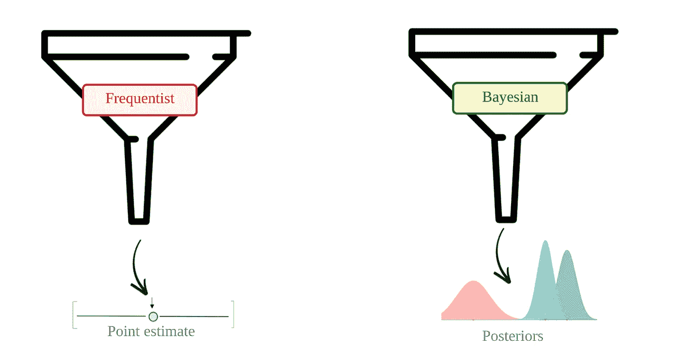**

**后验的获得是贝叶斯框架胜过频率主义者的另一个方面。有了后验概率，就很容易将参数的最合理值可视化，并量化我们估计中的任何不确定性。此外，如果有额外的观测数据，前后循环提供了更新参数的原则方法。**

# **实施蓝图**

**我们在第 1 部分已经看到，BG-NBD 模型是一个分层的概率模型。*层级*这里指的是一些分布的参数被其他分布(“父”分布)建模的事实。我们很快就会看到 *PyMC3* 允许我们用代码表达这些父子关系。**

**下面提供了指导编码步骤的蓝图。该蓝图遍历模型的逻辑流程，从输入(数据和先验分布)开始，到输出(后验分布)结束。**

**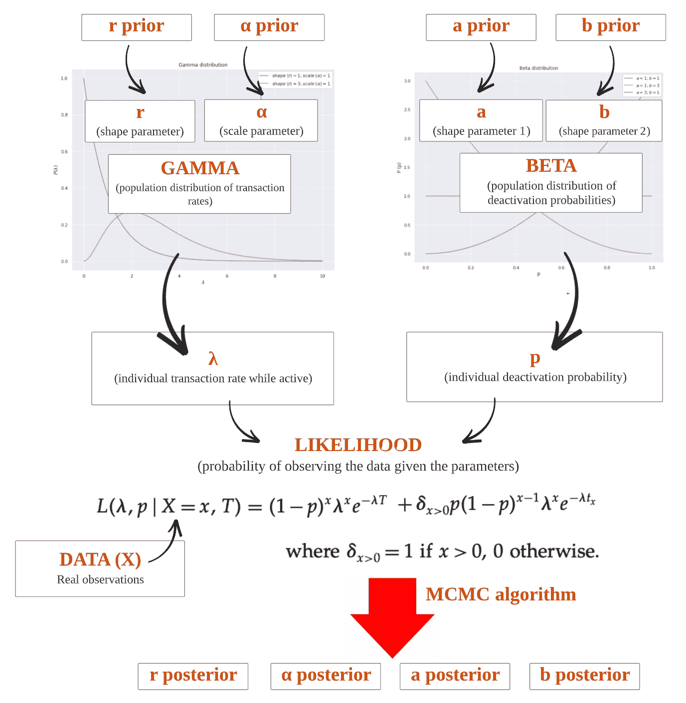**

**对上述蓝图的一些评论:**

1.  ****伽玛分布代表交易率λ在客户群体中的分布。**由两个参数参数化: *r* 和 *α* 。我们将为 *r* 和 *α* 提供先验，即将被我们的观测更新。**
2.  ****贝塔分布代表客户群体中去激活概率 *p* 的分布。**由两个形状参数参数化: *a* 和 *b* **。**同样，我们将提供这些参数的先验知识。**
3.  ****来自伽马分布的 *λ* 和来自贝塔分布的 *p* 构成了似然函数，该函数表示观察到数据集中的事务的概率。这种可能性就是结合我们的数据和理论的方程式。****
4.  ***PyMC3* 中的 MCMC 算法将使我们能够对 *r，α，a* 和 *b* 的后验分布进行采样。我们稍后会详细讨论这个算法。**

**有关上述分配的详细信息，请参见[第 1 部分](/customer-lifetime-value-estimation-via-probabilistic-modeling-d5111cb52dd)；如果你对它们不熟悉，就看看吧！**

# **先验选择**

## **考虑**

**如前所述，我们需要为 *r、α、a* 和 *b* 分别提供一个先验。**我们可以将这些先验及其各自的参数视为我们模型的“超参数”。**选择先验知识时，需要考虑多种因素:**

1.  **先验知识可以从现有的知识中形成，而现有的知识又可以来自领域专门知识、历史观察或过去的建模实验。**
2.  **当没有信息可用时，可以选择无信息先验来反映可能的参数值之间的差异。**
3.  **我们可以施加一些约束来指导我们的选择。例如，我们可以要求我们的先验分布是对称的、严格正的、重尾的等等。**

**在我们的案例中，以下是我们的考虑和假设:**

1.  **至于购买率λ，我们将假设我们有一个强烈的直觉，即我们的大部分客户以每周购买 4 次的速度进行交易。我们将选择反映这种先验信念的伽玛先验。**
2.  **相比之下，我们将假设没有关于我们的客户的去激活概率( *p* )的先验知识。因此，我们会选择无信息β先验。**
3.  **因为我们所有的参数( *r，α，a* 和 *b)* 只能是正实数，所以我们选择的先验分布必须为负数分配零概率密度。**

## **截尾正态分布**

**先验的一个很好的候选是[截尾正态分布](https://en.wikipedia.org/wiki/Truncated_normal_distribution)。顾名思义，截尾正态分布是一种被“截尾”的高斯分布。也就是说，其超过指定的左和右界限的密度*被设置为零，并且其在界限*之间的密度*被重新标准化为总和为 1。分布有四个参数:左右极限(通常称为 *A* 和 *B)* ，均值 *μ* 和标准差 *σ* 。***

> **截断正态分布常用作先验分布，因为它的四个参数提供了一种“猜测”值的直观方式。 *μ* 代表我们最有可能的猜测， *σ* 反映我们的不确定性水平， *A* 和 *B* 分别表示下限和上限约束。**

**以下是截断正态分布的一些例子:**

**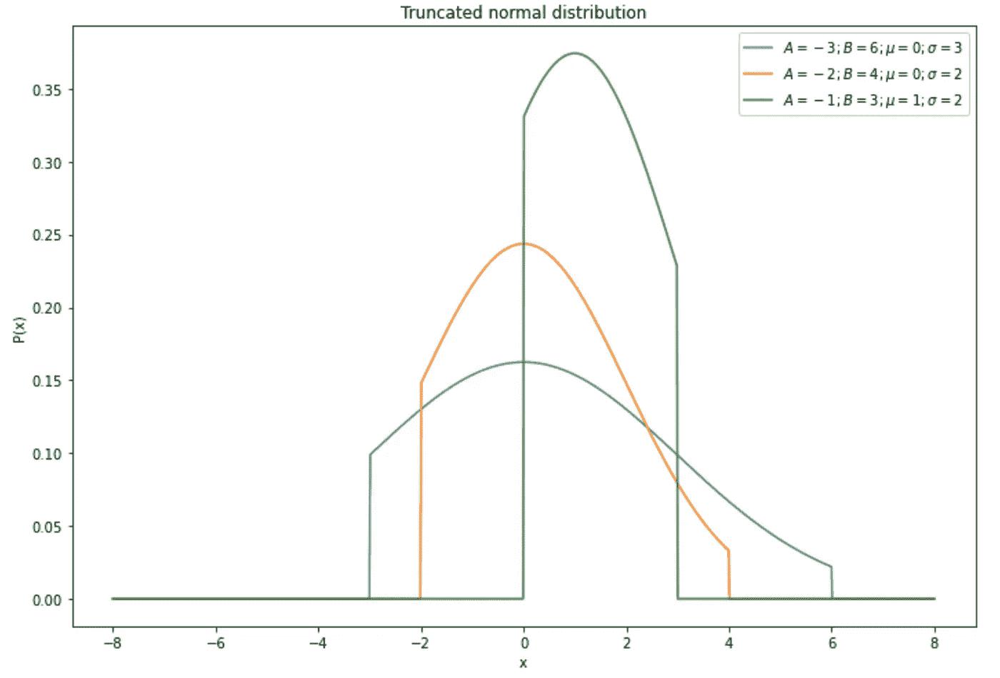**

## **伽玛和贝塔先验**

**有了这些考虑，现在让我们构建伽玛先验。以下是步骤:**

**1.如前所述，我们之前认为伽玛分布的最可能值(即其平均值)是每周 4 次交易。**

**2.**然后，我们选择伽马参数 *r* 和 *α* 的特定组合，这导致期望平均值为 4 的伽马分布。**我们知道一个[伽马分布的均值](https://en.wikipedia.org/wiki/Gamma_distribution)可以通过简单的公式 *μ* = *rα来计算；*这样，任何一对乘积为 4 的正数都可以被选为 *r* 和 *α* 的候选数。让我们将 *r* 设为 8，将 *α* 设为 0.5。使用这些参数构建的伽马分布绘制如下:**

**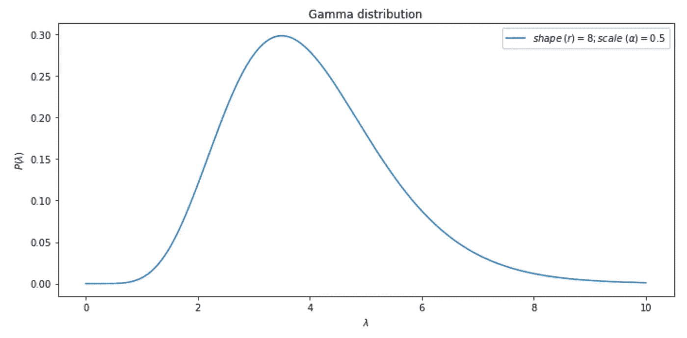**

**3.这些 *r* 和 *α* 值代表我们的*初始猜测*。由于我们对这些猜测没有 100%的把握，我们应该把它们表示为*分布*而不是点估计。正是这些分布，我们称之为*先验。由于前面提到的原因，我们将使用截尾正态来表示这些先验。***

**4.现在让我们把注意力集中在 *r 上。*r*r*的截断法线将具有以下参数:**

*   ***μ* : 8(我们最可能的初步猜测)**
*   ***∑*:7(相当大的标准差，反映了我们的高度不确定性)**
*   ***A* : 0(因为我们知道 *r* 不可能是负数)**
*   ***B* : 40(这里，我们选择一个我们 *r* 不会超过的极右极限)。**

**使用这些参数构建的截断法线绘制如下:**

****

**5.重复上述过程，以获得 *α、a* 和 *b 的先验。工作流程如下所示:***

**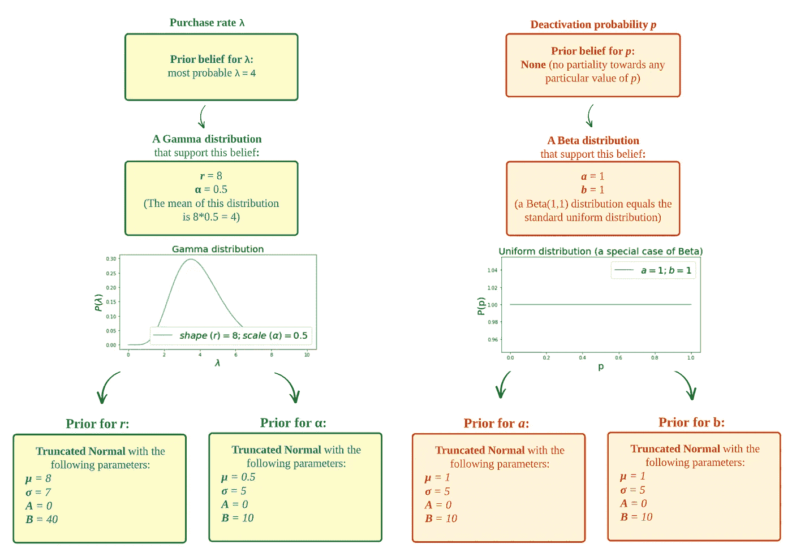**

**注意，对于β参数 *a* 和 *b，*我们选择了先验的无信息均匀分布，以反映我们对客户的失活概率( *p* )没有先验知识。**

# **在 PyMC3 中编码所有内容**

## **资料组**

**在整篇文章中，我们将使用由*生存期*提供的样本数据集( [MIT 许可](https://github.com/CamDavidsonPilon/lifetimes))。这张表记录了 [CDNow](https://en.wikipedia.org/wiki/CDNow) 的交易，这是一家出售 CD 的网络时代的公司。我们是这样加载的:**

**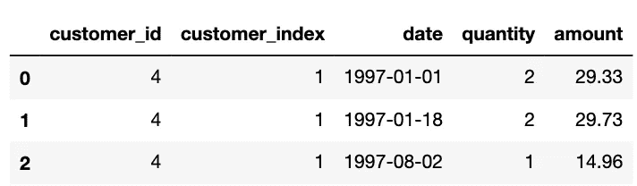**

****交易****

**正如在第 2 部分中讨论的[，在建模之前，该交易表应该经过两个先决步骤:](https://medium.com/@meraldo.antonio/71171a35f654#2b5f-e66d9b5b6df0)**

1.  **转换为规范的“RFM”格式，并且**
2.  **分为校准集和维持集。**

**我们将使用我们在第 2 部分中使用的同样的分裂机制，以便于比较*寿命*和 *PyMC3* 估计值。**

**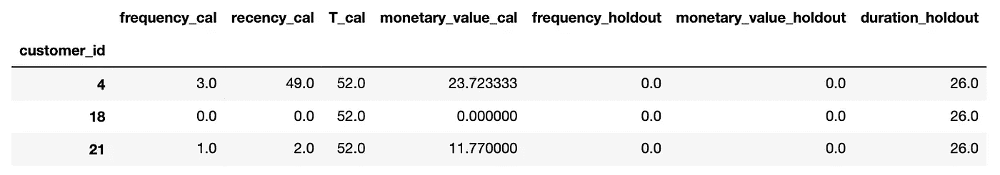**

****rfm_cal_holdout****

## ***PyMC3* 在动作**

**有了这个理论框架，我们现在就可以开始编码了。我们将使用 *PyMC3，*一个强大的贝叶斯建模库。虽然我们将提供一些关于 *PyMC3* 本身的提示，但我们的重点将放在 BG-NBD 实现上。**

**在 *PyMC3* 中，概率模型由 *pm 表示。Model()* 通常被编码为上下文管理器的对象。该模型将包含由*分布*对象表示的几个分布。这些*分布*对象之间可以有父子关系，其中父对象的值影响/决定子对象的值。**

**以下是 BG-NBD 在 *PyMC3* 中的实现。正如您所看到的，代码很好地反映了前面介绍的理论。**

**话虽如此，代码的两个部分可能并不简单，需要进一步讨论。这些部分，自定义似然函数(第 30–41 行)和 MCMC 采样(第 43–62 行)，详述如下。**

## **自定义似然函数**

***PyMC3* 配备了许多*分布*对象，每个对象对应一个众所周知的概率分布，如贝塔或伽马分布。然而，当涉及非标准概率分布时，如 BG-NBD 似然函数，则需要定制实现。**

**提醒一下，BG-NBD 模型中的似然函数如下所示(其推导过程在[第 1 部分](https://medium.com/p/d5111cb52dd)中提供):**

**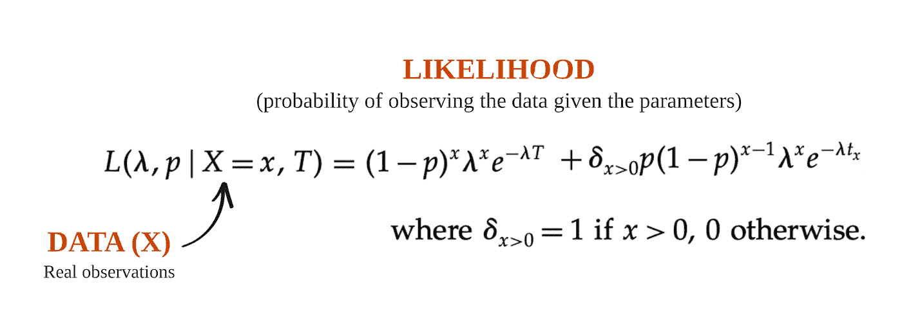**

**您可能还记得您的统计课，最大似然估计(MLE)涉及整个数据集的似然函数输出的乘法。因为这些乘法步骤中的每一步都输出一个分数，所以直接计算似然性可能会导致浮点问题。为了避免这种情况，通常将似然函数转换为对数似然函数，这样更便于优化。上述函数的对数似然版本如下:**

**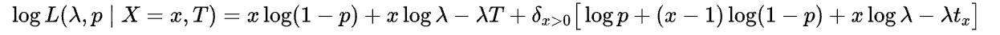**

**我们在 *logp* 函数中实现的就是*上面的这个*公式。然后，我们通过实例化一个新的[*density dist*](https://docs.pymc.io/en/v3/api/distributions/utilities.html#pymc3.distributions.DensityDist)*对象并在实例化过程中传递 callable，将这个函数转换成一个*分布*对象。因为这个*分布*对象的值是*已知的*，所以我们也在它的实例化期间提供了这些已知的值 *x* 、 *tₓ* 和 *T* 。***

## ***MCMC 算法***

***描述完模型后，我们可以执行 MCMC 算法对后验分布进行采样。MCMC 是一系列模拟算法，允许从封闭形式的 PDF 或 PMF 未知的分布中进行采样。它通过构建马尔可夫链来工作，马尔可夫链是一种多状态系统，允许根据特定的概率规则从一种状态转移到另一种状态。该链被设计成使其稳态与要采样的分布相匹配。***

***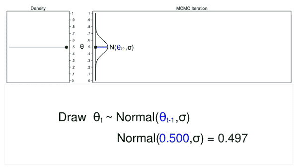***

***来自 Stata 博客的 MCMC 动画***

***我们使用 *pm.sample()开始链的构建和采样。*完成后，该函数返回一个包含绘制样本的 *trace* 对象。如果采样过程进展顺利(即达到稳定状态)，这些样本将代表我们期望的后验概率。***

***在进一步分析之前，我们应确认算法的收敛性(达到稳态),因为使用在收敛之前*获得的样本可能会导致错误的下游分析。为了确定收敛性，我们可以使用⁴的[*pm . trace _ plot()*](https://arviz-devs.github.io/arviz/api/generated/arviz.plot_trace.html)绘制*trace*；“曲折”模式表明不收敛，这不是一个好现象。****

***这是我们实验的轨迹图:***

***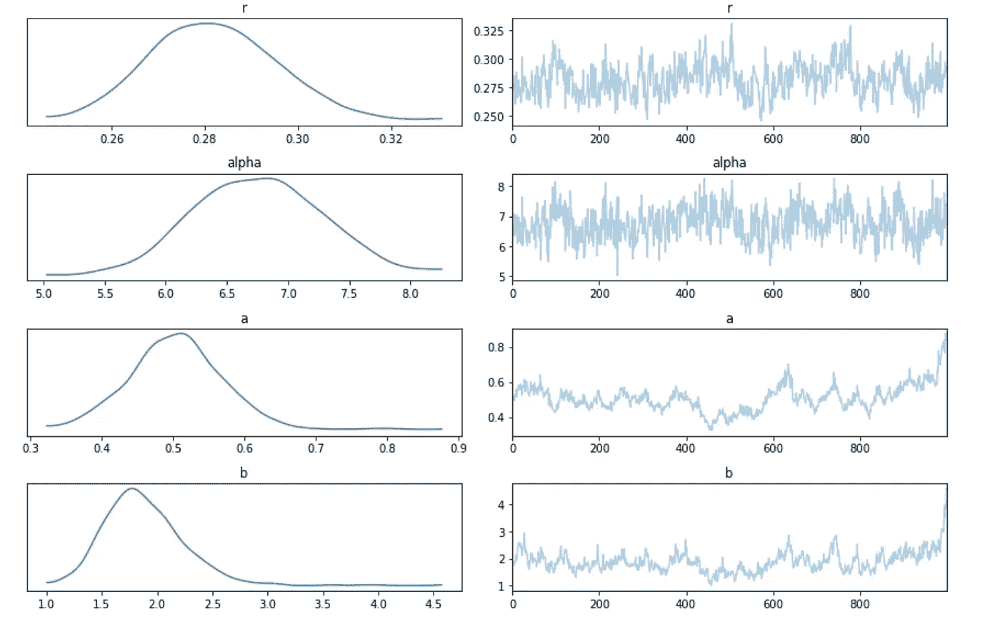***

***我们看到没有检测到明显的不收敛迹象。***

# ***后验分布分析***

## ***先验与后验***

***既然我们确信抽样过程运行正常，我们可以继续分析后验概率。一个常见的起点是 *pm.summary()，*，它返回我们的后验概率的汇总统计。让我们打印他们的手段。***

***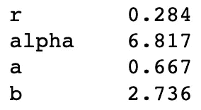***

***我们注意到这些后验方法与前验方法大不相同。例如， *b* 从 1(前均值)到 2.736(后均值)。这表明我们先前的信念没有得到数据的完全支持，因此被“更新”了。***

## ***与*寿命输出的比较****

***在本系列的前一篇文章中，我们已经看到了使用*寿命*库也可以用来估计参数 *r、α* 、 *a* 和 *b* 。现在让我们比较两种实现的结果:***

***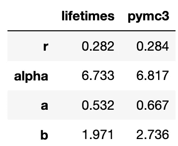***

***我们看到，尽管来自不同的框架(frequentist vs Bayesian)，估计的参数并没有太大的不同。***

## ***对估计的β和γ分布的分析***

***然后，我们可以使用贝叶斯后验概率的平均(即最可能的)参数值来构建和可视化伽玛和贝塔分布。***

***让我们从伽玛开始，这是图表:***

***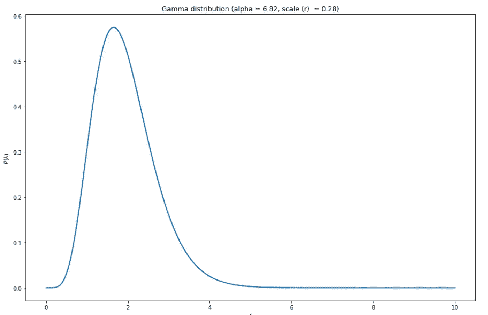***

***正如我们在第 1 部分中讨论的，伽玛分布具有实际意义——它定量地描述了我们客户群的集体购买行为。具体来说，它表明了人口中购买率的分布。上图显示了一个相对理想的伽马分布，大部分𝜆在 2 附近。这意味着我们的客户预计将以每周 2 笔交易的速度购物——对于 CD 公司来说，这是一个不错的速度！***

***现在让我们看看β分布，它描述了我们客户群中失活概率的分布:***

***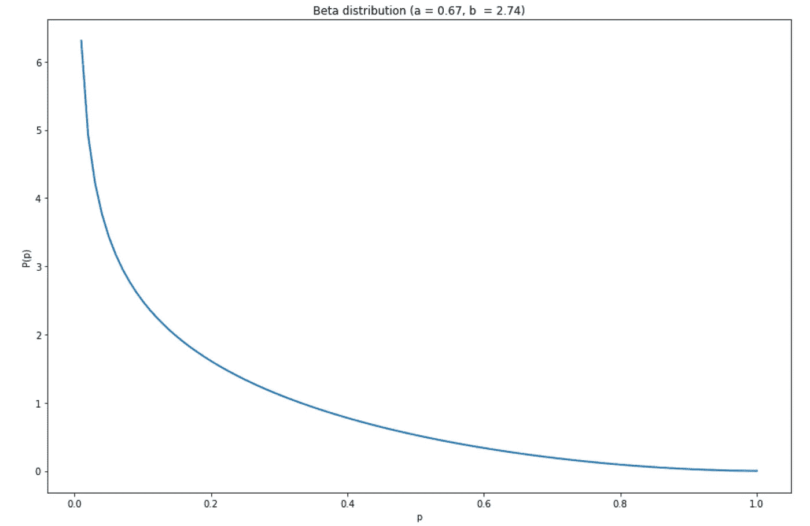***

***该图显示了一个相对健康的β分布，它将大部分的 *p* 集中在 0 附近。这意味着，作为一个整体，我们的客户不太可能停用。***

# ***结论***

***在这一系列文章中，我们讨论了 BG-NBD 模型的基本原理，并展示了它在解决现实世界商业问题中的价值。***

*****具体来说，在第 1 篇文章中，我们了解到 BG-NBD 对客户群的重复购买行为和停用概率进行了建模。得到的概率分布不仅在理论上是合理的；他们还提出了我们的个人客户和客户群的深刻的量化表示。*****

***在第 2 篇文章中，我们探讨了 BG-NBD 的常用实现*寿命*。*寿命*允许我们用几行代码来拟合 BG-NBD 模型。我们还看到了一些使用*生命周期输出的实用方法。* **我向那些不希望手动编写 BG-NBD 方程并希望立即开始推导商业价值的分析师推荐*寿命*。*****

***这第三篇也是最后一篇文章使用贝叶斯 *PyMC3* 库实现了 BG-NBD。该实施涉及从头开始编写 BG-NBD，因此需要对该模型有更深入的理解。优点是它允许我们指定先验，这允许我们将我们的专业知识结合到建模过程中。**我推荐这种方法给那些对 NBD BG 公司非常熟悉，并且对他们试图建模的客户群有领域知识的从业者。*****

# ***参考***

***[[1]“计算你的顾客”的简单方法:帕累托/NBD 模型的替代方案(布鲁斯·哈迪 *et。阿尔*，2005)](http://brucehardie.com/papers/018/fader_et_al_mksc_05.pdf)***

***[2]如果你对 pymc 3 的深入研究感兴趣，那就去看看这本很棒的书 [*概率编程&黑客的贝叶斯方法*](http://camdavidsonpilon.github.io/Probabilistic-Programming-and-Bayesian-Methods-for-Hackers/) 。***

***[[3] Stata 博客:贝叶斯统计介绍(第二部分)——MCMC 和 Metroplis Hastings 算法](https://blog.stata.com/2016/11/15/introduction-to-bayesian-statistics-part-2-mcmc-and-the-metropolis-hastings-algorithm/)***

***[4]轨迹绘制只是确认收敛的许多方法中的一种。PyMC3 [文档](https://pymcmc.readthedocs.io/en/latest/modelchecking.html)提供了该主题的广泛论述。***

******注*** *:除特别注明外，所有图像、图表、表格、方程式均由本人创作。****

***如果你对这篇文章有任何意见或者想联系我，请随时通过 LinkedIn 给我发一个联系方式。另外，如果你能支持我，通过我的推荐链接成为一名中级会员，我将非常感激。作为一名会员，你可以阅读我所有关于数据科学和个人发展的文章，并可以完全访问所有媒体上的故事。***