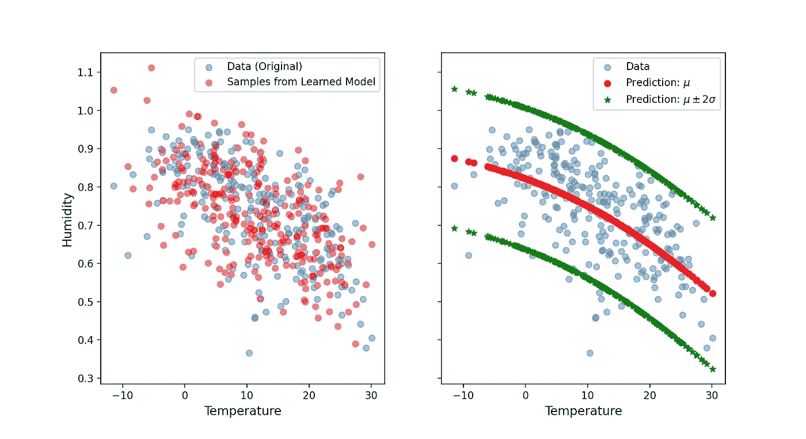
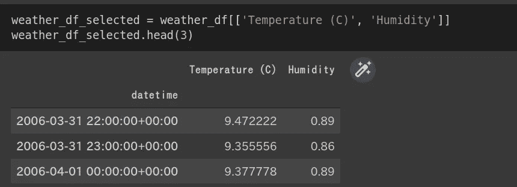
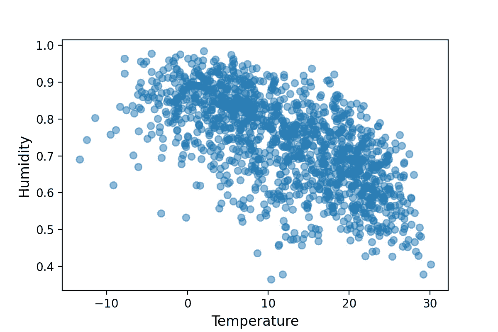
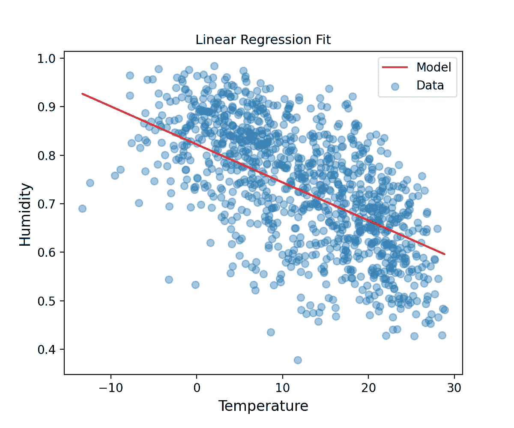
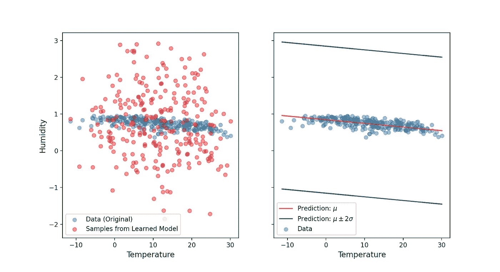
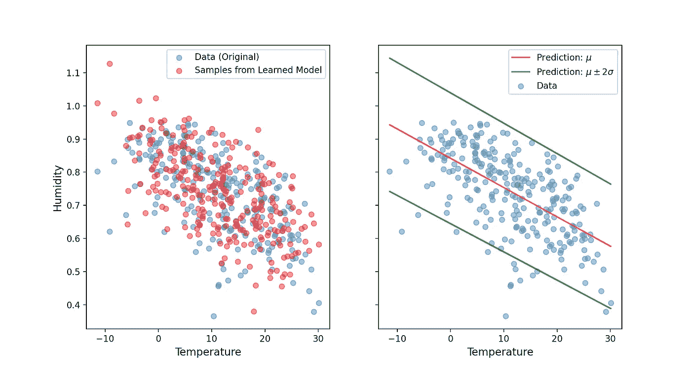
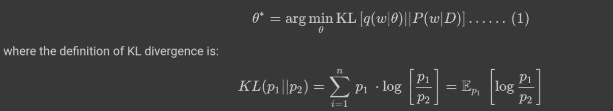
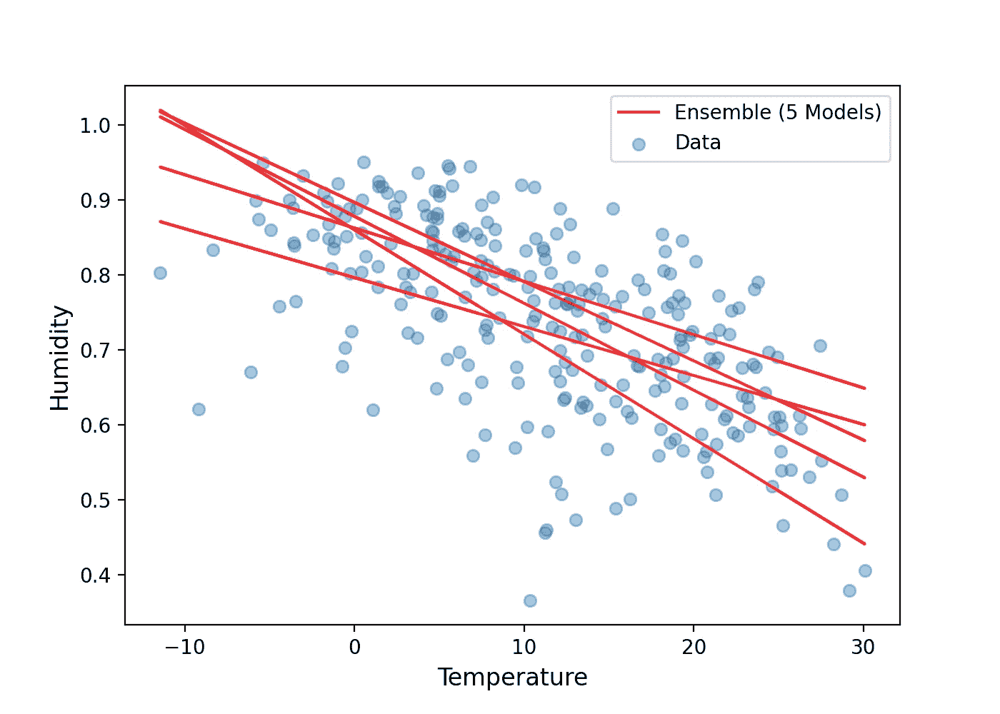
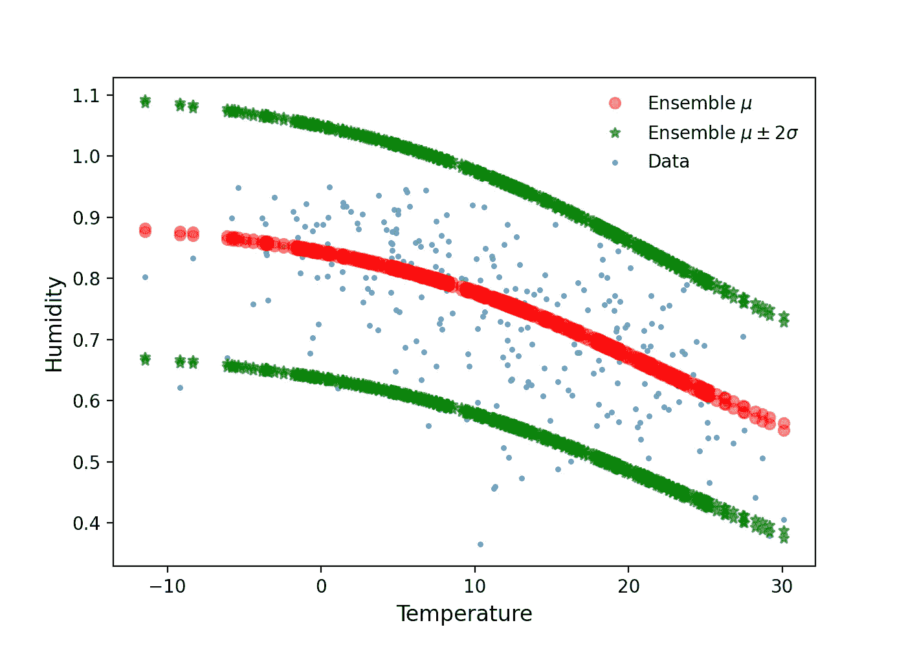

# 贝叶斯深度学习&估计不确定性

> 原文：<https://towardsdatascience.com/bayesian-deep-learning-estimating-uncertainty-9907f5208cc0>

## 天气数据；任意和认知的不确定性



湿度是温度的函数。更多细节见正文。(来源:作者)

深度神经网络(DNNs)的性能依赖于从大量数据中逐步构建和提取特征的能力。尽管这些深度模型通常是自适应的，但是性能取决于数据分布。鲁棒性在各种应用中是重要的，例如计算机视觉任务，例如自动驾驶，因为室外环境可能自然变化。在这一点上，我们希望知道预测正确的可能性有多大，这可以通过在模型中加入不确定性估计来实现。

在本帖中，我们将使用公开可用的真实[天气数据](https://www.kaggle.com/datasets/muthuj7/weather-dataset?sort=votes)，并构建简单的线性和非线性模型，不仅找到最佳模型，还找到不确定性估计。你可以从这篇文章中学到/回顾到什么—

1.  使用[张量流概率](https://www.tensorflow.org/probability)库开始贝叶斯深度学习。
2.  两种不同类型的不确定性估计:*任意的*和*认知的*不确定性。
3.  网络权重有多确定(*认知*不确定性)，什么是变分后验概率？

参考资料中给出的链接提供了完整的笔记本。让我们开始吧，不要耽搁。

## 1.加载和预处理数据:

我使用的是从 2006 年到 2016 年的 10 年间测量的[天气数据](https://www.kaggle.com/datasets/muthuj7/weather-dataset)(在 CC0 许可下可公开获得)。为简单起见，我将只使用温度和湿度值，我们的目标是发现湿度如何作为温度的函数而变化，并建立一个模型，该模型不仅预测行为，还为我们提供模型(&数据)不确定性信息。选择了所需的列后，我们的数据框架如下所示—



我们数据的前几个条目

正如我们所看到的，在 10 年的时间里，每小时都进行测量，产生了超过 95，000 个数据点。为了进一步简化，我们对数据帧进行了重新采样，以降低输入数据的频率，我选择了 3 天的时间间隔，而不是 1 小时的时间间隔，结果得到了 1340 个数据点。


以 3 天而不是 1 小时的频率重新采样数据。

我们现在可以在散点图中绘制湿度与温度的函数关系，如下所示——



图:1。湿度是温度的函数。

我们看到湿度(相对)在大约 0.4 到 1 之间变化，温度在大约-10 到大约 30 摄氏度之间变化，似乎有一种逆线性关系。我们将数据分成训练测试集，并将温度值标准化。这样，我们就为下一步做好了准备，建立模型并量化不确定性。

## 2.线性回归:

在处理任何不确定性之前，让我们先做一个简单的回归。简单的确定性回归给出了一个点估计，即对于一个输入值，我们得到一个预测值。对于这项任务，我们假设 X 数据与 Y 数据呈线性关系，噪声项呈正态分布。我们的模型通过最小化均方误差(MSE 损失)来学习，本质上是在我们的统计建模假设下最大化数据的可能性。我们可以很容易地在 TensorFlow 中建立这样一个回归网络，并检查如下预测—

代码块 1:具有单一单元的密集层的简单线性回归。



图 2:使用 TensorFlow & Python 的线性回归模型和预测。

## 任意的和认知的不确定性:

在我们深入研究概率回归之前，让我们简单讨论一下两种常见的不确定性:任意的和认知的不确定性。随机不确定性捕获了观测中固有的噪声，导致即使我们有更多的数据也无法减少的不确定性。另一方面，认知不确定性说明了模型参数的不确定性，如果获得更多数据，这种不确定性可以减少。认知不确定性是指决策者的无知(在这种情况下是深度神经网络)，而不是任何潜在的随机/随机过程。

## 3.1.任意不确定性:可训练均值

使用张量流概率库为回归任务模拟随机不确定性相当容易。在这里，我们的想法是捕捉数据中的固有噪声，并开始训练一个模型，该模型返回一个正态分布(与确定性线性回归和点估计非常不同)，具有可训练的平均值，但标准偏差=1(参见代码块 2)。这个想法是，在训练之后，我们的模型将能够复制原始的数据分布。为了使用密集层的输出来模拟正态分布，我使用了 TensorFlow Probability 的`DistributionLambda`层，它返回一个分布对象。这就是为什么我们使用负对数似然作为损失函数，而不是 MSE 损失。训练后，可以从学习到的分布中取样，并绘制平均&标准偏差，如下所示—

代码块 2:表示输入数据分布的模型(具有可训练的平均值，但方差固定)。



图 3:绘制了从学习的分布(左)生成的样本以及相应的平均值和标准偏差。

由于只有平均值是可训练的，并且我们将标准偏差(stddev)固定为 1，我们看到平均值的 2σ线相距太远。

这可以通过在之前的模型中添加 stddev 作为可学习参数来简单解决。现在，我们将使用两个单元(用于平均值和标准偏差)而不是一个只有一个单元的密集层。

## 3.2.任意不确定性:可训练的均值和方差；

为了在先前模型中添加可训练方差，我们可以使用具有`DistrbutionLambda`层的先前码块，但是在 TF 概率库中，我们具有能够直接包括先前密集层输出的随机性的`[IndependentNormal](https://www.tensorflow.org/probability/api_docs/python/tfp/layers/IndependentNormal)`层。让我们来看看这个模型—

代码块 3:类似于代码块 2，但是这里的模型具有可训练的均值和方差。

`IndependentNormal`层中的`event_shape`参数告诉我们所需的参数数量，对`event_shape=1`来说是 2；这就是为什么`Dense`层有 2 个单位(均值和方差)。为了指定密集层中的单元数量，我们使用了`IndependentNormal`层的静态方法`params_size`。

绘制学习分布的样本和相应的均值和标准差，如下所示—



图 4:与图 3 相同，但是现在我们的模型学习了原始数据分布的平均值和标准偏差。

不仅是线性模型，我们还可以添加一个具有非线性激活函数的密集层来包含非线性。

代码块 4:用非线性密集层扩展代码块 3。


图 5:与图 4 相同，但是代替线性模型，我们假设非线性模型来表示数据分布。

## 4.认知不确定性:

到目前为止，我们试图通过在模型的最后一层添加一些分布来模拟数据的一般随机性(即潜在噪声)，即最终预测是分布中的随机变量。

认知不确定性捕捉了 DNN 模型参数的不确定性。为了捕捉神经网络中认知的不确定性( *NN* )，我们将先验分布置于其权重之上，例如，高斯先验分布:*W*∞N(0， *I* )。将 DNN 权重表示为概率分布而不是点估计的想法是在“[神经网络](https://arxiv.org/pdf/1505.05424.pdf)中的权重不确定性”论文中提出的。我们从权重的一些先验分布开始，并随着网络看到更多数据而更新，以获得后验分布。对于多元正态分布，有可能得到后验的精确形式。一般来说，不可能确定后验概率的解析形式，因此变分法就变得有用了。

给定训练数据，*P*(*w*|*D*)的情况下，神经网络的贝叶斯推理计算权重的后验分布。*变分贝叶斯*方法使用称为*变分后验*的第二个函数来近似后验分布。该函数具有已知的函数形式，因此避免了精确确定后验概率 P ( *w* | *D* )的需要。为了避免选择差的变分后验概率的风险，这个近似函数，即变分后验概率由参数θ来参数化，参数θ被调整以使得该函数尽可能地近似原始后验概率(P( *w* | *D* ))。变分学习找到权重分布的参数*θ**q*(*w*|*θ*)，该参数最小化权重的 Kullback-Leibler (KL)散度与真实贝叶斯后验概率。



最小化 KL 散度将我们引向证据下限(ELBO)。关于 ELBO 的更多信息，你可以查看我在参考资料中列出的笔记本，也可以查看关于[期望最大化(EM)算法](https://medium.com/towards-data-science/latent-variables-expectation-maximization-algorithm-fb15c4e0f32c)的详细帖子。

我们在张量流中实现变分后验的方法是通过`[DenseVariationalLayer](https://www.tensorflow.org/probability/api_docs/python/tfp/layers/DenseVariational)`层，文档定义如下—

> 这一层使用变分推理来拟合分布在`kernel`矩阵和`bias`项上的“替代物”,这些项以类似于`[tf.keras.layers.Dense](https://www.tensorflow.org/api_docs/python/tf/keras/layers/Dense)`的方式使用。

在我们使用这一层之前，我们需要实现固定的先验分布和可训练的后验分布，这将在`DenseVariationalLayer`中使用。

代码块 5:考虑简单回归网络中的权重不确定性。

让我们看看在代码块 5 中发生了什么:*先验*:我们将先验权重定义为具有对角协方差矩阵的多元正态分布( *N* (0，1))，作为一个`sequential`，并且没有可训练的参数。*后验:*这里权重是可训练的(`VariableLayer` ) &遵循具有全协方差矩阵的多元正态分布(`MultivariateNormalTril`)。*模型*:最后我们使用`DenseVariational`层定义一个模型，并使用先验和后验定义。KL 散度根据训练样本的数量进行加权，你可以在笔记本上找到原因。在我们用 MSE 损失训练这个模型之后，我们可以绘制回归线如下—



图 6:认知的不确定性:这里，每条线代表从后验分布中随机抽取的不同模型参数。

每次我们调用这个模型，我们都会得到一个稍微不同的结果，你可以从那 5 行中看到。不同的斜率表明我们的模型不确定温度和湿度的线性相关性。`DenseVariational`本质上定义了模型的集合，在这种情况下，我们可以从这 5 个不同的调用中获得平均值。

## 5.任意+认知的不确定性:

最后，我们将创建一个模型，它可以结合随机和认知的不确定性，这是很容易做到的，我们只需要添加一个`IndependentNormal`层到以前的模型(代码块 5)来考虑标签(湿度)分布的随机性质。让我们看看下面的代码块—

一旦经过训练，我们就可以像以前一样从模型中为不同的呼叫(认知不确定性)进行采样，如下所示

```
for _ in range(2): y_model = model_non_lin_al_ep(X_test_scaled) y_hat = y_model.mean() y_hat_m2sd = y_hat — 2 * y_model.stddev() y_hat_p2sd = y_hat + 2 * y_model.stddev()
```

绘制这两个调用的均值和标准差如下所示—



图 7:与之前的图相同，但是这里我们有任意的和认知的不确定性:两条不同的线代表对模型的两个不同的调用(代表认知的不确定性)。

我们学习了贝叶斯神经网络(BNN)的基本构建模块，特别是与认知不确定性相关的模块。如果我们将数据集表示为 X = {x1，…，xN }，Y = {y1，…，yN }，那么贝叶斯推断用于计算权重 p(W|X，Y)的后验概率。这里我们通过一个简单的例子，我们知道确切的后验分布，只需要找到最佳参数。虽然认知的不确定性可以减少给定更多的数据，随机的不确定性是不可减少的。使用真实世界的天气数据，我们开发了一个简单的模型，适用于超越点估计和预测不确定性的回归任务。我希望这里用来建立这些模型的概念能给我们提供关于不确定性的信息，这将是有用的，你可以根据你的任务修改它们。

## 参考资料:

[1] ' ['机器学习中的任意和认知不确定性](https://link.springer.com/article/10.1007/s10994-021-05946-3) ': E. Hüllermeier，W. Waegeman

[2] ' [在计算机视觉的贝叶斯深度学习中我们需要哪些不确定性](https://arxiv.org/abs/1703.04977)？':a .肯德尔，Y. Gal。

[3] [TFP 层:概率回归](https://www.tensorflow.org/probability/examples/Probabilistic_Layers_Regression)。

[4] ' [神经网络中的权重不确定性](https://arxiv.org/pdf/1505.05424.pdf) ': C. Bundell 等人

[4]代码、概念和数学笔记本: [GitHub 链接](https://github.com/suvoooo/Learn-TensorFlow/blob/master/TF-Proba/Bayesian_uncertainty.ipynb)

***如果你对更深入的基础机器学习概念感兴趣，可以考虑加盟 Medium 使用*** [***我的链接***](https://saptashwa.medium.com/membership) ***。你不用额外付钱，但我会得到一点佣金。感谢大家！！***