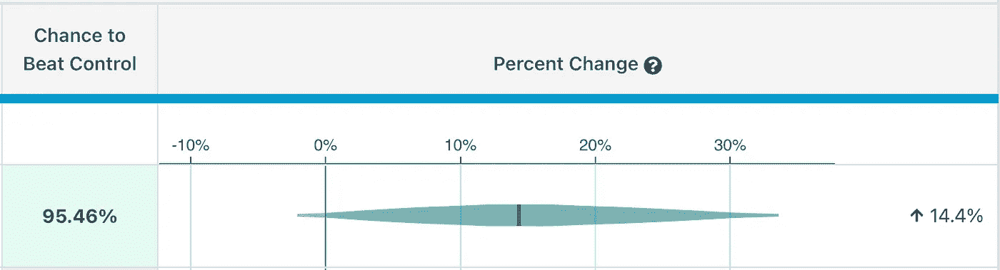
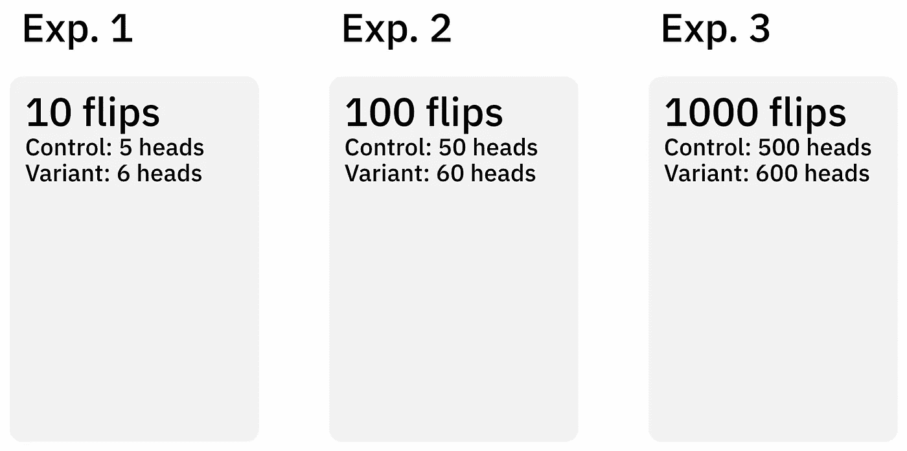
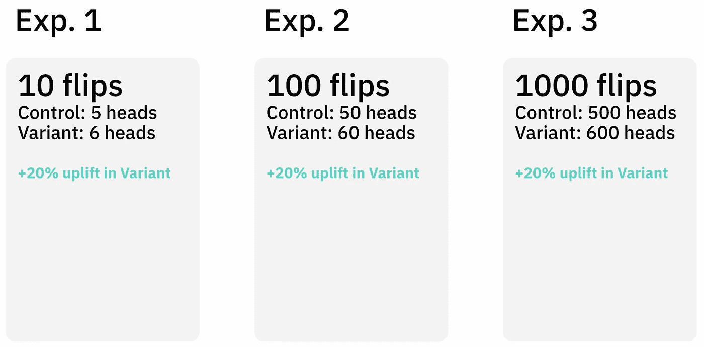
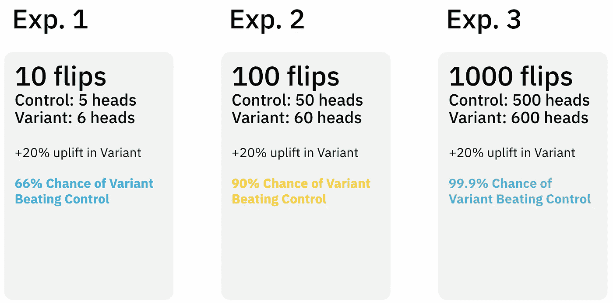
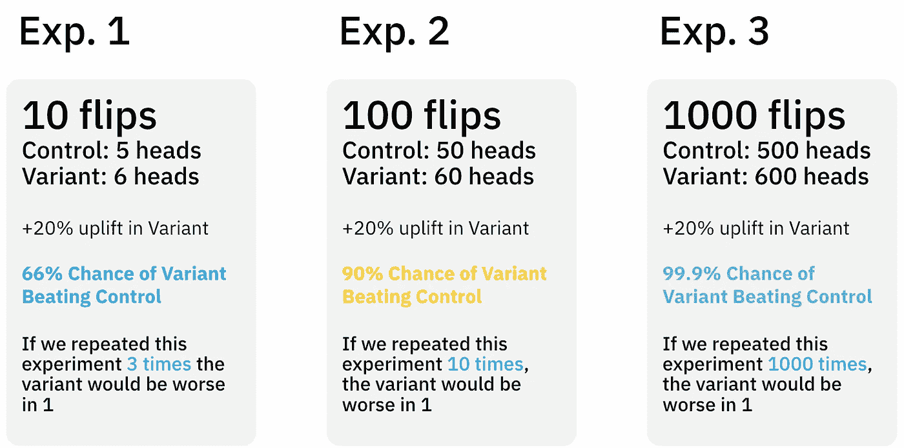
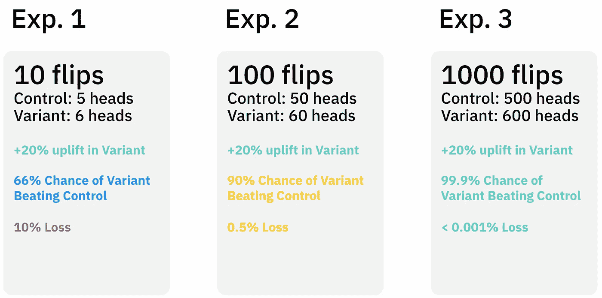

# 解释贝叶斯实验度量

> 原文：<https://towardsdatascience.com/bayesian-experimentation-metrics-explained-bd2faebd937e>

作者图片

在 Typeform，我们采用 GrowthBook 作为 AB 测试的实验平台。GrowthBook 根据您的指标计算 3 个贝叶斯统计，以帮助您对您的新功能得出结论:

*   上升
*   击败控制的机会
*   选择变体的损失或风险

在这篇文章中，我将解释它们是什么以及如何解释它们。

[图像来源](https://commons.wikimedia.org/wiki/File:Coin_Toss_(3635981474).jpg)

# 抛硬币示例

为了帮助解释我们的统计数据，我们将使用一个经典的抛硬币的例子来进行一个思维实验——这可能是解释贝叶斯统计的最好方法。

假设你有两枚硬币:

*   硬币 1(控制)是一个公平的硬币，正面或反面的机会是 50:50
*   硬币 2(变体)未知，您想知道它是否有更高的机会给出正面

我们要做实验来测试硬币 2 对硬币 1 的偏向。

# 实验结果

我们将运行 3 个不同版本的实验，在每种情况下将硬币翻转不同的次数:

作者图片

我假设控制硬币总是准确地返回 50:50 的正面和反面——在真实的实验中，你会在控制硬币和变体硬币的准确结果中得到变化。为了简单起见，我将随机波动限制为变量。

# 上升

您想要计算的第一个(可能也是最明显的)统计数据是*上升*。

> ***定义:*** 在实验过程中，变体的表现比对照好多少

下面是我们每个实验的提升:

作者图片

在每个实验中，我们观察到变体硬币相对于控制硬币有 20%的头部提升。我们怎么解释这个？

> ***我们可以说:*** 变异体比对照体表现好 20%
> 
> ***我们不能说的:*** 变体*会比对照*表现好 20%

这两种说法的区别在于，第一种说法是报告收集的数据，而第二种说法是推断未来的表现。这种差异在实验 1 中最为明显——如果你将变体硬币再抛 10 次，你会再次看到正好 6 个头吗？不，可能不会。如果这是一枚公平的硬币，你同样有可能得到 4 个正面，这将是 20%的概率——完全相反的结果！

直觉上，如果你重复实验 3，你可能会得到我们已经看到的接近 20%的提升，当然 20%的下降将是非常令人惊讶的！然而，这种可再现性或未来的性能并不是仅仅通过提升就能获得的。

# 击败控制的机会

这就是你可能提到的统计学意义。

> ***定义:*** 如果我们铺开，变体的表现优于对照的可能性有多大

以下是我们每个实验中战胜控制的机会:

作者图片

随着我们观察到越来越多的数据，我们可以更有把握地得出结论，这种变异有一种潜在的偏向头部的倾向。我们怎么解释这个？

> ***我们可以说:*** 变异体有 90%的几率表现得比对照好
> 
> ***我们不能说的:*** 变体有 90%的几率提供+20%的提升

与上升不同，战胜控制的机会是对硬币潜在行为的描述。我们现在可以得出结论，变体硬币在未来将如何继续表现。然而，击败控制组的机会是一个二元统计——变异体仅仅比控制组更好的可能性。我们不能把这个概率与我们在实验中看到的 20%的上升直接联系起来。

在实验 3 中，无论我们重复实验多少次，我们几乎可以保证(99.9%的机会)从变体中获得更多的头。事实上，如果你重复 1000 次，你只会认为第一次会更糟。然而，我们将看到的确切的上升在这些重复之间仍然会有所不同。如果我们重复 Exp 1 三次，那么我们预计其中一次会更糟——如果这是我们希望推出的新功能，可能性不大！

作者图片

# 失败

即使我们战胜控制的机会很高，仍然有很小的可能性会变得更糟，如果变得更糟的后果是灾难性的，那么我们不能忽视它。这就是损失的来源。

> ***定义:*** 如果我们推出变体，而它的表现更差，我们可以预期它会差到什么程度？

下面是我们每个实验的损失:

作者图片

亏损让你决定是否接受机会战胜控制和上涨带来的风险。

*   在实验 1 中，我们观察到 20%的增长，但损失是 10%—一般来说，变体收益的潜力不会超过潜在的损失。
*   在实验 3 中，损失几乎为 0——即使在最坏的情况下，变体的性能也和对照一样好。
*   实验 2 可能是最有趣的——有不可忽略的 10%的可能性变得更糟，但损失仍然只有 0.5%。在这种情况下，您可能会做出明智的决定，即变体的潜在改进确实超过了任何潜在的损失。

# 结论

我们已经介绍了 GrowthBook 计算的 3 个统计数据，并解释了如何使用它们来了解您的 AB 测试结果。推出新功能的决定取决于其他因素，例如生产新功能的工程努力。关于这一点的讨论将不得不等待另一篇文章！