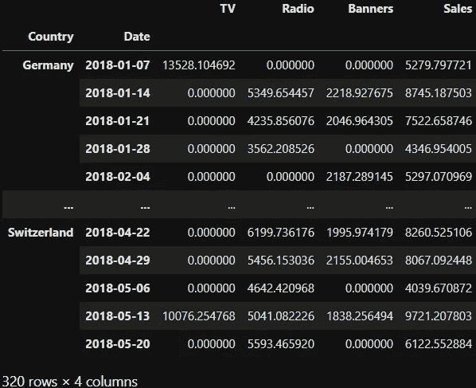
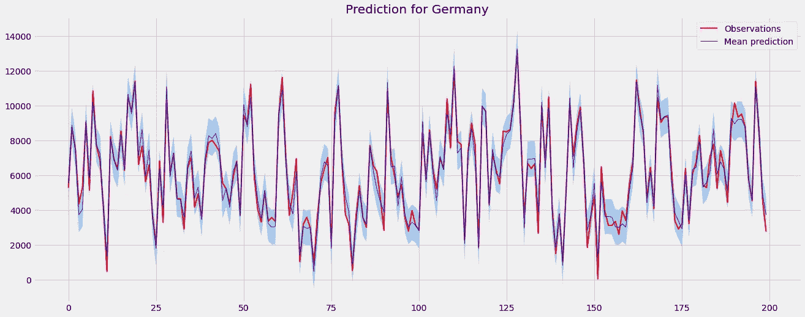
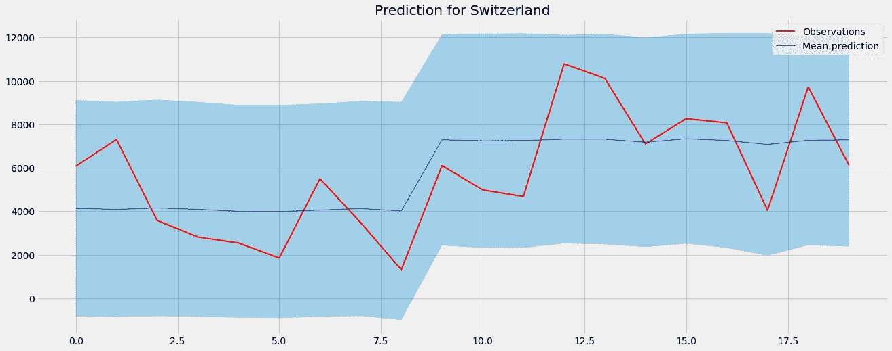
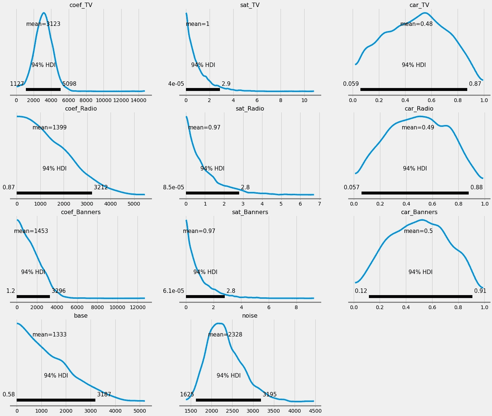
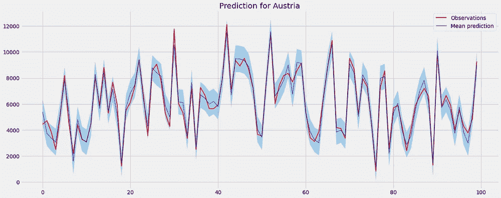
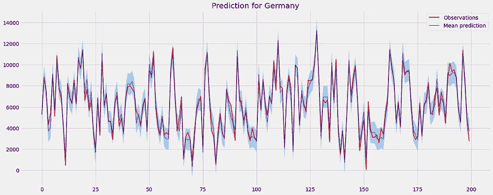
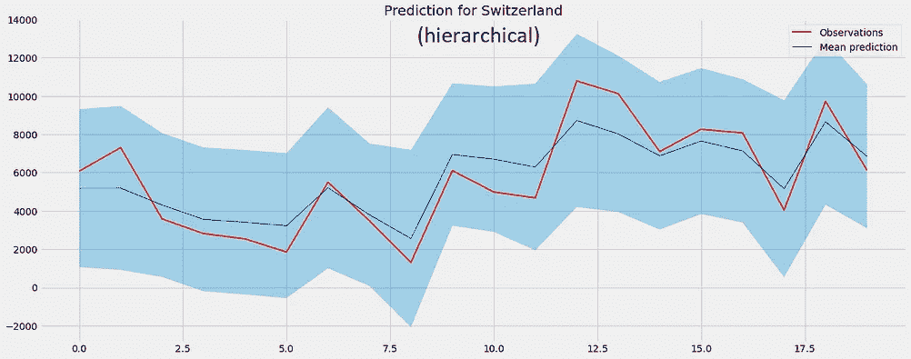
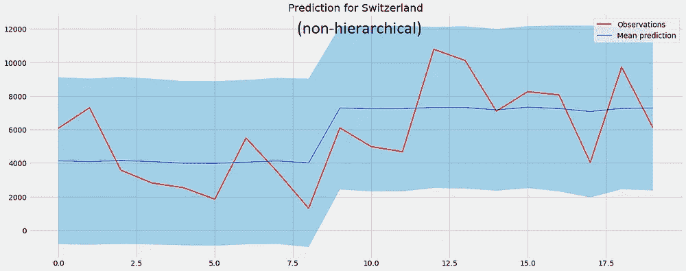

# PyMC 中的贝叶斯分层营销组合建模

> 原文：<https://towardsdatascience.com/bayesian-hierarchical-marketing-mix-modeling-in-pymc-684f6024e57a>

## [营销分析](https://medium.com/tag/marketing-analytics)

## 了解如何以正确的方式为不同的国家构建 mmm


由[安妮·斯普拉特](https://unsplash.com/@anniespratt?utm_source=medium&utm_medium=referral)在 [Unsplash](https://unsplash.com?utm_source=medium&utm_medium=referral) 上拍摄

我想你在营销部门工作，想调查你的广告投资是否有回报。看我其他文章的人都知道一个办法:**营销组合建模！这个方法特别有趣，因为它也适用于没有烹饪的世界。**

</introduction-to-marketing-mix-modeling-in-python-d0dd81f4e794>  

我还介绍了贝叶斯营销组合建模，这是一种为您预测的一切获得更健壮的模型和不确定性估计的方法。

</bayesian-marketing-mix-modeling-in-python-via-pymc3-7b2071f6001a>  

贝叶斯方法对**同质数据非常有效，**这意味着你的广告支出的效果在你的数据集中是可比较的。但是当我们有一个异构的数据集时，例如，跨越几个国家的花费会发生什么呢？处理它的两个明显的方法如下:

1.  忽略数据集中有几个国家的事实，建立一个**单一大模型**。
2.  每个国家生产**一款车型**。

不幸的是，这两种方法都有缺点。长话短说:忽视国家留给你的是一个过于粗糙的模型，很可能是**不适合**。另一方面，如果你为每个国家建立一个模型，你可能会有太多的模型需要跟踪。更糟糕的是，如果一些国家没有很多数据点，你的模型可能会过拟合。

通常，创建介于这两种方法之间的混合模型更有效:**贝叶斯分层建模**！您也可以在这里了解更多信息:

</bayesian-hierarchical-modeling-in-pymc3-d113c97f5149>  

你会问我们如何从中受益？例如，贝叶斯分层建模可以产生一个模型，其中相邻国家的 *TV 结转*值**彼此相距不太远**，这抵消了过度拟合效应。

然而，如果数据清楚地表明参数实际上是完全不同的，在给定足够的数据的情况下，贝叶斯分层模型也能够发现这一点。

在下文中，我将向您展示如何将**贝叶斯营销组合建模(BMMM)** 与**贝叶斯分层建模(BHM)** 方法结合起来，使用 PyMC 在 Python 中创建一个**贝叶斯分层营销组合模型(BHMMM)** 。

> BHMMM = BMMM + BHM

前谷歌公司的研究人员也写了一篇关于这个想法的论文，我鼓励你以后也去看看。[1]在你理解了我关于 BMMM 和 BHM 的文章之后，你应该能很好地理解这篇论文了。

请注意，我不再使用 PyMC ***3*** 了，而是使用 PyMC，它是这个伟大的库的[的改版。幸运的是，如果你以前知道 PyMC3，你也可以了解 PyMC。我们开始吧！](https://www.pymc.io/blog/v4_announcement.html#v4_announcement)

# 准备

首先，我们将加载一个我自己制作的合成数据集，这对于训练目的来说很好。

```
dataset_link = "https://raw.githubusercontent.com/Garve/datasets/fdb81840fb96faeda5a874efa1b9bbfb83ce1929/bhmmm.csv"

data = pd.read_csv(dataset_link)

X = data.drop(columns=["Sales", "Date"])
y = data["Sales"]
```



由作者创建的数据。图片由作者提供。

现在，让我从我的另一篇文章中复制一些函数，一个用于计算指数饱和度，一个用于处理结转。我对它们进行了调整，即将`theano.tensor`改为`aesara.tensor`，将`tt`改为`at`，以便与新的 PyMC 配合使用。

```
import aesara.tensor as at

def saturate(x, a):
    return 1 - at.exp(-a*x)

def carryover(x, strength, length=21):
    w = at.as_tensor_variable(
        [at.power(strength, i) for i in range(length)]
    )

    x_lags = at.stack(
        [at.concatenate([
            at.zeros(i),
            x[:x.shape[0]-i]
        ]) for i in range(length)]
    )

    return at.dot(w, x_lags)
```

我们现在可以开始建模了。

# BHMMM 大楼

在我们开始完整的模型之前，我们可以先建立单独的模型，看看会发生什么，并有一个基线。

## 独立型号

如果我们遵循[这里](/bayesian-marketing-mix-modeling-in-python-via-pymc3-7b2071f6001a)的方法，我们得到德国:



德国的模型预测。图片由作者提供。

非常合身。然而，对于瑞士，我们只有 20 个观测值，因此预测值不会太大:



瑞士的模型预测。图片由作者提供。

这也是为什么*独立模型接近*有时会有问题的原因。有理由相信，在媒体对瑞士人的影响方面，瑞士人与德国人并非完全不同，一个模型应该能够捕捉到这一点。

我们还可以看到**瑞士车型**对参数的了解:



瑞士模型的后验概率。图片由作者提供。

由于缺乏瑞士的数据点，后验概率仍然很大。您可以从右侧的`car_`参数中看到这一点:**结转的 94% HDI 几乎跨越了 0 和 1** 之间的整个可能范围。

让我们现在就建立一个合适的 BHMMM，这样特别是瑞士可以从我们从德国和奥地利获得的大量数据中受益。

## PyMC 实现

我们引入一些**超优先级**来塑造所有国家的基本分布。例如，使用 Beta 分布对遗留物进行建模。这个分布有两个参数 *α* 和 *β* 、，我们保留两个超先验`car_alpha`和`car_beta`来模拟这些。

在第 15 行，您可以看到如何使用超优先级来定义每个国家和渠道的结转。此外，我使用了比平常更多的调优步骤——3000 步而不是 1000 步——因为模型相当复杂。调整步骤越多，模型推断起来就越容易。

```
with pm.Model() as bhmmm:
    # Hyperpriors
    coef_lam = pm.Exponential("coef_lam", lam=10)
    sat_lam = pm.Exponential("sat_lam", lam=10)
    car_alpha = pm.Exponential("car_alpha", lam=0.01)
    car_beta = pm.Exponential("car_beta", lam=0.01)
    base_lam = pm.Exponential("base_lam", lam=10)

    # For each country
    for country in X["Country"].unique():
        X_ = X[X["Country"] == country]
        channel_contributions = []

        # For each channel, like in the case without hierarchies
        for channel in ["TV", "Radio", "Banners"]:
            coef = pm.Exponential(f"coef_{channel}_{country}", lam=coef_lam)
            sat = pm.Exponential(f"sat_{channel}_{country}", lam=sat_lam)
            car = pm.Beta(f"car_{channel}_{country}", alpha=car_alpha, beta=car_beta)

            channel_data = X_[channel].values
            channel_contribution = pm.Deterministic(
                f"contribution_{channel}_{country}",
                coef * saturate(carryover(channel_data, car), sat),
            )

            channel_contributions.append(channel_contribution)

        base = pm.Exponential(f"base_{country}", lam=base_lam)
        noise = pm.Exponential(f"noise_{country}", lam=0.001)

        sales = pm.Normal(
            f"sales_{country}",
            mu=sum(channel_contributions) + base,
            sigma=noise,
            observed=y[X_.index].values,
        )

    trace = pm.sample(tune=3000)
```

就是这样！

## 检查输出

让我们只看一下模型捕捉数据的能力。



德国和奥地利的 BHMMM 预测结果。图片由作者提供。

我现在不会用指标进行任何真正的检查，但从图表中，我们可以看到德国和奥地利的表现看起来相当不错。

如果我们将 BHMMM 中的瑞士和以前的 BMMM 版本进行比较，我们也可以看到它现在看起来好多了。



瑞士的 BHMMM(左)和 BMMM(右)预测结果。图片由作者提供。

这是唯一可能的，因为我们使用其他类似国家的数据给了瑞士一些背景。

我们还可以看到瑞士结转的后验概率是如何缩小的:


图片由作者提供。

一些发行版仍然有点混乱，我们必须深入研究如何解决这个问题。可能有取样问题或者前科不良，等等。但是，我们不会在这里这样做。

# 结论

在本文中，我们快速浏览了两个不同的贝叶斯概念:

*   贝叶斯营销组合建模分析营销支出，以及
*   贝叶斯分层建模。

然后，我们通过结合这两种方法，打造了一个更好的贝叶斯营销组合模型。如果您处理一些层次结构，例如，在为几个相关国家建立营销组合模型时，这尤其方便。

这种方法如此有效是因为**它为模型提供了背景**:如果你告诉模型对一个国家进行预测，它可以考虑其他国家的信息。如果模型必须在太小的数据集上操作，这是至关重要的。

另一个我想告诉你的想法如下:在本文中，我们使用了一个**国家层级**。然而，您也可以考虑其他层次，例如，**频道层次**。如果你说不同的渠道不应有太大的不同，渠道层级可能会出现，例如，如果你的模型**不仅采用横幅广告支出**，还采用网站 A 上的**横幅广告支出和网站 B** 上的**横幅广告支出，其中网站 A 和 B 的用户行为没有太大的不同。**

# 参考

[1]孙玉英，王玉英，金玉英，陈，克勒，[地理层次贝叶斯分层媒体混合建模](https://static.googleusercontent.com/media/research.google.com/de//pubs/archive/46000.pdf) (2017)

我希望你今天学到了新的、有趣的、有用的东西。感谢阅读！

**作为最后一点，如果你**

1.  **想支持我多写点机器学习和**
2.  **无论如何都要计划获得中等订阅量，**

**为什么不做** [**通过这个环节**](https://dr-robert-kuebler.medium.com/membership) **？这将对我帮助很大！😊**

透明地说，给你的价格不变，但大约一半的订阅费直接归我。

非常感谢，如果你考虑支持我的话！

> *有问题就在*[*LinkedIn*](https://www.linkedin.com/in/dr-robert-k%C3%BCbler-983859150/)*上写我！*