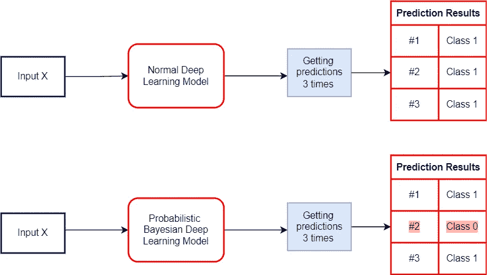
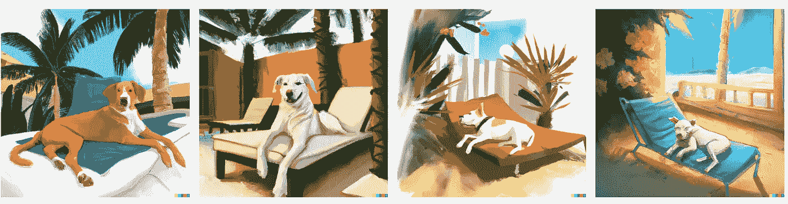
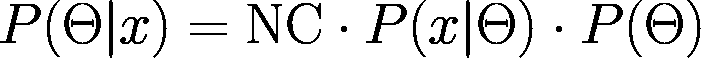
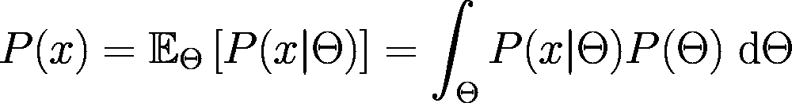
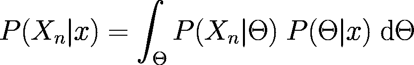
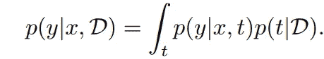
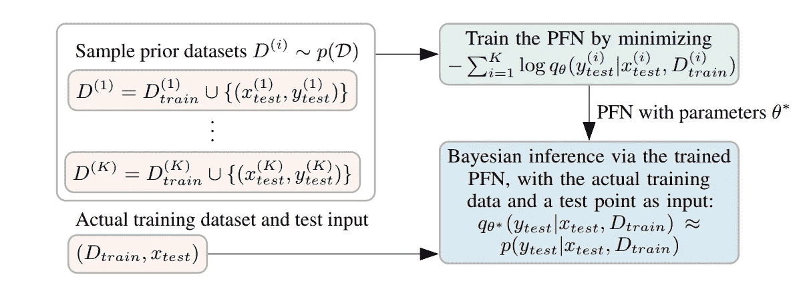
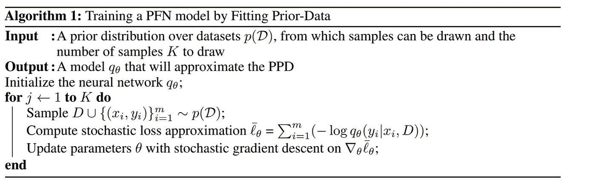
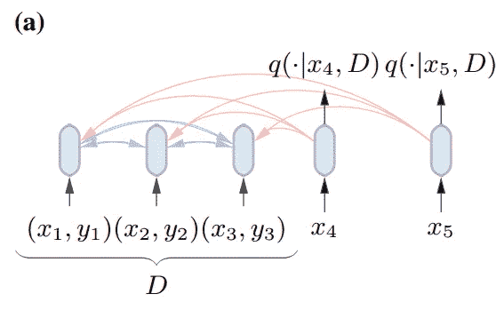
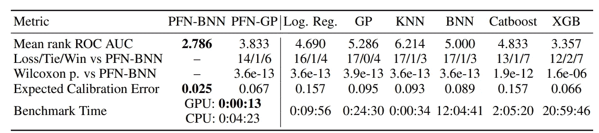

# 贝叶斯推理和变压器

> 原文：<https://towardsdatascience.com/bayesian-inference-and-transformers-3dc473ac1af2>

## 变形金刚可以帮忙做贝叶斯推断吗？简单回顾一下变形金刚可以做贝叶斯推断

阿瑟尼·托古列夫在 [Unsplash](https://unsplash.com?utm_source=medium&utm_medium=referral) 上的照片

这是深度学习的不确定性系列的最后一篇文章:

*   [第一部分——简介](/uncertainty-in-deep-learning-brief-introduction-1f9a5de3ae04)
*   [第 2 部分——随机不确定性和最大似然估计](/uncertainty-in-deep-learning-aleatoric-uncertainty-and-maximum-likelihood-estimation-c7449ee13712)
*   [第 3 部分——认知不确定性和反向投影贝叶斯](/uncertainty-in-deep-learning-epistemic-uncertainty-and-bayes-by-backprop-e6353eeadebb)
*   [第 4 部分——实现完全概率贝叶斯 CNN](/uncertainty-in-deep-learning-bayesian-cnn-tensorflow-probability-758d7482bef6)
*   [第五部分——贝叶斯 CNN 实验](/uncertainty-in-deep-learning-experiments-with-bayesian-cnn-1ca37ddb6954)
*   **第 6 部分——贝叶斯推理和变压器**

最后一部分将与该系列的其他部分略有不同。我将在下面的文章中描述一篇文章中的方法和提出的方法背后的推理(以便与变分推理进行比较): [**变形金刚可以进行贝叶斯推理**](https://arxiv.org/pdf/2112.10510.pdf) **。**

注:我将试着简要解释这篇论文，这并不意味着是官方的东西。

本文组织如下:

*   **重述**
*   **元学习和贝叶斯推理**
*   **后验和后验预测分布**
*   **建议方法:预先拟合网络**
*   **使用变压器并将零件组装在一起**
*   **结论**

# 概述

## 传统深度学习模型

正如第 2 部分和第 3 部分所解释的，标准模型是确定性的。换句话说，一个输入应该得到相同的输出。因为用最大似然估计(MLE)，你会得到点估计权重。

让我们来举例说明:

图片作者。

另一方面，**概率贝叶斯深度学习模型**可以对相同的输入输出不同的预测。通过观察输出，我们可以解释预测本身的不确定性。

## 深度学习中的贝叶斯方法

贝叶斯统计方法从一组数据中推断出与数据一致的潜在概率分布。

与更传统的方法相比，这种方法提供了几个优点，例如能够将关于分布的先验信息结合到分析中，并计算各种可能分布的置信程度。

在贝叶斯深度学习中，我们希望计算后验函数:

图片作者。

然而，这是困难的，并且大多数时候不可能计算真实的后验概率，因此它是近似的。这种近似被称为变分贝叶斯，或者更具体地说，变分推理。然而，这些方法在计算方面是**昂贵的。**

# 元学习和贝叶斯推理

在我们开始之前，简单定义一下**和**什么是元学习会很有帮助。正如我们所知，计算机和人类的学习方式不同。举一个具体的例子:

由 [Fede de Rodt](https://unsplash.com/@fedederodt?utm_source=medium&utm_medium=referral) 在 [Unsplash](https://unsplash.com?utm_source=medium&utm_medium=referral) 上拍摄的照片

如果我们给这张图片贴上标签，它会是一杯**咖啡。**有趣的是，一个人可以很容易地从几个样本中知道这是一杯**咖啡。嗯，这不适用于计算机。**

想想这些图像:

由 DALLE-2([https://openai.com/dall-e-2/](https://openai.com/dall-e-2/))生成的图像

一个从少量图像中学习的人可以很容易地正确分类这些图像。用于训练的图像很少的计算机**可能**很难对它们进行分类。

由 DALLE-2([https://openai.com/dall-e-2/](https://openai.com/dall-e-2/))生成的图像

或者这些图像，它们中的每一个都代表一杯咖啡，人类应该能够正确地对它们进行分类，然而计算机可能会对它们进行错误的分类。

如果计算机也能用很少的样本来概括数据集，那就太好了。这就是元学习的要点和主要思想。它也被称为**学会学习。**

我们可以在没有任何狗的图像上训练一个模型，然后它应该能够在看到一些可爱的狗照片后告诉我们给定的图像是否包含狗。

由 DALLE-2([https://openai.com/dall-e-2/](https://openai.com/dall-e-2/))生成的图像

实际上，在元学习时代有各种各样的方法。所提到的论文利用了高度面向研究的元学习技术，该技术试图允许模型 ***在单次向前传递中学习*** 。

# 后验和后验预测分布

现在，让我们区分这两个词。

*   在后面的
*   后验预测分布

图片作者。(后)

当我们想要找到模型参数的分布时，我们使用贝叶斯定理重写后验概率。证据，边际似然性， **P(x)** 充当归一化常数。

这里**后验分布取决于θ**，θ是**未知参数。**

预测分布是不同的。首先让我们看看**先验预测分布**:

图片作者。(先验预测分布)

右手边的积分告诉我们平均所有可能的**θ值。**真好，但是为什么呢？

在开始训练之前，我们只有先验分布，这意味着测量模型参数不确定性唯一方法是使用先验分布！

到时间**模型看到新的数据，**所以我们要对**θ的所有可能值进行平均。**因为我们有兴趣了解由下式给出的数据的分布:

图片作者。

在获取一些样本并进行训练后，我们通过使用后验概率更好地表示了模型参数的不确定性。按照上面相同的逻辑，**后验预测分布变成:**

图片作者。

**Xn** 代表独立的数据点。有一些结论:

*   如果我们能找到一个好的先验，我们的训练数据将密切遵循这种模式。
*   由于新数据点的引入，预计后验预测将具有不同的方差(通常更大)。

## 总结

总之，**后验**处理**模型参数**的分布。另一方面**后验预测分布**解释了我们将在未来 **(Xn)得到的**数据点的分布。****

因此，后验预测的主要思想是，我们不确定模型参数(认知不确定性),希望通过使用似然的平均值来预测新的数据点，但同时我们考虑模型参数的所有可能值。

> 预测的关键分布，即后验预测分布(PPD)，可以推断为[1]:

文献[1]中的后验预测公式。

# 建议的方法:先验拟合网络

在贝叶斯深度学习中，大多数时候真实的后验概率是近似的，因为它是难以处理的。说到底，我们感兴趣的是在后验预测公式中显示的术语右侧。

有趣的是，这篇论文提出了一种新方法，称为**先验数据拟合网络**，它训练一个模型来直接优化左边的术语。这意味着，我们不仅使用数据集，还使用查询。

该论文的作者绘制了该过程:

“先验数据拟合网络(pfn)的可视化。我们对先前的数据集进行采样，并对这些数据集的保留样本进行 PFN 拟合。给定一个实际数据集，我们将它和一个测试点输入到 PFN，并在一次正向传播中获得贝叶斯推断的近似值。”[1]

让我们把它分成更小的部分:

*   首先，我们选择一个先验。
*   先前的样本数据集。
*   通过最大化可能性开始元学习过程。这也等于最小化负面可能性。应用对数是因为当涉及乘法时它具有良好的性质。因此负对数似然性被最小化。
*   数据集被输入到一个参数化的模型中。

换句话说，它们生成大量数据(嗯，无限多是理想的)，并使用那些**参数化的**模型来标记生成的数据。

解释了文献[1]中的算法。

该模型可以是卷积网络或任何其他类型的神经网络架构。

作者选择了**变压器**作为 **PFN** ，因为变压器毕竟是我们所需要的。

# 使用 Transformer 并把零件组装在一起

正如我们所知，最初的**变压器架构**【2】由一个编码器和一个解码器组成。作者稍微修改了这个架构，使其排列不变。因此这意味着不再使用**位置编码。**

n = 3 个输入对和 m = 2 个查询的转换器的可视化。每个条形代表一个输入，箭头显示每个代表可以关注什么。”[1]

所提出的模型返回每个给定查询`x`的后验预测分布，这仅取决于数据集和查询本身。

在训练期间，输入的总数保持固定(N 个输入)。这些输入可以分成一个求和公式，即:

*   **N = m + n**

其中 **n** 是输入的数量， **m** 是给定查询的数量。换句话说，我们希望 Transformer 能够学会处理不同大小的数据集。

由于有各种各样的任务，最流行的是回归和分类，输出层是灵活的，并根据任务的变化。

# 结论

本文提出了一种利用元学习技术同时训练一个特殊的转换器的方法。这使得我们可以比变分推断**更快地做出后验推断(快 1000 倍)。**

基准测试结果证实:

“具有 30 个训练样本的数据集子集的聚合性能。我们的小说《PFN-BNN》整体表现最强。有关每个数据集的结果，请参见附录中的表 7。”[1]

你可以从[这里](https://github.com/automl/TransformersCanDoBayesianInference)查看论文的官方实现。

# 参考

[1]:塞缪尔·穆勒，诺亚·霍尔曼，塞巴斯蒂安·皮内达，约瑟夫·格拉博卡，弗兰克·赫特，[变形金刚可以做贝叶斯推理](https://arxiv.org/pdf/2112.10510.pdf)，ICLR 2022。

[2]: Ashish Vaswani 等人[注意力是你所需要的全部](https://proceedings.neurips.cc/paper/2017/file/3f5ee243547dee91fbd053c1c4a845aa-Paper.pdf)，神经信息处理系统进展，2017。