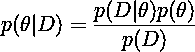
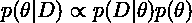
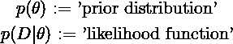
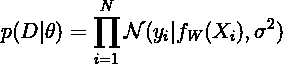
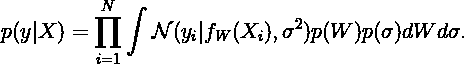
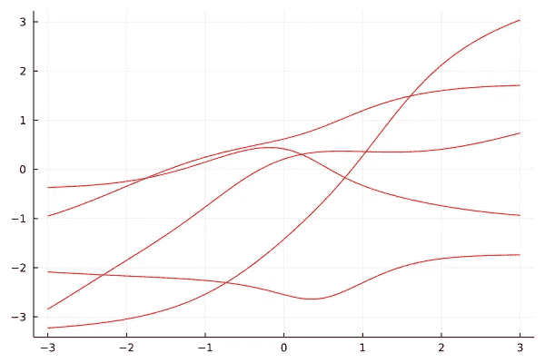
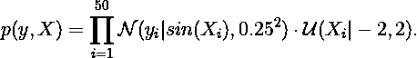
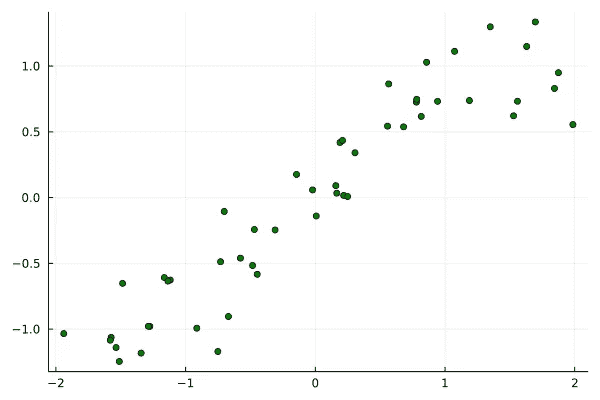
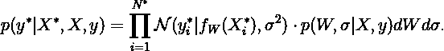
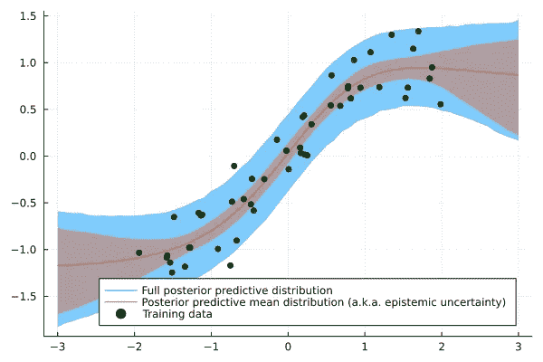

# 贝叶斯机器学习和朱莉娅是天作之合

> 原文：<https://towardsdatascience.com/bayesian-machine-learning-and-julia-are-a-match-made-in-heaven-c3c498f2d221>

## 两个 Julia 库让贝叶斯机器学习变得轻而易举


由 [Pablo Zuchero](https://unsplash.com/@pablozuchero?utm_source=unsplash&utm_medium=referral&utm_content=creditCopyText) 在 [Unsplash](https://unsplash.com/s/photos/thumbs-up?utm_source=unsplash&utm_medium=referral&utm_content=creditCopyText) 上拍摄的照片

正如我在[早先的一篇文章](https://sarem-seitz.com/blog/when-is-bayesian-machine-learning-actually-useful/)中所说，贝叶斯机器学习可能非常强大。然而，用 Python 构建实际的贝叶斯模型有时有点麻烦。你在网上找到的大多数解决方案要么相对复杂，要么需要学习另一种特定领域的语言。当您需要高度定制的解决方案时，后者很容易限制您的表达能力。

另一方面，在 Julia 中进行贝叶斯机器学习可以缓解这两个问题。事实上，你只需要几行原始的 Julia 代码来构建，例如，一个用于回归的[贝叶斯神经网络](https://arxiv.org/pdf/2007.06823.pdf)。朱莉娅的[通量](https://fluxml.ai/Flux.jl/stable/)和[图灵](https://turing.ml/stable/)软件包将处理引擎盖下的繁重工作。

因此今天，我想向你展示如何用不到 30 行 Julia 代码实现和训练贝叶斯神经网络。在向您展示代码之前，让我们简要回顾一下主要的理论方面:

# 贝叶斯机器学习的三个步骤

像往常一样，我们希望通过贝叶斯定律找到后验分布:



(图片由作者提供)

由于分母中的数据项是一个常数，我们可以简化上述公式:



(图片由作者提供)

为了避免混淆，让我们使用以下标准措辞:



(图片由作者提供)

对于贝叶斯神经网络回归，我们进一步指定似然函数:



(图片由作者提供)

这表示具有由神经网络输出定义的平均值的独立正态分布的乘积。正态分布的方差被选择为常数。

相应的先验分布可能如下所示:


(图片由作者提供)

网络权重的先验分布是独立的标准正态分布。对于方差的平方根(也称为标准偏差)，我们使用标准的[伽马分布](https://en.wikipedia.org/wiki/Gamma_distribution)。所以，从理论的角度来看，我们都准备好了。

理想情况下，我们现在希望通过以下步骤实现贝叶斯神经网络:

在代码中将这三个步骤相互分开，将有助于我们

*   **保持可读性** —除了相应的函数更小之外，潜在的读者也可以更容易地从先验中辨别可能性。
*   **在粒度级别保持代码的可测试性**——可能性和先验分布显然是不同的关注点。因此，我们也应该能够单独测试它们。

考虑到这一点，让我们开始在 Julia 中构建模型。

# 定义似然函数

`Flux`库提供了我们构建和使用神经网络所需的一切。它有`Dense`来建立前馈层和`Chain`来将这些层组合成一个网络。事实上，它们就像我们在本文[中定义的`Layer`和`Network`结构一样工作。](https://sarem-seitz.com/blog/implementing-neural-networks-in-16-lines-of-raw-julia/)

因此，我们的`Likelihood`结构由神经网络`network`和标准差`sigma`组成。在前馈通道中，我们使用网络的输出和`sigma`来定义高斯似然的条件均值和标准差:

`Normal.(...)`中的点让我们为每个网络输出定义一个正态分布，每个都有标准偏差`sigma`。我们可以将此与来自[分布](https://juliastats.org/Distributions.jl/stable/)库的`logpdf(...)`相结合，以训练具有最大似然梯度下降的模型。然而，为了执行贝叶斯机器学习，我们需要添加更多的元素。

这就引出了本文的中心功能，即`Flux.destructure()`。从文档中:

```
destructure(m)
Flatten a model's parameters into a single weight vector.julia> m = Chain(Dense(10, 5, σ), Dense(5, 2), softmax) Chain(Dense(10, 5, σ), Dense(5, 2), softmax) julia> θ, re = destructure(m);julia> θ 
67-element Vector{Float32}:
-0.1407104 
...
The second return value re allows you to reconstruct the original network after making modifications to the weight vector (for example, with a hypernetwork).julia> re(θ .* 2)
Chain(Dense(10, 5, σ), Dense(5, 2), softmax)
```

总之，`destructure(...)`获取一个实例化的模型结构并返回一个包含两个元素的元组:

1.  将**模型参数**串接成一个向量
2.  一个**重建器**函数，它采用一个如 **1 所示的参数向量。**作为输入，并返回带有这些参数的模型

后者很重要，因为我们可以向重建器提供任意参数向量。只要它的长度有效，它就会返回具有给定参数配置的相应模型。在代码中:

最后一个函数将允许我们分别向重建器提供权重和标准偏差参数。为了让`Turing`处理贝叶斯推理部分，这是一个必要的步骤。

从这里，我们准备转移到先前的分布。

# 定义先验分布

这部分非常简短，我们只需定义权重向量和标准差标量的先验分布:

定义了可能性和先验后，我们可以从**先验预测分布**中抽取样本



(图片由作者提供)

虽然这可能看起来像一个复杂的公式，但我们基本上只是绘制蒙特卡罗样本:

先前预测分布本身包括来自`sigma`的噪声。仅从网络中提取的先验预测，即先验预测平均值，产生了良好且平滑的样本:



*先验预测从均值函数(贝叶斯神经网络的输出；图片作者)*

现在，我们可以训练这个模型了。

# 训练贝叶斯神经网络

在本例中，我们将使用合成数据，采样自



(图片由作者提供)

后一个因子表示 *(-2，2)* 上的均匀密度。



*合成数据集——50 个来自正常均匀模拟(图片由作者提供)*

为了使用`Turing`，我们需要定义一个模型，正如他们的文档中所解释的[。应用于我们的示例，我们得到以下结果:](https://turing.ml/dev/docs/using-turing/quick-start)

最后，我们需要为贝叶斯后验推断选择一个算法。由于我们的模型相对较小，[哈密顿蒙特卡罗](https://en.wikipedia.org/wiki/Hamiltonian_Monte_Carlo) (HMC)是一个合适的选择。事实上，HMC 被普遍认为是贝叶斯机器学习的*黄金标准*算法。不幸的是，它在高维空间变得非常低效。

尽管如此，我们现在通过[图灵](https://turing.ml/dev/docs/library/#Turing.Inference.HMC)使用 HMC，并收集来自 MCMC 后验的结果:

从这里，我们可以看到完整的后验预测分布，



(图片由作者提供)

这是以与先前预测分布类似的方式完成的(星形变量表示训练集之外的新输入)。唯一的区别是，我们现在使用来自 MCMC 后验分布的样本。



*90%置信区间的后验预测分布。作为贝叶斯机器学习的典型，认知不确定性在观察数据的范围之外增加(图片由作者提供)*

使用上面的例子，很容易尝试其他以前的发行版。

# 即插即用，具有不同的先验分布

作为另一大优势，`Turing`可以使用来自`Distributions`库的几乎所有发行版作为先验。这也允许我们尝试一些奇异的权重先验，比如半径为 0.5 的半圆分布。我们所要做的就是替换高斯先验:

使用与之前相同的设置，我们得到以下后验预测分布:


*独立* `*Semicircle(0.5)*` *先验权重分布的后验预测分布(图片由作者提供)*

可能性显然不止于此。另一个卓有成效的调整可能是引入[超先验分布](https://en.wikipedia.org/wiki/Hyperprior)，例如权重先验的标准偏差。

使用不同于神经网络的模型也很简单。你只需要调整`Likelihood` struct 和相应的函数。

# 摘要

本文简要介绍了 Julia 的贝叶斯机器学习。事实上， [Julia 不仅速度快](https://julialang.org/benchmarks/)而且还能让编码变得更加容易和高效。

虽然 Julia 仍然是一门年轻的语言，在将 Julia 程序部署到产品中时还存在一些问题，但对于研究和原型开发来说，它绝对是一门令人敬畏的语言。尤其是不同库之间的无缝互操作性可以大大缩短学术界内外的迭代周期。

在这一点上，我也非常希望在不久的将来，我们会看到更多的 Julia 被用于工业级的产品代码中。

*原载于 2022 年 3 月 8 日*[*https://sarem-seitz.com*](https://sarem-seitz.com/blog/bayesian-machine-learning-and-julia-are-a-match-made-in-heaven/)*。*