# 贝叶斯方法(1)

> 原文：<https://towardsdatascience.com/bayesian-method-1-1cbdb1e6b4>

# 贝叶斯方法(1)

## 先验分布

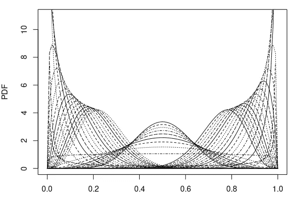

图 0.1 不同参数下的贝塔分布。(图片由作者提供)

很容易找到大量介绍贝叶斯统计的好文章。然而，它们中的大多数只介绍了什么是贝叶斯统计以及贝叶斯推理是如何工作的，而没有涉及许多数学细节。此外，这也是一个充满乐趣和挑战的探索领域。

因此，我打算写一系列文章来分享更多关于贝叶斯统计的理论，包括先验的选择，贝叶斯推断中的损失函数以及贝叶斯统计和一些频率主义方法之间的关系。本帖将介绍贝叶斯统计中使用的**先验分布**。为什么我们需要学习这个？因为选择先验分布是我们需要使用贝叶斯推理的第一步。更多地了解它们有助于选择。

# 基础知识

在这里，我们从贝叶斯统计如何工作的简要概述开始，并且在这里也介绍了我们稍后将使用的一些符号。在贝叶斯统计中，我们假设一个先验概率分布，然后使用我们拥有的数据更新先验。这种更新给出了后验概率分布。我们将后验概率表示为*π(θ|***x***)*(*π*可能看起来很烦人，因为它也是数学中很常见的常数，但在这种情况下，π提醒我们该分布与总体分布的参数有关)，其计算方法如下

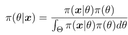

等式 1.1 计算后验概率的公式

其中，θ是所有可能的参数值的空间(这里的“空间”，我们指的是“样本空间”)，并且*π(****x****|θ)*是[可能性](https://en.wikipedia.org/wiki/Likelihood_function#:~:text=is%20the%20likelihood%20function%2C%20given%20the)——观察到给定真实参数值为 *θ* ，输出 ***x*** 的条件概率。由于*θ*∈θ是与*先验分布* n 相关的参数，而不是总体的分布，我们可以 *θ* 超参数***。*和往常一样，我们使用粗体( ***x*** )来表示向量。分母又称为*证据，*是使后验概率*π(θ|****x****)*成为概率分布(总和为 1)的归一化因子(常数)。这很容易验证**

**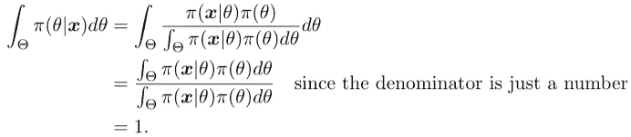**

**在推理中可以忽略归一化因子，我们可以在一些文献中看到这一点，如[1]，因为省略常数不会改变曲线的形状。**

**那么先验概率可以写成这样的形式**

**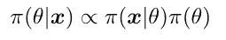**

**等式 1.2 不带分母的后验概率**

**一旦我们有了后验分布，也就是参数的分布(记住这一点)，我们就可以计算**预测分布**。是条件概率，是观察 *y* ，给定数据**x**的概率分布。其计算方法如下**

**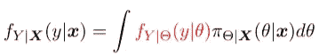**

**等式 1.3 预测分布**

**其中红色部分是新观测值的概率密度函数，给定参数 *θ* 。等式 1.3 一开始可能看起来有点混乱，但仔细观察后，我们可以看到它实际上是使用总概率的[定律计算的(就像加权平均一样简单)，它是给定参数值 *θ* 和参数取值 *θ* 给定数据 ***x*** 的概率分布的乘积的积分](https://en.wikipedia.org/wiki/Law_of_total_probability)**

# **选择先验**

**先验有时被描述为关于数据的“信念”。[2]这意味着我们根据我们对数据的了解来选择先验。当然，这并不像“信念”这个词所暗示的那样完全是一个主观的问题。**

## **先验的性质**

**请注意，参数的分布可以是无界的，这意味着它的概率密度是非负的，但它们的总和或积分是无限的。我们称参数**的这种分布为不恰当的先验分布**。**

**根据维基百科的说法，一个信息性的先验表达了关于一个变量的具体、明确的信息。通常，无论如何都要避免，但是如果先验信息是可用的，信息先验是将信息引入模型的合适方式。[7]**

**当我们不太了解我们的数据和参数的分布时，选择所谓的“模糊先验”是有意义的，它反映了最少的知识。所以我们需要一个没有人口基数的先验分布，这就很难构造，对后验分布的作用微乎其微。这样的先验密度称为**无信息**先验，或*扩散*先验。而[有些人](https://www.analyticsvidhya.com/blog/2016/06/bayesian-statistics-beginners-simple-english/)宁愿认为先验分布**总是**包含一些信息。有时不适当的先验被用来代表这种模糊的先验。稍后我们将看到这样的例子。**

**一个相关术语是**弱信息**先验，它包含部分信息，这意味着它足以给出后验分布的合理界限，但不能完全捕捉一个人关于参数的科学知识。[3]**

**先验的一个非常有趣的性质是**共轭**，这意味着后验分布与先验分布具有相同的参数形式。我们可以看到，这种先验与后验密切相关，因此我们说它包含了*强先验知识*。[5]共轭先验的好处是显而易见的——后验分布将是一个已知的分布。**

## **一些常见前科的例子**

1.  ***制服在先***

**如果参数值是有界的，最直观和最容易的先验是**均匀的**先验分布。该先验是非信息性的(有时也称为“低信息先验”[2])，它假设参数空间θ中的所有参数都是同等可能的。比如我们要用伯努利分布对数据进行建模(就像著名的例子——抛硬币)，参数 *p* 是一个概率，落在区间*【0，1】*内。在这种情况下，先验概率变为 *π(θ) = 1* ，对于*【0，1】*中的 *θ* 。**

**2.*霍尔丹在先***

**最少的知识不一定意味着所有的参数都是同样可能的。许多其他无信息的前科也是可能的。无信息先验的另一个例子是 J. B. S .霍尔丹提出的用于估计罕见事件的**霍尔丹**先验。霍尔丹先验实际上是参数 *α=0，β=0 的贝塔分布。*因此霍尔丹的先验是**

**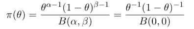**

**情商。2.1 霍尔丹先验**

**其中 *B(α，β)* 为贝塔函数。提醒一下，Beta 函数是这样的:**

**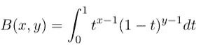**

**等式 2.3 贝塔函数**

**也可以写成伽玛函数**

**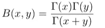**

**等式 2.4 根据伽马函数的贝塔函数**

**注意， *Beta(0，0)* 没有定义，但是我们可以考虑它在点 *(0，0)* 的近似值，如下图所示**

**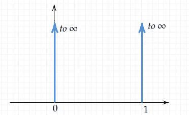**

**等式 2.5 参数 *α=0，β=0* 的贝塔分布的极限行为**

**后验分布*π(θ|****x****)*与 *θ⁻ (1-θ)⁻* )成正比(回想一下贝叶斯定理可以写成公式 1.2 的形式)，也就是说**

**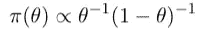**

**方程 2.6 霍尔丹先验没有归一化系数**

**该先验赋予 *θ=1* 和 *θ=0* 最大权重。使用[5]中的例子可以清楚地说明这一点:考虑我们正在观察一种未知化合物是否会溶解于水的情况。起初，我们对结果一无所知。因此，在观察到一个小样本溶解后，我们立即假设所有的样本都会这样做；如果没有，我们假设没有样品可以溶解。**

**3.*共轭先验—贝塔分布***

**第三个例子是**贝塔分布**，它是二项式分布的共轭先验。并且注意，由于*伯努利分布是二项式分布*(与 *B(1，1)* 相同)的特例，贝塔分布也是伯努利分布的共轭先验。是共轭先验的典型例子(在[维基百科](https://en.wikipedia.org/wiki/Conjugate_prior#:~:text=usual%20conjugate%20prior%20is%20the%20beta%20distribution%20with%20parameters)、【3】和上出现过)。**

**这里我们将展示为什么贝塔分布与二项式分布共轭。首先回忆一下，二项分布的概率质量函数是**

**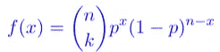**

**等式 2.7 二项式分布的概率质量函数(pmf)**

**其中 *n* 为试验总次数， *k* 为成功次数， *p* 为成功概率。因此，可能性是**

**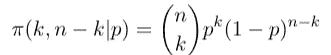**

**等式 2.8 可能性**

**参考我们在基础知识一节看到的，似然性表示为*π(****x****|θ)*，其中 ***x*** 为观测值，所以 ***x*** = (k，n-k)。这意味着**

> **二项分布的参数成为观察值，这种可能性中的“参数”是超参数。**

**然后我们选择贝塔分布作为先验。我们要做的是证明后验分布与先验分布是同一类型。**

**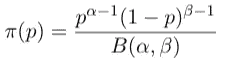**

**等式 2.9 选择贝塔分布作为先验分布**

**后验分布推导如下**

**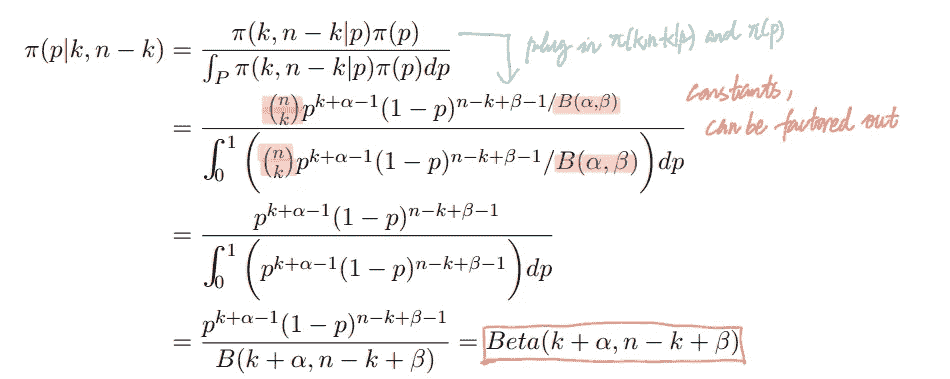**

**等式 2.10 后验分布**

**我们可以看到后验分布也是贝塔分布。**

***4。杰弗里斯先验***

**Jeffreys 先验是根据 Fisher 信息矩阵的行列式的平方根定义的非信息先验。**

**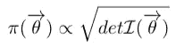**

**Def 2.11 杰弗里斯先验的定义**

**费希尔信息和费希尔信息矩阵在这里[介绍过](/maximum-likelihood-estimation-mle-and-the-fisher-information-1dd53faa369)，但是为了方便起见，我们在这里也再次提及。最初，费希尔信息被定义为分数的方差**

**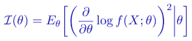**

**Def 2.12 费希尔信息的定义**

**其中较低的指数 *θ* 表示期望值是关于θ的，矩阵形式写为**

**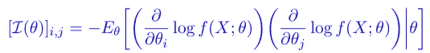**

**等式 2.13 费希尔信息矩阵**

**但是在某些特定的条件下(密度函数 f 是二阶可微的和正则的条件，可以在[这里](https://stats.stackexchange.com/questions/101520/what-are-the-regularity-conditions-for-likelihood-ratio-test)找到很好的总结)。**

**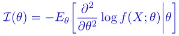**

**等式 2.14 特定条件下的费希尔信息**

**等式 2.14 是单变量情况下的公式(当有多个参数时，我们使用矩阵形式)。让我们试着计算伯努利试验的杰弗里斯先验，这是一个单变量的例子。我们使用这个分布进行演示是有原因的，我们将在后面看到。我们知道伯努利分布的概率分布是**

**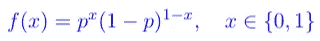**

**方程 2.15 伯努利分布的密度函数**

**现在我们需要计算密度函数的费希尔信息(方程 2.15)**

**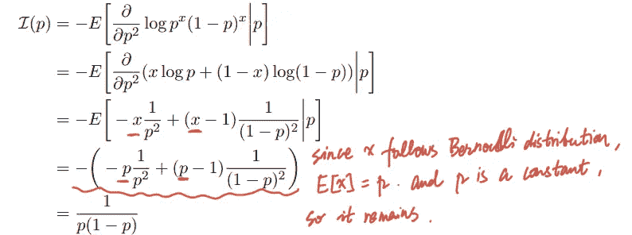**

**等式 1.26 伯努利试验的费希尔信息**

**由于参数只是一维的(单变量)，费雪信息只是一个数，也是行列式，我们有先验分布**

**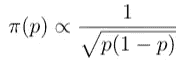**

**等式 1.27**

**仔细看方程 1.27，我们会发现杰弗里斯先验和霍尔丹先验类似。但不像霍尔丹先验，杰弗里斯先验是适当的。方程式 1.27 的曲线如下**

**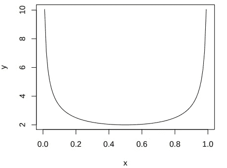**

**图 1.28(作者图片)**

**它还与β分布有关，因为等式 1.27 等于β(1/2，1/2)。**

**摘要**

**这个帖子主要是关于贝叶斯推断中的先验分布。首先，简单介绍了贝叶斯推理的基础知识。然后我们看看先验分布的类型，然后选择一些常见的先验分布。**

****参考文献**:**

**[1]李，T. S .，&芒福德，D. (2003)。*视觉皮层中的分层贝叶斯推理*。 *JOSA A* ， *20* (7)，1434–1448。**

**[2] Surya，Tokdar， [*选择先验分布*](https://www2.stat.duke.edu/courses/Spring13/sta732.01/priors.pdf) ，2021 年 12 月 4 日获取。**

**[3]赫尔曼、卡林、斯特恩、H. S .、鲁宾(1995 年)。 [*贝叶斯数据分析*](https://www.taylorfrancis.com/books/mono/10.1201/9780429258411/bayesian-data-analysis-andrew-gelman-john-carlin-hal-stern-donald-rubin) 。查普曼和霍尔/CRC。**

**[4] Etz，a .，& Wagenmakers，E. J. (2017 年)。JBS 霍尔丹对贝叶斯因子假设检验的贡献。*统计科学*，313–329。**

**[5]杰恩斯，E. T. (1968 年)。先验概率。 *IEEE 系统科学与控制论汇刊*， *4* (3)，227–241。**

**[6]斯坦福大学法学博士和瓦德曼大学(1994 年)。*物理科学统计方法*(第 28 卷)。学术出版社。**

**[7]戈尔奇，S. (2016 年 10 月)。[信息先验和贝叶斯计算](https://ieeexplore.ieee.org/abstract/document/7796966?casa_token=RgQ527gQM6cAAAAA:lvcjiPhN82UF3AmhNjPg4tEc-2nKYRkD5WtD-NVmNXNMqwcp6gJw8aeV-FY9ddqQAKgMCHD-eTU)。在 *2016 IEEE 数据科学与高级分析国际会议(DSAA)* (第 782–789 页)。IEEE。**

**[8] Nicenboim，b .，Schad，D. J .，& Vasishth，S. (2021 年)。 [*认知科学贝叶斯数据分析导论*](https://vasishth.github.io/bayescogsci/book/sec-analytical.html) 。**

**[9]杰里米·奥尔洛夫和乔纳森·布鲁姆， [*共轭先验:贝塔和正常*](https://ocw.mit.edu/courses/mathematics/18-05-introduction-to-probability-and-statistics-spring-2014/readings/MIT18_05S14_Reading15a.pdf) ，2021 年 12 月 11 日获取。**

**[](http://halweb.uc3m.es/esp/Personal/personas/mwiper/docencia/English/PhD_Bayesian_Statistics/ch5_2009.pdf)*【先验分布】，2022 年 1 月 1 日获取。***

*****延伸阅读**:***

***有关概率论的更多信息:***

***[](/measure-theory-in-probability-c8aaf1dea87c) [## 概率论中的测度论

### 概率毕竟不简单。

towardsdatascience.com](/measure-theory-in-probability-c8aaf1dea87c) 

关于贝叶斯和频率主义方法的比较:

[](https://medium.com/science-and-philosophy/subjectivism-in-decision-science-926c29feb7bb) [## 决策科学中的主观主义

### 关于贝叶斯主义的一点注记

medium.com](https://medium.com/science-and-philosophy/subjectivism-in-decision-science-926c29feb7bb) 

**补充**:

用于生成图 0.1 的代码

```
x.v <- seq(0, 1, by=0.01)
n <- length(x.v)
m <- matrix(nrow=n, ncol=1)for (i in seq(0.1, 5, 0.3)) {
  y.v <- dbeta(x.v, shape1=i, shape2=15)
  m <- cbind(y.v, m)
}
for (j in seq(0.1, 5, 0.3)) {
  y.v <- dbeta(x.v, shape1=15, shape2=j)
  m <- cbind(y.v, m)
}
for (i in seq(0.1, 10, 1)) {
  y.v <- dbeta(x.v, shape1=i, shape2=i)
  m <- cbind(y.v, m)
}
n.c <- ncol(m)
n.c
# remove last column with Nas
m <- m[,-n.c]
par(mar = c(3, 4, 1, 2))
matplot(x=x.v, y=m, type="l", col="black", ylim=c(0,11), xlab="", ylab="PDF")
```