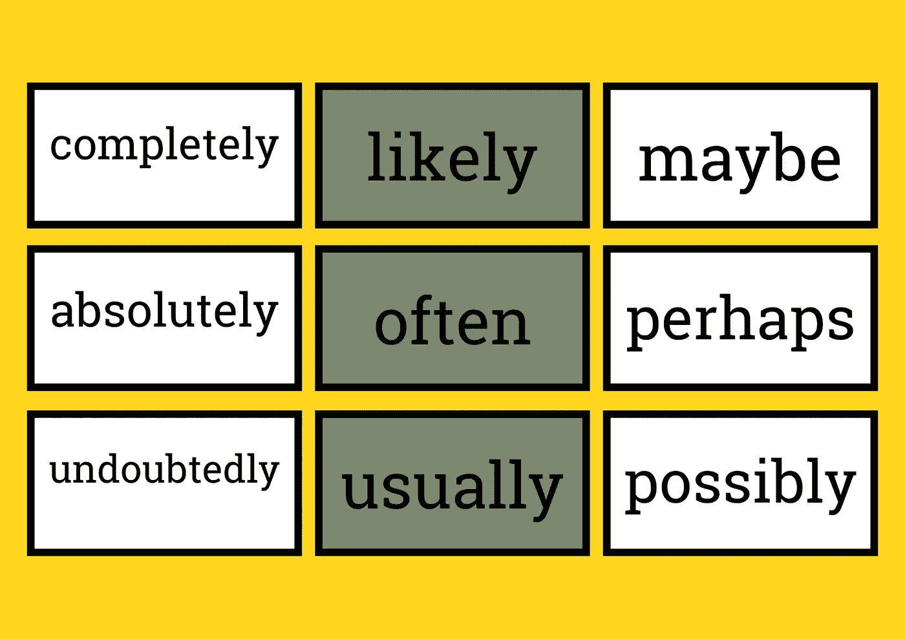

# 贝叶斯推理:鲨鱼攻击，并做出更好的决定

> 原文：<https://towardsdatascience.com/bayesian-reasoning-shark-attacks-zombies-and-making-better-decisions-38951d3671b7>

## 一个奇特的统计学概念如何帮助你在日常生活中做出更好的决定

作者图片

想想你是怎么做决定的。如果你像我和大多数人一样。你可能做得很差。现在，你可能会和我争论说，“史蒂文——我真的很擅长做决定。”

相信我，在这一点上，你错了。

我们不擅长做决定的原因是因为我们的大脑不是为此而生的。我们的大脑在某些事情上很棒，但在其他事情上就不那么棒了。我们来考虑一个例子，你觉得什么可能性更大？你是死于车祸还是飞机坠毁？事实证明，答案是你更有可能死于车祸。事实上，这种可能性大约是 26 倍。

那么，如果是这样的话——为什么我们害怕坐飞机而不开车呢？ **It** **都与我们的大脑如何处理概率有关。**

但是不要害怕，有一个非常聪明的人叫托马斯·贝叶斯，他给了我们一个框架来更好地做概率决策。

# 给我 10 分钟，我会讲:

> ***-什么是贝叶斯推理？***
> 
> ***——我们的大脑如何处理概率***
> 
> ***——概率性思维的好处。***

# 什么是贝叶斯推理？

托马斯·贝叶斯是 18 世纪的英国牧师，他在概率论方面的工作“一篇解决机会主义中一个问题的论文”是他最初提出他的理论的地方。他的朋友理查德·普莱斯继承了贝叶斯的研究成果，并运用它，想出了一种在面对不确定性时利用概率做出决策的方法。这被称为贝叶斯方法，近年来越来越受欢迎。

像皮埃尔·西蒙·拉普拉斯这样的数学家能够发展出更一般形式的贝叶斯定理。拉普拉斯将贝叶斯定理应用于天体力学问题，即根据运动行星的过去位置预测其未来位置。

贝叶斯定理在医学、统计学、机器学习等领域有着广泛的应用。

不过，这跟数学无关。尽管我很乐意向你抛出公式，但更重要的是理解贝叶斯定理背后的直觉。你需要提高你观察现实世界的能力，准确判断你遇到的事件的概率，并且愿意用你学到的新东西来提炼这些概率。

**下面是贝氏如何接近它的，正如** [**贝氏对假人的描述**](https://www.dummies.com/article/technology/information-technology/data-science/general-data-science/a-brief-guide-to-understanding-bayes-theorem-268197/)【1】**:**

> 他使用的演示是基于两个球的使用。助手会把第一个球放在桌子上，球可以放在任何地方，但不能说球在哪里。
> 
> 在助手多次丢下第二个球后，每次都告诉 Bayes 第二个球的位置和第一个球相对于它的位置，他会重复这个过程。根据第二个球给出的证据，他会试图估计第一个球的位置。
> 
> **贝叶斯方法以托马斯·贝叶斯的工作为基础，并通过纳入先验知识(即先验证据提供的概率)对其进行了扩展，该方法首先在贝叶斯方法中引入。**

**关于概率的一个快速提示:**概率，从最基本的意义上来说，就是给一个事件发生的可能性分配一个数值。这是一种衡量事情发生频率的方法。

有各种不同的方法来计算概率，这可能会变得非常复杂。但最简单的形式是，概率只是一个介于 0 和 1 之间的数字，它告诉你一个事件发生的可能性有多大。

0 表示该事件永远不会发生，1 表示几乎肯定会发生。

# 我们的大脑如何处理概率

如我所说，我们做得很差。但这不是我们的错。

人类只是不太擅长处理概率。研究表明，我们倾向于高估小概率，低估大概率。这在一定程度上是由于我们大脑的构造方式。

杏仁核负责威胁检测，当我们考虑可能危险的事情时，杏仁核更加活跃。海马体负责记忆，它更可能存储负面事件的记忆，而不是正面事件。

大脑的这两个部分共同作用，给了我们一种“消极偏见”这意味着我们更倾向于关注事件发生的微小可能性，而不是许多没有发生的例子。

**例如，你可能更容易记住吃了贝类后生病的时间，而不是所有没有生病的时间。**

我们不断扫描我们的环境，寻找可能伤害我们的东西，这可能会导致很多焦虑。

重要的是要记住，我们的大脑并不是为了应对现代世界而进化的。让我们的祖先存活下来的东西——比如快速识别捕食者的能力——在当今世界并不总是有用的。

如果我们想做出好的决定，我们需要学习如何以一种更合理的方式思考。这不是一项简单的任务，但对于理解我们周围世界的不确定性来说，这是一项必不可少的任务。

# 概率思维的好处

首先，你会更聪明。我并不是说要自大或吹牛，但如果你能掌握概率思维的概念，你将拥有很少人拥有的技能。

这种能力会在你生活的各个方面帮助你，从人际关系到财务到职业生涯。

如果你能进行概率性思考，你就能做出更好的决定，因为你会考虑到一种情况下所有可能的结果，而不仅仅是最有可能的结果。

你也不太可能陷入确认偏见——只关注确认你信念的信息的倾向。

如果你能以概率的方式思考，你会对新的信息持开放态度，你不会仅仅因为过时的信念让你感到舒服就坚持它。

> ***让我们用一个现实生活中的例子:*** *如果你正试图决定是否值得去海里游泳。你的朋友试图让你相信它是安全的，但是你情不自禁地想起所有你看到的关于鲨鱼袭击的新闻。如果你用贝叶斯方法思考，你会考虑你所有的信息。*
> 
> 你知道每天有很多人在海里游泳，但很少有人被鲨鱼袭击。你也知道鲨鱼袭击比以前更受媒体关注，这使得它们看起来比实际情况更常见。
> 
> 当你把所有这些信息都考虑进去时，你会发现被鲨鱼袭击的可能性其实很低。这将帮助你决定是否去游泳。
> 
> ***享受水。***

当然，没有人能保证你不会被鲨鱼攻击，但是根据你所掌握的信息，概率性思维会帮助你做出最好的决定。

# 包扎

差不多够了。贝叶斯思维是那些超级书呆子的概念之一，一旦应用到你的生活中，就会带来很大的好处。你甚至不需要所有花哨的数学，只需要愿意考虑一种情况下所有可能的结果。

我希望这篇文章已经启发了你开始思考概率。如果你有任何问题或者想分享你自己的贝叶斯推理经验，我很乐意在下面的评论中听到你的意见。

感谢阅读！

**来源:**

1.  [贝叶斯为假人](https://www.dummies.com/article/technology/information-technology/data-science/general-data-science/a-brief-guide-to-understanding-bayes-theorem-268197/)

如果你喜欢这篇文章，请考虑订阅我的[时事通讯](http://theconcept.substack.com/)或者在[推特](https://twitter.com/_stevenshoe)上关注我。