# 贝叶斯回归从零开始

> 原文：<https://towardsdatascience.com/bayesian-regression-from-scratch-a1fe19ff64c>

## 使用 Python 从基本原理导出贝叶斯线性回归


克利姆·穆萨利莫夫在 [Unsplash](https://unsplash.com?utm_source=medium&utm_medium=referral) 上的照片

# 介绍

[**线性回归**](https://en.wikipedia.org/wiki/Linear_regression) 是数据科学中最知名的算法，然而它有不止一个版本。大多数人使用的版本来自统计学家<https://en.wikipedia.org/wiki/Frequentist_inference>**的解释，但还有一个版本来自贝叶斯<https://en.wikipedia.org/wiki/Bayesian_statistics>**学派。****

****在本文中，我们将复习 [**贝叶斯定理**](https://en.wikipedia.org/wiki/Bayes'_theorem) ，频数统计和贝叶斯统计的区别，最后用 Python 从头开始实现 [**贝叶斯线性回归**](https://en.wikipedia.org/wiki/Bayesian_linear_regression) 。****

> ****注意:在整篇文章中，我假设读者对贝叶斯统计和线性回归有基本的了解。我确实重述了这些话题，但是没有深入到一个全新的读者可能完全掌握它们的程度。****

# ****贝叶斯推理重写****

## ****贝叶斯定理****

****贝叶斯定理写如下:****

********

****作者在 LaTeX 中生成的方程。****

*   *******P(H)*** 是 [**之前的**](https://en.wikipedia.org/wiki/Prior_probability)****
*   *******【D | H】***是 [**的可能性**](https://en.wikipedia.org/wiki/Likelihood_function)****
*   *******【P(H | D)】***是 [**的后路**](https://en.wikipedia.org/wiki/Posterior_probability)****
*   *******【P(D)】***是 [**归一化常数**](https://en.wikipedia.org/wiki/Normalizing_constant#Bayes'_theorem) ，其中是可能性与先验的乘积之和，也称为 [**全概率定律**](https://en.wikipedia.org/wiki/Law_of_total_probability) :****

********

****作者在 LaTeX 中生成的方程。****

****如果你不熟悉贝叶斯定理，我强烈推荐你看看我以前关于这个主题的文章:****

****<https://pub.towardsai.net/conditional-probability-and-bayes-theorem-simply-explained-788a6361f333>  

## 贝叶斯更新

贝叶斯定理用于根据新数据更新我们对某一事件的信念，使用以下公式:


作者在 LaTeX 中生成的方程。

在我们计算后验概率后，我们可能会获得关于我们试图建模的新数据。然后，我们使用旧的后验数据作为新的先验数据，用这个新数据计算新的后验数据。这个用新数据更新先验知识的过程称为贝叶斯更新。这就是[**贝叶斯推理**](https://en.wikipedia.org/wiki/Bayesian_statistics) 的本质所在。

你可以在我最近的一篇文章中读到更多关于贝叶斯更新的内容:

</bayesian-updating-simply-explained-c2ed3e563588>  

# 回归理论

## 线性回归

[**回归**](https://en.wikipedia.org/wiki/Regression_analysis) 旨在估计某一特性的效果，*【x】，*:**

**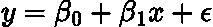**

**作者在 LaTeX 中生成的方程。**

**其中 ***β_0*** 为截距， ***β_1*** 为标定目标与特征关系的系数， ***ε*** 为误差项，在线性回归中遵循 [**正态分布**](https://en.wikipedia.org/wiki/Normal_distribution) :**

**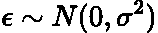**

**作者在 LaTeX 中生成的方程。**

**其中 ***σ*** 为 [**标准差**](https://en.wikipedia.org/wiki/Standard_deviation) 。**

**线性回归的目的是确定描述特征、 ***x*** 和目标、 ***y*** 之间关系的参数 ***β_0、β_1*** 和***【σ】***的最佳值。**

> **注意:我相信大多数阅读这篇文章的人都知道什么是线性回归，如果他们不知道的话，那么有很多资源可以比我更好地向你解释它！**

## **频繁主义观点**

**寻找线性回归模型参数的最广为人知的方法来自统计学的频率观点。**

**频率主义者的观点采用[**【OLS】**](https://en.wikipedia.org/wiki/Ordinary_least_squares)的普通最小二乘法，通过[**【RSS】**](https://en.wikipedia.org/wiki/Residual_sum_of_squares)**的残差平方和来估计参数:****

****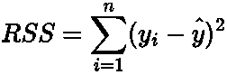****

****作者在 LaTeX 中生成的方程。****

****其中 ***y*** 是实际值，而 ***ŷ*** 是来自我们的模型的预测值，其一般形式为:****

****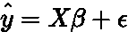****

****作者在 LaTeX 中生成的方程。****

****其中 ***X*** 和 ***β*** 是特征和参数的数组。****

****这个 OLS 方程的一般解是:****

****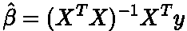****

****作者在 LaTeX 中生成的方程。****

> ****这个解决方案的完整推导可以在[这里](https://en.wikipedia.org/wiki/Ordinary_least_squares#Simple_linear_regression_model)找到。****

****Frequentist 方法的关键是我们为每个参数获得一个*单一固定值*。****

****最终的模型在某种程度上假设我们正在建模的数据必须来自这些固定的参数。然而，不可能获得所有数据，因此假设这些*单值*参数 100%正确似乎是愚蠢的。另一种表述方式是，我们假设我们有足够的数据来推导出参数的有意义的单一值。****

## ****贝叶斯观点****

****另一种观点认为，参数呈现值的分布，其中一些比另一些更有可能。它考虑了可能产生观测数据的几个似是而非的参数组合。****

****我们有一个我们认为参数可能是什么的初始视图/范围，例如我们可以认为截距同样可能是 0 到 10 之间的任何数字。这是我们参数的先验。****

****然后，我们使用观测数据更新先验，使用贝叶斯定理为每个参数创建后验分布，如下所示:****

****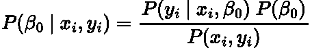****

****作者在 LaTeX 中生成的方程。****

****这是一个我们如何更新截距的例子。****

****也就是说目标，***【y】***，现在是数据上随机分布的变量， ***x*** ，参数 ***β_0，*** ***β_1，σ:*******

****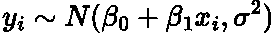****

****作者在 LaTeX 中生成的方程。****

****因此每个目标变量的可能性是正态分布的 [**【概率密度函数】**](https://en.wikipedia.org/wiki/Probability_density_function) :****

****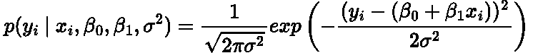****

****作者在 LaTeX 中生成的方程。****

*******y_i*** 的所有单个可能性的乘积产生当前模型及其给定参数的总可能性。****

> ****这个似然函数和贝叶斯回归作为一个整体的更密集和完整的推导可以在这里找到[。](https://statswithr.github.io/book/introduction-to-bayesian-regression.html)****

****观察贝叶斯方法的一个很好的方式是，当我们获得更多数据时，我们更新参数的分布，我们的模型变得更加确定参数应该是什么。他们很可能是 OLS 常客的估计，但这不是保证。****

****这是频率主义者和贝叶斯统计之间的差异的快速运行。如果你想更好地理解，那里有很多资源，但是我喜欢这个博客帖子！****

# ****Python 中的贝叶斯回归****

****现在让我们从头开始为一个简单的模型实现贝叶斯线性回归，其中我们有一个特征！****

## ****生成数据****

****我们首先使用 sklearn 的 *make_regression* 函数在 Python 中生成一些数据:****

```
****# Import packages
import pandas as pd
import matplotlib.pyplot as plt
from sklearn import datasets# Generate data
x, y = datasets.make_regression(n_samples=100,
                                n_features=1,
                                noise=10)# Plot data
fig, ax = plt.subplots(figsize=(9,5))
ax.scatter(x, y)
ax.ticklabel_format(style='plain')
plt.xlabel('x',fontsize=18)
plt.ylabel('y',fontsize=18)
plt.xticks(fontsize=18)
plt.yticks(fontsize=18)
plt.show()****
```

****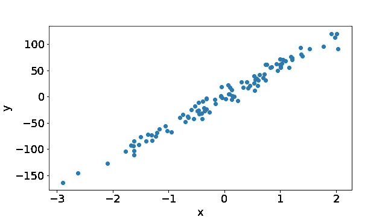****

****作者用 Python 生成的图。****

## ****普通最小二乘法****

****我们可以使用 statsmodel 软件包，通过 OLS 方法来估计频率回归线:****

```
****# Packages
import statsmodels.formula.api as smf# Create a dataframe
data = pd.DataFrame(list(zip(x.flatten(), y)), columns =['x', 'y'])# Calculating the slope and intercept
formula = 'y ~ x'
results = smf.ols(formula, data=data).fit()# Get our equation of the OLS line
intercept = results.params['Intercept']
slope = results.params['x']
x_vals = np.arange(min(x), max(x), 0.1)
ols_line = slope*x_vals + intercept# Plot the OLS line
fig, ax = plt.subplots(figsize=(9,5))
ax.scatter(data['x'], data['y'])
ax.plot(x_vals, ols_line,label='OLS Fit', color='red')
ax.ticklabel_format(style='plain')
plt.xlabel('x',fontsize=18)
plt.ylabel('y',fontsize=18)
plt.xticks(fontsize=18)
plt.yticks(fontsize=18)
plt.legend(fontsize=16)
plt.show()****
```

****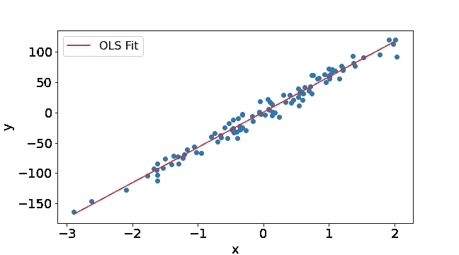****

****作者用 Python 生成的图。****

****为了清楚起见，斜率是 ***β_1，*** 截距是 ***β_0*** ，sigma 是*这就是我们上面在理论部分用来描述回归线的。*****

*****这是频率主义者的解释，因为我们现在对每个参数只有单一的估计。我们现在将执行贝叶斯版本。*****

## *****传道者*****

*****首先，我们需要给我们的参数分配一些先验分布。使用 OLS 估计的结果，我们构建了一个[统一的无信息先验](https://stats.stackexchange.com/questions/27813/what-is-the-point-of-non-informative-priors)，其范围为 OLS 估计的 20%:*****

```
*****def make_uninformative_prior(name,data):
    """Function to make priors."""
    df = pd.DataFrame({name:data})
    df['Probability'] = 1/len(data)
    return df# Create a range of values for the slope
data_slope = np.linspace(results.params['x']*0.8,
                         results.params['x']*1.2, num=60)prior_slope = make_uninformative_prior('slope',data_slope)
prior_slope.head()# Create a range of values for the intercept
data_inter = np.linspace(results.params['Intercept']*0.8,
                         results.params['Intercept']*1.2, num=60)prior_inter = make_uninformative_prior('intercept',data_inter)
prior_inter.head()# Create a range of values for the sigma
data_sigma = np.linspace(results.resid.std()*0.8,
                         results.resid.std()*1.2, num=60)prior_sigma = make_uninformative_prior('sigma',data_sigma)
prior_sigma.head()*****
```

*****如果我们对实际参数有所了解，我们可能会使用不同的先验，对参数的某些值进行不同的加权。前科完全是主观武断的。这通常是反对贝叶斯统计的一个[论点](https://stats.stackexchange.com/questions/381825/objective-vs-subjective-bayesian-paradigms)，因为它导致非客观概率。*****

*****我们现在计算三个参数的联合分布。这告诉我们一个特定的参数组合解释观察到的数据的可能性有多大:*****

```
*****# Counter for the row index
counter = 0# Dataframe to store the combinations in
df = pd.DataFrame(columns=['slope','intercept','sigma','prior'])# Iterate through the slope
for slope in prior_slope['slope']:
    prob_slope = \
    prior_slope['Prior'].loc[prior_slope['slope'] == slope]

    # Iterate through the intercept
    for intercept in prior_inter['intercept']:
        prob_inter = \
        prior_inter['Prior'].loc[prior_inter['intercept'] \
                                 == intercept]

        # Iterate through the error
        for sigma in prior_sigma['sigma']:
            prob_sigma = \
            prior_sigma['Prior'].loc[prior_sigma['sigma'] == sigma]

            # Calculate the prior of this specific combination
            prob = \
            float(prob_slope)*float(prob_inter)*float(prob_sigma)

            # Insert the row of data
            df.loc[counter] = \
            [slope] + [intercept] + [sigma] + [prob]

            # Update row index
            counter += 1*****
```

> *****如果这种格式在你的屏幕上看起来不舒服，我很抱歉。如果是这样的话，我强烈推荐你在我的 [GitHub repo 这里](https://github.com/egorhowell/Medium-Articles/blob/main/Statistics/Bayesian_Regression.ipynb)查看代码，让它更容易解释和理解！*****

*****我完全知道 for 循环不是最优的，使用 pandas 和 numpy 的矢量化实现会更快。然而，我认为使用循环可以让我们更好地理解正在发生的事情！*****

*****因为我们对每个参数都有未知的先验，所以每个组合都有完全相同的先验概率:*****

*****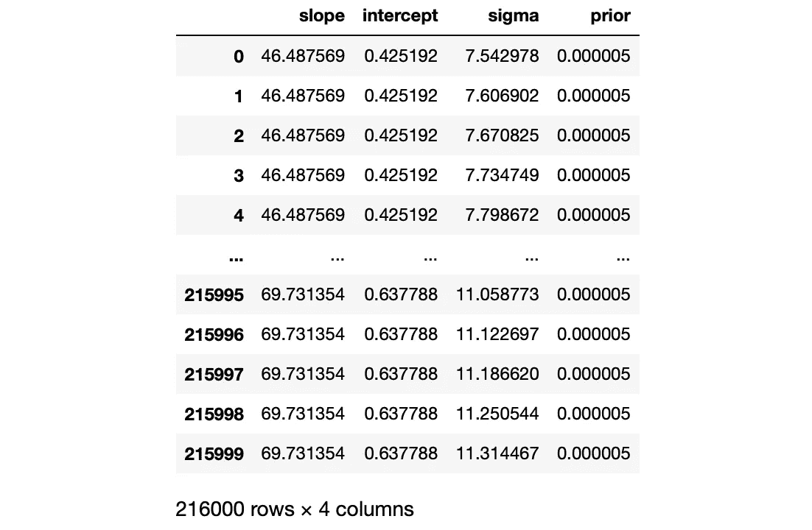*****

*****图片作者。*****

## *****可能性*****

*****就像我们之前说的，后验与先验和似然的乘积成正比。因此，要获得每个参数的后验分布，我们需要根据我们的观测数据计算它们的似然性。*****

*****为了计算可能性，我们为每个可能的组合(每一行)建立一个模型，并使用我前面提到的公式计算残差来找到可能性:*****

```
*****counter = 0
df['likelihood'] = df['prior']# Loop over the combination of values
for slope in prior_slope['slope']:
    for intercept in prior_inter['intercept']:        
        for sigma in prior_sigma['sigma']:

            # Compute the predictions from this line
            predictions = slope * data['x'] + intercept

            # Compute residual/errors of this line
            residual = data['y'] - predictions

            # Compute the likelihood function that we saw above
            likelihoods = norm(0, sigma).pdf(residual)

            # Compute the total likelihood
            df['likelihood'].loc[counter] = likelihoods.prod()
            counter += 1*****
```

*****这部分可能需要一段时间来运行，这是在大规模模型中使用贝叶斯方法的问题之一。要知道为什么会这样，查看一下我之前关于贝叶斯共轭先验的文章，这篇文章告诉你实施贝叶斯定理的一些缺点:*****

*****</bayesian-conjugate-priors-simply-explained-747218be0f70>  

我们的数据框架现在看起来像这样:

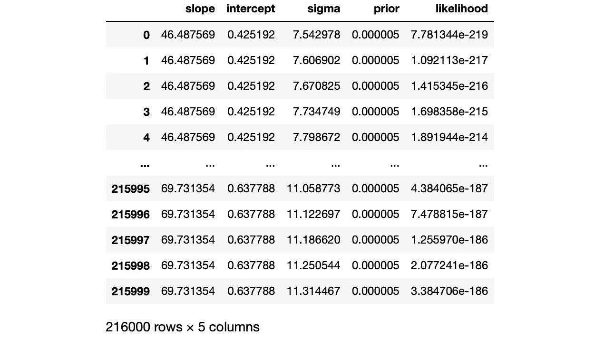

图片作者。

## 贝叶斯更新

我们现在可以如下执行我们的贝叶斯更新:

```
df['posterior'] = df['prior'] * df['likelihood']
df['posterior'] = df['posterior']/df['posterior'].sum()
```

我们得到的数据框架是:

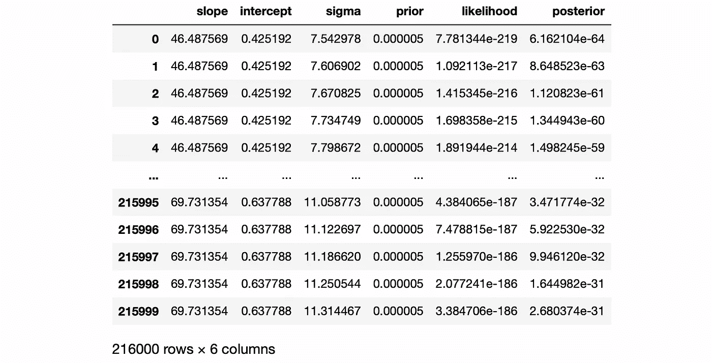

图片作者。

## 边际分布

为了输出每个参数的边际后验分布，我们需要对其他两个参数的后验进行求和。例如，为了找到斜率的边际后验分布，我们总结出，对于斜率的每个值 ***、*、**的后验超过σ和截距(基本上是一个积分):

```
slope_df = df.groupby('slope').sum()
```

然后，我们可以绘制斜率的后验分布:

```
# Plot the posterior distribution of the slope
plt.figure(figsize=(8,5))
plt.plot(slope_df.index, slope_df.posterior, linewidth=3)
plt.xticks(fontsize=18)
plt.yticks(fontsize=18)
plt.xlabel('Slope Value', fontsize=18)
plt.ylabel('PDF', fontsize=18)
plt.axvline(results.params['x'], color='red', ls='--', label='OLS Estimate')
plt.legend(fontsize=16)
plt.show()
```

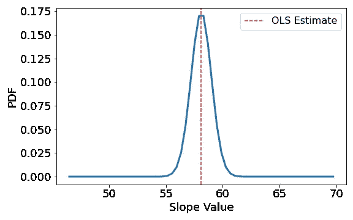

作者用 Python 生成的图。

> 斜率现在是一个分布！

我们可以对截距和误差项进行类似的计算:

```
intercept_df = df.groupby('intercept').sum()
sigma_df = df.groupby('sigma').sum()# Plot the posterior distribution of the Intercept
plt.figure(figsize=(8,5))
plt.plot(intercept_df.index, intercept_df.posterior, linewidth=3)
plt.xticks(fontsize=18)
plt.yticks(fontsize=18)
plt.xlabel('Intercept Value', fontsize=18)
plt.ylabel('PDF', fontsize=18)
plt.axvline(results.params['Intercept'], color='red', ls='--', label='OLS Estimate')
plt.legend(fontsize=16)
plt.show()# Plot the posterior distribution of sigma
plt.figure(figsize=(8,5))
plt.plot(sigma_df.index, sigma_df.posterior, linewidth=3)
plt.xticks(fontsize=18)
plt.yticks(fontsize=18)
plt.xlabel('Sigma Value', fontsize=18)
plt.ylabel('PDF', fontsize=18)
plt.axvline(results.resid.std(), color='red', ls='--', label='OLS Estimate')
plt.legend(fontsize=16)
plt.show()
```

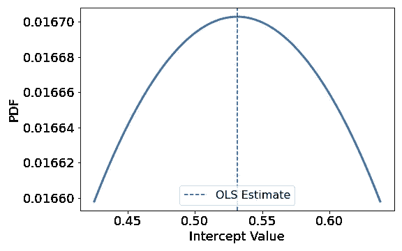

作者用 Python 生成的图。

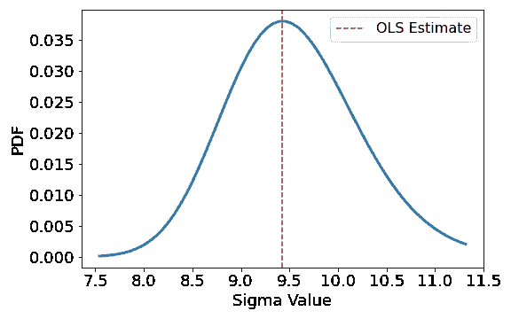

作者用 Python 生成的图。

OLS 估计值是这些参数最可能的值，但不是唯一的值。我们可以使用 216，000 种其他潜在组合来建立数据模型！

## 摘要

这个计算并不是那么直接，写这篇博客最终让我理解了整个贝叶斯回归过程。我建议读者在我的 GitHub 上查看完整的笔记本，并在上面玩一玩:

<https://github.com/egorhowell/Medium-Articles/blob/main/Statistics/Bayesian_Regression.ipynb>  

# 结论

在这篇文章中，我们回顾了贝叶斯定理，解释了频数统计和贝叶斯统计之间的关键区别，最后从头开始进行贝叶斯线性回归。

您可能已经注意到，这个主题在您需要完全掌握的先决知识方面相当广泛。如果我试着去适应所有的背景话题，这个博客真的会成为教科书！

因此，我建议那些还没有完全理解我们在这里所做的事情的人复习一下贝叶斯统计和线性回归。有这么多关于这些主题的资源，会比我教得更好！

# 和我联系！

*   [*要想在媒体上阅读无限的故事，请务必在这里注册！*](/@egorhowell/membership) 💜
*   [*在我发布注册邮件通知时获得更新！*T13*😀*](/subscribe/@egorhowell)
*   [*领英*](https://www.linkedin.com/in/egor-howell-092a721b3/) 👔
*   [*碎碎念*](https://twitter.com/EgorHowell) 🖊
*   [*github*](https://github.com/egorhowell)*🖥*
*   *<https://www.kaggle.com/egorphysics>**🏅***

> ***(所有表情符号都是由 [OpenMoji](https://openmoji.org/) 设计的——开源的表情符号和图标项目。执照: [CC BY-SA 4.0](https://creativecommons.org/licenses/by-sa/4.0/#)************