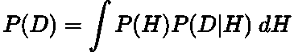
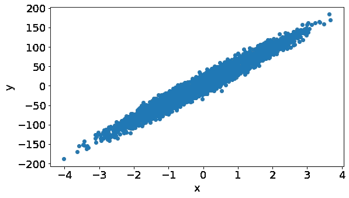
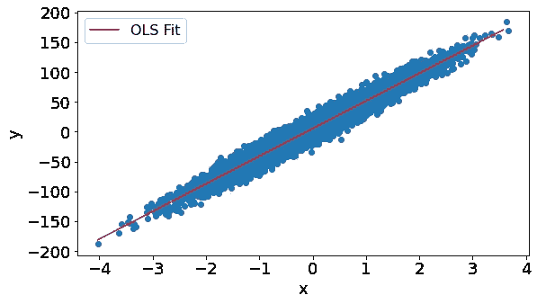
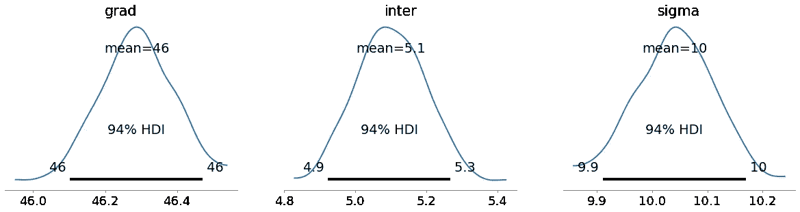
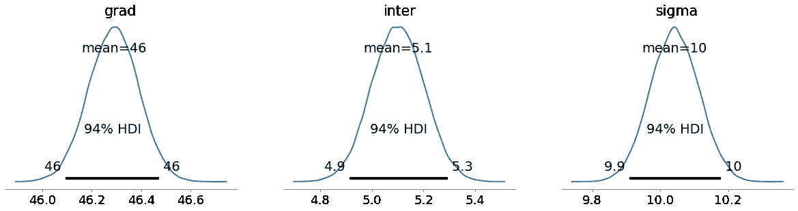

# 使用 PyMC3 的贝叶斯回归

> 原文：<https://towardsdatascience.com/bayesian-regression-using-pymc3-e279ccc81d20>

## 如何使用 PyMC3 包在 Python 中实现贝叶斯回归


Joachim Schnürle 在 [Unsplash](https://unsplash.com?utm_source=medium&utm_medium=referral) 上的照片

# 背景

[**PyMC3**](https://www.pymc.io/welcome.html) (现在简称 PyMC)是一个贝叶斯建模包，使我们作为数据科学家能够轻松地执行 [**贝叶斯推理**](https://en.wikipedia.org/wiki/Bayesian_inference) 。

在引擎盖下，PyMC3 使用[**【MCMC】**](https://en.wikipedia.org/wiki/Markov_chain_Monte_Carlo)**的方法计算后验分布。现在，这种方法非常复杂，需要另外一篇文章来全面介绍。因此，我在这里链接了一个很好地解释了这个话题的帖子[。](/a-zero-math-introduction-to-markov-chain-monte-carlo-methods-dcba889e0c50)**

**您可能想知道为什么封装使用 MCMC？嗯这是为了绕过 [**计算**](https://www.reddit.com/r/askmath/comments/cghi5c/what_is_an_intractable_integral_and_why_this/) **[**归一化常数**](https://en.wikipedia.org/wiki/Normalizing_constant#Bayes'_theorem) 中的 [**贝叶斯定理**](https://en.wikipedia.org/wiki/Bayes'_theorem)****

****

**作者在 LaTeX 中生成的方程。**

**其中 *P(H | D)* 是 [**后验**](https://en.wikipedia.org/wiki/Posterior_probability) ， *P(H)* 是 [**先验**](https://en.wikipedia.org/wiki/Prior_probability) ， *P(D | H)* 是 [**似然**](https://en.wikipedia.org/wiki/Likelihood_function) ， *P(D)* 是归一化常数，定义为:**

****

**作者在 LaTeX 中生成的方程。**

**对于许多问题来说，这个积分要么没有封闭形式的解，要么无法计算。因此，像 MCMC 这样的方法被开发出来解决这个问题，并允许我们使用贝叶斯方法。**

**如果你不熟悉贝叶斯定理，我推荐你看看我以前关于这个主题的文章:**

**[](https://pub.towardsai.net/conditional-probability-and-bayes-theorem-simply-explained-788a6361f333)  

还有另一种叫做 [**共轭先验**](https://en.wikipedia.org/wiki/Conjugate_prior) 的方法也解决了这个棘手的问题，但是它的可塑性不如 MCMC。如果你想了解更多关于共轭先验的知识，请查看我以前的文章:

[](/bayesian-conjugate-priors-simply-explained-747218be0f70)  

在这篇文章中，我们将介绍如何使用 PyMC3 包实现 [**贝叶斯线性回归**](https://en.wikipedia.org/wiki/Bayesian_linear_regression) ，并快速浏览一下它与普通的 [**线性回归**](https://en.wikipedia.org/wiki/Linear_regression) 有何不同。如果你想知道如何从零开始实现贝叶斯线性回归，那么看看我最近的帖子:

[](/bayesian-regression-from-scratch-a1fe19ff64c)  

# 概述:贝叶斯与频率主义回归

从本质上来说， [**Frequentist**](https://en.wikipedia.org/wiki/Frequentist_inference) 和 Bayesian 回归方法之间的关键区别在于它们如何处理参数。在频率统计中，线性回归模型的参数是固定的，而在贝叶斯统计中，它们是随机变量。

频率主义者使用[](https://en.wikipedia.org/wiki/Maximum_likelihood_estimation)**的方法来推导线性回归模型的值。MLE 的结果是每个参数的单一固定值。**

**然而，在贝叶斯世界中，你的参数有一个值的分布，它们可能有一定的概率。然后使用更多的数据更新这个分布，这样我们就可以更加确定参数的取值。这个过程被称为 [**贝叶斯更新**](https://en.wikipedia.org/wiki/Bayesian_inference) ，你可以在这里了解更多信息:**

**[](/bayesian-updating-simply-explained-c2ed3e563588)  

这是对贝叶斯和频率主义回归之间的主要区别的一瞥。如果你想要更深入的观点，有很多资源可以比我解释得更好！

# 使用 PyMC3

## 包装

首先，我们装入我们的包:

```
# Import pyMC3 and also arviz for visualisation
import pymc3 as pm
import arviz as az# Import the other core data science packages
import pandas as pd
import numpy as np
import matplotlib.pyplot as plt
from sklearn import datasets
from scipy.stats import norm
import statsmodels.formula.api as smf
```

你可能需要安装 PyMC3 和[T5 ArviZ](https://www.arviz.org/en/latest/)**。为此，只需遵循他们网站上的安装说明。**

## 数据

现在我们使用 sklearn 的 *make_regression* 函数生成一些数据:

```
# Generate data
x, y = datasets.make_regression(n_samples=10_000,
                                n_features=1,
                                noise=10,
                                bias=5)# Create the dataframe
data = pd.DataFrame(list(zip(x.flatten(), y)),columns =['x', 'y'])# Plot the data
fig, ax = plt.subplots(figsize=(9,5))
ax.scatter(data['x'], data['y'])
ax.ticklabel_format(style='plain')
plt.xlabel('x',fontsize=18)
plt.ylabel('y',fontsize=18)
plt.xticks(fontsize=18)
plt.yticks(fontsize=18)
plt.show()
```



作者用 Python 生成的图。

## 频率回归线

我们使用 [**【普通最小二乘法(OLS)**](https://en.wikipedia.org/wiki/Ordinary_least_squares) 的方法绘制频率线性回归线:

```
# OLS line
formula = 'y ~ x'
results = smf.ols(formula, data=data).fit()
results.params# Get our equation of the OLS line
inter = results.params['Intercept']
slope = results.params['x']
x_vals = np.arange(min(x), max(x), 0.1)
ols_line = inter + slope * x_vals# Plot the target against our feature with the OLS regression
fig, ax = plt.subplots(figsize=(9,5))
ax.scatter(data['x'], data['y'])
ax.plot(x_vals, ols_line,label='OLS Fit', color='red')
ax.ticklabel_format(style='plain')
plt.xlabel('x',fontsize=18)
plt.ylabel('y',fontsize=18)
plt.xticks(fontsize=18)
plt.yticks(fontsize=18)
plt.legend(fontsize=16)
plt.show()
```



作者用 Python 生成的图。

## PyMC3: 100 个样本

要使用 PyMC3，我们必须启动一个模型，选择我们的先验，并告诉模型我们的后验应该是什么分布:

```
# Start our model
with pm.Model() as model_100: # Define the priors on each parameter:
    grad = pm.Uniform("grad",
                      lower=results.params['x']*0.5,
                      upper=results.params['x']*1.5)

    inter = pm.Uniform("inter",
                       lower=results.params['Intercept']*0.5,
                       upper=results.params['Intercept']*1.5)

    sigma = pm.Uniform("sigma",
                       lower=results.resid.std()*0.5,\
                       upper=results.resid.std()*1.5)

    # Linear regression line
    mean = inter + grad*data['x']

    # Describe the distribution of our conditional output
    y = pm.Normal('y', mu = mean, sd = sigma, observed = data['y']) # Run the sampling using pymc3 for 100 samples
    trace_100 = pm.sample(100,return_inferencedata=True)
```

这段代码将运行 MCMC 采样器来计算每个参数的后验概率。同样，如果您有兴趣了解 MCMC 是如何工作的，请参考背景部分的链接。

我们现在可以绘制每个参数的后验分布:

```
with model_100:
    az.plot_posterior(trace_100,
                      var_names=['grad', 'inter', 'sigma'],
                      textsize=18,
                      point_estimate='mean',
                      rope_color='black')
```



作者用 Python 生成的图。

这些后验分布的平均值与 OLS 估计值相同，但是这不是参数可以采用的唯一值。如你所见，有很多值。这是贝叶斯线性回归背后的要点。

HDI 代表 [**高密度区间**](https://stats.stackexchange.com/questions/148439/what-is-a-highest-density-region-hdr) ，描述了我们在参数估计中的确定性。如果你想了解更多关于人类发展指数的信息，请查看我在[T21【贝叶斯可信区间 上的博文:](https://en.wikipedia.org/wiki/Credible_interval)

[](/bayesian-credible-intervals-simply-explained-24989c9259a3)  

这个模拟只使用了我们数据中的 100 个样本。与贝叶斯方法一样，我们随着更多的数据变得更加确定。

## PyMC3: 10，000 个样本

让我们再次运行该过程，但现在使用 10，000 个样本:

```
# Start our model
with pm.Model() as model_10_100: # Define the priors on each parameter:
    grad = pm.Uniform("grad",
                      lower=results.params['x']*0.5,
                      upper=results.params['x']*1.5)

    inter = pm.Uniform("inter",
                       lower=results.params['Intercept']*0.5,
                       upper=results.params['Intercept']*1.5)

    sigma = pm.Uniform("sigma",
                       lower=results.resid.std()*0.5,
                       upper=results.resid.std()*1.5)

    # Linear regression line
    mean = inter + grad*data['x']

    # Describe the distribution of our conditional output
    y = pm.Normal('y', mu = mean, sd = sigma, observed = data['y']) # Run the sampling using pymc3 for 10,000 samples
    trace_10_000 = pm.sample(10_000,return_inferencedata=True)
```

让我们再次查看参数的后验分布:

```
with model_10_100:
    az.plot_posterior(trace_10_000,
                      var_names=['grad', 'inter', 'sigma'],
                      textsize=18,
                      point_estimate='mean',
                      rope_color='black')
```



作者用 Python 生成的图。

平均预测没有改变，但是随着我们更加确定参数的分布，总体上分布变得更加平滑和紧密。

## 密码

要查看我在这篇文章中使用的全部代码，请点击这里查看 GitHub 上的笔记本:

[](https://github.com/egorhowell/Medium-Articles/blob/main/Statistics/pymc3_tutorial.ipynb)  

# 结论

在本文中，我们浏览了贝叶斯统计的主要原则，并解释了它如何采取不同于频率统计的线性回归方法。然后我们看了一个基本的例子，如何使用 PyMC3 包进行贝叶斯回归。

# 和我联系！

*   要在媒体上阅读无限的故事，请务必在此注册！T3*💜*
*   [*当我在这里发布注册邮件通知时，可以获得更新！*](/subscribe/@egorhowell) 😀
*   [*领英*](https://www.linkedin.com/in/egor-howell-092a721b3/) 👔
*   [*推特*](https://twitter.com/EgorHowell) 🖊
*   [*github*](https://github.com/egorhowell)*🖥*
*   *[](https://www.kaggle.com/egorphysics)**🏅***

> ***(所有表情符号由 [OpenMoji](https://openmoji.org/) 设计——开源表情符号和图标项目。许可证: [CC BY-SA 4.0](https://creativecommons.org/licenses/by-sa/4.0/#)*******