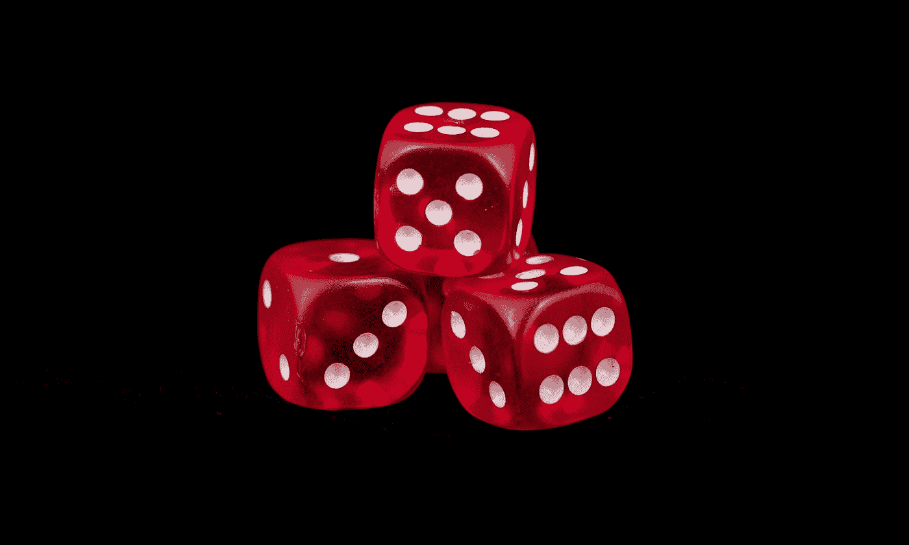
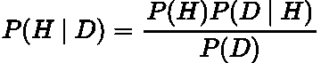
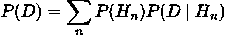
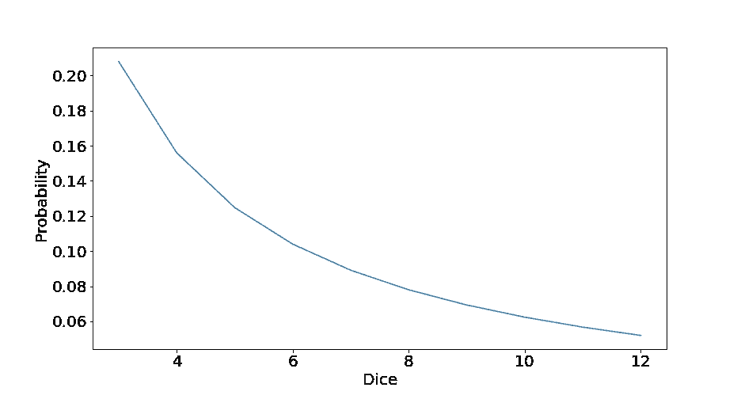
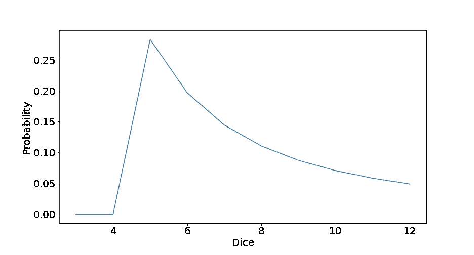
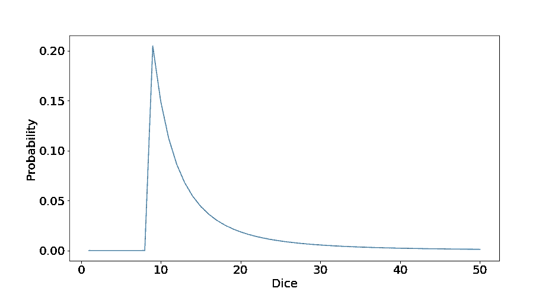

# Python 中的贝叶斯更新

> 原文：<https://towardsdatascience.com/bayesian-updating-in-python-8bbd0e7e30cc>

## 简单介绍如何使用 Numpy 在 Python 中执行贝叶斯更新。



特里·维里斯迪斯在 [Unsplash](https://unsplash.com?utm_source=medium&utm_medium=referral) 上的照片

# 介绍

在我以前的一篇文章中，我讨论了如何使用贝叶斯更新来更新你的信念。你可以在这里查看帖子:

[](/bayesian-updating-simply-explained-c2ed3e563588)  

在那篇文章中，我们有三个不同数字范围的骰子。我们随机拿起一个骰子，用那个骰子连续掷了两次。从这些信息中，我们计算出我们最有可能捡起哪个骰子的概率(后验概率)。

这个过程都是手工完成的，因为我们幸运地只有两次掷骰子的结果和三个骰子。然而，随着更多的骰子和更多的滚动，这个问题很快就变得冗长而乏味，无法用笔和纸来解决。

在本文中，我们将用 Python 实现上述问题的贝叶斯更新，以加快计算后验概率的过程。

# 贝叶斯定理概述

让我们快速回顾一下[贝叶斯定理](https://en.wikipedia.org/wiki/Bayes'_theorem)及其主要特征:



作者在 LaTeX 中生成的方程。

*   ***P(H):*** 假设的概率，这是[](https://en.wikipedia.org/wiki/Prior_probability)****。**这是在我们看到我们的数据之前，我们假设的可能性有多大， ***D*** 。**
*   *****P(D | H):***[**可能性**](https://en.wikipedia.org/wiki/Likelihood_function) **，**给定我们的假设，我们的数据正确的概率。**
*   *****P(H|D):*** 从我们给定的数据来看，我们的假设为真的概率。这是[的**后路**的](https://en.wikipedia.org/wiki/Posterior_probability)。**
*   *****P(D):*** 观测数据的概率。这是 [**归一化常数**](https://en.wikipedia.org/wiki/Normalizing_constant#Bayes'_theorem) **，**这是可能性和先验的乘积之和:**

****

**作者在 LaTeX 中生成的方程。**

**关于贝叶斯定理的完整推导和直觉，请查看我以前的帖子:**

**[](https://pub.towardsai.net/conditional-probability-and-bayes-theorem-simply-explained-788a6361f333)  

# 问题是

假设有一组不同数字范围的骰子，1-2，1-3，1-4 等等。我们随机选择一个骰子，然后掷几次。使用我们从掷骰结果中得到的数据，我们可以更新我们的信念来估计我们最有可能选择哪个骰子。

# 代码

让我们从导入我们的包开始:

```
import numpy as np
import matplotlib.pyplot as plt
```

## 骰子

生成我们的骰子，其中数字代表该骰子的最高值。例如，9 表示骰子的数字在 1-9 之间:

```
dice = np.arange(3,13)
diceOutput: array([ 3,  4,  5,  6,  7,  8,  9, 10, 11, 12])
```

## 在先的；在前的

由于每个骰子被选中的可能性相同，我们有一个[](https://en.wikipedia.org/wiki/Prior_probability#Uninformative_priors)****的统一先验。**因此，每个骰子具有相等的先验概率:**

```
prior = [1/len(dice) for _ in np.arange(len(dice))]
priorOutput: [0.1, 0.1, 0.1, 0.1, 0.1, 0.1, 0.1, 0.1, 0.1, 0.1]
```

**因为我们有 10 个骰子，每个骰子有 10%的概率被选中。**

## **可能性和掷骰 1**

**我们选择一个骰子，掷 1。掷出 1 的可能性如下:**

```
roll = 1
likelihood1 = [1/i if i >= roll else 0 for i in dice]
likelihood1Output: [0.3333333333333333,
 0.25,
 0.2,
 0.16666666666666666,
 0.14285714285714285,
 0.125,
 0.1111111111111111,
 0.1,
 0.09090909090909091,
 0.08333333333333333
```

**请注意，1–3 的骰子可能性最大。这是有意义的，因为它具有最小的数字范围。**

## **计算后验概率**

**将先验和似然性相乘，我们可以找到后验并将其归一化:**

```
posterior = np.array(likelihood1) * np.array(prior)
list(posterior/sum(posterior))Ouput: [0.20791611349879613,
 0.15593708512409712,
 0.1247496680992777,
 0.10395805674939806,
 0.08910690578519834,
 0.07796854256204856,
 0.06930537116626538,
 0.06237483404963885,
 0.05670439459058077,
 0.05197902837469903]
```

**绘制后路图:**

```
plt.figure(figsize=(13,7))
plt.xlabel('Dice', fontsize=20)
plt.ylabel('Probability', fontsize=20)
plt.plot(dice, list(posterior/sum(posterior)))
plt.xticks(fontsize=20)
plt.yticks(fontsize=20)
plt.show()
```

****

**作者用 Python 生成的图形。**

**找到概率最高的骰子，这就是所谓的 [**最大后验概率** ( **图)**](https://en.wikipedia.org/wiki/Maximum_a_posteriori_estimation) **:****

```
dice[np.argmax(posterior)]Output: 3
```

**因此，最有可能的骰子是范围从 1 到 3 的骰子！这是很明显的，因为它有最高的可能性，我们也有一个统一的先验。**

## **可能性和滚动 2**

**我们再次掷出同一个骰子，得到一个 5。这种结果的可能性是:**

```
roll = 5
likelihood2 = [1/i if i >= roll else 0 for i in dice]
likelihood2Output: [0,
 0,
 0.2,
 0.16666666666666666,
 0.14285714285714285,
 0.125,
 0.1111111111111111,
 0.1,
 0.09090909090909091,
 0.08333333333333333]
```

**注意前两个现在是 0。这是因为不可能用范围为 1-3 和 1-4 的骰子掷出 5。**

## **更新后验**

**使用我们的旧后验概率作为新的先验，以及滚动 5 的可能性，我们更新我们的后验概率为:**

```
posterior = posterior * np.array(likelihood2)
list(posterior/sum(posterior))Output: [0.0,
 0.0,
 0.2829544144262495,
 0.1964961211293399,
 0.14436449715624972,
 0.1105290681352537,
 0.08733160939081774,
 0.07073860360656238,
 0.05846165587319205,
 0.049124030282334974]
```

**绘制后路图:**

```
plt.figure(figsize=(13,7))
plt.xlabel('Dice', fontsize=20)
plt.ylabel('Probability', fontsize=20)
plt.plot(dice, list(posterior/sum(posterior)))
plt.xticks(fontsize=20)
plt.yticks(fontsize=20)
plt.show()
```

****

**作者用 Python 生成的图形。**

**概率最高的骰子:**

```
dice[np.argmax(posterior)]Output: 5
```

**根据我们的数据，范围为 1-5 的骰子是最有可能的！**

**范围为 1-3 和 1-4 的骰子是 0，因为它们不可能输出 5，因此我们知道我们肯定没有选择它们！**

## **类函数**

**为了方便起见，让我们将所有这些代码打包成一个函数:**

```
def bayesian_dice_updating(data, dice):
    """ Compute the posterior distribution for given dice and data.

    :param data: The numbers that have been rolled from the dice
    :type data: list, np.array

    :param dice: The range of dices where the number represents 
                 the maximum value that die can take.
    :type dice: list, np.array

    :returns: Posterior distribution of the dice given the data
    :rtype: list

    """

    prior = [1/len(dice) for _ in np.arange(len(dice))]

    posterior = prior

    for roll in data:
        likelihood = [1/i if i >= roll else 0 for i in dice]
        posterior = np.array(likelihood) * np.array(posterior)

    return list(posterior/sum(posterior))
```

**我们来试试吧！**

**生成一些骰子和一些数据(掷骰结果):**

```
dice = np.arange(1,51)
data = [4,6,9]
```

**绘制结果图:**

```
plt.figure(figsize=(13,7))
plt.xlabel('Dice', fontsize=20)
plt.ylabel('Probability', fontsize=20)
plt.plot(dice, bayesian_dice_updating(data, dice))
plt.xticks(fontsize=20)
plt.yticks(fontsize=20)
plt.show()
```

****

**作者用 Python 生成的图形。**

```
dice[np.argmax(bayesian_dice_updating(data, dice))]Output: 9
```

**功能运行良好！**

**完整代码可从我的 GitHub 获得，网址是:**

**[](https://github.com/egorhowell/Medium-Articles/blob/main/Statistics/Bayesian_Updating.ipynb)  

# 结论

在本文中，我们回顾了贝叶斯定理，并展示了如何用 Python 编写贝叶斯更新，以使计算后验概率变得简单。

# 和我联系！

*   要在媒体上阅读无限的故事，请务必在此注册！T3*💜*
*   [*当我在这里发布注册邮件通知时，可以获得更新！*](/subscribe/@egorhowell) 😀
*   [*领英*](https://www.linkedin.com/in/egor-howell-092a721b3/) 👔
*   [*推特*](https://twitter.com/EgorHowell) 🖊
*   [*github*](https://github.com/egorhowell)*🖥*
*   *[](https://www.kaggle.com/egorphysics)**🏅***

> ***(所有表情符号由 [OpenMoji](https://openmoji.org/) 设计——开源表情符号和图标项目。许可证: [CC BY-SA 4.0](https://creativecommons.org/licenses/by-sa/4.0/#)*******