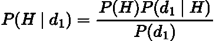
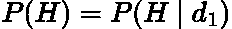
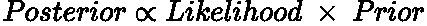
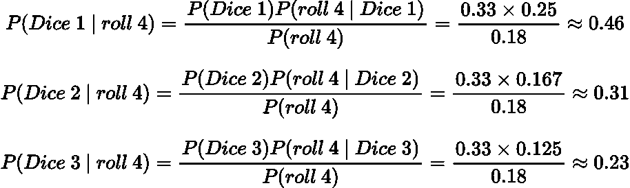
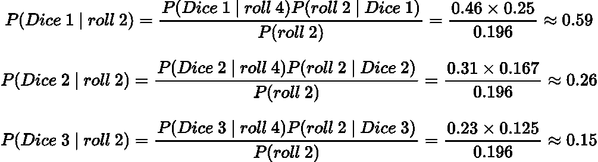
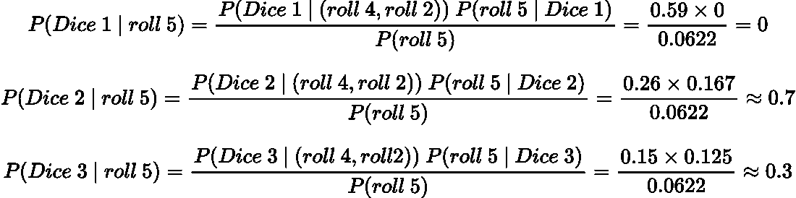
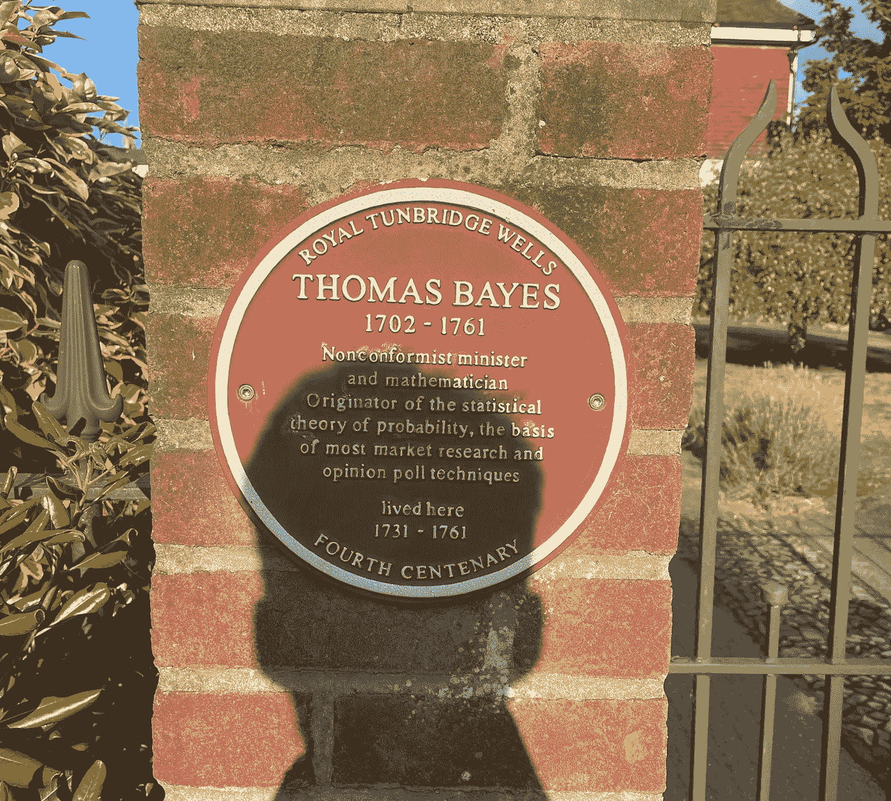

# 贝叶斯更新简单解释

> 原文：<https://towardsdatascience.com/bayesian-updating-simply-explained-c2ed3e563588>

## 用贝叶斯定理更新信念的直观解释

迪伦·克里夫顿的照片在 [Unsplash](https://unsplash.com?utm_source=medium&utm_medium=referral) 上

# 介绍

在我以前的文章中，我们从条件概率中推导出了贝叶斯定理。如果您不熟悉贝叶斯定理，我强烈建议您在阅读本文之前先阅读那篇文章:

  

在本文中，我们将使用贝叶斯定理来更新我们的信念，并展示如何随着更多的数据，我们变得更加确定我们的假设。

# 贝叶斯定理

我们可以把贝叶斯定理写成如下:

作者在 LaTeX 中生成的方程。

*   ***P(H)*** 是我们假设的概率，即****。**这是在我们看到证据/数据之前，我们假设的可能性有多大。**
*   *****P(D|H)*** 是 [**可能性**](https://en.wikipedia.org/wiki/Likelihood_function) **，**是给定我们的假设，我们的证据/数据正确的概率。**
*   *****P(H|D)*** 是从我们的数据/证据来看，我们的假设是正确的概率。这就是俗称的**。****
*   *******P(D)*** 是我们证据/数据的概率。这被称为 [**归一化常数**](https://en.wikipedia.org/wiki/Normalizing_constant#Bayes'_theorem) **，**，它是可能性和先验的乘积之和:****

********

****作者在 LaTeX 中生成的方程。****

# ****贝叶斯更新****

****当新的证据出现时，我们可以用贝叶斯定理来更新我们的假设。****

****例如，给定一些数据*其中包含了一个 ***d_1*** 数据点，那么我们的后验就是:*****

**********

*****作者在 LaTeX 中生成的方程。*****

*****假设我们现在获得了另一个数据点***【D2】***，因此我们有更多的证据来评估和 ***更新*** 我们的信念(后验)。然而，**我们的** [**先验现在变成了我们的旧后验**](https://www.investopedia.com/terms/p/posterior-probability.asp) 因为这代表了我们的**新的先验信念**我们的假设:*****

**********

*****作者在 LaTeX 中生成的方程。*****

*****就更新而言，我们说后验与似然和先验的乘积成比例:*****

**********

*****作者在 LaTeX 中生成的方程。*****

*****这种更新可能看起来有些武断，但是现在让我们通过一个例子来使它更加具体。*****

> *****我们通常省略分母 P(D ),因为它只是一个归一化常数，使概率总和为 1。[Stat Exchange 有一个很好的帖子很好地解释了这一点。](https://stats.stackexchange.com/questions/64364/why-is-posterior-density-proportional-to-prior-density-times-likelihood-function)*****

# *****例子*****

*****假设我有三个不同的骰子，有三个不同的数字范围:*****

*   ********骰子 1:1–4********
*   ********骰子 2:1–6********
*   ********骰子 3:1–8********

*****我们随机选择一个骰子，用给定的骰子做三次后续的掷骰子。使用这些掷骰子(数据)，我们可以计算在到达角色(后)后，我们选择骰子 1、2 或 3 的可能性。*****

## *****第一卷*****

*****在第一次掷骰子时，我们得到数字 **4** 。我们选择骰子 1、2 或 3 的概率是多少？*****

*****我们可以使用贝叶斯定理计算如下:*****

**********

*****作者在 LaTeX 中生成的方程。*****

*****我们使用了以下值:*****

*   *****之前， ***P(骰子)*** ，简单来说就是 **0.33** 因为每个骰子被选中的几率相等。*****
*   *****可能性， ***P(掷出 4 |骰子)*** ，就是每个骰子掷出一个 **4** 的概率。*****
*   *****数据的概率(归一化值)， ***P(第 4 卷)*** ，就是似然性和先验乘积的**之和。*******

*****所以第一次掷骰子后，骰子 1 是最有可能的。这是有意义的，因为它只有 4 个结果，因此 1-4 之间的任何一次掷骰都是最有可能的。*****

## *****第二卷*****

*****使用相同的骰子，我们现在掷第二次，得到一个 **2** 。然而，我们有了新的先验，这是上面我们掷出 4 的计算后验。*****

*****因此，现在的概率是:*****

**********

*****作者在 LaTeX 中生成的方程。*****

*****有了这个新信息，骰子 1 越来越有可能是我们捡到的那个。*****

## *****第三卷*****

*****我们用我们选择的骰子掷第三次，得到一个 **5** 。使用我们以前的后验概率作为我们新的先验概率，现在的概率是:*****

**********

*****作者在 LaTeX 中生成的方程。*****

*****它是骰子 1 的概率现在是 0，因为不可能用骰子 1 掷出 5。因此，给定这三个数据点(掷骰子),骰子 2 是我们最有可能选中的一个！*****

*****具有最高后验概率的值称为 [**【最大后验概率】**](https://en.wikipedia.org/wiki/Maximum_a_posteriori_estimation) 。这类似于 [**最大似然**](https://en.wikipedia.org/wiki/Maximum_likelihood_estimation) 但是对于贝叶斯统计来说，是后验分布的众数。*****

> *****骰子的三个后验值形成了一个**后验分布**，尽管非常小！*****

# *****结论*****

*****在这篇文章中，我们展示了当你面对新数据时，如何使用贝叶斯定理来更新你的信念。这种统计方式与我们人类的思维方式非常相似，因为新信息可以强化或改变我们的信念。*****

# *****和我联系！*****

*   *****要在媒体上阅读无限的故事，请务必在此注册！T17*💜******
*   *****[*要想在我发帖注册时得到更新的邮件通知就在这里！*](/subscribe/@egorhowell) 😀*****
*   *****[*LinkedIn*](https://www.linkedin.com/in/egor-howell-092a721b3/)*👔******
*   ******[*推特*](https://twitter.com/EgorHowell) 🖊******
*   ******[*github*](https://github.com/egorhowell)*🖥*******
*   *********🏅*********

> *******(所有表情符号都是由 [OpenMoji](https://openmoji.org/) 设计的——开源的表情符号和图标项目。许可证: [CC BY-SA 4.0](https://creativecommons.org/licenses/by-sa/4.0/#)*******

# *******额外的东西！*******

*******我的父母住在东苏塞克斯，上周末我去拜访了他们。在旅途中，我们在一个名叫滕布里奇·韦尔斯的小镇吃了晚饭。你知道谁住在那里吗？托马斯·贝叶斯！*******

*******如果您在该地区，这是非常值得一试！*******

**************

*******作者照片。*******