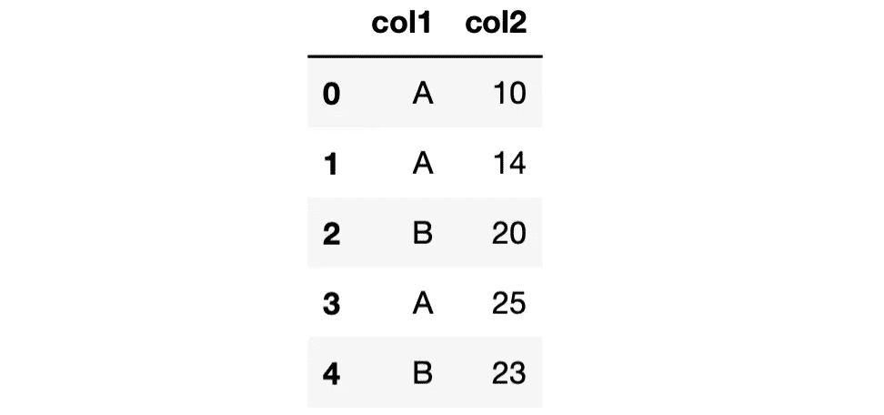
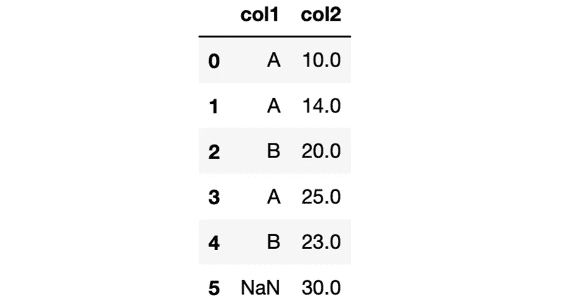

# 在对分类数据类型使用 Pandas Groupby 时要小心

> 原文：<https://towardsdatascience.com/be-careful-when-using-pandas-groupby-with-categorical-data-type-a1d31f66b162>

## 为了避免意外的结果


在 [Unsplash](https://unsplash.com/s/photos/warning?utm_source=unsplash&utm_medium=referral&utm_content=creditCopyText) 上由 [Muhammad Daudy](https://unsplash.com/@ahsanjaya?utm_source=unsplash&utm_medium=referral&utm_content=creditCopyText) 拍摄的照片

在统计学中，[分类变量](https://en.wikipedia.org/wiki/Categorical_variable)是一个变量，它可以取有限的、通常是固定数量的可能值中的一个。Pandas 有一个专用于分类变量的数据类型，即 category。

在某些情况下，使用 category 数据类型非常有用且高效。例如，如果您的字符串或对象列只包含几个不同的值，将其转换为类别数据类型将节省大量内存。

为了比较内存使用情况，让我们首先创建一个 Pandas 系列，它包含三百万行三种不同的字符串，数据类型为 string。

```
import pandas as pdnames = pd.Series(["John", "Jane", "James"] * 1000000, dtype="string")names.memory_usage()
**# output**
24000128
```

它占用了大约 2400 万字节的空间。让我们用 category 数据类型来试试。

```
names = pd.Series(["John", "Jane", "James"] * 1000000, dtype="category")names.memory_usage()
**# output**
3000260
```

内存使用量减少到 300 万，比字符串数据类型的内存使用量少 8 倍。

category 数据类型允许为一个列强制一组可能的值。如果试图赋一个不在指定类别中的值，将引发类型错误。因此，具有类别数据类型的列中的所有值要么在给定的类别中，要么缺少值(即 np.nan 或 None)。

回到我们对数据类型为 category 的列上的 groupby 函数的讨论，有一点您应该注意。

让我们创建一个包含两列的示例数据框架，其中一列是包含 3 个类别的类别数据类型。

```
df = pd.DataFrame({
    "col1": pd.Categorical(
        ["A", "A", "B", "A", "B"], 
        categories=["A","B","C"], 
        ordered=False
    ),
    "col2": [10, 14, 20, 25, 23]
})
```



df(作者图片)

列 col1 的数据类型是具有值 A、B 或 c 的类别。

```
df["col1"]
**# output**
0    A
1    A
2    B
3    A
4    B
Name: col1, dtype: category
Categories (3, object): ['A', 'B', 'C']
```

当我们对该列使用 groupby 函数时，尽管 DataFrame 的 col1 列中不包含带有 C 的行，但类别 C 仍会出现在结果中。

```
df.groupby("col1")["col2"].sum()
**# output**
col1
A    49
B    43
C     0
Name: col2, dtype: int64
```

我们可以通过将 observed 参数的值设置为 True 来改变这种行为，这将只返回在 DataFrame 中观察到的值。

```
df.groupby("col1", observed=True)["col2"].sum()
**# output**
col1
A    49
B    43
Name: col2, dtype: int64
```

## 棘手的部分

棘手的部分是当我们在数据类型为 category 的列中缺少值时。让我们在 category 列中添加一个缺少值的新行。

```
import numpy as npdf.loc[5,:] = [np.nan, 30]
```



df(作者图片)

默认情况下，groupby 函数不显示缺失值的聚合值。因此，如果我们按 col1 列对行进行分组，我们将不会在结果中看到 NaN 组。我们可以通过使用 dropna 参数并将其值设置为 False 来更改此设置。在其他数据类型中，此更改将在结果中包括 NaN 组。但是，它不适用于类别数据类型。

我们来做几个例子说清楚。

```
df.groupby("col1", dropna=False)["col2"].sum()
**# output**
col1
A    49.0
B    43.0
C     0.0
Name: col2, dtype: float64
```

即使我们使用观测参数，结果也是一样的。它将只移除未观察到的类别，但丢失的值不会显示在输出中。

```
df.groupby("col1", observed=True, dropna=False)["col2"].sum()
**# output**
col1
A    49.0
B    43.0
Name: col2, dtype: float64
```

这只是类别数据类型的问题，在[新版本](https://pandas.pydata.org/docs/whatsnew/v1.5.1.html)文档中有提及。如果数据类型是 string 或 object，dropna 参数将按预期工作。让我们通过将数据类型更改为 string 来进行确认。

```
df["col1"] = df["col1"].astype("string")
df.groupby("col1", dropna=False)["col2"].sum()
**# output**
col1
A       49.0
B       43.0
<NA>    30.0
Name: col2, dtype: float64
```

现在，我们在输出中将缺失的值视为一组。

这可能不是一个重要的问题，但绝对是我们需要记住的事情。我们经常会遇到原始数据中的缺失值，应该把它们考虑进去。否则，我们可能会得到意想不到的结果或不可靠的模型。

*你可以成为* [*媒介会员*](https://sonery.medium.com/membership) *解锁我的全部写作权限，外加其余媒介。如果你已经是了，别忘了订阅**如果你想在我发表新文章时收到电子邮件。***

*感谢您的阅读。如果您有任何反馈，请告诉我。*