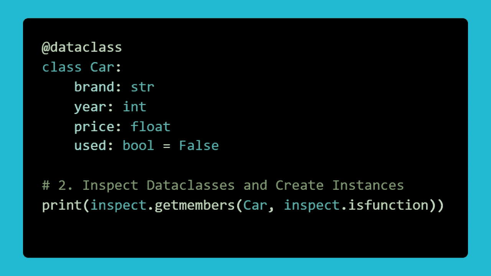

# 去样板代码！Python 中的主数据类

> 原文：<https://towardsdatascience.com/be-gone-boilerplate-code-master-dataclasses-in-python-d3f302f9a7c4>

# 去样板代码！Python 中的主数据类

## 熟悉一个非常有用的数据容器



图片作者。

# 您的旅程概述

1.  [设置舞台](#40d7)
2.  [什么是数据类？](#63dc)
3.  [创建数据类的实例](#820f)
4.  [简单验证](#dad6)
5.  [数据类之间相等](#d594)
6.  [数据类的排序](#c9f4)
7.  [不可变数据类](#766f)
8.  [包装](#2718)

# 1 —搭建舞台

Python 有许多数据类型，可以作为其他数据类型的容器。最简单的例子是内置数据类型`List`、`Tuple`、`Dictionary`和`Set`。虽然这些数据类型在某些设置中工作得很好，但在许多设置中却不尽如人意。这对于数据科学家和数据工程师来说并不陌生:

*   使用 NumPy 数组是因为列表很慢，而且不是为向量运算和线性代数而构建的。
*   你使用熊猫数据框架是因为字典对于数据分析来说不够方便。

然而，在数据科学/工程领域之外，还有一些非常有用的数据容器。例子有*命名元组*、*数据类*和 *Pydantic 模型*。这些数据容器在数据领域经常被忽略，因为它们不是绝对必要的。人们低估了他们对减少样板代码、获得数据验证和处理数据的帮助。用下面的木工比喻来思考这个问题🔨

> 可以用螺丝刀的背面敲入钉子。但是，如果有一把锤子躺在周围，等着被使用，你为什么要这样做呢？

可能在数据科学/数据工程中经常被忽略的更有用的数据结构之一是**数据类**。这是 Python 生态系统(Python 3.7 版及更高版本)的新成员。在这篇博文中，我将告诉你开始在你的项目中使用数据类所需要知道的一切。

**你是视频人吗？我在 dataclasses 上制作了四个 YouTube 视频，内容与博客相同。如果你想检查一下，请便！**

*   [Python 中的主数据类第 1 部分——基本结构和验证](https://youtu.be/Yi55fpwcFhA)
*   [Python 第 2 部分中的主数据类——数据类之间的相等性](https://youtu.be/y9uRbrxDWQE)
*   [Python 中的主数据类第 3 部分——数据类的排序](https://youtu.be/myENiF_Zw7Q)
*   [Python 第 4 部分中的主数据类—不可变数据类](https://youtu.be/Yi55fpwcFhA)

**先决条件:**因为数据类本质上是增强的 Python 类，所以你需要知道 Python 类的基础。如果您对诸如*抽象*、*封装*和*多态之类的高级术语感到生疏，也不必感到难过。你不需要任何高级的东西👍*

# 2-什么是数据类？

一个数据类是一个数据容器，它包含了电池。更确切地说，它是一个已经实现了一些很酷的特性的 Python 类。通过使用数据类，您将避免编写大量样板代码。Dataclasses 为您提供了一种灵活且可预测的方式来存储数据、比较数据和排序数据。

要开始使用 dataclasses，**确保您安装了 Python 3.7 或更高版本**。您不需要下载第三方库，因为数据类在标准库中。以下是模拟汽车的数据类的最小示例:

```
from dataclasses import dataclass@dataclass
class Car:
  """A dataclass that models a car."""
  brand: str
  year: int
  price: float
  used: bool
```

让我们慢慢浏览上面的代码片段:

*   1 —从`dataclasses`模块导入`dataclass`装饰器。
*   2 —将 dataclass 装饰器应用于一个名为`Car`的类。
*   3 —为数据类应该包含的各种数据编写类似`brand: str`的属性。属性名将是`brand`，而`str`表示它应该是一个字符串。这是 Python 中*类型提示*的一个例子。如果你不熟悉，那就看看[这篇博文](/modernize-your-sinful-python-code-with-beautiful-type-hints-4e72e98f6bf1)。

使用上面的代码，您已经表示了一辆具有四个属性`brand`、`year`、`price`和`used`的汽车😃

您创建的只是一个普通的 Python 类，除了`dataclass`装饰器增加了额外的功能。您是否注意到在类中不需要`__init__`方法？这是`dataclass`装饰器为您修复的事情之一。

# 3-创建数据类的实例

现在，您将继续使用上一节中的代码，并创建一些汽车实例。要制造两辆汽车，您只需提供必要的属性:

```
# Initiate a BMW car
bmw_car = Car(brand="bmw", year=2016, price=20000, used=False)#Initiate an Audi car
audi_car = Car(brand="audi", year=2018, price=18000, used=True)
```

让我们把这些车打印出来:

```
print(bmw_car)
print(audi_car)**Output:** Car(brand="bmw", year=2016, price=20000, used=False)
Car(brand="audi", year=2018, price=18000, used=True)
```

打印数据类时的输出是信息性的，无需在类中编写`__repr__`方法。这是由`dataclass`装饰器自动处理的🔥

要查看还自动实现了什么，您可以使用`inspect`模块:

```
import inspect# Inspect the Car class
print(inspect.getmembers(Car, inspect.isfunction))**Output:**
[('__eq__', <function __create_fn__.<locals>.__eq__ at 0x0000021CB9A23790>), ('__init__', <function __create_fn__.<locals>.__init__ at 0x0000021CB9A23670>), ('__repr__', <function __create_fn__.<locals>.__repr__ at 0x0000021CB9A135E0>)]
```

我知道这不是最美丽的景象😅

如果你仔细阅读，那么你可以看到一个`__eq__`、`__init__`和`__repr__`是在 dataclass 中自动实现的。稍后我将回到`__eq__`是如何实现的。

默认情况下，数据类是可变的。这意味着您可以进行以下更改:

```
# The Audi car becomes used
audi_car.used = True
print(audi_car.used)**Output:**
True
```

最后，你可以让一个数据类的一些属性拥有*默认值。*假设您希望`used`属性有一个默认值`False`。为此，您只需更改一行代码:

```
used: bool = False # Last line in the Car class
```

现在，如果你写

```
bmw_car = Car(brand="bmw", year=2016, price=20000)
```

您会自动获得以下内容:

```
print(bmw_car)**Output:** Car(brand="bmw", year=2016, price=20000, used=False)
```


穆罕默德·诺哈西在 [Unsplash](https://unsplash.com?utm_source=medium&utm_medium=referral) 上的照片

# 4-简单验证

人们很容易将数据类视为过于复杂的字典。为什么不用下面的方法简单地存储变量`bmw_car`呢？

```
bmw_car = {
  "brand": "bmw", 
  "year": 2016, 
  "price": 20000, 
  "used": False
}
```

虽然这也是可行的，但是数据类提供了值得考虑的额外特性。其中之一是初始化新实例时的基本验证。

为了演示这一点，我在我的工作目录中创建了一个名为`cars`的文件夹(不要担心这是哪里，我将只使用相对路径)。文件夹`cars`包含四个文件`car1.json`、`car2.json`、`car3.json`和`car4.json`。每个 JSON 文件都包含一行数据:

```
**car1.json** {
  "brand": "bmw", 
  "year": 2016, 
  "price": 20000
}**car2.json** {
  "brand": "audi", 
  "year": 2018, 
  "price": 25000, 
  "used": true
}**car3.json** {
  "brand": "toyota", 
  "year": 2020, 
  "price": 22000, 
  "used": false
}**car4.json** {
  "brand": "toyota",  
  "price": 22000, 
  "used": false
}
```

我想将这里给出的四辆汽车初始化为 dataclass 对象。仔细看上面的四个例子。有没有应该拒绝的？

导入 JSON 文件和启动`Car`实例可以通过下面的标准 Python 代码片段来完成:

```
import json# Loading and initiating the cars
cars = []
for i in range(1, 5):
  with open(f"cars/car{i}.json", 'r') as file:
    car_info = json.load(file)
    cars.append(Car(**car_info))
print(cars)**Output:** TypeError: __init__() missing 1 required positional argument: 'year'
```

你会立即得到反馈，有什么地方出错了😮

当然，当你查看`car4.json`时，就会发现`year`属性不见了。如果您使用基本的字典来建模汽车，那么您将需要大量枯燥的代码来确保提供没有默认值的属性。

通过使用第三方库 **MyPy** ，您还可以使用 dataclasses 中的类型提示来获得更好的数据验证。虽然这超出了这篇博文的范围，但是如果你感兴趣的话，可以看看 [MyPy](http://mypy-lang.org/) 。

# 5-数据类之间相等

dataclasses 的一个很酷的特性是它们已经实现了一个用于比较实例的`__eq__`方法。为了了解这是如何工作的，让我们考虑另一个数据类示例，其中您对图书进行建模:

```
from dataclasses import dataclass@dataclass
class Book:
  """A dataclass for representing books."""
  title: str
  author: str
  isbn: str
  pages: int = 0
```

到目前为止，一切顺利。现在举以下四个例子:

```
fluent_python = Book(
  title="Fluent Python", 
  author="Luciano Ramalho", 
  isbn="978-1-491-94600-8",
  pages=751
)fluent_python_identical = Book(
  title="Fluent Python", 
  author="Luciano Ramalho", 
  isbn="978-1-491-94600-8",
  pages=751
)fluent_python_missing_pages = Book(
  title="Fluent Python",
  author="Luciano Ramalho",
  isbn="978-1-491-94600-8"
)python_crash_course = Book(
  title="Python Crash Course", 
  author="Eric Matthes", 
  isbn="978-1-593-27928-8"
)
```

书籍`fluent_python`和`fluent_python_identical`包含完全相同的数据。另一方面，书`fluent_python_missing_pages`是缺页的，所以页数被设置为默认值`0`。最后，这本书`python_crash_course`从根本上不同于其他所有的书。

下面显示了如果您尝试比较不同的实例会发生什么:

```
print(fluent_python == python_crash_course)**Output:** Falseprint(fluent_python == fluent_python_identical)**Output:** Trueprint(fluent_python == fluent_python_missing_pages)**Output:** False
```

最有趣的是，书`fluent_python`和`fluent_python_missing_pages`并不被认为是平等的。

> 当且仅当两个 dataclasses 实例的所有属性都相等时，它们才被视为相等。

这与平时上课的方式形成了鲜明的对比。对于通常的类，除非你实现了你自己的`__eq__`方法，否则只有当两个实例引用同一个内存地址时，它们才被认为是相等的。这是一个非常严格的标准，在数据科学和数据工程中不是很有用。

# 6-数据类中的排序


照片由[安德烈·泰森](https://unsplash.com/@andretaissin?utm_source=medium&utm_medium=referral)在 [Unsplash](https://unsplash.com?utm_source=medium&utm_medium=referral) 上拍摄

既然您已经看到了数据类的基础知识，那么是时候讨论数据类的排序了。默认情况下，数据类没有顺序。但是，您可以指定希望数据类按如下方式排序:

```
@dataclass(order=True)
class RGBColor:
  """A class for keeping track of a color."""
  red: int
  green: int
  blue: int
```

注意，我在 dataclass 装饰器中指定了`order=True`。您现在得到以下排序:

```
almost_white_color = RGBColor(red=254, green=255, blue=255)
red_color = RGBColor(red=255, green=0, blue=0)print(almost_white_color > red_color)**Output:** False
```

这是怎么回事？😟

如果除了`order=True`之外没有指定任何东西，那么默认的排序将按照*字典的方式*来比较属性。这意味着首先将`almost_white` (254)的`red`值与`red_color` (255)的`red`值进行比较。因为 254 小于 255，所以得到输出`False`。如果出现平局，则比较下一个属性(绿色),依此类推。

默认顺序通常不是您想要的。这一次，它很大程度上依赖于属性的排序(红色现在比蓝色更适合确定大小)。对于红、绿、蓝三色同等重要的 RGB 颜色来说，这似乎不是一个好主意。

这就引出了一个问题:*如何指定自己的排序？*

以下示例为您的`RGBColor`数据类实现了自定义顺序:

```
from dataclasses import dataclass, field@dataclass(order=True)
class RGBColor:
  """A class for keeping track of a color."""
  sort_index: int = field(init=False, repr=False)
  red: int
  green: int
  blue: int def __post_init__(self):
    self.sort_index = self.red + self.green + self.blue
```

这里发生了一些事情。让我们把它们一个一个分解开来:

*   除了`dataclass`之外，你还可以从`dataclasses`模块中导入`field`。
*   您创建了一个属性`sort_index`,该属性将用于对数据类的实例进行排序。我稍后会回到论点`init=False`和`repr=False`的意思。
*   您创建了一个名为`__post_init__`的特殊方法。该方法在`__init__`方法在引擎盖下执行后执行。然后指定`sort_index`属性应该是什么。之所以需要在`__init__`方法之后指定，是因为您需要能够访问三个属性`red`、`green`和`blue`。默认情况下，`__post_init__`方法中指定的变量将决定数据类的排序方式。

现在你有了以下比较:

```
almost_white_color = RGBColor(red=254, green=255, blue=255)
red_color = RGBColor(red=255, green=0, blue=0)print(almost_white_color > red_color)**Output:
True**
```

之所以认为`almost_white_color`比`red_color`要“高”,是因为您现在要比较这些值

254 + 255 + 255 > 255 + 0 + 0,

这明明是`True`。请注意，当您创建两种颜色`almost_white_color`和`red_color`时，您没有为`sort_index`传入一个值。这是因为你在创建`sort_index`时指定了`init=False`。第二个参数`repr=False`确保如果你打印出实例，那么你看不到属性`sort_index`:

```
print(almost_white_color)
print(red_color)**Output:**
RGBColor(red=254, green=255, blue=255)
RGBColor(red=255, green=0, blue=0)
```

因为你想为`sort_index`设置自定义属性，比如`init=False`和`repr=False`，你需要使用`dataclasses`模块中的`field`函数。有关字段的更多信息，请查看关于数据类的 [Python 文档。](https://docs.python.org/3/library/dataclasses.html)

# 7-不可变数据类

我想告诉你的最后一件事是如何使数据类**不可变**。我之前告诉过你数据类是可变的。但是，你可以改变这一点！以下示例说明了如何使 dataclass 不可变:

```
from dataclasses import dataclass@dataclass(frozen=True)
class Rectangle:
  """A dataclass representing a geometrical rectangle."""
  height: float
  width: float
```

如您所见，真正需要做的唯一事情是在 dataclass 装饰器中指定`frozen=True`。一旦这样做了，那么您的数据类实例将不会是可变的:

```
my_rect = Rectangle(height=1, width=2)
my_rect.height = 47**Output:** dataclasses.FrozenInstanceError: cannot assign to field 'height'
```

让数据类不可变有助于确保代码不会被意外修改😎

# 8—总结


照片由[斯潘塞·伯根](https://unsplash.com/@shutterspence?utm_source=medium&utm_medium=referral)在 [Unsplash](https://unsplash.com?utm_source=medium&utm_medium=referral) 上拍摄

我已经向您展示了数据类在 Python 中是如何工作的。我希望你学到了一些新东西，并且能够在未来的项目中使用这些东西。

**喜欢我写的？**查看我的其他帖子，了解更多 Python 内容:

*   [用漂亮的类型提示使你罪恶的 Python 代码现代化](/modernize-your-sinful-python-code-with-beautiful-type-hints-4e72e98f6bf1)
*   [用 Python 可视化缺失值非常简单](/visualizing-missing-values-in-python-is-shockingly-easy-56ed5bc2e7ea)
*   [使用米托轻松加速 Python 中的数据分析](/painlessly-speed-up-your-data-analysis-in-python-with-mito-2b79de4f2f46)
*   [5 个超赞的数字功能，能在紧要关头救你一命](/5-awesome-numpy-functions-that-can-save-you-in-a-pinch-ba349af5ac47)
*   5 个专家建议让你的 Python 字典技能突飞猛进🚀

如果你对数据科学、编程或任何介于两者之间的东西感兴趣，那么请随意在 LinkedIn 上加我，并向✋问好