# 用 Neo4j 和 Dijkstra 算法寻找最优路径击败 Wikirace

> 原文：<https://towardsdatascience.com/beating-wikirace-by-finding-the-optimal-path-with-neo4j-and-dijkstras-algorithm-1e11193c55bb>

## 探索维基百科数据集并应用图形数据科学算法


维基百科插图。来自[维基共享资源](https://commons.wikimedia.org/wiki/File:Wikipedia-logo-v2-wordmark.svg)的编辑图片。 [CC BY-SA 3.0](https://creativecommons.org/licenses/by-sa/3.0/deed.en)

## 介绍

几周前，我通过看一些彩带玩这个游戏，偶然发现了一个有趣的游戏，叫做 Wikirace。[Wikirace](https://en.wikipedia.org/wiki/Wikipedia:Wikirace)是任意数量的参与者之间的比赛，使用链接从一个维基百科页面到另一个页面。

通常，参与者从一个随机的维基百科页面开始，然后选择一个目标页面。例如，他们可以从维基百科的“瑞典”页面开始，目的页面是“德拉库拉”。目标是从源页面“瑞典”到达目的页面“德古拉”，只需使用维基百科网站上的超链接。第一个到达目的页面的人，或使用最少链接到达目的页面的人，赢得比赛。

虽然游戏本身很有趣，也很好玩，但是吸引我眼球的是最优解。仅使用维基百科中的超链接，从源页面到目标页面的最优路径是什么？在分析了这个问题之后，我发现带有最短路径算法的图形数据库是找到最佳路径的最佳解决方案。在这个项目中，我将使用 Neo4j 图形数据库。我将从图形数据库的快速介绍开始这篇文章。

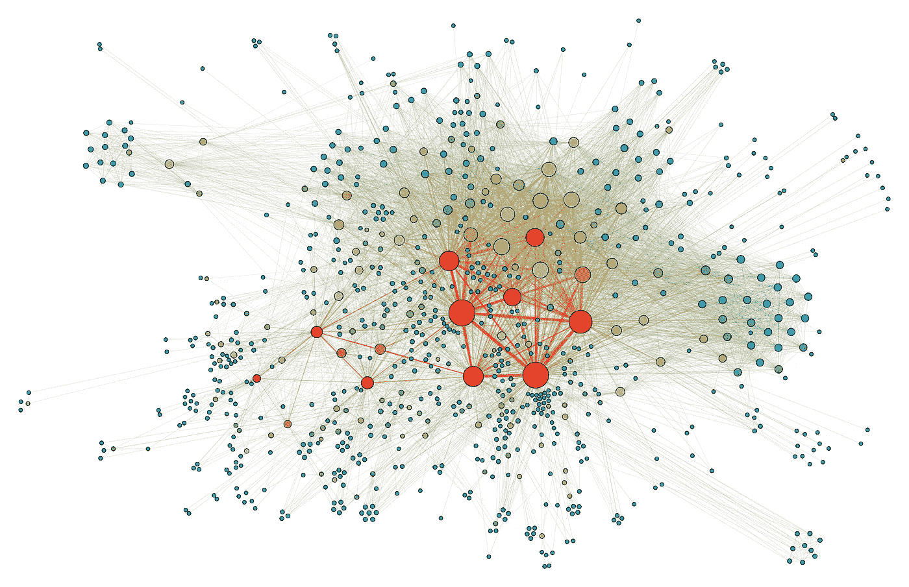

Martin Grandjean 的图表数据库插图。 [CC BY-SA 4.0](https://creativecommons.org/licenses/by-sa/4.0/deed.en)

## 图形数据库

图形数据库(GDB)是一种使用图形结构进行语义查询的数据库，具有节点、边和属性来表示和存储数据。使用 GDB，我可以构建所有维基百科页面之间的关系。在 GDB 中，两个节点之间的关系可以表示如下:

```
(n:SourceNode)-[RELATION]->(m:TargetNode)
```

例如，在瑞典的维基百科页面上，如下所示，与其他超链接的关系可以被构造为:

```
(n:Sweden)-[HyperLink]->(m:Nordic country) 
(n:Sweden)-[HyperLink]->(m:Finland)
```

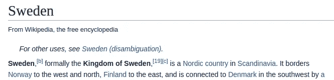

从[瑞典](https://en.wikipedia.org/wiki/Sweden)的维基百科页面截取文本。

这种关系在 GDB 中显示为节点和边:

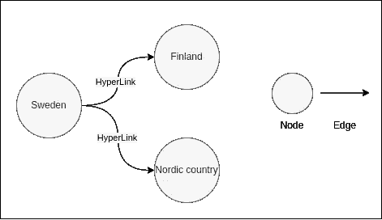

建立关系的节点和边。作者图片

## 资料组

在我尝试解决这个问题之前，我需要维基百科中的所有关系。我将通过添加一个仅使用英文维基百科页面的约束来减少数据。斯坦福大学有一个名为“[英语维基百科超链接网络”的数据集，作者是 Jure Leskovec。](https://snap.stanford.edu/data/enwiki-2013.html)该数据集描述了 2013 年以来所有英文维基百科页面之间的关系。该文件夹包括两个文件。一辆 csv。包含所有节点 ID 及其名称的文件。另一个文件是 txt。描述不同维基百科页面之间关系的文件。以下是来自 relation.txt 文件的示例:

```
1 2435 35
2 354 87
3 44 91120
4 492 5
5 …
```

每行描述一个关系。第一个数字是确切关系的 ID。第二个数字是源页面，第三个数字是目标页面。例如，如果您位于维基百科第 2435 页，该页上有一个超链接指向维基百科第 35 页。我想这些数字是用来减少。txt 文件，而不是使用全名。该文件夹还包括一个文件，其中包含所有数字及其相应的维基百科页面名称。例如，ID 号为 35 的节点是“瑞典”的维基百科页面。

要将文件导入 Neo4j 图形数据库，我想使用 Neo4j 管理导入功能。[当数据集“巨大”时，建议](https://neo4j.com/docs/operations-manual/current/tutorial/neo4j-admin-import/)使用此导入功能，在这种情况下，数据集包括超过 400 万个节点(维基百科页面)和 1.01 亿条边(关系/超链接)。

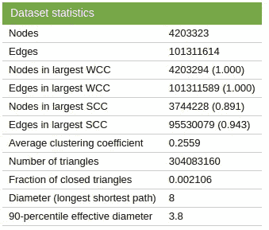

图表来自[斯坦福大学，作者 Jure Leskovec](https://snap.stanford.edu/data/enwiki-2013.html) 。

为了将文件导入 Neo4j 数据库，我首先将文件从。发短信给。Python 中的 csv。我的最终计划是使用图表算法，利用这些关系找到从一个页面到另一个页面的最短路径。为了找到最短路径，算法需要知道节点之间的距离。在这种情况下，所有节点到其邻居的距离都相同。为了在数据集中包含距离，我在。距离等于 1 的 csv 文件。然后，我清理了数据集并添加了适当的标题，以利用 Neo4j 管理导入功能。下图显示了关系和节点的示例。csv 文件。

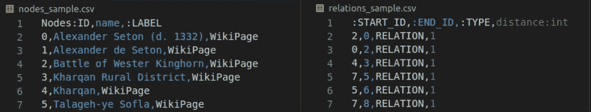

来自节点和关系的样本数据。csv 文件。

为了将数据上传到 Neo4j GDB，我使用了 Neo4j 管理导入功能，命令如下:

```
bin/neo4j-admin import --database=neo4j --nodes=import/nodes.csv --relationships=import/relations.csv --multiline-fields=true
```

使用此功能之前，请确保数据库为空。

导入完成后，我可以在 Neo4j 桌面中可视化与 Neo4j 浏览器的关系。第一，我想知道有多少维基百科页面上有一个“瑞典”的超链接。

```
match(n:WikiPage{name:'Sweden'})-[r:RELATION]->(m) return count(m)count(m) : 840
```

这个结果表明，840 个维基百科页面在维基百科页面上有一个“瑞典”的超链接。我用这个查询可视化了其中的 20 个。

```
match(n:WikiPage{name:'Sweden'})-[r:RELATION]->(m) return n,m limit 21
```

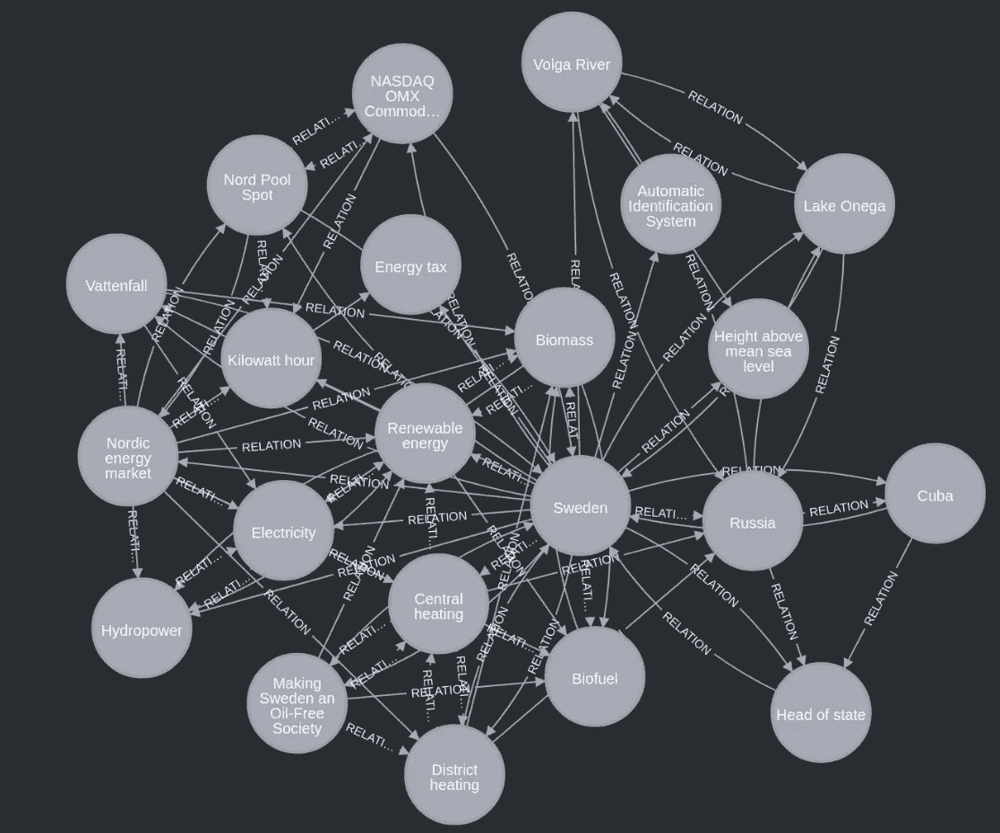

一些与“瑞典”维基百科页面有关系的维基百科页面。

结果表明，许多与“瑞典”的最初关系也是相互关联的。例如，可以从维基百科页面“瑞典”直接转到“国家元首”，距离=1，或者转到“俄罗斯”或“古巴”，距离= 2。这一点我们可以从维基百科“瑞典”的原始页面中得到证实:

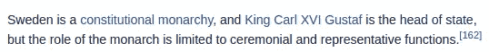

从[维基百科“瑞典”页面复制文字。](https://en.wikipedia.org/wiki/Sweden)

在这种情况下，最短路径算法将选择路径“瑞典”->“国家元首”，因为这条路径的距离最短。

## 寻找最短路径

现在，我终于可以使用图算法来找到这个图中两个节点之间的最短路径。首先，我需要从 Neo4j 桌面中的插件安装图形数据科学库。为了使用 GDS 库中包含的算法，[要求图形被投影](https://neo4j.com/docs/graph-data-science/current/management-ops/projections/graph-project/)。投影一个图形是通过下面的查询完成的。关于投影图的更多细节可以在[这里](https://neo4j.com/docs/graph-data-science/current/management-ops/projections/graph-project/)找到:

```
CALL gds.graph.project('myGraph','WikiPage','RELATION',{relationshipProperties:'distance'})
```

为了找到图中的最短路径，我选择使用 Dijkstra 的算法。

> Dijkstra 算法是一种用于寻找图中节点之间的最短路径的算法，该图可以表示例如道路网络。它是由计算机科学家 Edsger W. Dijkstra 在 1956 年构思的，三年后发表。[【1】](https://en.wikipedia.org/wiki/Dijkstra's_algorithm)

我不会详细解释 Dijstra 的算法是如何工作的，但下面的动画显示了主要的算法。在这里可以找到一个很好的解释[。](https://www.geeksforgeeks.org/dijkstras-shortest-path-algorithm-greedy-algo-7/)

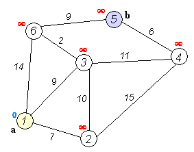

Dijkstra 算法的动画由 [Ibmua 制作。在公共领域发布。](https://commons.wikimedia.org/wiki/File:Dijkstra_Animation.gif)

现在可以用下面的查询运行 Dijkstra 的算法了。为了测试算法，我想找到从“瑞典”到“德拉库拉”的最短路径。

```
MATCH (source:WikiPage {name: "Sweden"}), (target:WikiPage {name: "Dracula"})CALL gds.shortestPath.dijkstra.stream('myGraph', { sourceNode: source, targetNode: target, relationshipWeightProperty: 'distance'})YIELD index, sourceNode, targetNode, totalCost, nodeIds, costs, pathRETURN
index, gds.util.asNode(sourceNode).name AS sourceNodeName, gds.util.asNode(targetNode).name AS targetNodeName, totalCost, [nodeId IN nodeIds | gds.util.asNode(nodeId).name] AS nodeNames, costs, nodes(path) as pathORDER BY index--------------------------------------------------------------------Result:index: 0
sourceNodeName: “Sweden”
targetNodeName: “Dracula”
totalCost: 3.0
nodeNames: ["Sweden", "Industrial Revolution", "Lord Byron", "Dracula"]
costs: [0.0, 1.0, 2.0, 3.0]
```

结果显示，从“瑞典”到“德拉库拉”至少需要三个链接。该路径可以在下图所示的图表中可视化:


从维基百科页面“瑞典”到“德古拉”的最短路径。

通过使用 Wikipedia.com，我可以确认这条路径存在，并且我相信实现的 Dijkstra 算法已经找到了最短的路径。

在[thewikigame.com](https://www.thewikigame.com/group)不同的人正在竞争从源页面中寻找目标页面。每 120 秒就会有一个新的目标和源维基百科页面被公布。谁能最快地从源页面到达目标页面，谁就赢得了比赛。我不会用我的代码挑战这些玩家，因为那会被认为是作弊。我想用玩游戏的结果来比较参赛者与 Dijkstra 算法找到的最优解的接近程度。为了将我的算法与最好的 wikiracers 进行比较，我编写了一个简短的 Python 代码，它从上一次运行中获取源页面和目标页面，并使用 Dijkstra 算法。结果如下图所示。


显示从 thewikigame.com 出发的最快路径与 Dijkstra 算法找到的最短路径相比的数据帧。

如上表所示，DijkstrasPath 总是短于或等于 fastestPath，这是一个人在 thewikigame.com 上找到的最快路径。然而，令人印象深刻的是，有些人实际上发现了一条长度与 DijkstrasPath 相等的路径。记住，这个问题可能有很多不同的最短路径，从而导致多个解。thewikigame.com 上的玩家通常用 30-90 秒找到最快的路径，而 Dijkstra 的算法用 1-2 秒。如果我们看看从“拉什·林堡”到“动物”的路径，Wikirace 上最快的路径长度是 6，Dijkstra 找到了一条长度为 4 的更短的路径，如下图所示。

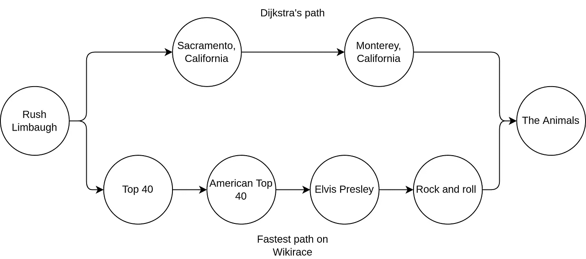

比较由 Dijkstra 算法找到的路径和 Wikirace 中的竞赛获胜者。

由此得出结论，有可能使用图算法，例如 Dijkstra 算法，找到两个维基百科页面之间的最短路径，并有可能赢得维基百科。这个项目中使用的数据集的一个问题是数据集来自 2013 年。过时的数据集可能会导致问题，因为 2013 年的一些路径现在已经不存在了。自 2013 年以来，还实施了某些新路径。

# Neo4j GDS 中的其他图算法

当图表被投影时，我想对维基百科数据集做更多的分析。比如:哪些维基百科页面被其他维基百科页面引用最多？我不是维基百科专家，但我猜有很多关系的维基百科网站将是一个开始比赛的好地方。

Neo4j 的算法叫做[中心性算法](https://neo4j.com/developer/graph-data-science/centrality-graph-algorithms/)。

> 中心性算法用于确定网络中不同节点的重要性。[【2】](https://neo4j.com/developer/graph-data-science/centrality-graph-algorithms/)

一种特殊的中心算法，[页面排名](https://neo4j.com/docs/graph-data-science/current/algorithms/page-rank/)，可以帮助我找到最重要的节点，或者维基百科网站。

> PageRank 算法根据传入关系的数量和相应源节点的重要性来衡量图中每个节点的重要性。[【3】](https://neo4j.com/docs/graph-data-science/current/algorithms/page-rank/)

我可以用这个查询运行 PageRank 算法:

```
CALL gds.pageRank.stream('myGraph')
YIELD nodeId, score
RETURN gds.util.asNode(nodeId).name AS name, scoreORDER BY score DESC, name ASC
```

结果很有趣。下图显示“美国”是数据集中最重要的节点。其他重要的节点也是国家。根据这一分析，我建议在维基百科开始时选择一个主要的国家来尝试进入维基百科页面。更有调查显示，“美国”在维基百科页面上有 938 个超链接，其他维基百科页面有 431705 个超链接指向“美国”的维基百科页面。


用 PageRank 算法发现维基百科图数据库中最重要的节点

我还可以通过对结果进行升序排序来探索不太重要的节点。结果显示许多节点具有同样低的分数。通过观察图中的节点，我可以看到它们只有一个关系。得分如此低的许多节点或维基百科页面今天都进行了更新，比 2013 年的数据集有更多的关系。


用 PageRank 算法发现维基百科图数据库中的次要节点

## 进一步分析

对随机维基百科页面的进一步分析可以在下面的柱状图中看到。该图显示了引用随机页面的超链接和引用随机页面中其他维基百科页面的超链接之间的差异。

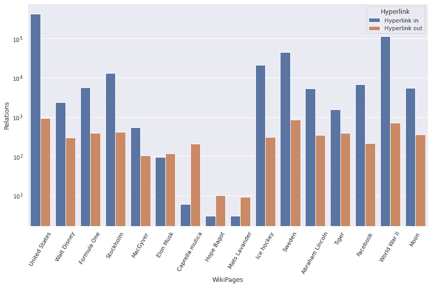

比较随机维基百科页面的超链接引用。

例如，“Elon Musk”的维基百科页面有大约 10 个指向其他维基百科页面的超链接(出)，并且几乎与指向“Elon Musk”维基百科页面的超链接数量相等(入)。乍一看，“MacGyver”在维基百科中的引用比“Elon Musk”多，这很奇怪。但如前所述，数据集来自 2013 年。如果我在 Google Trends 中进一步调查，结果显示“MacGyver”的 Google 搜索点击量大于“Elon Musk”。但如图所示，2010 年后“埃隆·马斯克”的趋势是上升的。

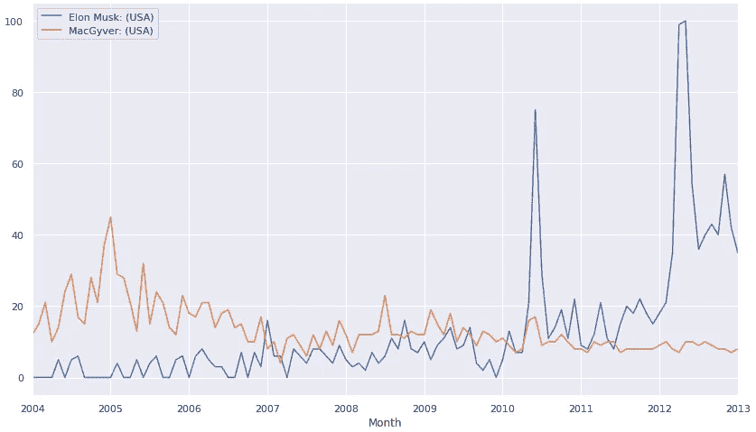

埃隆马斯克和麦吉弗在美国的谷歌趋势。

## 结论

这个项目的目标是应用某种算法在维基百科中找到最佳路径。在这篇文章中，我展示了使用 Neo4j GDB、图形数据科学和 Dijkstra 的算法以及斯坦福大学维基百科关系数据集来找到最佳路径是可能的。然后，我将一些真实的维基百科与 Dijkstra 算法找到的最佳路径进行了比较。尽管 Dijkstra 的算法几乎总能找到最短的路径，但很少有 wikiraces 具有相同的路径长度。有了结果，我可以断定这个项目是成功的，我找到了最优解。如前所述，数据集来自 2013 年，这个项目只能保证找到 2013 年维基百科页面的最佳路径。

最后，我研究了其他一些 GDS 算法，并对结果做了进一步的分析。这个项目仅用于教育目的，并不打算在游戏中使用，如维基百科。

## 参考

[【1】](https://en.wikipedia.org/wiki/Dijkstra's_algorithm)—迪杰斯特拉算法，维基百科
[【2】](https://neo4j.com/developer/graph-data-science/centrality-graph-algorithms/)—中心性算法，Neo4j
[【3】](https://neo4j.com/docs/graph-data-science/current/algorithms/page-rank/)—page rank，Neo4j

[*领英儿科*](https://www.linkedin.com/in/peder-ward-158b87b4/)