# 精美的插图:从 RNN 到变形金刚的 NLP 模型

> 原文：<https://towardsdatascience.com/beautifully-illustrated-nlp-models-from-rnn-to-transformer-80d69faf2109>

## 深度学习

## 用工作图解释他们复杂的数学公式


鲁拜图·阿扎德在 [Unsplash](https://unsplash.com?utm_source=medium&utm_medium=referral) 上的照片

```
**Table of Contents****·** [**Recurrent Neural Networks (RNN)**](#6cf1)
  ∘ [Vanilla RNN](#8dde)
  ∘ [Long Short-term Memory (LSTM)](#ed57)
  ∘ [Gated Recurrent Unit (GRU)](#1247)**·** [**RNN Architectures**](#866f)**·** [**Attention**](#b5e5)
  ∘ [Seq2seq with Attention](#e999)
  ∘ [Self-attention](#7efc)
  ∘ [Multi-head Attention](#2fbd)**·** [**Transformer**](#8704)
  ∘ [Step 1\. Adding Positional Encoding to Word Embeddings](#5dd0)
  ∘ [Step 2\. Encoder: Multi-head Attention and Feed Forward](#1e51)
  ∘ [Step 3\. Decoder: (Masked) Multi-head Attention and Feed Forward](#b51d)
  ∘ [Step 4\. Classifier](#7edd)**·** [**Wrapping Up**](#f7d9)
```

N 自然语言处理(NLP)是深度学习中一个具有挑战性的问题，因为计算机不理解如何处理原始单词。为了使用计算机的能力，我们需要在将单词输入模型之前将其转换为向量。由此产生的向量被称为 [**单词嵌入**](https://levelup.gitconnected.com/glove-and-fasttext-clearly-explained-extracting-features-from-text-data-1d227ab017b2) 。

这些嵌入可以用于解决期望的任务，例如情感分类、文本生成、命名实体识别或机器翻译。它们以一种聪明的方式被处理，使得模型对于某些任务的性能变得与人的能力不相上下。

那么，我听到你问，如何处理单词嵌入？如何为这种数据建立一个自然的模型？

让我们首先试着熟悉我们将要使用的符号。

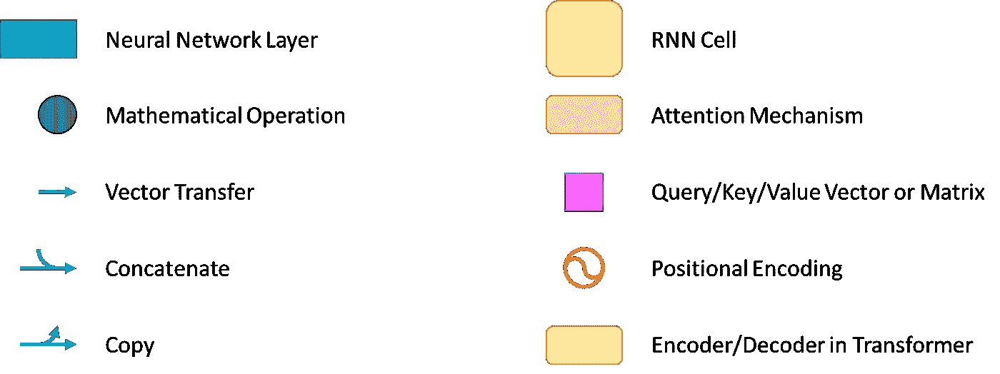

我们将在这个故事中使用的符号|图片作者[作者](http://dwiuzila.medium.com/membership)

# 递归神经网络(RNN)

当你读这句话的时候，你并不是从零开始思考每一个新单词。你保持以前单词的信息来理解你当前正在看的单词。基于这种行为，递归神经网络(RNN)诞生了。

在这一部分的故事中，我们将重点介绍 RNN 细胞及其改进。稍后，我们将看到细胞是如何排列在一起的。

## 香草 RNN

传统的 RNN 由重复的单元组成，每个单元依次接收嵌入 *xₜ* 的输入，并通过隐藏状态 *hₜ₋₁* 记住过去的序列。隐藏状态被更新到 *hₜ* 并被转发到下一个单元格，或者——取决于任务——可用于输出预测。下图显示了 RNN 细胞的内部工作原理。

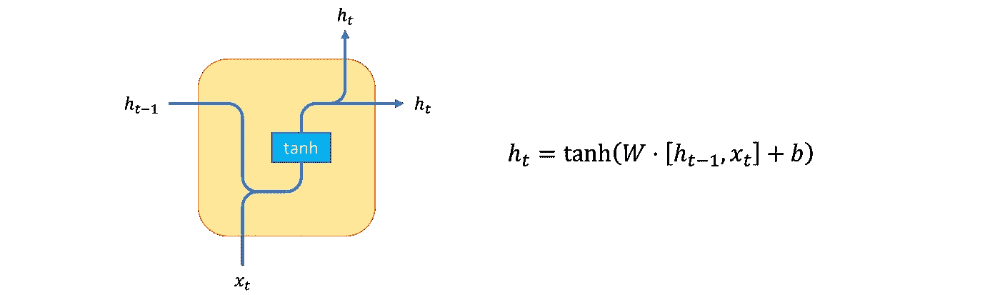

香草 RNN 细胞|图片由[作者](http://dwiuzila.medium.com/membership)

**优势:**

*   以有意义的方式说明订单和先前的输入。

**缺点:**

*   每一步的预测都依赖于之前的预测，因此很难将 RNN 运算并行化。
*   处理长序列会产生爆炸或消失的梯度。

## 长短期记忆(LSTM)

减轻爆炸或消失梯度问题的一种方法是使用门控 rnn，其被设计成选择性地保留信息，并且能够学习长期依赖性。有两种受欢迎的门控 RNNs:长短期记忆(LSTM)和门控循环单位(GRU)。

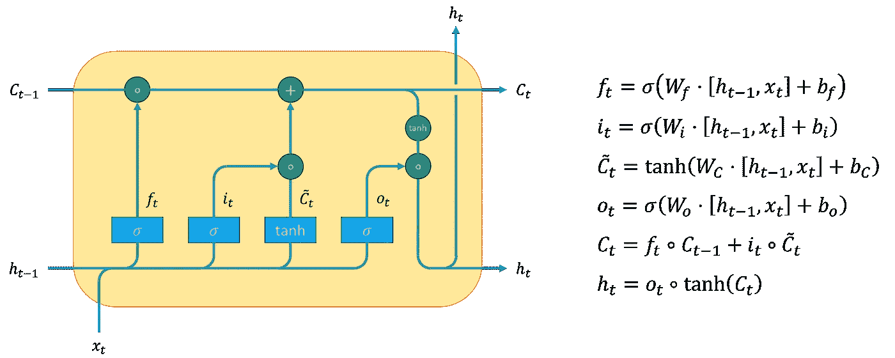

LSTM 手机|图片由[作者](http://dwiuzila.medium.com/membership)

为了避免长期依赖问题，LSTM 配备了一个单元状态 *Cₜ* ，这有点像高速公路，所以信息很容易不加修改地通过它。

为了有选择地保留信息，LSTM 也有三个关口:

1.  忘记门→查看 *hₜ₋₁* 和 *xₜ* ，并输出由 0 和 1 之间的数字组成的向量 *fₜ* ，该向量告诉我们要从单元格状态 *Cₜ₋₁* 中丢弃什么信息。
2.  输入门→类似于遗忘门，但这一次输出 *iₜ* 用于根据虚拟单元状态 *ćₜ* 决定我们要在单元状态中存储什么新信息。
3.  输出门→类似于遗忘门，但输出 *oₜ* 用于过滤更新的单元状态 *Cₜ* 成为新的隐藏状态 *hₜ* 。

## 门控循环单元(GRU)

LSTM 相当复杂。GRU 提供了与 LSTM 相似的性能，但复杂性更低(重量更轻)。它合并了单元格状态和隐藏状态。它还将遗忘门和输入门合并成一个“更新门”。

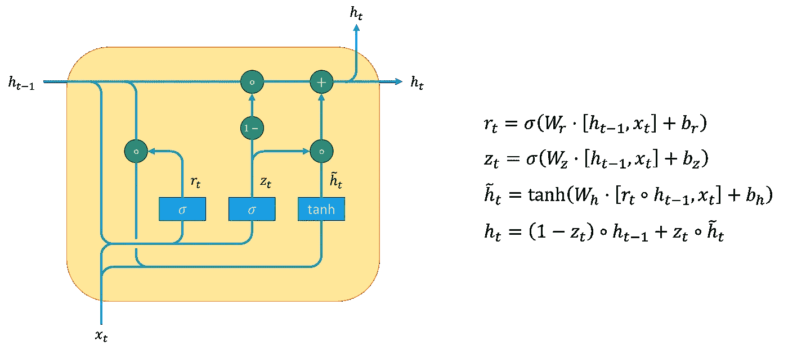

GRU 手机|图片由[作者](http://dwiuzila.medium.com/membership)

为了进一步解释，GRU 有两个大门:

1.  reset gate →查看 *hₜ₋₁* 和 *xₜ* ，输出一个由 0 和 1 之间的数字组成的矢量 *rₜ* ，该矢量决定需要忽略多少过去的信息 *hₜ₋₁* 。
2.  更新门→根据 *rₜ* 决定我们要在新的隐藏状态 *hₜ* 中存储什么信息或者丢弃什么信息。

# RNN 建筑

现在你已经理解了 RNN 细胞是如何工作的，你可以按如下顺序链接它的拷贝。这里， *yₜ* 是预测的输出概率，表示为

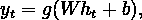

对于一些重量 *W* ，偏置 *b* ，以及激活功能 *g* 。如您所见，架构和激活功能取决于任务。

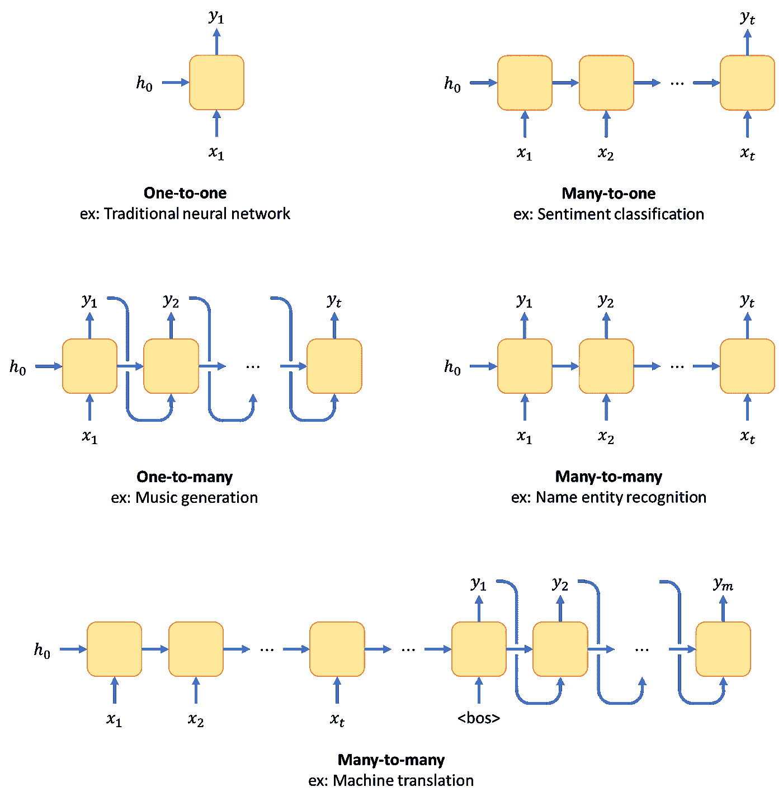

RNN 建筑取决于任务|图片作者[作者](http://dwiuzila.medium.com/membership)

特别是，上面最后一个机器翻译的例子是我们所说的 **seq2seq** 模型，其中输入序列 *x₁* 、 *x₂* 、…、 *xₜ* 被翻译成输出序列 *y₁* 、 *y₂* 、…、 *yₘ* 。第一组 *t* RNNs 称为**编码器**，最后一组 *m* RNNs 称为**解码器**。

RNN 单元也可以翻转或垂直堆叠，如下所示。这种架构通常只由两到三层组成。这可以提高模型性能，但代价是计算量更大。

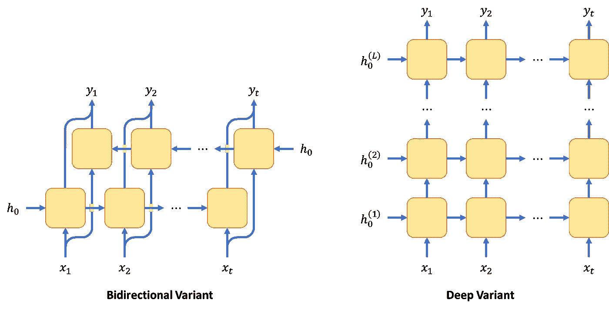

RNN 变体，这样的架构通常只由两三层组成|图片作者[作者](http://dwiuzila.medium.com/membership)

# 注意力

Seq2seq 被限制为使用编码器最末端的表示来被解码器解释。解码器只看到来自最后一个编码器 RNN 单元的输入序列的一个表示。然而，输入序列的不同部分在输出序列的每个生成步骤中可能更有用。这就是注意力的概念。

**优点:**

*   考虑适当的编码表示，而不管输入标记的位置。

**缺点:**

*   另一个计算步骤包括学习权重。

## Seq2seq 注意

每个解码器令牌将查看每个编码器令牌，并通过其隐藏状态来决定哪些令牌需要更多关注。

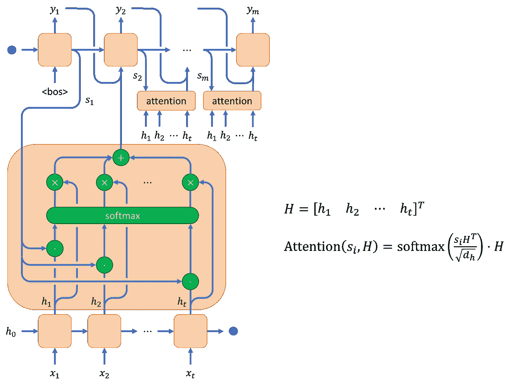

seq2seq 工作图有关注|图片作者[作者](http://dwiuzila.medium.com/membership)

在 seq2seq 中融入注意力有三个步骤:

1.  从一对解码器和编码器隐藏状态( *sᵢ* 、 *hⱼ* )计算标量**注意力分数**，其代表编码器令牌 *j* 与解码器令牌 *i* 的“相关性”。
2.  所有注意力分数通过 softmax 传递，以产生**注意力权重**，其形成解码器和编码器令牌对的相关性的概率分布。
3.  计算具有注意力权重的编码器隐藏状态的**加权和**,并将其馈入下一个解码器单元。

在我们的例子中，得分函数是缩放的点积

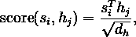

其中 *dₕ* 为 *hⱼ* (和 *sᵢ* )的尺寸。

## 自我关注

让我们完全抛弃 seq2seq，只关注注意力。一种流行的关注是自我关注，其中不是从解码器到编码器令牌寻找相关性，而是从一组令牌中的每个令牌到同一组中的所有其他令牌寻找相关性。

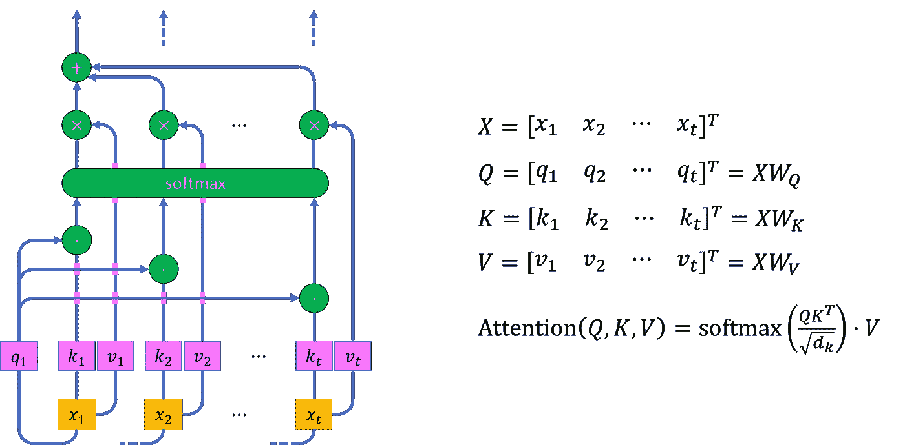

自我关注|图片工作图[作者](http://dwiuzila.medium.com/membership)

自我注意使用注意函数创建基于输入标记对之间的相似性的加权表示，这提供了知道其元素之间的关系的输入序列的丰富表示。

普通注意力和自我注意力有三个主要区别:

1.  由于自我关注中没有解码器令牌，一个“查询”向量*qᵢ*——与输入嵌入 *xᵢ* 线性相关——取而代之。
2.  关注度得分是从这一对( *qᵢ* 、 *kⱼ* )中计算出来的，其中 *kⱼ* 是一个“关键”向量，与 *qᵢ* 的维度相同，也与 *xⱼ* 线性相关。
3.  自我关注用注意力权重乘以一个新的“价值”向量 *vⱼ* ，而不是像普通注意力一样，再用注意力权重乘以 *kⱼ* 。请注意， *vⱼ* 的尺寸可能与 *kⱼ* 的尺寸不同，并且再次与 *xⱼ* 线性相关。

## 多头注意力

注意力可以并行运行几次，产生我们所说的多头注意力。独立的注意力输出然后被连接并线性转换成期望的维度。

多个注意头背后的动机是它们允许不同地注意输入序列的部分(例如，长期依赖性对短期依赖性)，因此它可以提高单一注意的性能。

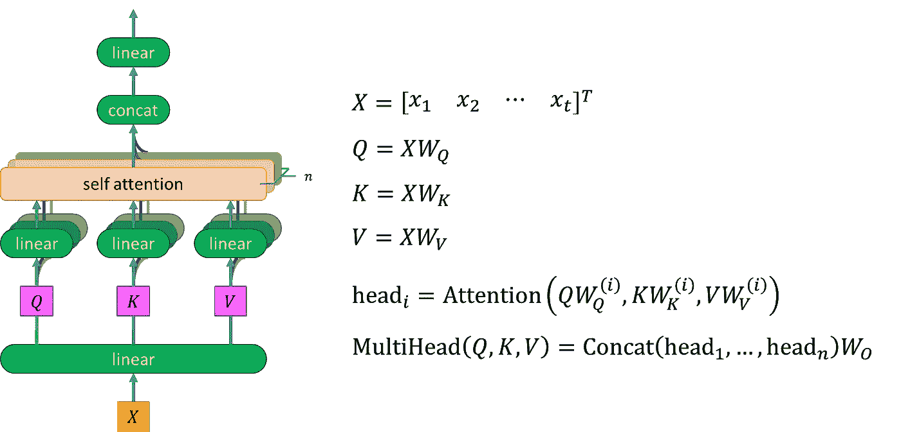

n 种注意力机制的多头注意力工作图|图片由[作者](http://dwiuzila.medium.com/membership)

由于在故事的下一部分事情会变得更加疯狂，在上面的图表中，我们对一切进行了矢量化，以便多头注意力的输入和输出由一个带单箭头的矩阵表示。

自我注意也可以与任何类型的注意交换，或者通过任何修改来实现，只要其变量的维度是适当的。

# 变压器

给定输入嵌入 *X* 和输出嵌入 *Y* ，一般来说，使用一个接一个堆叠的 *N 个*编码器连接到一个接一个堆叠的 *N 个*解码器来构建变压器。 [*没有递归或卷积，你所需要的是*](https://proceedings.neurips.cc/paper/2017/file/3f5ee243547dee91fbd053c1c4a845aa-Paper.pdf) 中的每个编码器和解码器。


具有 N 个编码器和解码器的变压器的工作图|图片由[作者](http://dwiuzila.medium.com/membership)提供

**优点:**

*   输入记号的更好表示，其中记号表示基于使用自我注意的特定相邻记号。
*   (并行)处理所有输入令牌，而不是受到顺序处理(RNNs)的内存问题的限制。

**缺点:**

*   计算密集型。
*   需要大量数据(使用预训练模型缓解)。

让我们来看看变压器是如何工作的！

## 第一步。向单词嵌入添加位置编码

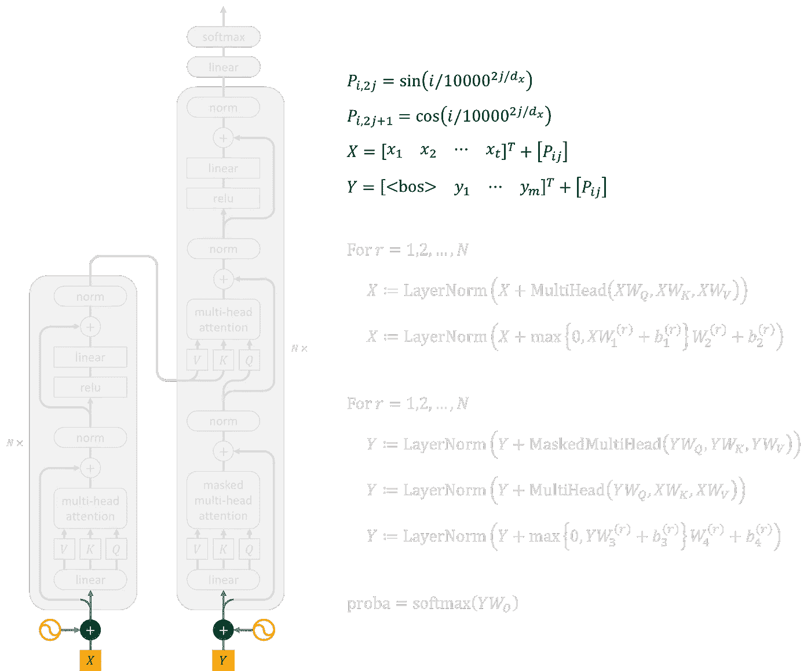

向单词嵌入添加位置编码|图片作者[作者](http://dwiuzila.medium.com/membership)

由于变换器不包含递归和卷积，为了使模型利用序列的顺序，我们必须注入一些关于序列中记号的相对或绝对位置的信息。

因此，我们必须通过“位置编码”的方式让模型明确地知道记号的位置:

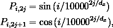

其中 *i* 是令牌的位置(令牌#0、令牌#1 等等)， *j* 是编码的列号， *dₓ* 是编码的维数(与输入嵌入的维数 *X* 相同)。

对于编码维度为 512 的前 2048 个标记，您可以将位置编码矩阵 *P* 可视化如下。


编码维度为 512 的前 2048 个标记的位置编码|图片作者[作者](http://dwiuzila.medium.com/membership)

在 seq2seq 模型中，输出嵌入 *Y* 右移，第一个标记是“句首”< bos >。位置编码然后被添加到 *X* 和 *Y* ，然后分别被馈送到第一编码器和解码器。

## 第二步。编码器:多头关注和前馈

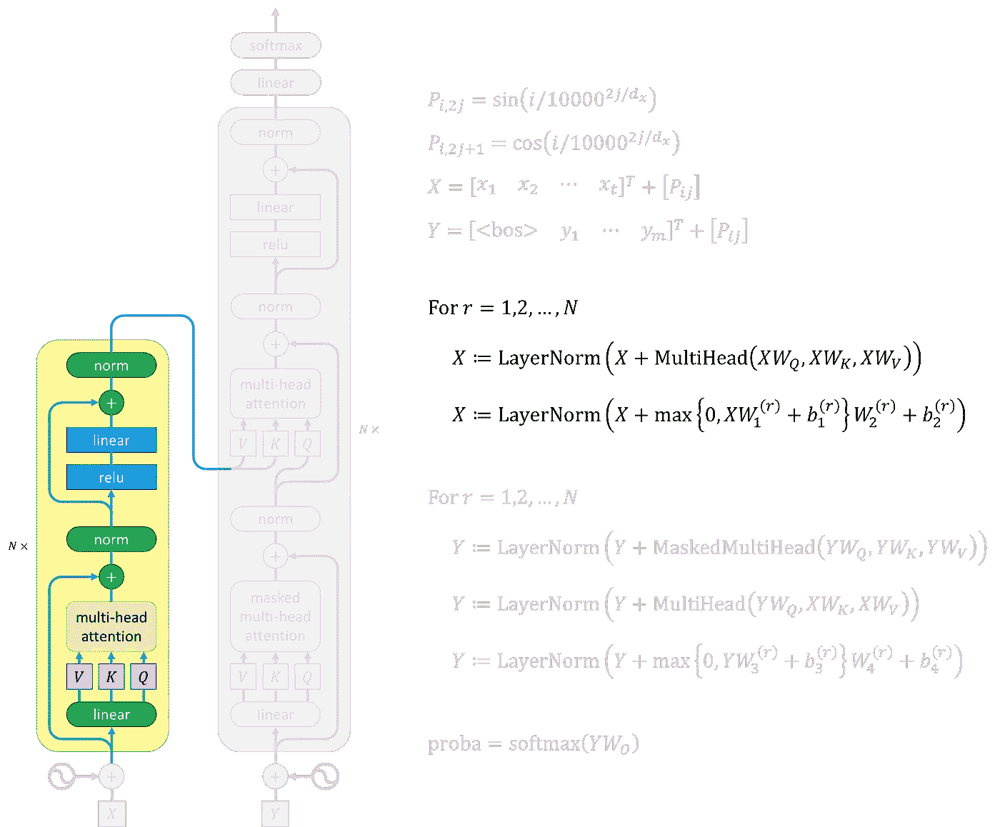

变形金刚中的编码器|图片作者[作者](http://dwiuzila.medium.com/membership)

编码器由两个模块组成:

1.  输入的嵌入*X*——加上位置编码*P*——送入**多头关注**。剩余连接被用于多头注意力，这意味着我们将单词嵌入(或前一编码器的输出)加到注意力的输出上。然后将结果归一化。
2.  归一化后，信息通过一个**前馈**神经网络，该网络由两层组成，分别具有 ReLU 和线性激活函数。同样，我们在这个块上使用剩余连接和标准化。

> 要了解更多关于残差连接和图层规范化的信息，您可以进入这个故事:

[](/5-most-well-known-cnn-architectures-visualized-af76f1f0065e) [## 5 种流行的 CNN 架构得到清晰的解释和可视化

### 为什么盗梦空间看起来像三叉戟？！

towardsdatascience.com](/5-most-well-known-cnn-architectures-visualized-af76f1f0065e) 

编码器内部的计算到此结束。输出可以被馈送到另一个编码器或最后一个编码器之后的每个解码器的特定部分。

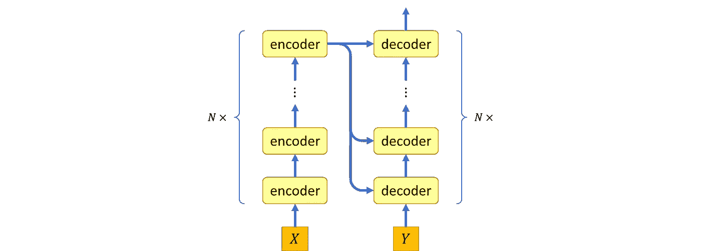

变形金刚编码器和解码器|图片由[作者](http://dwiuzila.medium.com/membership)提供

## 第三步。解码器:(屏蔽)多头注意，前馈

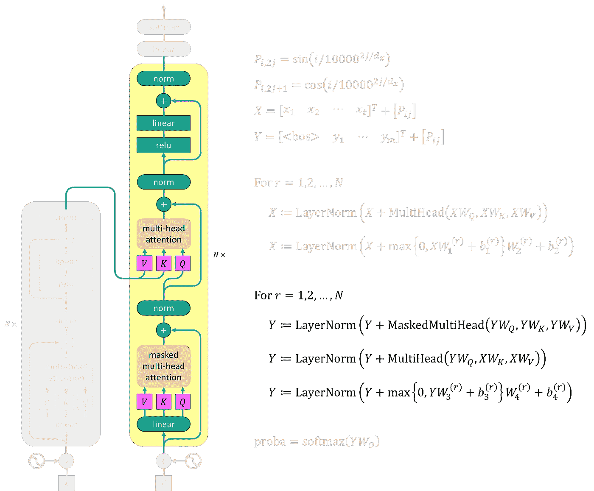

《变形金刚》中的解码器|图片作者[作者](http://dwiuzila.medium.com/membership)

解码器由三个模块组成:

1.  输出嵌入*Y*——右移加位置编码 *P* 后——送入**多头关注**。注意，我们屏蔽掉(设置为 softmax 输入中与后续位置连接相对应的所有值。
2.  然后信息通过另一个**多头注意力**——现在没有屏蔽——作为查询向量。键向量和值向量来自最后一个编码器的输出。这允许解码器中的每个位置关注输入序列中的所有位置。
3.  结果通过一个**前馈**神经网络传递，该网络具有类似编码器的激活功能。

注意，所有解码器块也采用残差连接和层归一化。结合输出嵌入偏移一个位置的事实，屏蔽确保位置 *i* 的预测可以仅依赖于小于 *i* 的位置处的已知输出。

这就是解码器内部计算的结束。输出可以被馈送到另一个解码器或最后一个解码器之后的分类器。

## 第四步。分类者

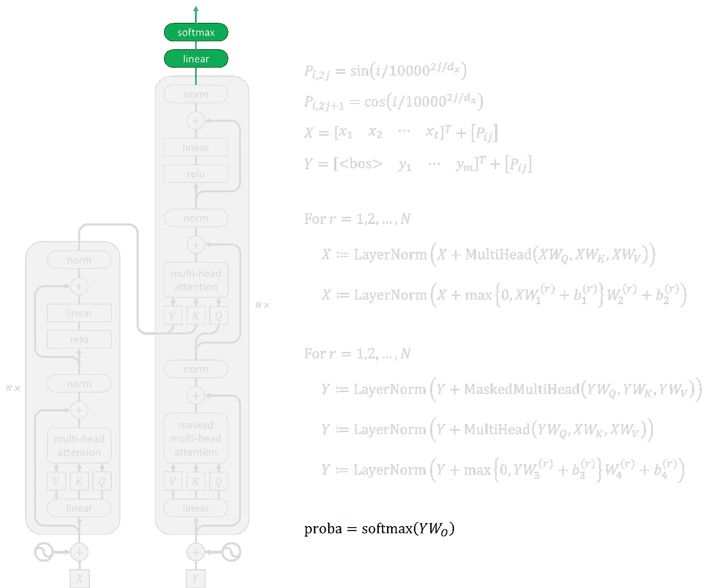

变形金刚|图片中的分类器作者[作者](http://dwiuzila.medium.com/membership)

这是最后一步，非常简单。我们使用学习线性变换和 softmax 将解码器输出转换为预测的下一个令牌概率。

《变形金刚》在自然语言处理方面取得了巨大的成功。许多预先训练好的模型，如 GPT-2、GPT-3、BERT、XLNet 和 RoBERTa，展示了 transformers 执行各种 NLP 相关任务的能力，如机器翻译、文档摘要、文档生成、命名实体识别和视频理解。

变压器还被应用于[图像处理](https://arxiv.org/pdf/2010.11929v2.pdf)，与卷积神经网络相比，其结果颇具竞争力。

# 包扎


照片由[杰瑞米·托马斯](https://unsplash.com/@jeremythomasphoto?utm_source=medium&utm_medium=referral)在 [Unsplash](https://unsplash.com?utm_source=medium&utm_medium=referral) 上拍摄

NLP 相关的任务很难。有许多方法可以解决这些问题。最直观的一个是 RNN，尽管它的操作很难并行化，并且当暴露于长序列时，它遭受爆炸或消失梯度。别担心，LSTM 和 GRU 会来救你的！

排列 RNN 细胞的方法有很多种，其中一种叫做 seq2seq。在 seq2seq 中，解码器只看到来自最后一个编码器 RNN 单元的输入序列的一个表示。这激发了注意力的使用，输入序列的不同部分可以在输出序列的每个生成步骤中得到不同的注意。

随着自我关注的发展，RNN 细胞可以被完全抛弃。称为多头注意力的自我注意力束以及前馈神经网络形成了转换器，构建了最先进的 NLP 模型，如 GPT-3、BERT 等，以出色的性能处理许多 NLP 任务。


🔥你好！如果你喜欢这个故事，想支持我这个作家，可以考虑 [***成为会员***](https://dwiuzila.medium.com/membership) *。每月只需 5 美元，你就可以无限制地阅读媒体上的所有报道。如果你注册使用我的链接，我会赚一小笔佣金。*

🔖*想了解更多关于经典机器学习模型如何工作以及如何优化其参数的信息？或者 MLOps 大型项目的例子？有史以来最优秀的文章呢？继续阅读:*


[艾伯斯·乌兹拉](https://dwiuzila.medium.com/?source=post_page-----80d69faf2109--------------------------------)

## 从零开始的机器学习

[View list](https://dwiuzila.medium.com/list/machine-learning-from-scratch-b35db8650093?source=post_page-----80d69faf2109--------------------------------)8 stories

[艾伯斯·乌兹拉](https://dwiuzila.medium.com/?source=post_page-----80d69faf2109--------------------------------)

## 高级优化方法

[View list](https://dwiuzila.medium.com/list/advanced-optimization-methods-26e264a361e4?source=post_page-----80d69faf2109--------------------------------)7 stories

[艾伯斯·乌兹拉](https://dwiuzila.medium.com/?source=post_page-----80d69faf2109--------------------------------)

## MLOps 大型项目

[View list](https://dwiuzila.medium.com/list/mlops-megaproject-6a3bf86e45e4?source=post_page-----80d69faf2109--------------------------------)6 stories

[艾伯斯·乌兹拉](https://dwiuzila.medium.com/?source=post_page-----80d69faf2109--------------------------------)

## 我最好的故事

[View list](https://dwiuzila.medium.com/list/my-best-stories-d8243ae80aa0?source=post_page-----80d69faf2109--------------------------------)24 stories

艾伯斯·乌兹拉

## R 中的数据科学

[View list](https://dwiuzila.medium.com/list/data-science-in-r-0a8179814b50?source=post_page-----80d69faf2109--------------------------------)7 stories

[1]阿希什·瓦斯瓦尼、诺姆·沙泽尔、尼基·帕尔马、雅各布·乌兹科雷特、利永·琼斯、艾丹·戈麦斯、卢卡兹·凯泽、伊利亚·波洛舒欣(2017): *注意力是你所需要的全部*。NeurIPS 2017。[ [pdf](https://proceedings.neurips.cc/paper/2017/file/3f5ee243547dee91fbd053c1c4a845aa-Paper.pdf)

[2]克里斯托弗·奥拉(2015): *了解 LSTM 网络*。[ [网址](https://colah.github.io/posts/2015-08-Understanding-LSTMs/)

[3]悟空·莫汉达斯(2022): *粉底——用 ML 制作*。[ [网址](https://madewithml.com/courses/foundations/)

[4]杰伊·阿拉玛(2018): *图解变形金刚*。[ [网址](https://jalammar.github.io/illustrated-transformer/)

[5]莱娜·沃伊塔(2022): *Seq2seq 及注意事项*。[ [网址](https://lena-voita.github.io/nlp_course/seq2seq_and_attention.html)