# 贝克德尔测试:比较电影中的女性表现指标

> 原文：<https://towardsdatascience.com/bechdel-test-comparing-female-representation-metrics-in-movies-6cbade15010f>

## [变更数据](https://towardsdatascience.com/tagged/data-for-change)

# 贝克德尔测试:比较电影中的女性表现指标

## 使用 API 收集数据，制作动画图形，并使用 Python 弥合电影中屏幕上和屏幕外的女性表现之间的差距


乔恩·泰森在 [Unsplash](https://unsplash.com?utm_source=medium&utm_medium=referral) 上的照片

## 目录

[数据收集](#2595)
∘ [使用 API 获取数据](#26d7)
∘ [数据角力](#f45d)
∘ [数据集更新](#f42f)
[数据分析&可视化](#6627)
∘ [了解 Bechdel 数据](#8ed3)
∘ [比较屏幕内&屏幕外指标](#894f)
[结论](#09c3)

作为一个电影和电视剧的忠实粉丝，当我第一次在课堂上了解到 Bechdel 测试时，我很感兴趣。它通过检查三个标准来衡量小说中的女性形象:

*   这部电影必须至少有两个女性角色
*   他们互相交谈
*   关于一个男人以外的东西。

这个测试是由艾莉森·贝克德尔在 1985 年发明的，但是它仍然适用于今天。我期望这是一个所有电影都应该通过的简单测试，但事实是这样吗？

在知道什么是贝克德尔测试之前，我会考虑一些指标，比如当谈到电影中的女性形象时，导演是否是女性或者女性演员的比例。这些是**屏幕外**的代表性指标，而 Bechdel 测试为**屏幕上**的女性代表性提供了一个指导方针，这是一个相当难以量化的东西。

因此，为了进一步研究这一主题并弥合屏幕上和屏幕外指标之间的差距，我从这个名为 [Bechdel 测试电影列表](https://bechdeltest.com/)的惊人网站获得了 9，300 多部电影的 Bechdel 测试数据，以回答以下问题:

*   Bechdel 考试成绩如何随时间变化？电影在通过贝克德尔测试方面做得更好吗🤞？
*   Bechdel 测试与屏幕外表现的其他基准相比如何？

> *为数据集勾选*<https://www.kaggle.com/alisonyao/movie-bechdel-test-scores>**。
> 本帖中的代码可以在这个*[*GitHub repo*](https://github.com/AlisonYao/HCDS-Bechdel-Test-Final-Project)*中找到。**

# *数据收集*

*Bechdel 测试数据的所有学分都归入 [Bechdel 测试电影列表](https://bechdeltest.com/)，该列表为任何人检索原始数据提供了一个方便的 API。数据带有 CC BY-NC 3.0 许可证。我们感谢 bechdeltest.com 允许我们使用这篇文章中的数据。*

## *使用 API 获取数据*

*API 文档给了我们 4 种调用数据的方法:*

1.  *getMovieByImdbId(返回一部包含 9 列的电影)*
2.  *getMoviesByTitle(返回具有匹配标题的多部电影，9 列)*
3.  *getAllMovieIds(返回数据库中的所有电影，2 列)*
4.  *getAllMovies(返回数据库中的所有电影，5 列)*

*我们可以马上看到，简单地使用一种方法不会给我们数据库中的所有信息。所有信息的数据帧应该包含 9 列的所有电影，那么方法 4 getAllMovies 缺少的 3 个特征是什么？好吧，让我们看看电影到底给我们带来了什么。*

```
*# import library 
import pandas as pd 
# get dataframe 
df = pd.read_json('http://bechdeltest.com/api/v1/getAllMovies') 
# check the last 5 rows of the dataframe 
df.tail() 
# you can check the first 5 rows by running df.head()*# save dataframe to a csv file* df.to_csv('Bechdel.csv')*
```

*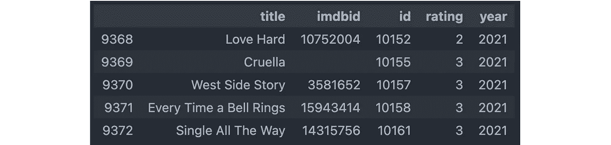*

*作者图片*

*电影是按时间顺序添加的，所以最近的放在底部。我们可以看到*克鲁拉*没有 imdbid，这是我们需要稍后解决的问题。*

*方法#4 getAllMovies 给我们的有用信息是电影名称、IMDb id、唯一网站 id (id)、Bechdel 测试分数(评级)和发行年份。Bechdel 测试分数或评级是通过检查这三个标准来计算的。因为每个标准都是建立在前一个的基础上的，也就是说。一部电影不能满足标准#2。如果不满足标准#1，0 分意味着一部电影没有两个女性角色。1 表示一部电影有两个女性角色，但她们彼此不说话。2 表示一部电影有两个女人在说话，但她们谈论的是男人。3 表示完全通过 Bechdel 测试。所以，恭喜*克鲁拉*，*西城故事*，*每次铃响*，还有*单曲一路*！*

*现在让我们看看# 1 getMovieByImdbId 方法给了我们什么。*

```
*# Using Single All The Way as an example (imdbid=14315756) pd.read_json('http://bechdeltest.com/api/v1/getMovieByImdbId?imdbid=14315756', typ='series')*
```

*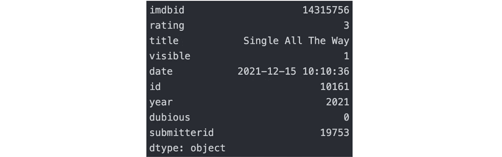*

*作者图片*

*它没有索引，但有 4 个额外的列:可见，电影被添加到列表的日期，可疑，和提交者 id。对于每个电影，Visible 总是为 1，因为 API 调用只返回可见的电影。有趣的是**可疑的**栏目。它指示“提交者是否认为评级可疑”。换句话说，我们不能相信可疑电影的评级，因为它们很容易被修改。*

*这使事情变得复杂…可疑现在是一个不容忽视的重要专栏。我们可能会丢弃可疑的电影，或者我们可能会将可疑作为另一个类别。不管怎样，我们现在需要一个新的专栏——不确定。这花了我额外的 7 个小时。*

## *数据争论*

*现在我们有了 9300 多部电影的 IMDb id，我们可以用它来获得每部电影的完整信息，这意味着我们需要调用 API 数千次。该网站指出:*

> *请记住，我是在一个共享主机方案上运行这个网站的，所以如果你在短时间内发送大量的查询，你可能会给我带来麻烦。请友好一点，绝对不要把这些数据用在流量大的东西上。*

*我不想引起任何麻烦，所以我每隔几秒钟就调用一次 API(因此花了我 7 个小时)。我确实经历了一些超时错误和不稳定的互联网(这是我的错)，所以也许几秒钟还是太频繁了。但谢天谢地，网站没有崩溃。正因如此，**我建议如果你想使用数据集，避免再次调用 API，造成更多不必要的流量，可以查看一下这个** [**Kaggle 数据库**](https://www.kaggle.com/alisonyao/movie-bechdel-test-scores) **。***

*但是获得额外的 4 列的代码在这里:*

*然而，我们还没有完成。如果我们检查`Bechdel_detailed.csv`文件，我们将看到 3 个新列和一些 nan。*

```
*bechdel_detailed_df = pd.read_csv('Bechdel_detailed.csv', index_col=0) 
bechdel_detailed_df.info()*
```

*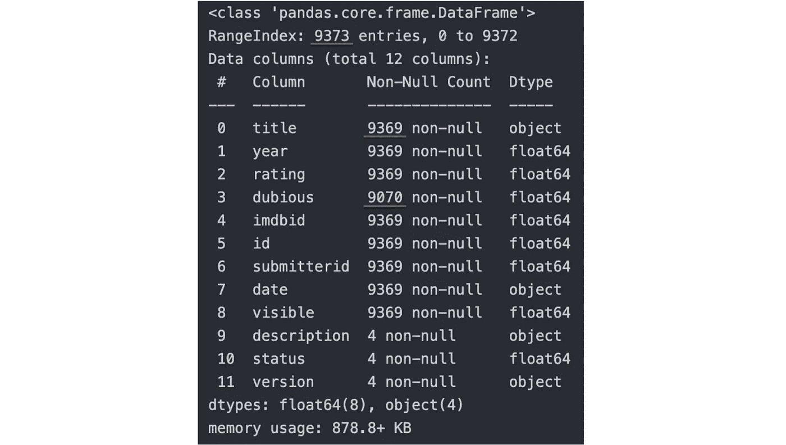*

*作者图片*

*很多可疑的是 NAN，因为该网站在其 API 中返回 null，但有 9373–9369 = 4 部电影看起来很奇怪。让我们来看看它们。*

```
*bechdel_detailed_df[bechdel_detailed_df['title'].isna()]*
```

*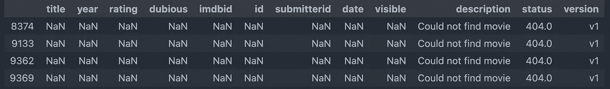*

*作者图片*

*这并不奇怪，因为索引 9369 是没有 imdbid 的 Cruella。我们预计它会引起问题，现在是时候解决它了。我们可以去 IMDb 手动获取 imdbid。现在，只需再清理一点数据，我们就完成了。*

*当前的`Bechdel_detailed.csv`文件应该是这样的。它包含了从 1874 年到 2021 年的 9373 部电影。*

*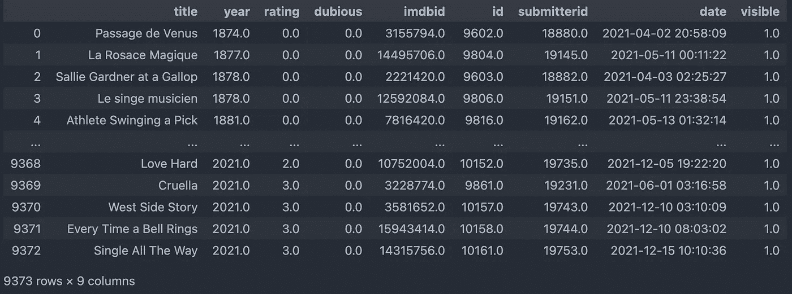*

*作者图片*

## *数据集更新*

*网站更新很快，这里的分析基于 2021 年 12 月 23 日的数据。请查看 [Kaggle](https://www.kaggle.com/alisonyao/movie-bechdel-test-scores) 获取最新的数据集(我打算每季度维护一次)。*

# *数据分析和可视化*

*与往常一样，对于任何数据集，我们都从探索性数据分析(EDA)开始，并将数据可视化，以了解我们在处理什么。*

## *了解 Bechdel 数据*

*继续我们离开的地方，让我们首先导入更多的库并再次检查`bechdel_detailed_df`的基本信息。*

```
*# import libraries 
import numpy as np 
import matplotlib.pyplot as plt 
%matplotlib inline 
from plotnine import * 
from mizani.formatters import percent_format # rename column because the name rating a little confusing
bechdel_detailed_df.rename(columns={'rating': 'bt_score'}, inplace=True)# check null 
bechdel_detailed_df.info()*
```

*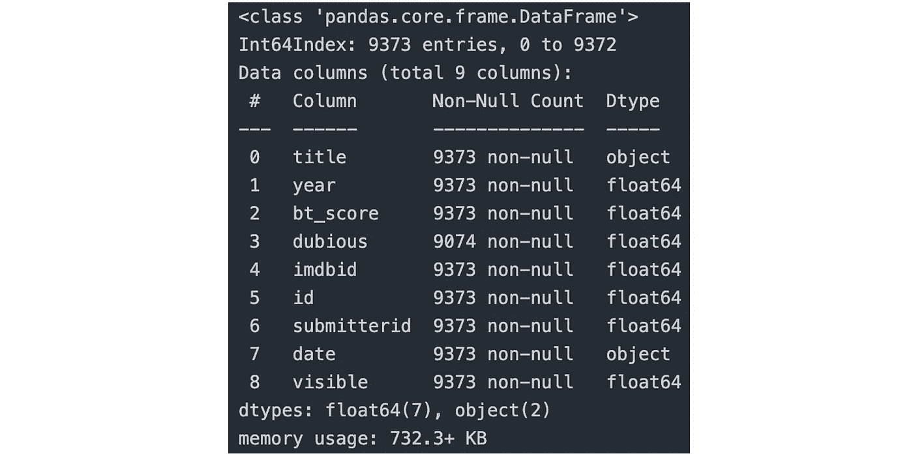*

*作者图片*

*数据集中有一些可疑的= NaN，但不太多，所以我们可以继续删除它们。*

```
*# drop NAN 
bechdel_detailed_df = bechdel_detailed_df.dropna().reset_index(drop=True)len(bechdel_detailed_df) # returns 9074*
```

*现在，我们总共有 9074 部电影。我们还需要检查重复，并删除 9 个重复的电影。*

```
*bechdel_detailed_df.duplicated().sum() # returns 9
bechdel_detailed_df.drop_duplicates(inplace=True) 
# reset index
bechdel_detailed_df = bechdel_detailed_df.reset_index(drop=True)
# left with 9,065 movies*
```

*好了，我们可以开始想象了。由于这几个月一直在学习 R(我的母语是 Python)，开始喜欢上了 ggplot2 的风格，所以选择了混合使用 matplotlib 和 plotnine 进行可视化。*

*首先，我对数据集中的分数分布和百分比很好奇。*

*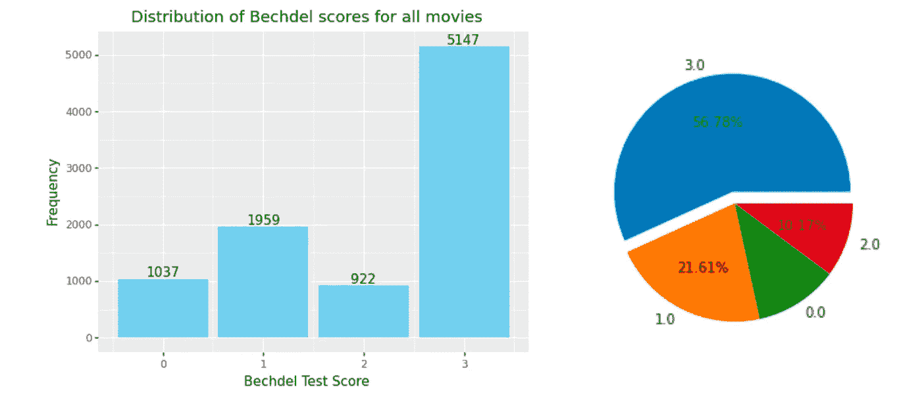*

*作者图片*

*超过一半的电影通过了 Bechdel 测试，考虑到 Bechdel 测试似乎并不太难通过，这是相当令人失望的。然而，fivethirtyeight 表示，56%的通过率已经高于预期[1]。他们还指出了一个“女权主义倾向”的问题，这意味着人们下意识地挑选更有可能通过 Bechdel 测试的电影，因为他们事先知道他们要向 Bechdel 网站提交一个分数[1]。此外，不难看出数据库中的大多数电影都是受欢迎的好莱坞电影，这也给我们的分析带来了地理位置限制。*

*承认数据集中的**偏差**很重要，EDA 帮助我们做到了这一点。*

*让我们继续处理可疑的电影。请记住，可疑的电影分数很容易改变，我们已经删除了带有可疑= nan 的行，所以现在我们对标记为可疑= 1 的电影感兴趣。*

```
*dubious_count = bechdel_detailed_df['dubious'].value_counts()print('Percentage of dubious movie scores:', str('{:.2f}'.format(dubious_count[1.0] / (dubious_count[1.0] + dubious_count[0.0]) * 100))+'%')*
```

*可疑电影评分百分比:8.92%*

*~9%不算太差，但我认为我们现在不应该放弃那些可疑的电影。而是打算把它作为一个新的类别，和 bt_score = 0，1，2，3 在同一个级别。让我们创建另一个名为“类别”的列，并标记 5 种可能性:*

*   *可疑的*
*   *0-少于两个女性角色*
*   *1-女性角色不说话*
*   *2-女性角色谈论男性*
*   *3 次通过 Bechdel 测试*

*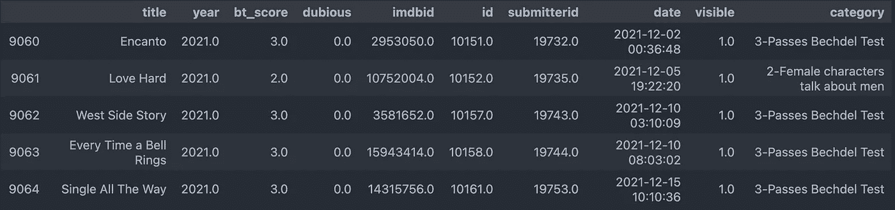*

*作者图片*

*好吧，让我们继续分析这些年的趋势。我们可以计算每一年的平均分数，并以散点图的形式显示出来。*

*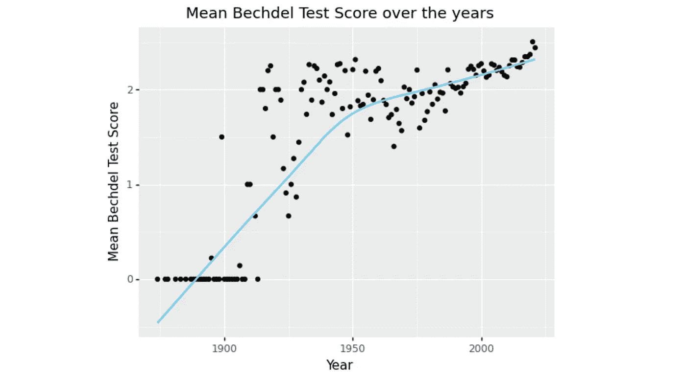*

*作者图片*

*我添加了一条平滑的曲线，这样更容易看出趋势。早些年的电影表现非常差，但平均分数随着时间的推移在提高。最近几年达到了历史最高水平。*

*是因为电影通过测试的比例越来越高吗？让我们找出答案。*

*我选择使用动画饼图来可视化，因为它很好地显示了时间流动(在条形图中拟合 150 年看起来很糟糕)。另外，练习一些新的东西是有好处的。这次，我用颜色区分了 5 个类别。*

*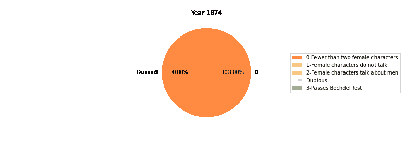*

*作者的 GIF(动画图表可以很好地显示随时间的变化)*

*我们可以看到早年都是橙色，表示 0 电影通过测试。但是这些年来，越来越多的绿色出现，这意味着更多的电影通过了测试。但是绿的比例不稳定，因为 1 年的间隔太小。所以，我们用 10 年的间隔来代替。这一次，我们终于可以把所有的东西都放进一个条形图里了。*

*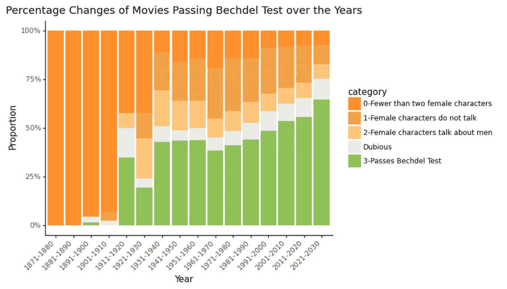*

*按作者分类的图片(这是显示比例的百分比堆积条形图，而不是显示频率或计数的常见条形图。)*

*可疑的电影在中间，以便人眼可以更好地比较绿色和橙色的比例。我们可以看到，随着绿色比例越来越大，橙色比例越来越轻。也就是说，许多电影仍然没有通过测试，但更多的电影得到了 1 和 2，而不是 0，这表明了进步。耶！*

*现在，我想花点时间强调一下，这里的“多”或“少”都是比例，或者百分比，或者比率。他们不是指纯粹的数字，或卷，或电影的数量。*比较数字没有意义。*为什么？因为**人口效应**，或者说**规模效应**。*

*例如，2122 年通过 Bechdel 测试的电影数量可能比 2022 年多，因为 2122 年发行的电影数量是 2022 年的 10 倍。比例可能会下降，即使数字上升，所以数字本身并不能告诉我们多少有用的信息。我最近听到的另一个例子是，我的一个朋友正在做 NLP，他发现情感分析中的负面评论往往更短，但原因可能是互联网上的短评论(就数量而言)通常更多，所以他的结论可能没有意义。这个陷阱包含“人口”一词，因为它通常与人口联系在一起。中国的出生率比日本高，仅仅是因为中国人口多。这没什么意思。有趣的是出生率，而不是出生人数。同样，我们谈论的是人均 GDP，而不是整体 GDP。令人惊讶的是，我们经常把人口效应误解为有意义的事情。*

*好吧，让我们回到分析上来。既然我们对 Bechdel 数据和随时间变化的总体趋势有了很好的理解，让我们将其与屏幕外的指标进行比较。*

## *比较屏幕上和屏幕外的指标*

*关于电影中女性形象的屏幕外指标，我指的是演员和工作人员中的女性比例。为了获得比率，我们可以使用这个流行的 [Kaggle 数据集](https://www.kaggle.com/rounakbanik/the-movies-dataset?select=credits.csv)。`credits.csv`文件标记了性别信息。*

**

*作者图片*

*为了将 Bechdel 数据与性别数据连接起来，我们需要`links.csv`文件。*

```
*# import more libraries
import ast 
from collections import defaultdict
import seaborn as sns# load the 2 new datasets 
links_df = pd.read_csv('./TheMoviesData/links.csv', index_col=0) 
credits_df = pd.read_csv('./TheMoviesData/credits.csv')
# there are 37 duplicates in credits_df, but let's drop them later# merge 
bechdel_df = pd.merge(bechdel_detailed_df, links_df, left_on='imdbid', right_on='imdbId', how='inner').drop(columns=['imdbId']) bechdel_df = pd.merge(bechdel_df, credits_df, left_on='tmdbId', right_on='id', how='inner').drop(columns=['imdbid', 'submitterid', 'date', 'visible', 'tmdbId', 'id_x', 'id_y']) bechdel_df*
```

*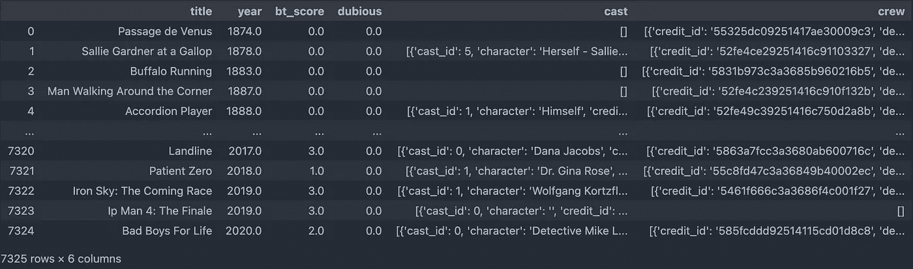*

*作者图片*

*《演员表》和《剧组》有些空值。让我们计算空值的百分比，看看我们应该怎么做。*

```
*count1, count2 = 0, 0 
for index, row in bechdel_df.iterrows():
     cast_list = ast.literal_eval(row['cast'])
     crew_list = ast.literal_eval(row['crew'])
     if len(cast_list) == 0:
         count1 += 1
     if len(crew_list) == 0:
         count2 += 1 print('Empty cast percentage:', str('{:.2f}'.format(count1/len(bechdel_df) * 100))+'%') print('Empty crew percentage:', str('{:.2f}'.format(count2/len(bechdel_df) * 100))+'%')*
```

*空投百分比:0.41%
空车率:0.11%*

*这是一个非常小的百分比，所以我们可以继续并放弃它们。此外，我们需要删除重复的内容。*

```
*bechdel_df = bechdel_df[(bechdel_df['cast'] != '[]') & (bechdel_df['crew'] != '[]')].reset_index(drop=True) # check & drop duplicates
print(bechdel_df.duplicated().sum()) # returns 9 bechdel_df.drop_duplicates(inplace=True)
bechdel_df = bechdel_df.reset_index(drop=True)*
```

*然而，Kaggle 数据集中还有一个性别未知的问题。Kaggle 数据集的原始数据源没有详细记录性别信息。其实有很多未知。*

*演员表中的未知百分比:36.29%
剧组中的未知百分比:59.01%
导演中的未知百分比:39.44%
编剧中的未知百分比:38.91%*

*因为有太多的未知数，我们可以通过从名字中预测性别来填补空白。性别猜测套餐是个不错的选择。这个包将性别视为二元的(可能是一个限制)，并告诉我们名字是男/女，还是主要是男/女，或者未知/雌雄同体。例如，我的中文名字韩愈可以是任何性别，包装上会告诉你我的性别是未知的，但你可以从我的英文名字艾莉森看出我是女性。*

*演员中的未知百分比:4.78%
剧组中的未知百分比:4.99%
导演中的未知百分比:4.21%
编剧中的未知百分比:4.99%*

*未知的百分比显著下降，这太好了！现在，是时候决定我们需要哪些指标了。我认为重要的女性比例是:*

*   *演员女性比例*
*   *船员女性比例*
*   *导演女性比例(有导演、助理导演等)*
*   *作家女性比例*

*因此，我们可以通过运行以下命令来添加新列:*

```
*bechdel_df['cast_female_ratio'] = gender_df['cast_female_num'] / gender_df['cast_total_num'] bechdel_df['crew_female_ratio'] = gender_df['crew_female_num'] / gender_df['crew_total_num'] bechdel_df['directing_female_ratio'] = gender_df['Directing_female'] / gender_df['Directing_total'] bechdel_df['writing_female_ratio'] = gender_df['Writing_female'] / gender_df['Writing_total'] bechdel_df.head()*
```

*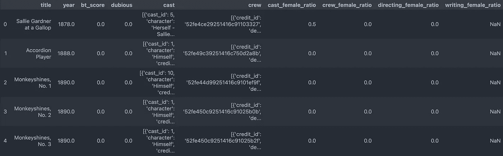*

*作者图片*

*writing_female_ratio 列中有一些 NaN，因为 0/0 是 NaN。如果编剧总数是 0(分母)，那么这些电影的记录很可能是不完整的，对我们没有用处。让我们放弃空值。此外，这一次，在比较指标时，我们不能再考虑可疑的因素，因为可疑的分数是不可靠的。*

```
*bechdel_df_no_nan = bechdel_df.dropna().reset_index(drop=True) 
bechdel_df_no_nan_no_dubious = bechdel_df_no_nan[bechdel_df_no_nan['dubious']==0].reset_index(drop=True)*
```

*现在，我们可以检查每个指标的平均 Bechdel 分数。*

```
*bechdel_df_no_nan_no_dubious.groupby('bt_score').mean()*
```

*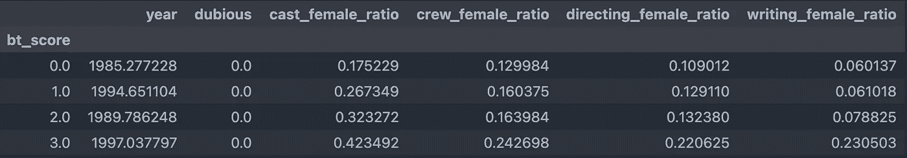*

*作者图片*

*通过目测平均值，似乎较高的女性比例与较高的 bt _ 得分相关。为了直观地显示平均值及其不确定性区间，我们可以使用误差线来比较指标和 Bechdel 分数。对于演员女性比例与 Bechdel 分数，我们有:*

*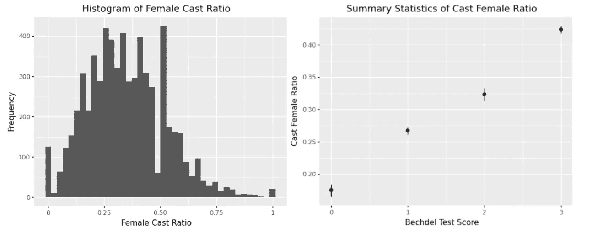*

*作者图片*

*误差条不重叠，这表明 bt_score = 0、1、2 和 3 的 4 组的平均值在统计上是不同的。而且正相关非常明显。*

*通过将列名从`cast_female_ratio`改为其他，我们可以绘制所有 4 个图形。*

*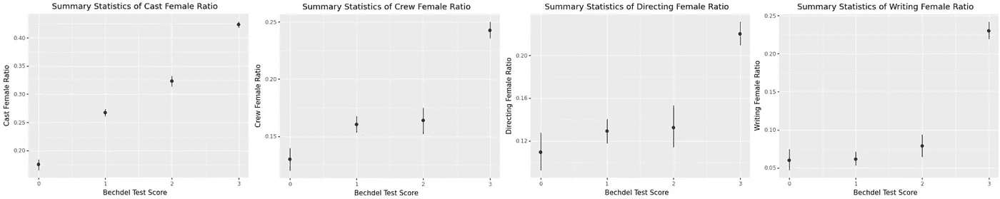*

*作者图片*

*没有通过贝克德尔测试的群体并不总是彼此不同，但与通过测试的电影相比，他们都有较低的女性比例。屏幕上和屏幕外指标之间的正相关非常显著。也就是说，演员和剧组中女性成员的比例越高，电影通过贝克德尔测试的可能性就越大，反之亦然。在片场有更多的女性的确可以转化为银幕上更好的女性形象。*

*这个有趣的分析到此结束。*

# *结论*

*在这篇文章中，我们谈到了:*

*   *如何使用 API 收集数据*
*   *如何制作动画饼图*
*   *什么是人口效应/规模效应*

*我们已经回答了这些问题:*

1.  *Bechdel 考试成绩如何随时间变化？电影在通过 Bechdel 测试方面做得更好吗？*

> *是啊！Bechdel 平均分和电影通过率都在上升。对于未能通过贝克德尔测试的电影，现在更多的电影更接近通过测试。*

*2.Bechdel 测试与屏幕外表现的其他基准相比如何？*

> *Bechdel 分数与演员、工作人员、导演和编剧中的女性比例呈正相关。职场中更多的女性可以转化为更多的女权主义产出。*

*这里的定量工作更侧重于数据采集、数据分析和可视化，因为这个项目最初是为了探索数据科学中的以人为本。重要的是学会**问正确的问题，识别偏见和局限性，并意识到为什么对数据集做出每个决定**。我认为这没有太大的意义，例如，根据性别比例预测 Bechdel 分数，并在这个项目中涉及机器学习模型。如果可视化已经说明了一切，我也不想通过引入像 Tukey 的 HSD 这样的统计概念来进行成对比较，从而使事情变得过于复杂。但是如果这符合你的需要，我们非常欢迎你这样做。*

*我的优秀队友 **JB** 、**敏杰**和**法蒂玛**浏览了 Bechdel 网站上的评论，并做了使项目完整的定性分析。如果你有兴趣，请点击这里的！*

> **本帖中的代码可以在这个*[*GitHub repo*](https://github.com/AlisonYao/HCDS-Bechdel-Test-Final-Project)*中找到。检查数据集的*<https://www.kaggle.com/alisonyao/movie-bechdel-test-scores>**。***

# **参考资料和相关阅读**

**以下是我在从事这个项目时发现的一些非常有帮助和鼓舞人心的文章。他们探索了 Bechdel 分数和其他有趣的方面如评级、预算等之间的关系。享受阅读的乐趣！**

**[1][https://fivethirtyeight . com/features/the-dollar-and-cents-case-against-Hollywood-exclusion-of-women/](https://fivethirtyeight.com/features/the-dollar-and-cents-case-against-hollywoods-exclusion-of-women/)
【2】[https://towards data science . com/the-bechdel-test-analyzing-gender-disparity-in-Hollywood-263 CD 4 BCD 9d](/the-bechdel-test-analyzing-gender-disparity-in-hollywood-263cd4bcd9d)**

**特别感谢 TDS 编辑[本·胡伯尔曼](https://medium.com/u/e6ad8abedec9?source=post_page-----6cbade15010f--------------------------------)，他在获得数据许可方面给了我难以置信的帮助，并指导我完成了发表这篇文章的每一步。**

**感谢您的阅读！希望这对你有帮助。有任何反馈请留言:)**