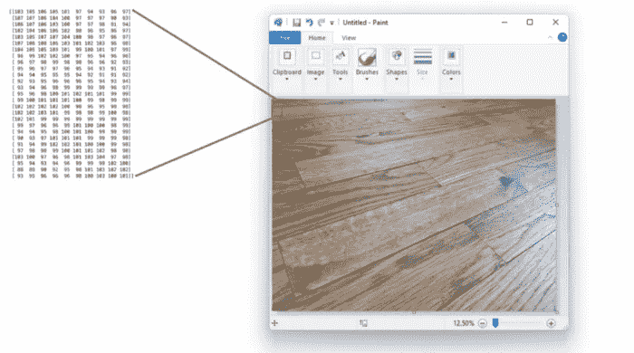
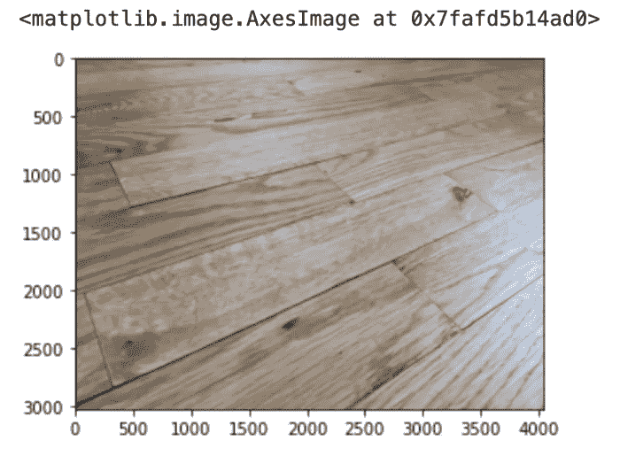
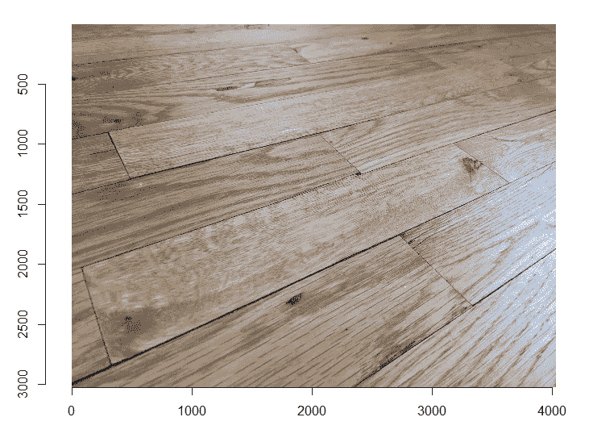
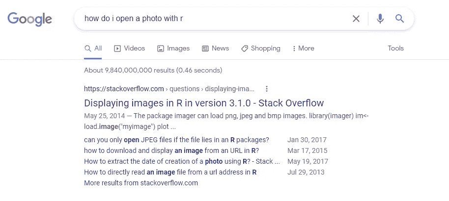
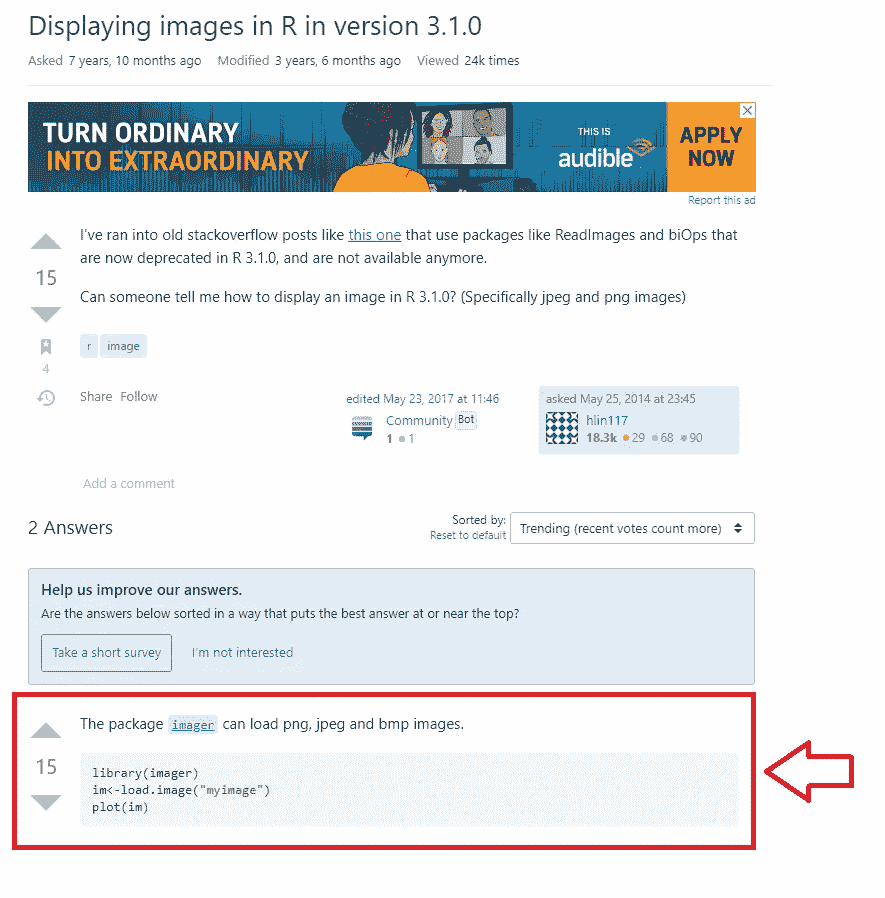
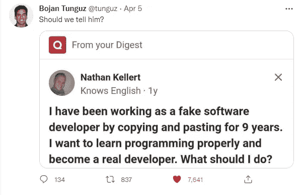

# 成为“真正的”数据分析师

> 原文：<https://towardsdatascience.com/becoming-a-real-data-analyst-dcaf5f48bc34>

## 业余分析师和专业分析师的 10 个区别

[在之前的](/thinking-of-becoming-a-data-analyst-youre-already-one-5773b63ae83b)中，我向您介绍了一些伪装成日常活动的分析任务，以证明您已经是一名数据分析师。例如，考虑下图。数码照片存储为一串数字(左)，在你用合适的工具打开它们(右)之前，这些数字对你的大脑毫无意义。

我在 MS Paint 中打开的木地板照片中的蓝色通道数据示例。

哒哒！您刚刚完成了数据可视化。当你发现数据分析的能力一直存在于你的内心时，音乐就会膨胀。

***但这是否意味着你已经准备好从事专业分析师的工作了呢？***

不完全是。业余分析师和专业分析师之间有很大的区别。

## 专业数据人员与业余数据人员的区别#1 —软件技能

与大多数业余爱好者不同，专业人士知道如何使用软件(例如 **Python** 和 **R** )来让他们在一个地方与更多的数据格式进行交互。虽然 MS Paint 只适用于图像，但分析软件可以处理图像、表格、声音、文本和……以及厨房水槽。

下面是当你用 **Python** 打开同一个图像时的样子:

这是用 **R** 看到的同一个图像:

## 专业数据与业余数据的区别之二——轻松处理大量数据

第二个区别是，专业人员可以处理大量的数据。尽管我已经处理数据二十多年了，但我仍然更喜欢在浏览器甚至 MS Paint 中打开一张照片，而不是在 R 或 Python 中。那么，除了能够打开许多不同数据类型的灵活性之外，学习 analytics pro 工具的卖点是什么？好吧，如果你想弄懂一张*百万张*的照片呢？

你可以试着用 MS Paint 来理解它们，但是以每张图片 1 秒钟的速度，这将花费你一个多月的时间。通过使用代码处理和汇总大量数据，专业人员可以使用正确的工具在几分钟内完成这项工作。

你如何开始学习这些工具？你查找如何安装它们( [R](https://www.rstudio.com/products/rstudio/) 和 [Python](https://jupyter.org/try-jupyter/lab/) 是免费的)并开始玩它们。就像 MS Paint 一样，但是更好。只要在谷歌上搜索你想用它们完成的任何任务，然后阅读结果。

这是响应上述搜索查询的第一个结果:

嘣。这就是你所需要的。

好吧，如果你以前从未使用过 R，你的下一个搜索将需要是“我如何在 R 中安装包？”但在那之后，你就是黄金了。只需将代码复制粘贴到答案中，将“我的图像”替换为您照片的文件名和文件路径。不确定这些术语是什么意思？做一个搜索来查找它们。当你用完了你必须查阅的东西，你就掌握了你开始学习的任务。开发人员就是这样开发的(双关语)。

这样做一大堆，有一天你会醒来，意识到你已经意外地发展了专业软件技能。

这条[推文](https://twitter.com/tunguz/status/1511432870920966151)逗得我哈哈大笑。如果你不明白，重点是他已经是一个真正的软件开发人员了…复制和粘贴*是*工作。数据分析代码技能也是如此。你通过查找如何完成一项任务来学习，然后将它添加到你的工具箱中。

我喜欢编程的一个原因是它是魔法和乐高的结合。要学习完成任务的咒语，你可以在互联网上查找…这本身就是数据分析！

> 我喜欢编程的一个原因是它是魔法和乐高的结合。

说真的，你不需要课程。简单地挑战自己，尽可能多地使用 R 或 Python 语言(它们都很好)，同时不断询问互联网如何克服出现的任何障碍。在你打开数据之后([下面是如何找到数据来看](http://bit.ly/quaesita_datasearch))，想出一个让你心动的问题，并尝试使用工具来得到答案。从小处着手，随着过程变得更加雄心勃勃。没有什么能阻止你！玩得开心！

照片由 [Jonny Gios](https://unsplash.com/@supergios?utm_source=medium&utm_medium=referral) 在 [Unsplash](https://unsplash.com?utm_source=medium&utm_medium=referral) 上拍摄

## 专业数据与业余数据的区别#3 —不受数据科学偏见的影响

在我看来，学习工具是容易的部分。困难的部分是采用分析思维模式，这是接下来的区别所在。从这个开始:专家已经形成了对数据无所不包的不尊重。是的，你听到了。

只有新手才会把“数据”念成大写的“D”，并把它当成神奇的东西。专业人士被烧伤和心碎的次数够多了，他们痛苦地认识到数据只是人类决定以电子形式写下来的一些东西。([更多此处](http://bit.ly/quaesita_hist))。)

> 数据的优势是内存，不是质量。

在故事中加入一些数字使其更“科学”可能会赢得业余爱好者的信任，但经验丰富的分析师知道得更多。他们对我所说的*数据科学偏见*免疫——当信息带有数据科学的味道时，他们会更加信任信息。给一份无意义的报告添加一个漂亮的图表并不能愚弄他们。

专家们明白，数据的优势是[记忆，而不是质量](http://bit.ly/quaesita_hist)，所以他们对正式数据集的怀疑就像他们在街上漫步时听到的景象和声音一样。

> “有了数据，你仍然只是另一个有观点的人。''

我最喜欢的 T4 统计学先驱之一 W. Edwards Deming 有一句名言“没有数据，你只是另一个有观点的人。这是真的，但不幸的是，“有了数据，你仍然只是另一个有观点的人。“专业分析师从骨子里明白这一点。

照片由[木村宏](https://unsplash.com/@muukii?utm_source=medium&utm_medium=referral)在 [Unsplash](https://unsplash.com?utm_source=medium&utm_medium=referral) 上拍摄

要开始建立相同的免疫力，停止将数据视为特殊。你已经(希望*)学会了如何对照片保持理智和怀疑。例如，你很清楚不要把你在 Instagram 上看到的任何东西当作真实的、不加改变的、不带偏见的现实再现。如果照片不是你拍的，你就不会相信照片。对吗？没错。

> 停止将数据视为特殊！

你在野外看到的景象和声音中所学到的所有常识性规则也适用于[结构化数据](http://bit.ly/quaesita_provenance)(表格/矩阵/电子表格中的数字)。

将数据等同于真理，就如同在对作者一无所知的情况下，相信书中所写的一切。如果你保持头脑清醒，保持健康的怀疑态度，你就能很好地进行分析。

有些可爱的人似乎已经成年，却不知道你在网上找到的并非都是真的。如果那是你，我可以委婉地建议分析可能不是你最好的职业选择吗？

由[亚历山大·辛恩](https://unsplash.com/@swimstaralex?utm_source=medium&utm_medium=referral)在 [Unsplash](https://unsplash.com?utm_source=medium&utm_medium=referral) 上拍摄的照片

除了更多使用专业工具的实践之外，专业分析师还理解专业的专业方面，我们将在本系列的下一篇文章中讨论。为了提前预览，下面是即将推出的部分标题:

**数据专家 vs 业余爱好者差异# 4——了解职业
数据专家 vs 业余爱好者差异# 5——拒绝成为数据江湖骗子
数据专家 vs 业余爱好者差异# 6——抵制确认偏差
数据专家 vs 业余爱好者差异# 7——对数据的现实预期
数据专家 vs 业余爱好者差异# 8——知道如何增加价值
数据专家 vs 业余爱好者差异# 9——对时间的不同思考
数据专家 vs 业余爱好者差异# 10——细致入微的卓越观**

如果你想到了这些标题之外的其他不同之处，请在评论中告诉我！

# 本系列的前一篇文章

 [## 想成为一名数据分析师？你已经是一个了！

### 是的，你。

towardsdatascience.com](/thinking-of-becoming-a-data-analyst-youre-already-one-5773b63ae83b) 

# 本系列的下一篇文章

 [## 将你的思维从业余分析师转变为专业分析师

### 成为“真正的”数据分析师的旅程

towardsdatascience.com](/shifting-your-mindset-from-amateur-to-professional-analyst-61383f913408) 

*又及:你有没有试过在 Medium 上不止一次点击这里的拍手按钮，看看会发生什么？* ❤️

# 喜欢作者？与凯西·科兹尔科夫联系

让我们做朋友吧！你可以在 [Twitter](https://twitter.com/quaesita) 、 [YouTube](https://www.youtube.com/channel/UCbOX--VOebPe-MMRkatFRxw) 、 [Substack](http://decision.substack.com) 和 [LinkedIn](https://www.linkedin.com/in/kozyrkov/) 上找到我。有兴趣让我在你的活动上发言吗？使用[这种形式](http://bit.ly/makecassietalk)取得联系。