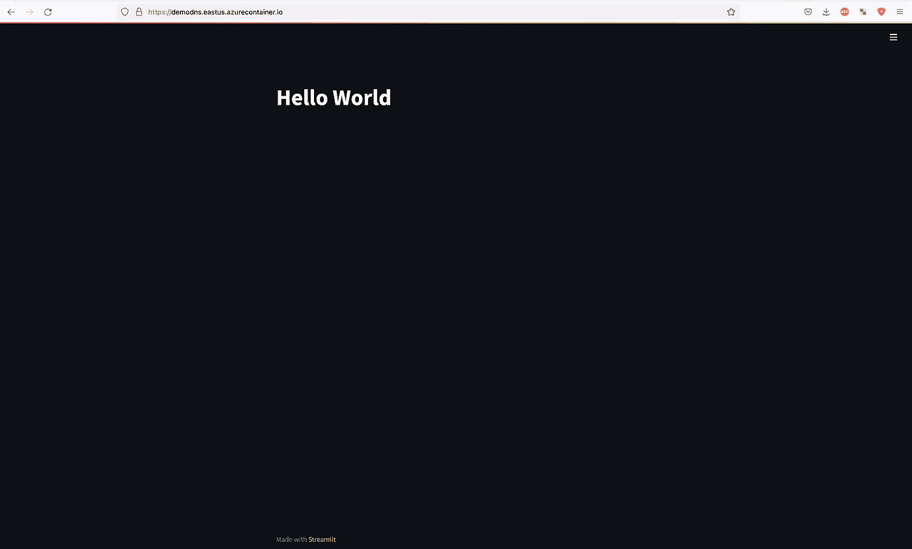
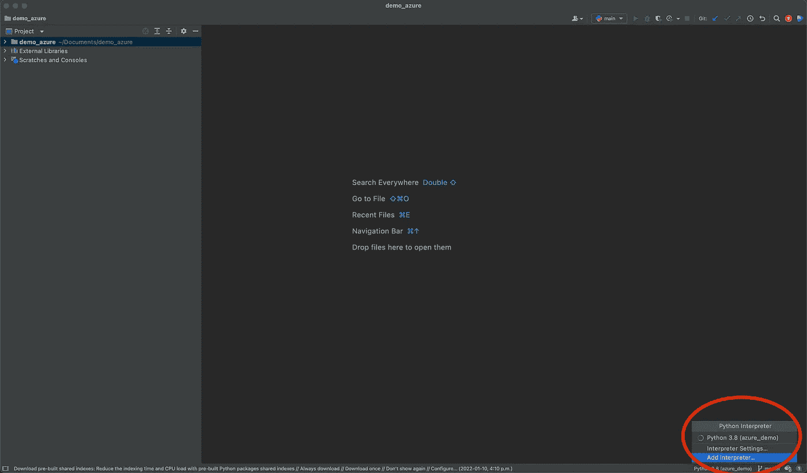
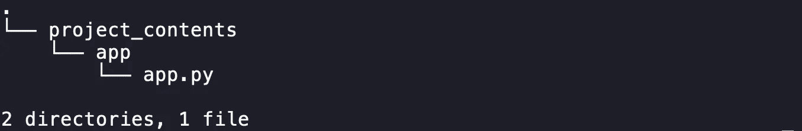
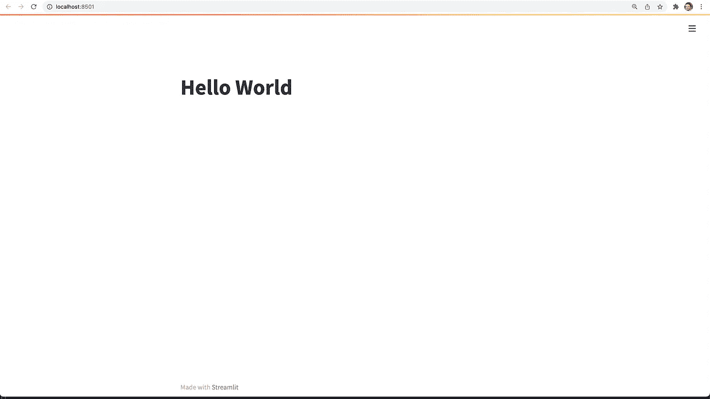
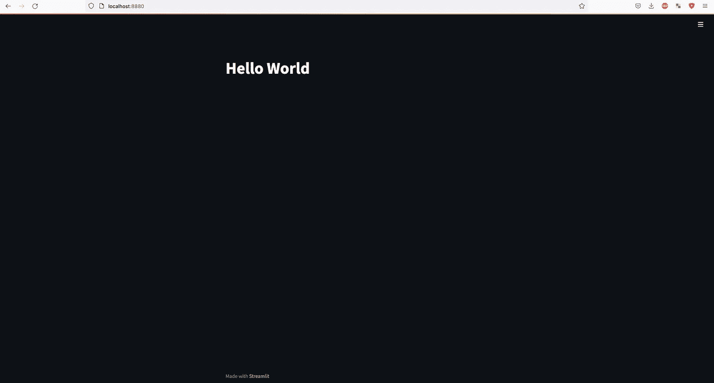
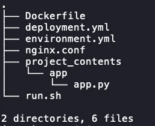
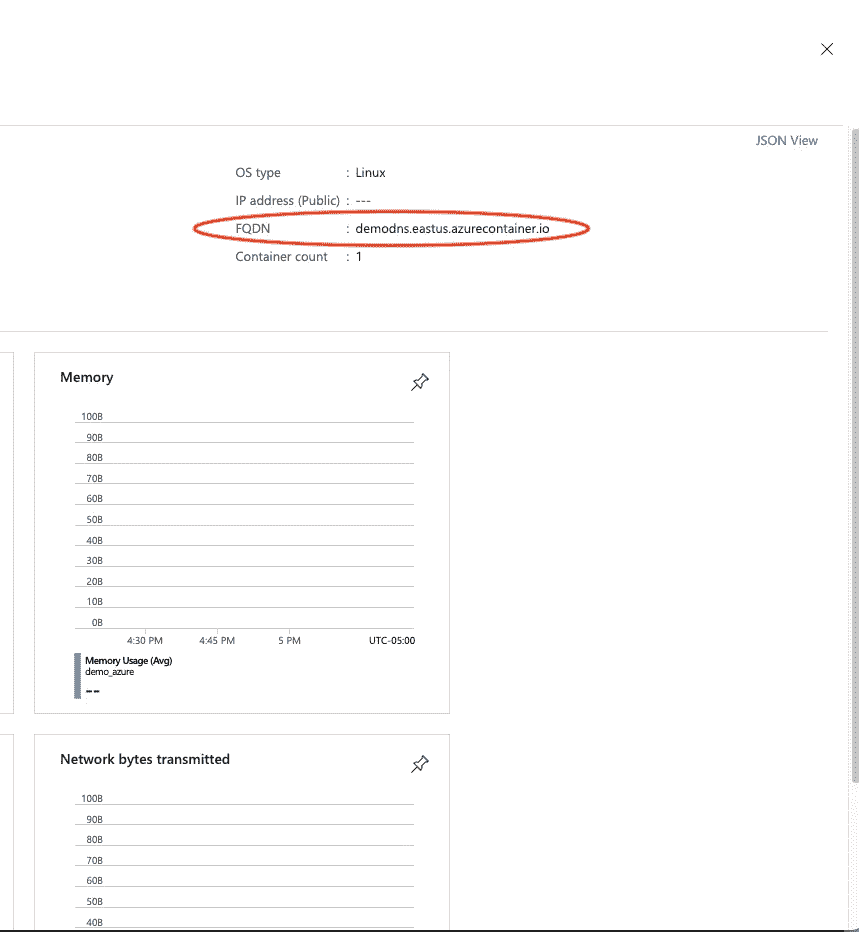

# Azure 上简化 it 部署的初学者指南

> 原文：<https://towardsdatascience.com/beginner-guide-to-streamlit-deployment-on-azure-f6618eee1ba9>

# Azure 上简化 it 部署的初学者指南

## 使用免费 SSL 证书在 15 分钟内在 Microsoft Azure 上部署 Hello World Streamlit 应用程序的完整指南



使用 SSL 的最终应用程序部署(图片由作者提供)。

[Streamlit](https://streamlit.io/) 是一个令人惊叹的开源应用框架，数据科学家通常使用它来快速制作响应迅速的 web 应用。Streamlit 的直观框架非常容易学习，可以在几分钟内创建漂亮的仪表板甚至更复杂的 web 应用程序。

然而，许多数据科学家将部署的想法推迟到项目结束。相反，通过从部署阶段开始他们的项目，程序员可以在工作时在最终的 UI 中快速可视化他们的更改。如果您完成了机器学习阶段，却发现在尝试部署您的项目时有许多意想不到的问题，这可以为您节省很多压力。

当试图部署我最近的一个项目时，我意识到没有太多关于如何在 Azure 上部署带 SSL 加密的 Streamlit 应用程序的解释。SSL 证书对于任何面向客户端的页面都非常重要。如果你有一个证书，你的网页的访问者将不会面临一个网站不安全的浏览器警告。这个浏览器警告是不专业的，可能会阻止用户成功连接(取决于浏览器和设置)。因此，经过多天的试验、研究和解析不推荐的或不可理解的解决方案，我开发了一个最小的分步指南，使用 SSL 在线部署 Hello World Streamlit 应用程序。为此，我们将使用 Microsoft Azure(存储库、存储帐户和容器实例)、certbot(用于 SSL)和 NGINX 作为反向代理 web 服务器。如果你不懂一个(或者全部)也不用担心！)本指南是一步一步的，应该能让您在 15 分钟内启动并运行。事不宜迟，我们开始吧！

# 第 1 部分:在本地运行 Streamlit

首先，我们将建立一个新的虚拟环境。我推荐使用 [Anaconda](https://www.anaconda.com/products/individual) ，这是一个建立虚拟环境的好工具。如果你还没有 Anaconda，可以在这里下载[。一旦安装了 Anaconda，我们就可以用](https://www.anaconda.com/products/individual)

```
conda create -n NAME_OF_ENV python=3.8
```

如果提示 y/n，请输入 y 安装所需的软件包。NAME_OF_ENV 是一个占位符，用于表示您希望如何称呼您的环境。我将我的环境命名为 azure_demo。之后，使用以下工具激活您的环境

```
conda activate NAME_OF_ENV
```

我们将只为这个最小的项目安装一个包，尽管以后可以很容易地以类似的方式添加更多的包。我们使用以下工具安装 Streamlit

```
pip install streamlit
```

我们的环境现在已经准备好了！让我们将它添加到 PyCharm(如果您愿意，也可以添加到另一个 Python IDE)。首先创建一个新项目(我的命名为 demo_azure)，然后[添加你作为解释器创建的新 conda 环境](https://www.jetbrains.com/help/pycharm/conda-support-creating-conda-virtual-environment.html)。



将 conda 环境添加到我们的 PyCharm 项目中。

我们的编码环境现在已经准备好了！让我们添加一个文件夹来保存我们的主要 Python 代码。我将我的项目称为 _contents。在里面，我们再做一个文件夹叫 app。在这里，创建一个名为 app.py 的新 Python 文件。



项目目录(图片由作者提供)。

我们现在准备创建我们的 Streamlit 应用程序。由于本教程的重点是部署，而不是使用 Streamlit 构建网页，我们将简单地创建一个标题为“Hello World！”。这可以用两行代码来完成——一行用于导入 Streamlit，一行用于添加标题。

就是这样！我们已经准备好在本地运行我们的 Streamlit 应用程序。打开一个终端(例如 mac 中的 terminal 或 Windows 中的 Anaconda 提示符)，导航到您的项目根目录，确保您已经激活了之前创建的 virtualenv，然后运行命令

```
streamlit run project_contents/app/app.py
```

在任何浏览器中输入 localhost:8501，你应该会看到你的应用程序。



我们在 localhost:8501 上本地部署的 Streamlit 应用程序(图片由作者提供)。

恭喜你！您已经在本地部署了您的 Streamlit 应用程序，这是我们的第一个里程碑！作为参考，完整的项目代码可以在 Github [这里](https://github.com/sergeiissaev/demo_azure_streamlit/tree/master)找到。现在，您可以通过在终端中键入 Ctrl+C 来终止该应用程序，然后继续第 2 部分。

# 第 2 部分:整理你的 Streamlit 应用程序

在第 2 部分中，我们将使用我们的 Streamlit 应用程序，并协调其在 [Docker](https://www.docker.com/) 中的部署。Docker 将我们的应用程序容器化，使其可以部署在各种云平台上。如果你还没有安装 Docker，点击[这里](https://docs.docker.com/get-docker/)。

首先，我们将在项目的根目录中创建一个 Dockerfile(接下来，所有创建的文件都将放在项目的根目录中):

对于这个部署，我们使用 micromamba 映像。确保在第 3–5 行将项目目录名称从 demo_azure 替换为您的项目名称。

接下来，我们将创建在 docker 文件的第 14 行引用的 run.sh 文件。在这里，我们只需使用 Streamlit 运行 app.py。我在 theme.base 中添加了“黑暗”来设置一个黑暗的主题，尽管这是完全可选的(而且非常酷！).

接下来，我们将创建环境文件，在 docker 文件的第 7–9 行中引用。创建一个名为 environment.yml 的文件，并添加以下代码。这个文件将指导 Docker 安装必要的包来运行我们的应用程序。完成本教程后，您可以随意添加您的应用程序需要的任何其他包，只需在新的一行中添加到文件的底部“- NAME_OF_PACKAGE”即可。

我们的集装箱现在准备好了！让我们在本地使用

```
docker build -t azure_demo:v1 .docker run --rm -p 8880:8501 azure_demo:v1
```

标志-RM 在容器停止运行后删除映像，而-p 8880:8501 将我们的本地端口 8880 映射到容器的端口 8501。因此，当我们在浏览器中导航到 localhost:8880 时，应该会看到以下内容:



我们的容器化 Streamlit 应用程序可在 localhost:8880(图片由作者提供)访问。

恭喜你！您已经容器化了您的 Streamlit 应用程序，现在已经完成了第 2 部分。随时停止你的运行 Docker 容器。让我们通过将容器部署到 Azure 来结束本教程。如果你愿意，这个容器也可以部署到另一个云平台(比如 AWS 或者 GCP ),尽管这里只讨论 Azure。

# 第 3 部分:将你的 Dockerized 应用部署到 Azure

现在，我们的应用程序被封装在 Docker 容器中，我们可以部署我们的应用程序，以便它可以在互联网上访问。在我们继续之前，请确保您已经安装了 [Azure CLI](https://docs.microsoft.com/en-us/cli/azure/install-azure-cli) 。登录使用

```
az login
```

此外，确保您有一个资源组，可以用它来创建容器实例和容器注册表。出于演示的目的，我的资源组将被称为 AMAZING_RESOURCE_GROUP。

我们的第一个任务是将我们的容器图像从我们的计算机上传到 Azure 容器注册表。我们可以使用创建一个新的注册表

```
az acr create --resource-group AMAZING_RESOURCE_GROUP --name NAME_OF_REGISTRY --sku Basic
```

请记住，根据需要更改资源组的名称和注册表的名称。您可以通过登录 Azure 门户并导航到容器注册表来检查注册表是否存在。您的注册表应该在那里。

您现在可以使用登录您的注册表

```
az acr login -n NAME_OF_REGISTRY
```

您应该会看到“登录成功”。您可以使用门户上传容器映像，但是在本教程中我们将使用 CLI。以下命令将构建我们的映像并将其推送到我们的新注册表中:

```
docker build -t azure_demo:v1 .docker tag azure_demo:v1 NAME_OF_REGISTRY.azurecr.io/azure_demo:v1docker push NAME_OF_REGISTRY.azurecr.io/azure_demo:v1
```

请记住:更改注册表的名称以匹配您自己的名称。如果在第一行中没有将图像命名为 azure_demo，请确保在第 2 行和第 3 行中使用相同的名称，这样图像名称就一致了。通过在 Azure 门户中导航到您的注册表并验证您的映像是否在注册表中(在服务>存储库下)，可以进行可选的检查。

太棒了。我们的图像现在位于 Azure 注册表的一个存储库中。这使得部署更加容易。下一步是在我们的项目目录中创建一个名为 deployment.yml 的文件，其内容如下:

为了部署我们的容器，deployment.yml 文件包含 Azure 需要知道的所有信息。这个 yml 文件包含部署我们的应用程序所需的最少内容——如果你想添加更多内容，Azure 上的 [YAML 参考](https://docs.microsoft.com/en-us/azure/container-instances/container-instances-reference-yaml)是一个很好的资源。记住将第 2 行设置为您的位置(例如，eastus)，将第 3 行设置为一个唯一的项目名称，第 8、19 和 20 行使用您的注册表名称。第 30 行的 FQDN 指的是你希望你的域名是什么——例如，如果你把第 30 行的 FQDN 名字写成我的假期，你的网站可以通过访问我的假期来访问。最后，我们必须提供凭证来访问我们的容器注册中心，以提取我们的容器映像(第 21 行)。为了获得此密码，请运行以下命令:

```
az acr update -n NAME_OF_REGISTRY --admin-enabled trueaz acr credential show --name  NAME_OF_REGISTRY
```

这将在终端中输出您的注册表的密码。复制密码，并粘贴到第 21 行。我们的 deployment.yml 现在已经准备好了。

在部署应用程序之前，我们将在项目目录中创建一个名为 nginx.conf 的文件。这将把网络流量从我们的 FQDN 重新路由到 8501 端口。否则，您必须在域名中指定端口 8501(例如，my vacation . eastus . azure container . io:8501—yikes)。您可以将以下代码复制粘贴到 nginx.conf 中:

唯一必须更改的行是第 22 行和第 53 行，其中 FQDN 名称是您在 deployment.yml 的第 30 行中选择的 FQDN 名称，AZURE_LOCATION 是您在 deployment.yml 的第 2 行中选择的位置。总的来说，这个 nginx 服务器将侦听端口 80(连接到我们的网站时的默认端口)，并将流量重新路由到本地主机端口 8501。我包括的位置(/healthz、/vendor、/stream)对 Streamlit 很重要——如果省略这些行，Streamlit 将无法工作。

完美！现在我们只需将新创建的 nginx.conf 文件添加到 docker 文件中。

将您的 docker 文件修改为这个新版本，它包括安装 nginx(以及我们将用于 SSL 的其他包)的一些安装步骤，还包括复制 nginx.conf 文件的命令。

我们还必须更新我们的 run.sh，添加第 2 行和第 3 行来启动 nginx。



最终项目树(图片由作者提供)。

唷！是时候看看我们的网站在互联网上运行了。但是首先，由于我们对项目进行了更改，我们必须重新创建我们的容器，并将这个新容器推送到 Azure container registry 来代替旧容器。我们可以使用相同的代码来构建我们的映像，并像以前一样推送它:

```
docker build -t azure_demo:v1 .docker tag azure_demo:v1 NAME_OF_REGISTRY.azurecr.io/azure_demo:v1docker push NAME_OF_REGISTRY.azurecr.io/azure_demo:v1
```

现在，在您的终端中运行以下命令来部署您的应用程序:

```
az container create --resource-group AMAZING_RESOURCE_GROUP --name demo_azure -f deployment.yml
```

该命令使用我们的文件 deployment.yml 创建一个容器实例，确保— name 标志与您在 deployment.yml 第 3 行中提供的名称相匹配。部署可能需要几分钟时间。您可以确认已经使用 Azure 门户部署了您的实例(导航到容器实例)。您将能够使用您选择的 FQDN(FQDN 名称)访问您的应用程序。AZURE _ location . AZURE container . io)。该名称也可以在门户网站中确认:



确认我们的域名(图片由作者提供)。


我们部署的 Streamlit 应用程序(图片由作者提供)。

恭喜你！您的 Streamlit 应用程序现已启动，并在您的自定义域名上在线运行。

# 结论

请记住，在对我们的项目进行任何更改后，为了使这些更改反映在您的 web 应用程序上，您必须重新构建您的映像，推送映像，删除 Azure 上正在运行的容器实例，并再次构建您的容器实例。

请务必阅读这个两部分系列的第二部分，在那里我将讨论如何创建一个免费的 SSL 证书，如何存储该 SSL 证书，以及如何自动安排证书的更新。我还将提到一些更高级的加快开发的技巧。

我希望本教程在您的 Streamlit 部署过程中为您节省了大量时间和压力！欢迎关注我，获取更多关于机器学习和数据科学的实践教程。感谢您的阅读！

链接:

领英:[https://www.linkedin.com/in/sergei-issaev/](https://www.linkedin.com/in/sergei-issaev/)

github:【https://github.com/sergeiissaev 

https://www.kaggle.com/sergei416

中:[https://medium.com/@sergei740](https://medium.com/@sergei740)

推特:[https://twitter.com/realSergAI](https://twitter.com/realSergAI)

了解更多关于巫班的信息:[https://vooban.com/en](https://vooban.com/en)