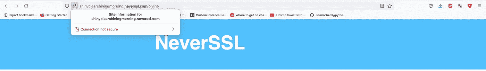
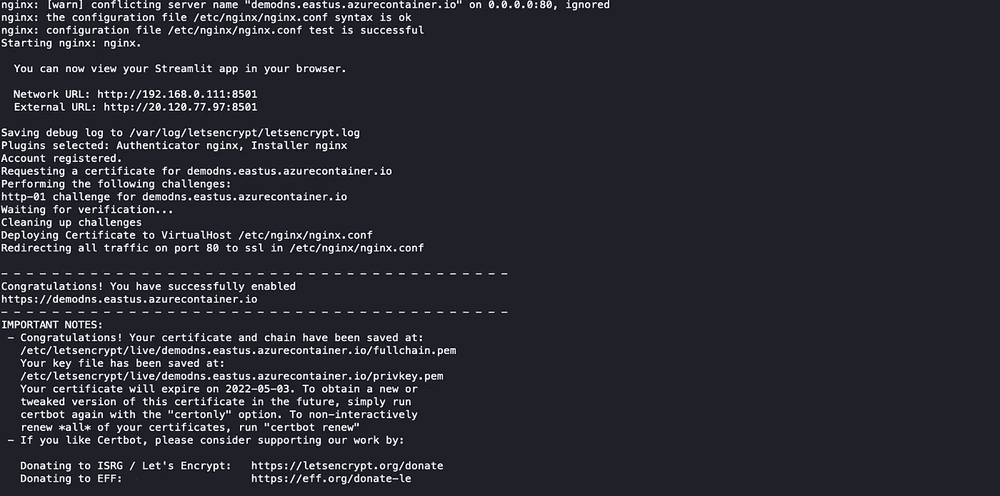
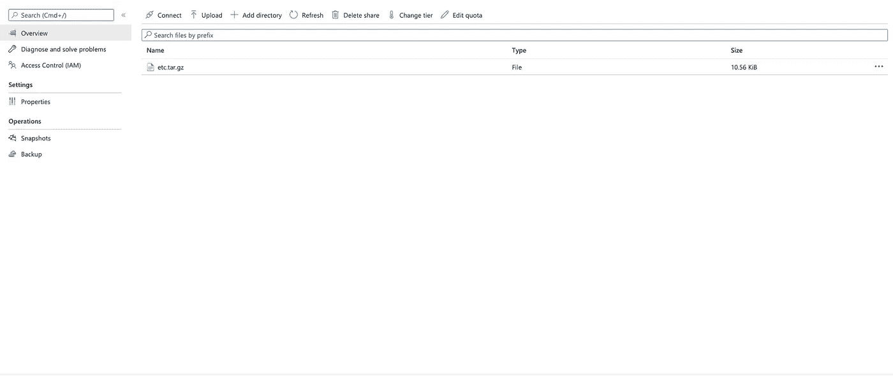

# Azure 上简化 it 部署的初学者指南—第 2 部分

> 原文：<https://towardsdatascience.com/beginner-guide-to-streamlit-deployment-on-azure-part-2-cf14bb201b8e>

## 使用免费 SSL 证书在 15 分钟内在 Microsoft Azure 上部署 Hello World Streamlit 应用程序的完整指南-第 2 部分


本教程的重点将是 SSL。马库斯·温克勒拍摄的照片。

# 介绍

W 欢迎回到我的两部分系列的第二部分**T5 】,这个系列致力于教你如何使用免费的 SSL 证书将 Streamlit 应用程序部署到 Azure。在第一部分中，我们**

*   在本地开发了一个基本的 Streamlit 应用程序
*   使用 Docker 封装我们的 Streamlit 应用程序
*   将我们的 Dockerized 应用程序推送到 Azure 存储库
*   将我们的 Docker 映像部署为容器实例

我们将从停止的地方继续。本教程的重点是向我们部署的网站添加 SSL 证书。如果没有 SSL 证书，访问您页面的访问者将会收到一个明显的浏览器警告，提示连接不安全。根据客户端的浏览器设置，访问者甚至可能被完全禁止访问您的网站。



没有 SSL 证书的网站示例。作者照片。

在本教程中，我们将使用 Certbot 生成一个 SSL 证书，将该证书存储在 Azure 存储中，最后设置一个 cron 任务来自动更新我们的证书。最终，您的 minimal Streamlit 应用程序将可以通过 https 使用有效的 SSL 证书进行访问，该证书将自动更新。我们开始吧！

# 第 1 部分:创建卷挂载

如果我们不能存储证书，那么创建一个 SSL 证书并不是特别有用，这样当我们在进行更改后重新部署我们的应用程序时就可以访问它。如果您想走捷径，在每次启动容器实例时简单地生成一个新证书，这是不可行的，因为 certbot(我们将用于生成免费 SSL 证书的服务)限制了在一段时间内向特定域颁发的证书数量。

因此，我们将首先生成一个 SSL 证书，然后将 SSL 文件存储在 Azure 文件共享中。让我们首先使用下面的命令创建一个存储帐户(将存放我们的文件共享):

```
az storage account create -n NAME_OF_STORAGE -g AMAZING_RESOURCE_GROUP -l AZURE_LOCATION --sku Standard_LRS
```

请确保将上述命令中的变量替换为应用程序的位置和资源组，并为您的存储帐户设置一个自定义名称。请随意打开 Azure 门户以确认您的存储组在那里。

在我们的存储帐户中，我们将使用以下命令创建一个文件共享:

```
az storage share create --account-name NAME_OF_STORAGE --name NAME_OF_SHARE
```

存储名称应该与您刚才在上面创建的存储帐户相同，共享名称可以是您根据自己的喜好自定义的名称。同样，可以通过检查门户来验证您的共享是否存在。

现在是时候将这个文件共享作为卷挂载添加到我们的容器映像定义中了，它存储在 deployment.yml 中。

在此之前，我们应该记下文件共享的密码，可以通过运行

```
az storage account keys list --account-name NAME_OF_STORAGE --resource-group AMAZING_RESOURCE_GROUP
```

这个命令的输出应该会返回您的密码。该密码将用于 deployment.yml 的第 24 行(第 24 行显示为一个占位符)。

如下所示修改您的 deployment.yml。

记下所有注入了变量的行——用它们的真值替换它们。该文件类似于上一教程中的文件，只是增加了第 14–16 行和第 34–39 行。

您的容器实例现在被配置为在部署时附加一个[卷挂载](https://docs.microsoft.com/en-us/azure/container-instances/container-instances-volume-azure-files)。这允许您的实例读写您刚才创建的文件共享。太棒了。

在对 deployment.yml 进行更改后，重新部署您的应用程序。为了方便起见，这里有一个我编写的 bash 脚本，用于在对项目进行更改后加速部署。

```
**#!/bin/bash** az acr login -n NAME_OF_REGISTRY
docker build -t NAME_OF_REGISTRY.azurecr.io/NAME_OF_IMAGE:v1 .
docker push NAME_OF_REGISTRY.azurecr.io/NAME_OF_IMAGE:v1
az container delete --name APP_NAME --resource-group AMAZING_RESOURCE_GROUP -y
az container create --resource-group AMAZING_RESOURCE_GROUP --name APP_NAME -f deployment.yml
```

这些命令将登录到您的 Azure 注册表，构建您的 Docker 映像，将您的 Docker 映像推送到注册表，删除您当前的容器实例，并在其位置部署新的容器实例。

如果您使用的是 Mac 或 Linux，只需将这些行保存在名为 deploy.sh 的文件中，然后运行

```
sh deploy.sh
```

这里有一个更巧妙的技巧:您可以使用以下命令查看正在运行的应用程序的日志

```
az container logs --resource-group AMAZING_RESOURCE_GROUP --name APP_NAME
```

> 请注意，Azure 的 FQDN 连接到您的应用程序通常需要大约 2-5 分钟。如果您在访问 FQDN 时出现 ERR_CONNECTION_TIMED_OUT 错误，请稍等几分钟，然后刷新您的页面。

# 第 2 部分:生成 SSL 证书

现在，我们的存储卷已经装载到我们的实例中，一旦生成 SSL 证书，我们就可以轻松地以持久的方式存储它。所以让我们开始发电吧！

将 run.sh 修改为以下内容:

确保用您的值替换第 6 行的变量。

这个 run.sh 配置应该运行一次，之后你的 SSL 证书应该保存在你的 Azure 文件共享中。就这么简单！它是这样工作的:

*   第 2–3 行:启动 nginx
*   第 4 行:启动我们的 Streamlit 应用程序。此应用程序必须在我们的 FQDN 上运行，以便使用 certbot 获得 SSL 证书。
*   第五行:睡眠 300 秒。这很重要，因为 FQDN 可能需要几分钟时间来指向我们的 Streamlit 应用程序。如果我们的应用程序在我们的域名(FQDN 域名)无法访问。AZURE _ location . AZURE container . io)，certbot 的域所有权验证将失败，并且不会生成 SSL 证书。
*   第 6 行:使用 certbot(安装在 Dockerfile 命令中)为您的域名创建一个 SSL 证书。我花时间弄清楚了命令行标志，以确保这将为您顺利运行。只需替换 FQDN 名称和 AZURE 位置占位符。
*   第 7 行:压缩 SSL 证书，并将其保存在卷挂载上。
*   第 8 行:这个命令运行一个无限循环。这样，您的 Streamlit 应用程序将永远运行下去(只要您的容器实例启动)。如果没有这一行，将会生成并保存 SSL 证书，并且您的容器实例将会立即被终止。这一行确保您的 Streamlit 应用程序在 SSL 证书生成后仍然运行。

立即推送您的应用。如果您从第一部分构建了 bash 文件，您可以简单地输入

```
sh deploy.sh
```

使用以下命令检查日志

```
az container logs --resource-group AMAZING_RESOURCE_GROUP --name APP_NAME
```

您应该会看到一条来自 certbot 的消息，说明证书已经成功生成。请注意，我在 run.sh 文件中添加了一个 300 秒的睡眠命令，以便 Azure 有时间将我们的 Streamlit 应用程序连接到我们的 FQDN。如果 FQDN 没有连接到我们的 Streamlit 应用程序，certbot 的站点所有权验证将会失败。因此，请检查日志，直到您看到与下面类似的成功消息。**编辑:如果认证失败，请为 run.sh 的第 5 行尝试更长的睡眠时间。FQDN 连接可能需要 10 分钟！**



证书生成成功的消息。图片作者。

作为附加检查，请转到您的 Azure 文件共享并检查您的证书是否存在。



SSL 证书应该以压缩文件的形式存在于 Azure 文件共享中。图片作者。

恭喜你！您已经为您的网站创建并存储了 SSL 证书。

# 第 3 部分:将我们的容器指向 SSL 证书

既然 SSL 证书保存在文件共享中，我们应该更改 run.sh 文件，以便每次启动容器实例时，都不会生成新的证书(这不仅是多余的，而且会长期失败，因为 certbot 限制了每周可以分配给单个域的 SSL 证书的数量)。我们新的 run.sh 文件将是:

在第 2 行中，我们在卷挂载上解压缩 SSL 证书。然后我们启动 nginx，最后运行我们的 Streamlit 应用程序。

在我们的站点可以访问 SSL 证书之前，我们还需要添加一个更改。我们必须修改 nginx.conf 文件，指向我们在 run.sh 的第 2 行解压缩的 SSL 证书的位置。

第 47–51 行指示我们的应用程序使用 SSL 证书。确保更改路由以反映 SSL 证书的存储位置。在文件的底部，我们添加了一个规则(301 重定向，永久重定向),将任何流量从 HTTP 连接重定向到我们的域，以使用 HTTPS 连接。因此，即使我们输入 [http://FQDN_NAME。AZURE _ location . AZURE container . io](http://FQDN_NAME.AZURE_LOCATION.azurecontainer.io)，我们将被重定向到[https://FQDN _ 名称。AZURE _ location . AZURE container . io](http://FQDN_NAME.AZURE_LOCATION.azurecontainer.io)。

现在推送我们的应用程序应该会产生一个 SSL 连接的网站。

```
sh deploy.sh
```

您可以通过尝试使用 HTTP 访问您的网站来测试 301 重定向，如果一切正常，您应该会自动重定向到 HTTPS，并在浏览器的搜索栏附近看到一个锁定的挂锁图标，表明连接是安全的。

# 第 4 部分:自动更新 SSL 证书

您的网站现在有一个有效的 SSL 证书。但是，certbot 生成的证书有 90 天的有效期。如果我们忽略这一点，我们的网站将在 3 个月后回到不安全的连接(或者更糟，显示一个无效的 SSL 证书错误)。由于没有使用 certbot 定期更新证书的内置方法，我们将简单地使用 cron 每月运行一次 certbot 命令。

为了实现这一点，我们只需在 Dockerfile 中添加第 26 和 28 行，它将每月执行一次认证命令(在第 12 天)，并将新创建的 SSL 证书压缩到附加的卷 mount 中。

我们还必须确保 cron 是在 run.sh 文件中启动的:

用上面的文件替换您的 run.sh 文件。

完美！您现在可以高枕无忧，因为您的 SSL 证书将继续无限期更新，从而为您的所有访问者提供不间断的安全连接。

# 清理

为了最大限度地减少对你的 Azure 帐户的收费，删除你不再需要的资源是一个好主意。如果你想从你的 Azure 帐户中删除本教程的所有痕迹，请不要忘记删除:

*   容器实例
*   Azure 存储帐户
*   Azure 容器注册表

# 结论

祝贺您完成了这个由两部分组成的教程！请记住，这种部署创建了一个无服务器的实例，这意味着您的 webiste 存在一些限制(例如，您不能设置名称服务器并注册从 godaddy 购买的域名，也就是末尾没有“. azurecontainer.io”的域名)。为了做到这一点，考虑创建一个[专用虚拟网络](https://azure.microsoft.com/en-ca/free/virtual-network/search/?&ef_id=Cj0KCQiAxoiQBhCRARIsAPsvo-zcX1zoG4yFbuRRnfqo-9P9Zw--wnvMi3r9SdjFBRpwCg91i9RYXh8aAhXqEALw_wcB:G:s&OCID=AID2200157_SEM_Cj0KCQiAxoiQBhCRARIsAPsvo-zcX1zoG4yFbuRRnfqo-9P9Zw--wnvMi3r9SdjFBRpwCg91i9RYXh8aAhXqEALw_wcB:G:s&gclid=Cj0KCQiAxoiQBhCRARIsAPsvo-zcX1zoG4yFbuRRnfqo-9P9Zw--wnvMi3r9SdjFBRpwCg91i9RYXh8aAhXqEALw_wcB)，这将允许您更多地控制您的网络和基础设施。

我希望本教程在您的 Streamlit 部署过程中为您节省了大量时间和压力！如果你愿意，可以在评论中分享你部署的容器的链接！欢迎关注我，获取更多与机器学习、数据科学、投资和区块链相关的实践教程。感谢您的阅读！

链接:

领英:【https://www.linkedin.com/in/sergei-issaev/ 

github:[https://github.com/sergeiissaev](https://github.com/sergeiissaev)

https://www.kaggle.com/sergei416

中:【https://medium.com/@sergei740】T4

推特:[https://twitter.com/realSergAI](https://twitter.com/realSergAI)

了解更多关于 Vooban 的信息:[https://vooban.com/en](https://vooban.com/en)