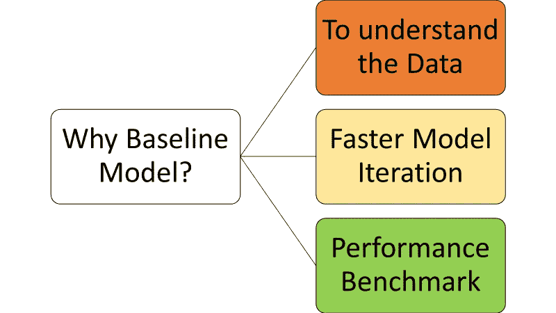
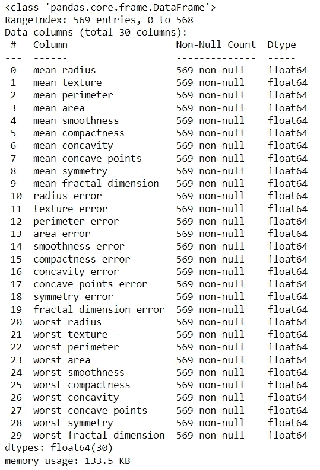
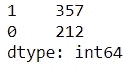
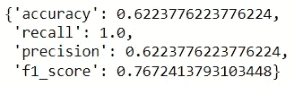
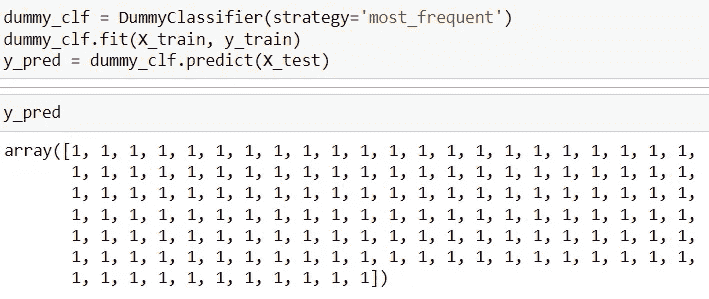
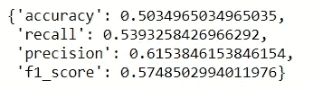
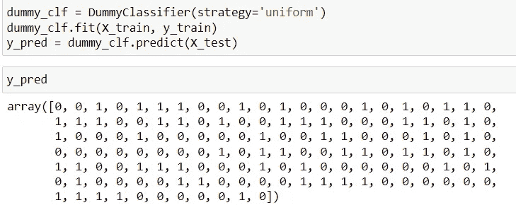
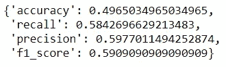
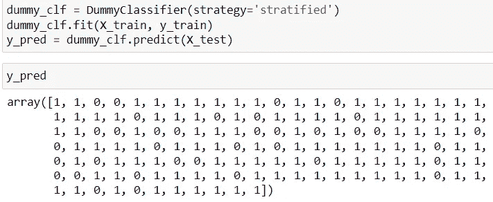
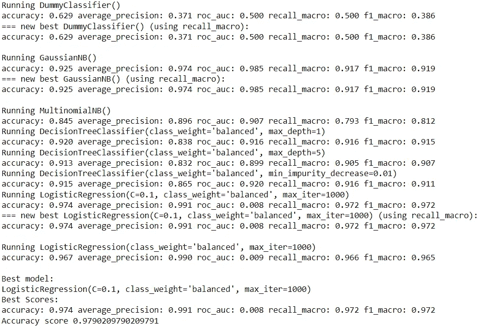

# 机器学习项目的初学者基线模型

> 原文：<https://towardsdatascience.com/beginners-baseline-model-for-machine-learning-project-f835ebd53ee0>

## 学会标准化你的机器学习开发


[附身摄影](https://unsplash.com/@possessedphotography?utm_source=medium&utm_medium=referral)在 [Unsplash](https://unsplash.com?utm_source=medium&utm_medium=referral) 上拍照

机器学习开发是公司雇佣数据科学家的一个原因。企业有一个业务问题，数据科学家用他们的 ML 模型解决这个问题。然而，我们怎么知道我们的模型足以解决问题呢？或者我们甚至需要机器学习吗？。这就是我们需要基线模型的地方。

在本文中，我想向您介绍什么是数据科学领域的基线模型，以及拥有一个基线模型有多重要。此外，我们将学习一些关于如何创建基线模型的知识。让我们开始吧。

# **基线模型**

什么是基线模型？**我们可以将基线模型定义为实际模型的参考。**基线模型应该是一个简单的模型，用作比较，并且易于解释。此外，基线模型应该基于数据集来创建实际的模型。

为什么我们希望在我们的项目中有一个基线模型？主要有三个原因。



作者图片

## 了解数据

基线模型帮助我们更好地理解我们的数据，主要与模型创建相关。在基线模型创建过程中，我们将获得一些信息，包括:

*   **数据集预测能力。预测很少或没有预测的基线模型可以指示低信号或低拟合。**
*   **数据集子集分类**。基线模型可以帮助我们识别数据集的哪一部分更难分类。这些信息将允许我们选择模型。
*   **数据集目标分类**。观察和基线模型还提供了哪些目标值更难确定的信息。

## **更快的模型迭代**

有了基线模型，模型开发和其他过程将变得更加容易。基线模型如何让事情变得更快？例如，您的基线模型将成为构建模型的参考，有时您的基线模型对于业务用户来说已经足够了。

## **性能基准**

在开发实际模型时，我们使用基线模型来获得我们所反对的性能指标。有了基线模型，我们可以评估我们是需要一个复杂的模型还是已经为业务工作的简单模型。此外，我们可以使用基线模型对业务 KPI 进行基准测试。

# 创建基线模型

我们已经理解了基线模型以及拥有基线模型的优势；现在，我们只需要创建一个。然而，什么可以被认为是基线模型？我们可以使用任何东西作为基线模型，从简单的方法到复杂的模型。但是，一个太复杂的模型会挫败基线模型的目的——简单和快速，所以我们通常只在复杂模型是研究的基准时才使用它。

如果我们想要对一个基线模型进行分类，我会将它们分成两组:

1.  简单基线模型
2.  机器学习基线模型

## **简单基线模型**

简单基线模型是一个具有简单逻辑来创建基线的模型。它可以是简单的随机模型预测或特定的基于规则的模型。关键是要有一个简单的模型，我们可以用它来对实际模型进行基准测试。

一个简单的基线模型可能来自**简单的统计学、商业逻辑或各种随机模型。**这些差异也可以归结为建模问题，例如:

1.  结构化数据或非结构化数据
2.  监督或非监督问题
3.  分类或回归

根据定义，您可能想要不同的基线模型。但是，为了举例，让我们坚持分类表格模型问题。我将使用下面的乳腺癌数据集示例。

```
import pandas as pd
from sklearn.datasets import load_breast_cancer
from sklearn.model_selection import train_test_split
from sklearn.dummy import DummyClassifier
from sklearn.metrics import accuracy_score, f1_score, recall_score, precision_scoredf = load_breast_cancer()
df.keys()
X, y = pd.DataFrame(df['data'], columns =df['feature_names'] ), pd.Series(df['target'])
X.info()
```



作者图片

我们可以看到我们的数据集由 30 个数字列组成。让我们看看目标分布。

```
y.value_counts()
```



作者图片

正如我们在上面看到的，分布与目标 1 略有不平衡，但没有那么大。

我们希望使用当前数据集创建一个分类模型来预测乳腺癌患者；我们需要一个基线模型作为基准。现在，我们将在 Scikit-Learn 的`DummyClassifier`的帮助下创建各种简单的基线模型。

什么是`DummyClassifier`？它是一个忽略输入特征的分类器，为简单基线创建一个分类器，以便与其他更复杂的分类器进行比较。我们可以在课堂上使用不同的策略。让我们试着一个一个去探索。

首先，我将创建一个允许我们生成基线模型的函数。

```
#Function for evaluation metrics
def print_binary_evaluation(X_train, X_test,y_train, y_true, strategy):
    dummy_clf = DummyClassifier(strategy=strategy)
    dummy_clf.fit(X_train, y_train)
    y_pred = dummy_clf.predict(X_test)
    results_dict = {'accuracy': accuracy_score(y_true, y_pred),
                    'recall': recall_score(y_true, y_pred),
                    'precision': precision_score(y_true, y_pred),
                    'f1_score': f1_score(y_true, y_pred)}
    return results_dict
```

我们将通过准确度、召回率、精确度和 F1 分数来评估基线模型。然后我会尝试分割数据集。

```
X_train, X_test, y_train, y_test = train_test_split(X, y, random_state = 42)
```

让我们使用上面的函数来测试每个基线模型策略。

**最频繁(模式)**

这是最简单的策略，我们预测数据集中最频繁的标签。我们将目标 1 作为数据集中最常见的目标，因此分类器将始终有一个预测 1。

```
print_binary_evaluation(X_train, X_test, y_train, y_test, 'most_frequent')
```



作者图片

如果我们去掉哑分类器，预测结果类似下图。



作者图片

通过始终预测 1，我们实现了 0.62 的准确度和 0.76 的 F1 值。从机器学习的角度来看，这并不坏，但建议所有患者都患有乳腺癌会对企业有好处吗？显然不是。

至少，我们现在有了复杂模型的基线模型。让我们试试另一个策略。

**制服**

统一策略创建一个基线模型，该模型使用随机统一分布进行预测。这意味着所有目标成为预测输出的概率相似。

```
print_binary_evaluation(X_train, X_test,y_train, y_test, 'uniform')
```



作者图片

正如我们从上面的结果中看到的，因为基线模型预测分布是一致的，所以指标接近 50%。



作者图片

结果通常也更接近均匀分布。

**分层**

分层策略是创建遵循目标分布的基线模型的策略。它适用于不平衡数据，因为它反映了实际分布。

```
print_binary_evaluation(X_train, X_test,y_train, y_test, 'stratified')
```



作者图片

我们可以看到，这些指标的结果与采用统一策略的基线模型相似，因为分布几乎完全相同。



作者图片

我们可以看到，目标 1 略微主导了结果，因为它是主导标签。

总的来说，简单基线模型是一种忽略输入数据并且只关注预测结果的预测模型。如果我们使用上面的简单基线模型作为基准，我们可能希望比只预测每个人都患有乳腺癌的模型更好。

还有另一种方法来开发基于业务逻辑的简单基线模型，但是它需要领域知识和业务理解。我在另一篇文章中写过这个话题，你可以参考一下。

[](/how-to-set-technical-metrics-data-science-project-for-business-7e77084448a4) [## 如何为企业设置技术指标数据科学项目

### 技术 KPI 是数据科学项目中的必备要素

towardsdatascience.com](/how-to-set-technical-metrics-data-science-project-for-business-7e77084448a4) 

## **机器学习基线模型**

基线模型不仅仅是一个简单的基线模型，你也可以实现一个机器学习模型。**与 ML 基线模型的不同之处在于，您仅在针对比基线模型更复杂的模型时使用它。**

例如，您希望使用 XGboost 模型进行预测，因此您的机器学习模型可能是决策树模型。

如果你是一个新模型的研究人员，你会想要最先进的模型作为基线模型。

无论哪种方式，你都可以有一个机器学习模型作为你的基线模型，但总是用它来测试你的实际模型。

# 自动化基线模型开发

使用名为 [dabl](https://github.com/amueller/dabl) 的 Python 包来自动化基线模型开发是可能的。它是一个简单的包，迭代了许多简单的基线和机器学习模型。

让我们尝试使用 dabl 包。首先，我们需要安装软件包。

```
pip install dabl
```

然后，我们将使用下面的代码来开发基线模型。

```
sc = dabl.SimpleClassifier().fit(X_train, y_train)
print("Accuracy score", sc.score(X_test, y_test))
```



作者图片

该模型将运行到所有基线模型，并带有基本的度量信息。现在由我们来决定如何翻译基线模型信息。也许基线模型已经很好了，我们不需要复杂的模型？这当然有可能发生。

# 结论

基线模型是数据科学项目的一个重要方面，因为它可以在以下方面为您提供帮助:

*   了解您的数据
*   更快的模型迭代
*   性能基准

根据您的数据科学项目问题，有许多方法可以开发您的基线模型。大多数时候，我们可以将基线模型分为两种类型:

*   简单基线模型
*   机器学习基线模型

希望有帮助！

在我的 [**LinkedIn**](https://www.linkedin.com/in/cornellius-yudha-wijaya/) 或 [**Twitter**](https://twitter.com/CornelliusYW) 上访问我。

> *如果您喜欢我的内容，并希望获得更多关于数据或数据科学家日常生活的深入知识，请考虑在此订阅我的* ***简讯。***

> *如果您没有订阅为中等会员，请考虑通过* [*我的推荐*](https://cornelliusyudhawijaya.medium.com/membership) *订阅。*