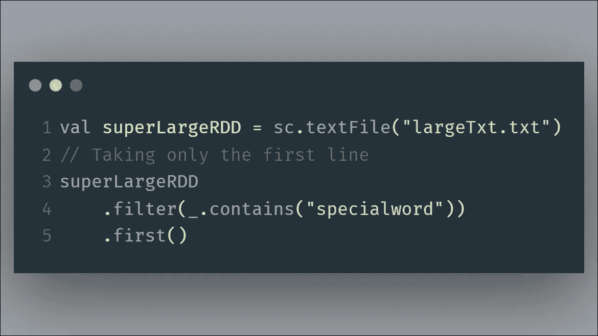
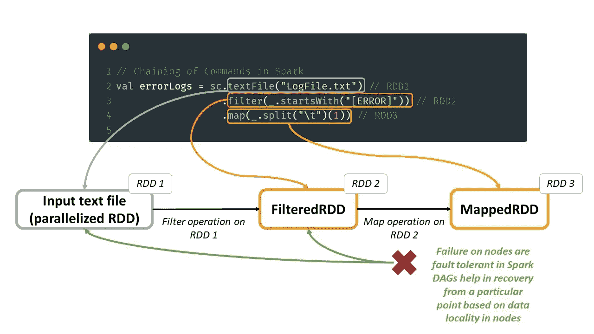
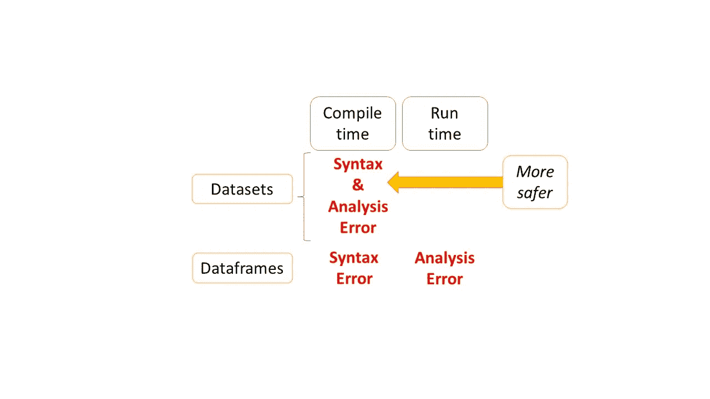

# 正确选择 Spark API 的初学者指南:rdd、数据帧和数据集

> 原文：<https://towardsdatascience.com/beginners-guide-for-choosing-the-correct-spark-api-rdds-dataframes-datasets-23c94041f575>

## 何时使用 rdd、数据帧和数据集？激发正确的选择！

📷[露西·希斯](https://unsplash.com/@capturebylucy?utm_source=medium&utm_medium=referral)在 [Unsplash](https://unsplash.com?utm_source=medium&utm_medium=referral) 拍摄的照片

# 介绍

当开始使用 Spark 编程时，我们将可以选择使用不同的抽象来表示数据——灵活地使用三种 API(rdd、数据帧和数据集)中的一种。但是这个选择需要小心处理。随机选择 API 会影响 ETL/ELT/ETLT 管道和分布式集群的性能。

我在**粗体**中强调了 Spark 架构中使用的关键点和有用术语。

# 动机

我最近一直在与 Spark 合作，并有机会研究和体验不同 Spark APIs 的优缺点。

我也使用过熊猫在进入 Spark 之前提供的数据结构。对于处理大数据用例，与小数据项目相比，我们需要有不同的思维模式。

本文将对那些经历类似的向分布式数据领域过渡的人有所帮助。因此，我想分享我在处理跨多个节点的大数据项目时如何选择合适的 API 的经验。

# Spark 中使用的基本术语

Spark 中使用的 API 利用了这两个基本术语:

## A.分布式执行-驱动程序和工作程序节点

在 Spark 架构中，使用两种类型的机器/节点/计算基础设施，即驱动程序和工作程序来支持并行执行。

把它们想象成我们如何解决一个大型拼图游戏:

a)我们可以同时开始处理它的不同部分。在 Spark 架构中，它是一组同时处理任务的机器/节点(也称为**工作节点**)。

b)然后我们连接/还原结果，以从拼图中获得完整的图片。在 Spark 中，最终结果被发送回用户应用程序可以使用的**驱动节点**。

## **B .惰性评估-转换&动作**

用 Spark 编写的代码被分成**转换**和**动作**。两者都是基于 spark 函数的形式，但不同之处在于它们的使用方式。
转换**的谱系**以**有向无环图(DAG)** 的形式收集，并在驱动节点触发**动作**时执行。在 DAG 的帮助下，Spark 可以进行关键优化，以减少执行时间并提高节点集群的性能。

在并行计算中，考虑下面的 Spark 命令，它过滤一个大的文本文件，并在第一行搜索一个特殊的单词。

为什么懒在火花好！[图片由作者提供]

所需的数据量远远少于查询的数据量，在这种情况下，第一行是需要考虑可以应用过滤器的数据。因此，通过整理**转换** Spark 将构建一个最佳计划来一起执行它们。这也减少了驱动程序和工作节点之间的往返次数，减少了它们之间所需的数据 I/O 量。

# 在 Spark 中与三个火枪手(API)合作

这一节深入探究了三个火枪手(即 RDDs、Dataframes 和 Datasets)的细微差别。引入它们是为了处理将跨节点分布的数据。

它们作为 Spark 中的特性被引入的时间线同样重要。它解释了一个 API 的缺点如何成为优化后续 API 的触发因素。

在接下来的四个小节中，我们从 rdd 的用例开始，然后分别阐述 Dataframe 和 Dataset API，最后讨论 Dataset 与 Dataframe API 的统一以及何时使用这些 API。

# 1.RDD(弹性分布式数据集)

rdd 是 Matei Zaharia 等人在 2012 年作为内存计算的容错抽象提出的([会议资源](https://www.usenix.org/system/files/conference/nsdi12/nsdi12-final138.pdf))。

随着 RDD 在 Spark 体系结构中的引入，与使用细粒度读/写转换的分布式共享内存系统相比，它显得更加有效。

缩写 RDD 可以拆分来理解它的定义:

*   *:数据的处理方式是容错的，Spark 能够在数据损坏的情况下随时重建数据。这是由于在 Spark 操作中使用的**有向无环图(DAGs)** 。*
*   ****分布式数据集*** :我们通过 Spark 上下文馈入 Spark 的数据将被存储为分区。*

*它们是 Spark 优化引擎使用的低级 API。需要注意的重要一点是，Spark 中的大多数查询最终都会简化成这种形式，因此它确实是 Spark 中的低级 API。*

*这是为开发人员在分布式架构中实现**容错**而引入的，这是通过在节点集群之间使用受限形式的共享内存来实现的，基于形成谱系的粗粒度转换，而不是依赖于细粒度更新。*

**

*DAGs 在 Spark 中带来容错行为[图片由作者提供]*

## *何时使用 rdd？*

*   *当您处理需要在行/记录级别转换特殊数据结构(文本或媒体文件)的操作时。*
*   *当在粒度级别修改数据的灵活性更重要时。*
*   *当模式变得与您的用例无关，但并行化会有所帮助。*
*   *当您不打算使用**特定于领域的表达式时(*想想 Spark SQL 抽象)****

## ***何时避免使用 rdd？***

*   *当您想要强加模式并使用 Spark catalyst 优化以及列名访问时。*
*   *当你想为简单的 API 操作避免复杂的编码结构时，例如寻找一个文件中单词的平均频率。*

# *2.数据帧*

*Spark 1.3.0 版本(2015 年初)中引入了数据帧。它是 RDDs 的高级抽象，由一个模式提供支持，该模式还允许 Spark 使用 **Catalyst optimizer** 在运行时执行更多的自动化优化。*

*当连接两个 rdd 时，由于**催化剂优化器**的存在，将它们转换成数据帧可能是有益的。它使用 Scala 中的准引号和模式匹配来加速执行过程。*

*可以使用以下方式创建数据帧:*

*   *从 RDDs 使用 *inferSchema* 选项(或)使用自定义模式。*
*   *来自不同格式的文件(JSON、Parquet、CSV、Avro 等。).*
*   *从数据集中使用 ***隐式转换***`***toDF***`*的方法。**

## **数据帧的非类型化本质——运行时的类型检查**

**数据帧是一组保存数据的通用行对象，它们有类型。单词 **untyped** 表示对数据帧进行类型检查的时间。仅在 ***运行期间*** 根据用户推断或定义的模式完成。**

## **数据框架的缺点**

*   **它无法通过优化有效地使用 UDF。**
*   **缺乏 Scala/Java 中可以实现的强类型。**

# **3.数据集**

**Spark 1 . 6 . 0 版(2016 年初)引入了数据集。它本身带来了在 ***编译时*** 进行强类型检查的优势。**

**引入类型安全的基本概念是通过**编码器**的引入，它可以将类型 T 的 JVM 对象转换成内部二进制表示。也是序列化&反序列化( **SerDe** )框架**。**编码器表示记录的模式，这避免了 JVM 对象的不必要的转换。它强制执行从域对象到内部二进制表示的映射。与 Java 或 Kryo 序列化相比，它们提供了超快的转换。**

## **数据集的类型化本质——编译时的类型检查**

**强类型数据集 API 带来了使用 Scala 中的 case 类或 Java 中的 bean 对象来创建将在编译时强制执行的模式的优势。**

**只有数据集才有检查语法和分析错误的能力。**

****

**数据框架和数据集 API 中的类型检查[图片由作者提供]**

**这种强大的类型检查将节省开发人员的时间和成本。**

## **数据集的特征**

*   **对半结构化数据的无缝支持。**
*   **编译时类型安全(语法+分析错误)。**
*   **编码器提高了序列化/反序列化的速度。**
*   **Java 和 Scala 的单一 API。**

# **4.数据集和数据框架 API 的统一**

**Dataset 和 Dataframe 是独立的 API，直到最后两个*火枪手*在 Spark 2.0.0 版本(2016 年末)中组合成了**统一的 Dataset API** 。**

**这种统一将 rdd 和 Dataframe APIs 的优点结合在一起。**

****

**数据框架和数据集 API 的统一(Spark 2.0+)[图片由作者提供]**

**Dataframe 成为了`**Dataset[Row]**`的类型别名。就语言而言，数据帧仍然是 Python 语言的主要抽象，因为它们类似于单节点数据帧。在 Scala & Java 中，datasets 代表 API 的类型化版本，dataframe 是非类型化版本。**

## **何时使用统一数据集[Dataframe / Dataset] API？**

*   **当我们计划在特定领域的抽象(聚合、连接等)上使用高层抽象时。)和模式实施。**
*   **列访问，lambda 作用于半结构化数据。**
*   **为了在编译时进行更高级别的类型安全检查，我们可以使用统一数据集 API 的类型化版本。**
*   **受益于**钨代码生成(*使用 dataframe/SQL 操作符* )** 的更快表达式求值。**
*   **r 建议用户使用数据框架(数据集不可用)。**
*   **Python 用户也可以使用数据框架(数据集不可用)。**

# **结束语**

**毫无疑问，对于大数据用例来说，一种通用的 API 是不存在的。关键的一点是，我们要根据我们面临的场景选择正确的 API:输入文件的类型、选择的编程语言、将要执行的处理类型以及流程中的操作量。**

**另外，请注意，这三种类型之间的转换是无缝的，可以使用简单的方法调用来完成。因此，如果您注意到使用特定的 API 在速度和效率方面是有益的，那么转换将是利用其优势的最佳选择。**

**在撰写本文时——在 Spark (3.2.X)的最新版本中，有更多关于 API 进一步标准化的讨论，Python 中熊猫 UDF 的优化以及 PySpark 中对熊猫 API 的支持。谈到 Apache Spark，变化的可能性是无穷的。**

**你可以在 [LinkedIn](https://www.linkedin.com/in/lingeshwaran-kanniappan-157455117/) 上与我联系，进行简短的交谈。**

***你可以在这里* *阅读我的其他文章* [*。下次见！*](https://medium.com/@lingeshk)**