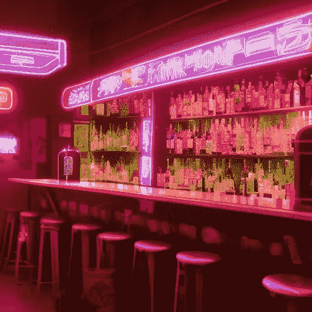
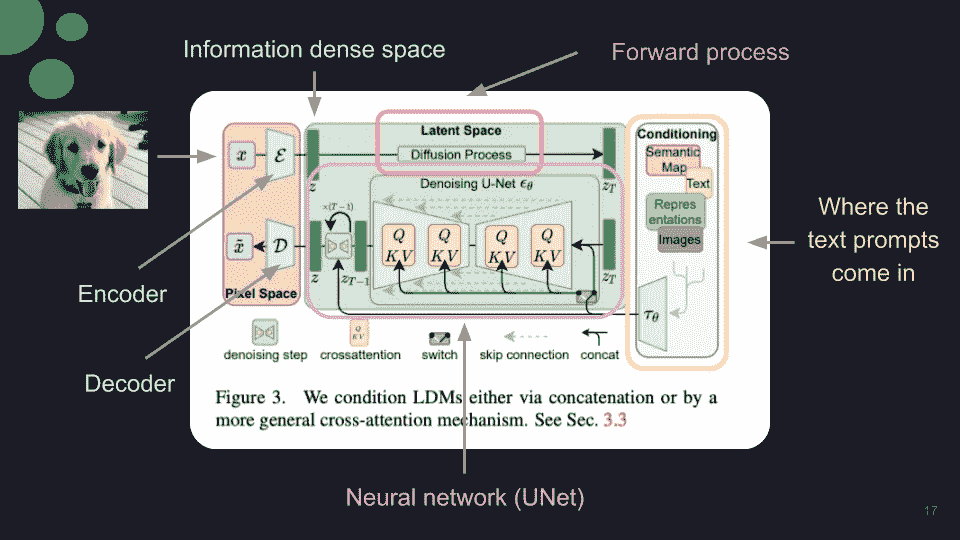
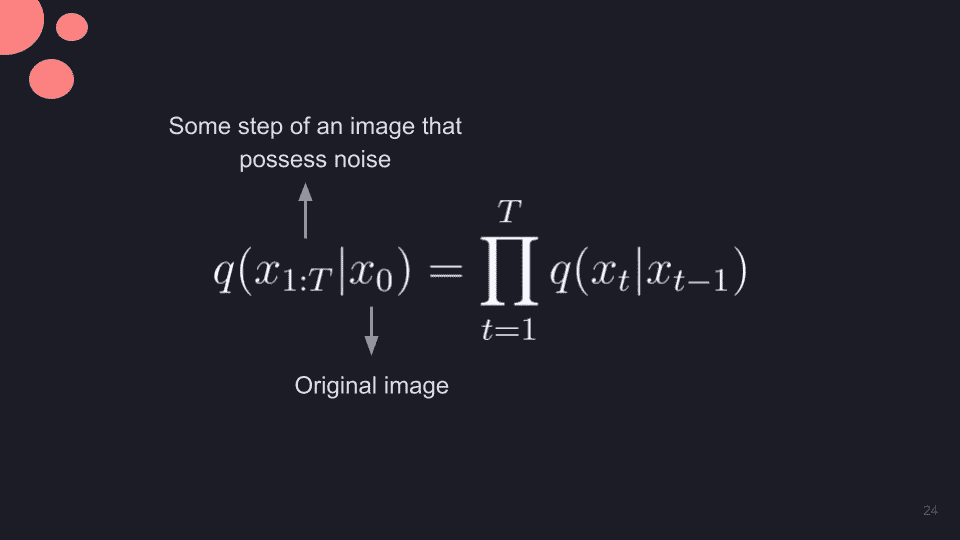
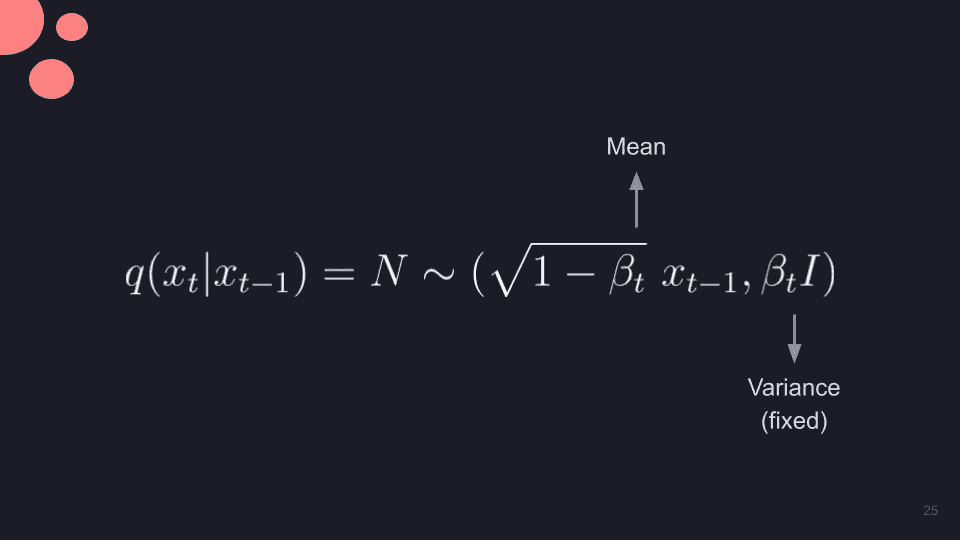
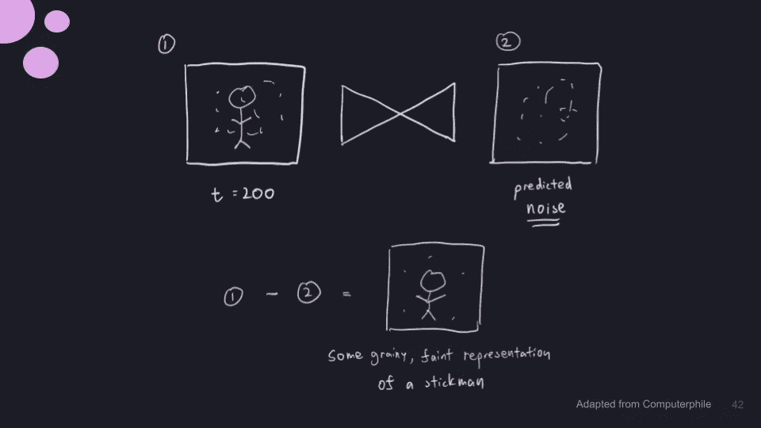
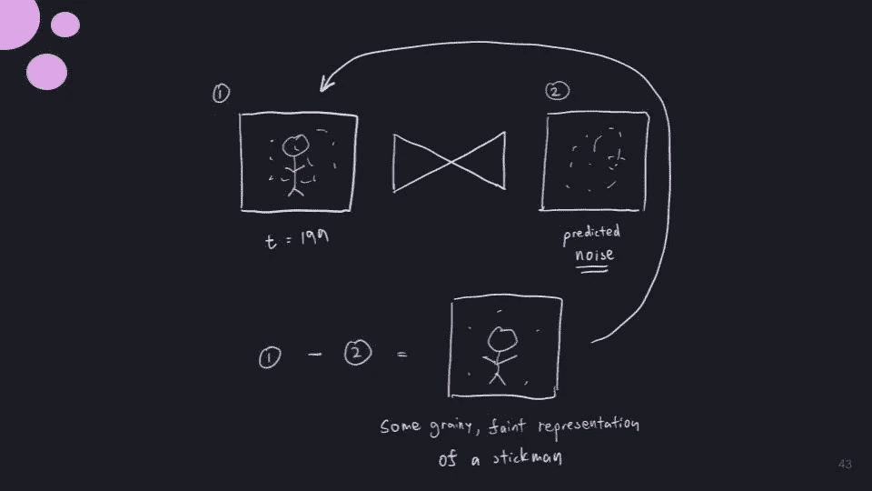
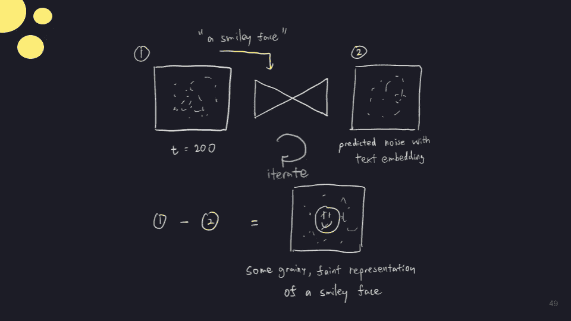
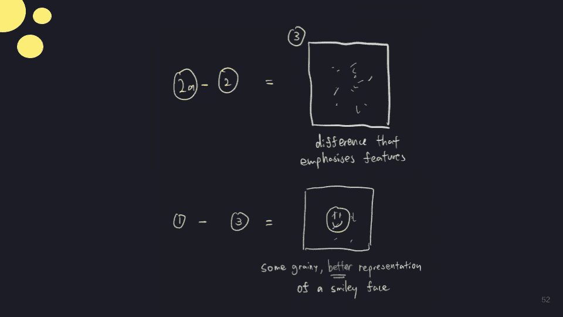

# 扩散模型入门指南

> 原文：<https://towardsdatascience.com/beginners-guide-to-diffusion-models-8c3435ccb4ae>

## 对人工智能生成的艺术如何通过稳定扩散、中途或 DALL-E 制作的直观理解

用稳定扩散生成的莎菲朋克吧。图片由我提供。

最近，人们对 OpenAI 的 DALL-E、Stable Diffusion(DALL-E 的免费替代品)和 Midjourney(托管在 Discord 服务器上)的兴趣越来越大。虽然人工智能生成的艺术非常酷，但更吸引人的是它最初是如何工作的。在最后一部分，我将包括一些资源，供任何人在这个人工智能艺术空间开始。

那么这些技术是如何工作的呢？它使用了一种叫做潜在扩散模型的东西，其背后的想法其实很巧妙。

# 什么是扩散模型？

> 本质上，这是一个两阶段的过程。
> 
> 首先，它破坏输入，直到只剩下噪声。
> 
> 其次，我们使用神经网络从噪声中恢复输入，以产生新生成的图像。

记住前面提到的核心思想，让我们看看架构(参考这个[链接](https://arxiv.org/pdf/2112.10752.pdf)获得全文)。

用潜在扩散模型合成高分辨率图像:【https://arxiv.org/pdf/2112.10752.pdf】T2。我做的附加注释。

了解该体系结构中的某些部分非常重要。有相当多的符号，所以让我从分解它们开始。

我们从 x 开始，这是原始图像。我们把它输入到网络中的编码器，在那里它将被编码到一个叫做 z 的信息密集空间。

然后，我们将经历一个前进的过程，在这个过程中，我们对文本进行扩散和调节。该机制将文本嵌入与我们已经处理的图像相结合，并且合并的输入是扩散过程的初始噪声的一部分。

在此之后，它将通过一个神经网络，主要是预测图像中噪声的 UNet(卷积神经网络的一种形式)。

最后，通过解码器重构噪声，产生你想要的图像。

在这里，我想强调一下我认为该架构最重要的三个部分:

1.  扩散的正向过程
2.  神经网络本身
3.  调节方面

# 正向过程

概括地说，扩散模型通过逐渐增加噪声来破坏一些输入。这个转发过程可以使用 [**马尔可夫链**](https://en.wikipedia.org/wiki/Markov_chain) 来完成。

## 马尔可夫链表示

由于添加噪声的过程是一系列事件，其中每个时间步都依赖于前一个时间步，因此我们可以使用马尔可夫链。

图一。向图像添加噪声的公式。我的插图。

对于一个特定的图像，x₀，我们可以通过添加一系列噪声，特别是高斯噪声来创建一个有噪声的图像。

## 高斯噪声

噪声采样方式实际上可以用以下公式描述:

图二。噪声方程。我的插图。

这是一个有条件的高斯分布，取决于前一个图像和一个特定的方差。这里描述了分布的均值和方差。

让我们更仔细地看看这个等式。贝塔序列被称为**方差表**，它描述了我们想要在每个时间步长添加多少噪声。把它想象成一张关键是时间的地图，值基本上就是你想产生多少失真。

请注意，平均值总是基于之前的图像，因此每次添加噪声时，基本上都是对之前的图像进行细微的调整。这使得小的修改进一步扭曲了图像。

## 贝塔

那么贝塔到底是什么？为了理解 Beta，让我们首先快速回顾一下图像是如何工作的。我们知道图像是由像素组成的，每个像素有 3 个通道——(R)ed，(G)green，(B)lue。

假设我们有一个纯绿色的像素(-1，1，-1) [R，G，B]。我们采用特定的通道(绿色)并应用图 2 中*的等式。*

回顾过去，我们观察到，选择更大的β意味着像素分布更宽，因为方差更大。然而，这也意味着正态曲线进一步向 0 移动，因为均值项受到影响。

因此，当图像偏离原始图像越来越远时，图像会变得越来越糟糕。

## 噪声调度

在每个特定的时间步长 t，将会应用特定的β值。这个贝塔序列被称为噪声时间表。

目的是添加适量的噪声，这样我们可以得到均值为 0 且在所有方向上方差固定的各向同性高斯分布。这使得去噪过程运行良好。

有许多策略来执行噪声调度，包括但不限于:

*   线性的
*   s 形的
*   二次的

# 神经网络

现在我们已经讨论了正向过程，让我们来讨论如何“反转”整个序列并预测只有噪声的图像。

这就是神经网络派上用场的地方。把它想象成去噪，一步一步地去除图像的“杂质”，直到它恢复或产生非常好的图像。神经网络在取自 LAION-5B 的成对图像和标题上进行训练，LAION-5B 是一个公开可用的数据集，来自于从网络上搜集的常见爬行数据。

我们预测噪声而不是整个图像本身的原因是它在计算上更可行。这是因为一幅图像有大量的复杂性，而噪声只是噪声。

图三。去噪示例。我的插图。

考虑图 3 中*所示的例子。在这里，我们有一个非常嘈杂的图像在时间步骤 200，这应该揭示一个坚持的人，如果你完全降噪的图像。神经网络预测我们在(1)处看到的图像上的噪声，并产生噪声作为(2)中所示的输出。*

之后，我们从有噪声的图像中减去噪声，得到一个棍子人的模糊的图像。

图 4。迭代循环。我的插图。

我们在 for 循环中一直这样做，直到最终到达原始图像。

拼图的最后一块是实际生成带有文本的特定图像。这可以通过最后一种机制——调节来实现。

# 调节

让我们以嘈杂的图像为例，但这次我们也添加了“一个笑脸”的文本提示，如图*图 5* 所示。

图五。带文本提示的噪声图像。我的插图。

它通过神经网络，将再次预测噪声，但它将使用通过训练获得的笑脸的相关潜在空间表示来预测噪声。

本质上，它对笑脸产生的噪音有一个粗略的概念，并将其纳入预测。

我们再次减去噪声，从时间步长 200 到 199。我们像以前一样，反复重复这个过程，但是这次再次输入文本提示，聚焦并放大我们想要的对象——一个笑脸。

## 附加技巧

为了更好地得到我们想要的，我们可以使用一些额外的技巧。我们可以利用无分类器指导(CFG)来使输出更加依赖于提示。

当你自己玩稳定扩散时，你可能会看到一个叫做 CFG 的滑块，这个值越高，就越接近你的描述。

图六。输入两次。我的插图。

我们通过向神经网络发送两次输入来做到这一点，一次是带有文本嵌入的的**，一次是没有文本嵌入的**的**，如图 6 中的*所示。***

图 7。求差以得到笑脸的更好表示。我的插图。

这会产生两组噪声图像，我们可以取其差值并将其馈入网络以放大该信号，如图*图 7* 所示。

# 将一切拼凑在一起

作为用户，我们希望为模型提供文本提示，以生成我们想要的图像。这种方法被称为 **txt2img。**

典型的提示结构如下:

> "[主要主题的[图片类型]，[样式提示]"

通过给模型输入提示，我们实际上是在使用模型的条件和神经网络部分来产生我们想要的图像。使图像有噪声的前向过程仅用于训练，而不是我们在此阶段所关心的。

至此，我们对这项技术的工作原理有了更好的理解。如果您想亲自尝试，请查看以下资源:

*   [DALL-E](https://openai.com/dall-e-2/)
*   [稳定扩散](https://huggingface.co/spaces/stabilityai/stable-diffusion)
*   [中途](https://midjourney.com/)

感谢您阅读另一本**初学者指南。例如，如果你对卷积网络的工作方式感兴趣，一定要看看我写的另一篇文章[这里](https://medium.com/towards-data-science/beginners-crash-course-to-deep-learning-and-cnns-a32f35234038)简单地解释了一切。**