# 逻辑回归初学者指南

> 原文：<https://towardsdatascience.com/beginners-guide-to-logistic-regression-eb1e9af717ae>

## 它是什么，如何工作，何时使用

如果你想进入机器学习领域，逻辑回归是构建知识工具箱的必备工具。这是机器学习的基本构件之一。逻辑回归对于机器学习来说是一个简单而强大的工具。你会发现逻辑回归到处都在使用，无论是在工业界还是学术界。如果你正在开发在专业或研究环境中使用的机器学习技能，你需要对逻辑回归了如指掌。

让我们浏览一个示例数据集。为了简单起见，数据将是 2D，我们将只处理两个输出类，蓝色和橙色。

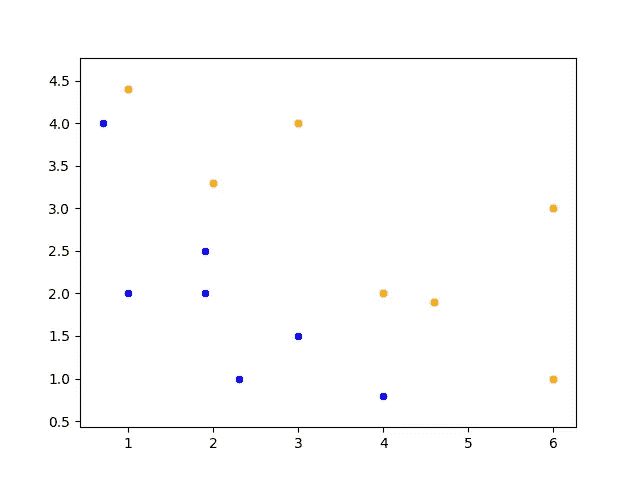

(作者的图表)我们的数据集的绘图，由输出类着色

逻辑回归本质上是线性分类。它不是试图找到数据集的[线性近似，而是旨在找到一个线性分类来将数据集分配给输出类。它基本上找到了在 N 维空间中分隔两个类的最佳线](/closed-form-solution-to-linear-regression-e1fe14c1cbef)

如果数据点位于与其类别相对应的线的一侧，则该数据点被正确分类。这也可以定义为从点到线的距离与类具有相同的符号。

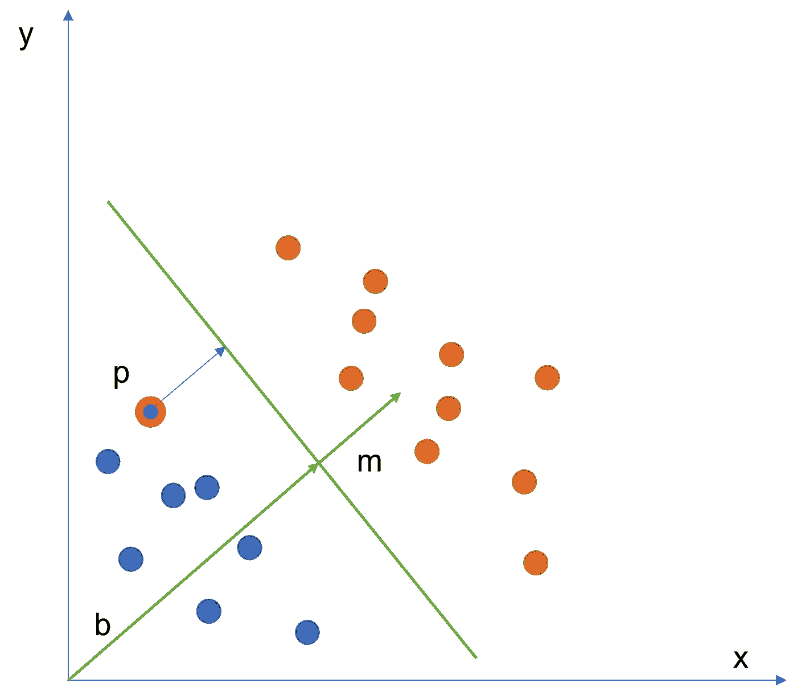

(作者提供的图表)描述了点到线的距离计算

N 维向量空间中的一条线可以由有向单位向量 *m* 和偏置向量 *b* 定义。对于线上的每个 N 维点 *x* ，以下等式成立:

N 维向量空间中从点 p*到具有方向单位向量 *m* 和偏置向量 *b* 的直线的距离[d](https://brilliant.org/wiki/dot-product-distance-between-point-and-a-line/)*定义为:

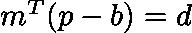

[逻辑回归:问题的定义](#0b75)
[逻辑回归:最小二乘误差有用吗？](#32f9)
【逻辑回归:使我们的步骤函数连续
[逻辑回归:寻找最优解](#dae4)
[总结逻辑回归](#e3d9)

# 逻辑回归:问题的定义

我们希望优化分类线的斜率和偏差，以便最大限度地减少错误分类的点数。[距离](https://brilliant.org/wiki/dot-product-distance-between-point-and-a-line/)仅用于计算每个点在线的哪一侧，因此最终我们可以计算给定线的分类误差。

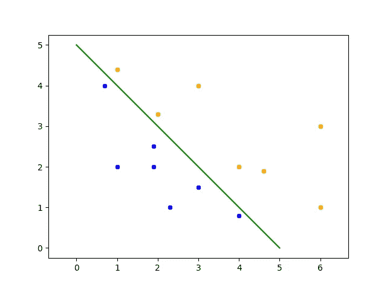

数据集之间的分类线示例(按作者分类的图表)

如果我们想要优化分类线，你可能会认为我们需要优化 *m* 和 *b* ，但是有一种方法可以建立距离方程，所以我们只处理 *m* 。我们可以通过将 m 扩展到一个额外的维度来将偏差吸收到 m 中。这个维度就是偏差。

首先，我们来思考一下 *m* 和 *b* 是什么。 *m* 和 *b* 都是具有相同方向性但长度不同的向量，因此我们可以将它们表述为

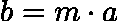

如果我们将 m*a 代入 b 的距离方程，我们得到如下结果:

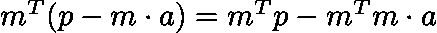

由于 *m* 是一个单位向量，并且任何单位向量乘以自身的形式

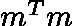

等于 1，根据单位向量的定义，我们也可以将其简化为以下形式。

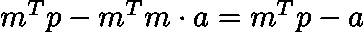

通过吸收偏差，我们用-a 项扩展 m，用 1 扩展 p，因此我们得到:

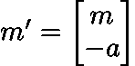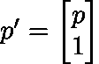

如果我们现在使用新的注释计算距离，则:

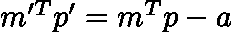

从这一点开始，为了简化公式，我们假设 *m = m'* 和 *p = p'* 。

# 逻辑回归:最小二乘误差有用吗？

在我们的数据集中，我们有一组点 P 和标签 Y，其中

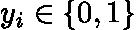

如果我们有一个标签为 0 的点，我们希望该点和分隔线之间的距离为负。或者，如果标签为 1，则距离应为正。

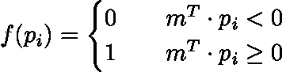

我们可以通过计算出的每个点到分类线的距离来预测标签。

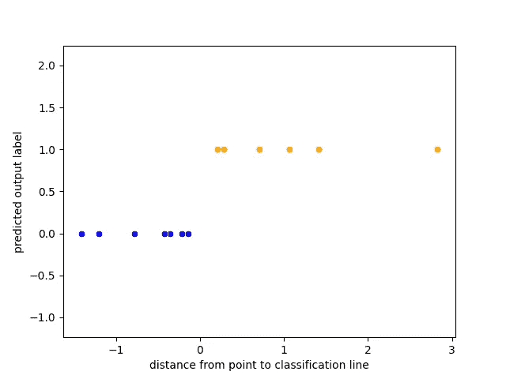

(作者提供的图表)预测输出与距离的关系

现在我们已经有了问题的恰当表述，我们要优化 *m* 。为了做到这一点，我们需要尽量减少被错误分类的点的数量。在[线性回归](/closed-form-solution-to-linear-regression-e1fe14c1cbef)中，我们使用了[最小二乘误差](https://www.investopedia.com/terms/l/least-squares-method.asp#:~:text=The%20term%20%E2%80%9Cleast%20squares%E2%80%9D%20is,on%20the%20horizontal%20x%2Daxis.)函数，所以让我们在这里尝试一下。

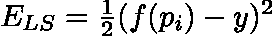

为了优化它，我们对 m 求导，并设它等于零。遵循[链式法则](https://tutorial.math.lamar.edu/classes/calci/chainrule.aspx):

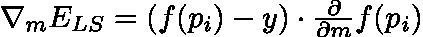

这个公式的问题是, *f* 相对于 *m* 不可微，因为它是一个不连续的阶跃函数。此外，即使 *f* 可微，它也不是线性的。我们不能直接求解最优 *m* 的导数，所以我们需要不同的映射函数和新的方法来寻找最优 *m* 。

# 逻辑回归:让我们的阶梯函数连续

让我们首先来看看我们如何写 *f* ，这样它就非常类似于上面定义的阶跃函数，但是是可微分的。为此，我们将使用一个 [sigmoid 函数](https://machinelearningmastery.com/a-gentle-introduction-to-sigmoid-function/)。

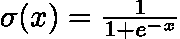

sigmoid 函数绘制如下。

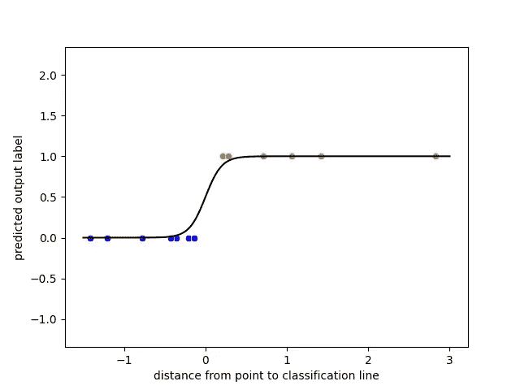

(作者提供的图表)按距离对预测输出进行 sigmoid 叠加

你会注意到，它看起来非常类似于一个阶跃函数，如果你以一种连续的方式连接两个不同的部分，这正是我们使用它的原因。

误差函数的一个关键特征是误差值应该与我们离最优解的距离成比例。在[线性回归](/closed-form-solution-to-linear-regression-e1fe14c1cbef)的背景下使用最小二乘误差函数，这一点非常清楚，因为误差值就是最佳拟合线与给定数据点的精确距离。

然而，在逻辑回归的情况下，这些值具有非常有限的范围，即从 0 到 1。因为我们的潜在输出值是如此有限，预测标签和实际标签之间的最大差异是 1。因此，最小二乘误差的范围是从 0 到 1，这是次优的。理想情况下，我们会有一个明显更大的范围，最好是从 0 到无穷大，就像线性回归一样。

使用 sigmoid 函数时，更好的误差函数选项是[对数丢失误差](https://dasha.ai/en-us/blog/log-loss-function)。

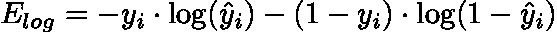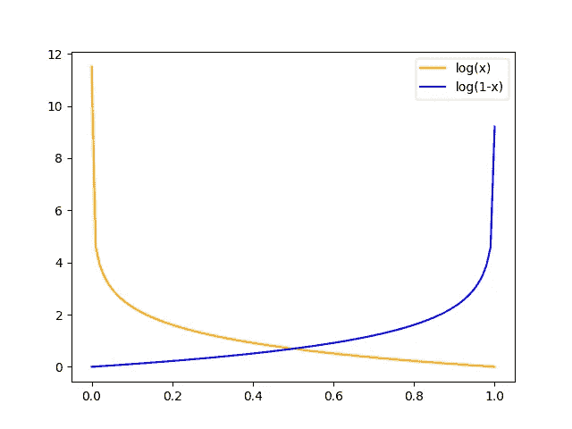

日志丢失错误映射示例

如你所见，这个误差函数允许误差从 0 到无穷大，但你也应该明白，如果我们试图推导这个关于 m 的损失函数，结果将不是线性的。这意味着我们不能使用封闭形式的方法来寻找最佳的 m*。

# 逻辑回归:寻找最优解

为了解决这个优化问题，我们将使用[梯度下降](https://ml-cheatsheet.readthedocs.io/en/latest/gradient_descent.html#:~:text=Gradient%20descent%20is%20an%20optimization,the%20parameters%20of%20our%20model.)来代替。梯度下降法只需要一个可微的凸误差函数来保证最优解。我们的误差函数很好地满足了这两个要求，所以让我们开始研究吧。

梯度下降迭代地更新向量 m，以便接近最优解 m*。它通过每次迭代在误差导数的方向上迈出一小步α来实现。

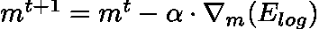

阿尔法通常被称为[学习率](/understanding-learning-rates-and-how-it-improves-performance-in-deep-learning-d0d4059c1c10)。如果误差收敛到零，我们就找到了最优解 m*。要了解更多关于梯度下降背后的理论，请查看这个深入研究[梯度下降如何工作的](/gradient-descent-algorithm-a-deep-dive-cf04e8115f21)。

# 总结逻辑回归

我们从线性回归的[公式开始，并对其进行转换，以便我们可以将其用于分类问题，从而产生逻辑回归。通过线性回归和逻辑回归，我们现在可以为所有监督机器学习问题建立模型！](/closed-form-solution-to-linear-regression-e1fe14c1cbef)

需要注意的一点是，我们在这个演练中使用了一个二进制示例，这意味着输出中只有两个类。在实际的数据集中，通常有两个以上的输出类。[适应这些多个输出类](/multiclass-logistic-regression-from-scratch-9cc0007da372)意味着改变问题的表述。我们将使用多个映射函数 F，

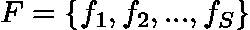

对于设置输出类别 *S* 中的每个类别，使用软最大值对输出进行归一化。请关注我的下一篇文章，它将介绍一个多类输出的逻辑回归示例。

如果有任何问题，请告诉我！

*公开招聘自由职业技术写作和代笔工作:*[margo.hatcher.writes@gmail.com](mailto:margo.hatcher.writes@gmail.com)*。我专注于数据科学和前端编程。*