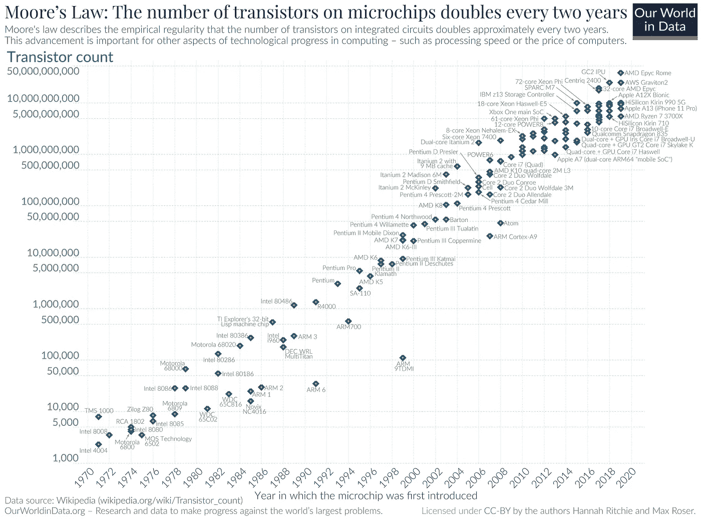
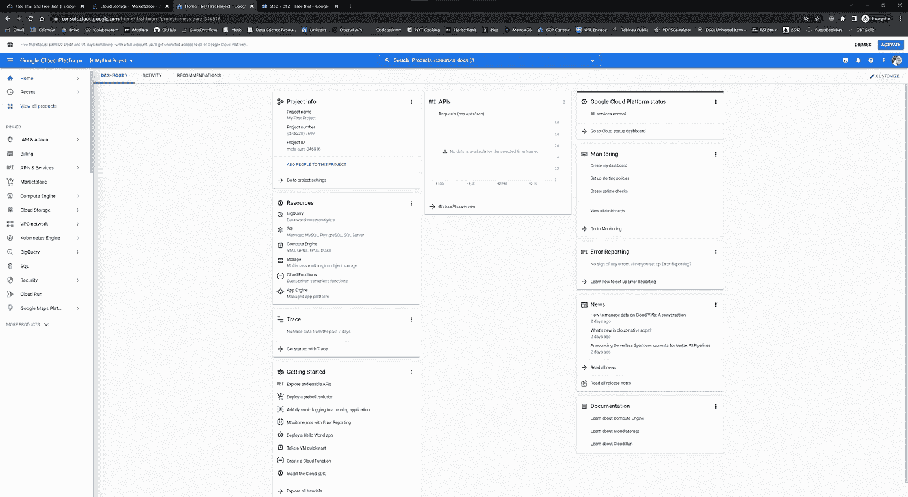
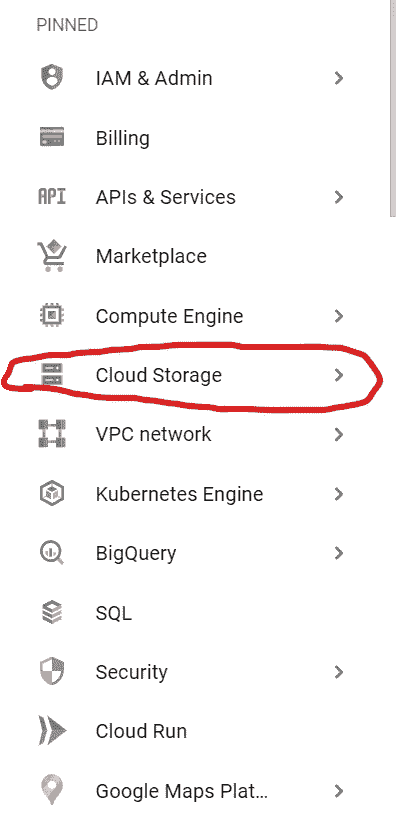
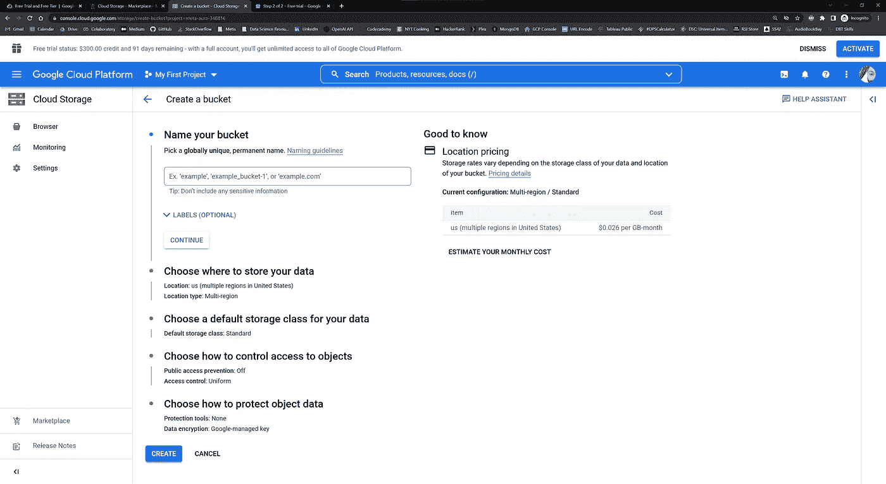
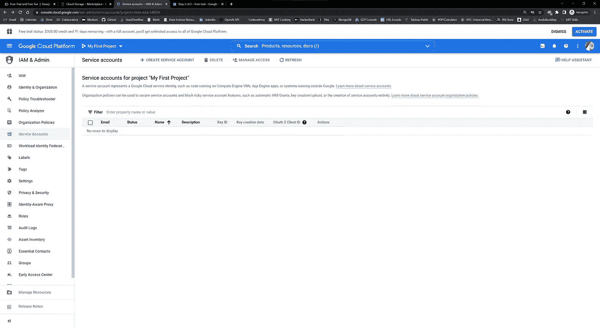
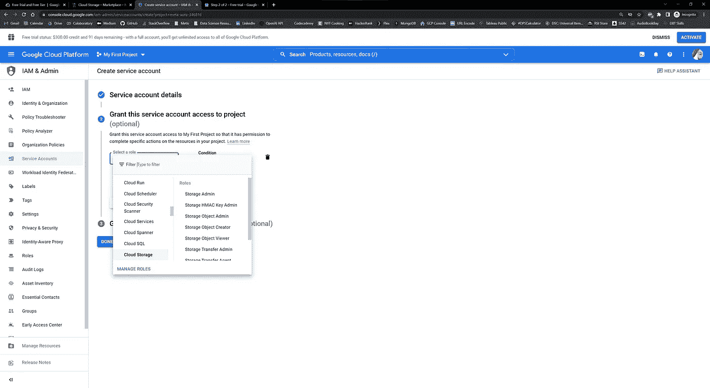
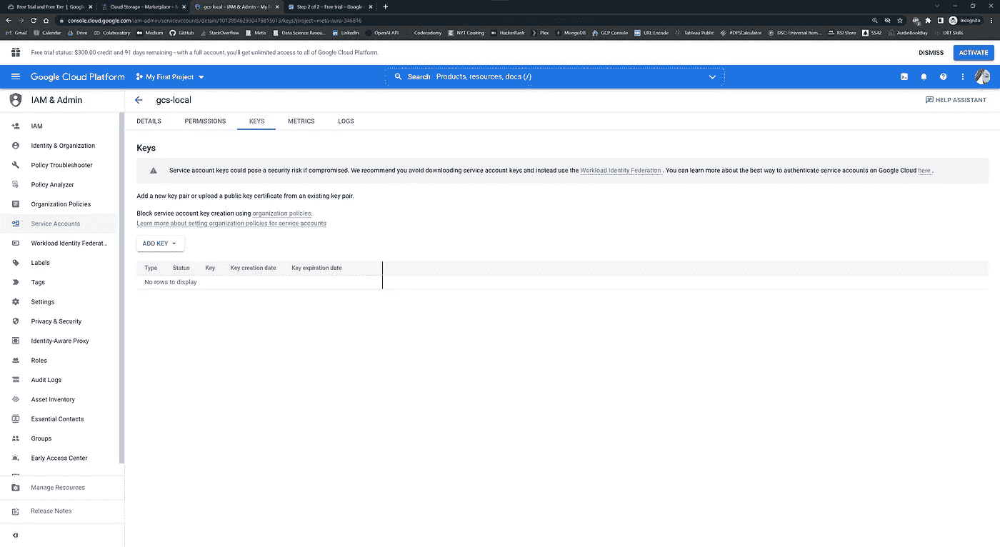
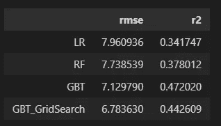

# 大数据机器学习入门指南

> 原文：<https://towardsdatascience.com/beginners-guide-to-machine-learning-with-big-data-d6dbb155673c>

## 使用 Google Cloud 和 Spark ML 处理大型数据集的教程


约书亚·索蒂诺在 [Unsplash](https://unsplash.com?utm_source=medium&utm_medium=referral) 上拍摄的照片

[*GitHub 代码*](https://github.com/NateDiR/celestial_body_size_predictor/blob/main/pyspark_model_script.ipynb)

学习数据科学和在专业环境中实践数据科学的最大区别之一是我们正在处理的数据的规模和复杂性。

当我们第一次开始学习时，我们构建第一个项目所用的数据可能是适度的、干净的、易于理解的。在本地机器上使用第一个数据集很容易，用 Pandas 进行计算，或者用 Matplotlib 进行可视化，几乎都是瞬间完成的。

不幸的是，这是一个田园诗般的乌托邦，很少(如果有的话)存在于专业界。随着计算能力( [**)摩尔定律**](https://en.wikipedia.org/wiki/Moore%27s_law) )和存储容量( [**克莱德定律**](https://www.techtarget.com/searchstorage/definition/Kryders-Law#:~:text=Kryder's%20Law%20is%20the%20assumption,improves%2C%20storage%20will%20become%20cheaper.) )的效率提高和价格下降，企业能够存储、分析和利用的数据比以往任何时候都多。



摩尔定律图。1970–2020.图片来自维基百科。

作为一名新晋的数据科学家，与我们所学的规模适中的数据集相比，处理不太适合本地机器的数据是一个巨大的变化。我们每个人都曾在某个时候试图将一个巨大的数据集加载到熊猫中，并耐心等待，只为内核在抗议中死去。幸运的是，当这种情况发生时，我们有选择！

在本教程中，我们将讨论两种用于处理海量数据集的常用工具— [**谷歌云存储**](https://cloud.google.com/storage) 和[**Apache Spark**](https://databricks.com/spark/about)**。**一旦我们为这些解决方案建立了一个概念基线，我们将通过一个例子来使用存储在 Google Cloud 中的大型数据集和 SparkML 的建模功能创建一个基本的回归模型。让我们实现它吧！

# 什么是“大”数据？

在深入了解 Spark 和 GCS 之前，让我们先了解一下“大数据”到底是什么。我能想到的最一致的大数据定义如下:**无意义的行话**。

大数据的*概念*是一个移动的目标。正如我之前提到摩尔定律和克莱德定律时提到的那样，对更高数量的计算和存储容量的相对可访问性正以大约每两年 2 倍的速度增长。这意味着 2 年前的“大数据”按照目前的标准可能还不算大，10 年前的“大数据”对于现代机器来说可能微不足道。


由[彼得·赫尔曼](https://unsplash.com/@tama66?utm_source=medium&utm_medium=referral)在 [Unsplash](https://unsplash.com?utm_source=medium&utm_medium=referral) 上拍摄的照片

“大数据”也完全特定于个体数据从业者。判断某样东西是否是大数据的一个简单的经验法则是，它是否适合你的**电脑，而如今电脑有各种不同的配置——我的 MacBook 有 16 GB 的内存，8 核英特尔处理器和 1 TB 的磁盘存储。我的 Windows 桌面有 64 GB 内存，16 核英特尔处理器，12 TB 磁盘存储(加上一个 GPU 下次再说)。可以理解的是，这些机器可以处理不同数量的数据。**

因为个人电脑有如此多不同的风格，我们需要在单个项目中使用大数据技术的情况将取决于我们所拥有的能力。

但一般来说，有企业级数据需求的公司也买得起企业级机器。有时，公司的需求超过了任何一台机器能够提供的能力，无论是计算能力还是磁盘存储。当这种情况发生时，像**谷歌云存储**和 **Spark** 这样的解决方案开始发挥作用。


Jakub Skafiriak 在 [Unsplash](https://unsplash.com?utm_source=medium&utm_medium=referral) 上拍摄的照片

# 火花

最基本的，Spark 是一个开源项目，旨在帮助跨**集群并行处理大量数据。**什么是集群？想想你的电脑。现在想一想你的两台电脑。我们可以将这些计算机连接起来，将磁盘空间、计算能力和内存容量集中到一台“计算机”中，用它来做事情。这是一个(非常基本的)集群。

Spark 帮助我们跨集群执行数据处理任务。为了做到这一点，Spark 创建了一个**有向无环图** (DAG)，作为数据如何转换的“行动计划”。Spark 不是存储这个行动计划的结果，而是将行动计划本身存储在内存中，并且直到它被明确告知要持久化它时才存储结果。这是与熊猫等工具的主要区别之一。

Spark 和传统工具的另一个主要区别是 Spark 使用**分布**和**并行的方式。**正如我前面提到的，Spark 的主要功能是帮助我们跨集群执行数据处理任务。Spark 在这项任务上比传统工具更高效的部分原因是它使用了分布式存储和并行计算。

Pandas、NumPy 和其他核心 Python 库针对单核计算进行了优化，而 Spark 则利用它创建的 Dag 来寻找完成给定任务的最佳计算路线。

回想一下，集群是我们的两台笔记本电脑相互连接，作为一台“计算机”使用。当我们利用 Spark 处理数据时，Spark 将获取“大块”数据(默认为 128 MB)，并将它们存储在集群的多个位置。将你的数据分成更小的片段并存储在集群中的过程被称为**数据分片**。我们对数据进行分片，并将每个分片存储在集群的多个位置，以实现冗余性和弹性。值得一提的是，Spark 的分布式存储方法是 **Hadoop 分布式文件系统(HDFS)的一个分支，**了解 Hadoop 和 HDFS 是什么是值得的，但我们不会在这里深入讨论。

与 Spark 分布数据存储的方式非常相似，它也分布您想要在数据上运行的计算，并并行执行它们。正如我上面提到的，像 Pandas 和 NumPy 这样的 Python 库默认使用单个 CPU 内核运行。另一方面，Spark 使用机器上的所有内核。在集群环境中，这意味着 Spark 会将您的数据分解成更小的碎片，然后在每个碎片上并行执行计算，如果您使用传统的数据操作工具，这将大大减少获得结果所需的时间。

最后值得一提的是，Spark 可以部署在单台机器上(比如您的笔记本电脑)。这样做的好处是，它可以更有效地利用您的 RAM，并在可能的情况下跨所有 CPU 内核并行化计算。如果您的数据集特别大，Spark 也会将它从 RAM 溢出到磁盘，尽管这会影响性能。


在 [Unsplash](https://unsplash.com?utm_source=medium&utm_medium=referral) 上由 [Daoudi Aissa](https://unsplash.com/@dannyeve?utm_source=medium&utm_medium=referral) 拍摄的照片

# 谷歌云存储

现在我们已经了解了如何用 Spark 处理数据，下一个问题是我们将在哪里存储数据。处理存储在本地的大型数据集会很快耗尽你的磁盘空间，像 GitHub 或 Google Drive 这样的选项不适合处理超过几百 MB 的文件。进入谷歌云存储。

谷歌云存储是一个基于云的**对象存储服务**。在不涉及太多技术细节的情况下，对象存储意味着将非结构化对象存储在一个易于访问的地方。对象通常包括数据本身、关于对象的一些元数据以及使其区别于其他对象的唯一标识符。例如，将对象存储与数据库进行对比。对象存储对于需要经常更改的事务性数据来说并不理想。但它在这里会工作得很好。

所有主要的云提供商都提供对象存储**——亚马逊 S3、Azure Blob 存储、谷歌云存储..都一样。一般来说，云的好处在于它的可伸缩性和高正常运行时间。这是什么意思？当您的硬盘空间已满时，您需要删除一些项目来添加更多内容，或者购买额外的驱动器。当使用云服务时，你基本上是租用你的提供商的计算能力和磁盘存储。如果您需要的比您目前拥有的更多，您的提供商会自动调整您的资源。从这个意义上说，云服务是无限可扩展的(实际上来说)。**

**同样，云服务也极具弹性。凭借这些公司的全球基础设施足迹，您可以放心，您的数据不会在云中丢失(除非发生一些灾难性事件，但您可能会遇到更大的问题)。如果您的本地机器死机，您的数据可能无法恢复。如果云提供商的一部分基础设施出现故障，有许多级别的冗余和故障转移功能来保持您的数据随时可用。**

**如果我没有提到云服务是要花钱的，那我就失职了。每个主要的提供商都有一个免费层，并提供一些积分让你开始使用一个新帐户，但当使用云服务时，很容易积累大量的账单。**如果您正在使用云服务，请始终关注您的计费中心报告并设置预算限制**！**

# **设置**

**现在我们对 Spark 和 Google 云存储有了一个概念性的了解，让我们在一个简单的演示中让它们为我们工作。下面，我将介绍清理存储在谷歌云存储中的大型数据集的过程，并使用 Spark 建立梯度增强回归模型。但是在我开始之前，让我们先看一下在开始编码之前需要完成的先决步骤。**

****

**维克多·塔拉舒克在 [Unsplash](https://unsplash.com?utm_source=medium&utm_medium=referral) 上拍摄的照片**

## **数据**

**对于这个例子，我使用的数据来自加州理工学院美国宇航局喷气推进实验室。他们维护着[小天体数据库](https://ssd.jpl.nasa.gov/tools/sbdb_query.html)，这是一个包含超过 120 万个太阳系已知小行星观测数据的数据集。每一次观测都包含 30 多个特征，我们将使用这些数据来尝试使用 SparkML 预测小行星的直径。该数据集是免费供公众使用的，对于一个适度的“大数据”项目来说是一个很好的选择，所以去看看吧。**

## **Google 云设置**

**如果我们要使用云存储，我们需要设置一个谷歌云账户。**

1.  **导航到谷歌云[注册页面](https://cloud.google.com/free)，使用你的谷歌账户创建一个 GCP 账户。公平的警告:创建帐户时，您需要提供一张信用卡。前 90 天你还可以获得 300 美元的积分，所以你不应该马上被收费。**
2.  **创建 GCP 账户后，导航至[谷歌云控制台](http://console.cloud.google.com)。它应该是这样的:**

****

**谷歌云控制台。图片作者。**

**3.从 Google Cloud 主页，进入左侧边栏的**云存储**选项:**

****

**图片作者。**

**4.在谷歌云存储上，点击**‘创建一个存储桶’**。这将带您进入如下页面:**

****

**图片作者。**

**命名您的存储桶，选择您所在的地区，并决定您要为您的数据使用哪种存储类别。访问管理是保持公司云实例安全的一个非常重要的方面，但是对于初次尝试使用个人云实例的人来说，粒度 IAM 就不太需要了。统一访问和 Google 管理的密钥是访问和保护的良好选择。**

**在此页面的右侧，您应该会看到以 GB/月为基础的存储桶价格估算。这一点值得注意，因为一旦你的信用用完或 90 天试用期结束，这将是保持水桶运行的成本。**

**5.一旦您创建了您的 bucket，我们就需要获得一个访问键来在我们的代码中使用，以便我们能够访问我们的云实例上的数据。打开左上角的**导航菜单**(三个横条)，点击出现的侧边栏中的 **IAM & Admin** ，然后点击**服务账户**。你应该在这样的页面上:**

****

**图片作者。**

**创建一个服务帐户，并给它起一个合适的名字。在第 2 步中，我们希望授予该服务帐户对我们的存储对象的访问权限，因此使用下拉菜单授予它该级别的权限。找到**云存储**选项，然后**存储对象管理**:**

****

**图片作者。**

**完成服务帐户创建过程，应该会返回到包含新创建的服务帐户的表。点击**账户 ID** 访问详细信息，然后点击顶部的**【密钥】**选项卡。应该是这样的:**

****

**图片作者。**

**点击**‘添加密钥’>‘创建新密钥’>JSON。**这会自动将密钥下载到您的本地机器。保持这个安全！非常注意你的密匙最终在哪里，例如，永远不要在 GitHub repo 上公开发布它。我们将介绍如何将它们隐藏在下面。**

## **加载数据**

**下载完密钥后，返回云存储页面并创建一个存储桶。恰当地命名。在那里，创建一个文件夹，并将您的数据添加到该文件夹中。我下载了。csv 格式的小行星数据来自 JPL 网站，创建了一个桶，一个名为小行星的文件夹，并上传了。csv 到文件夹中，然后从我的本地机器上删除它。这是一个简单的过程，与 Google Drive 上传没有什么不同，所以应该不会有任何问题。**

## **火花设置**

**现在我们已经设置好了 Google 云存储，是时候在我们的机器上安装 Spark 了。在 Mac 上安装 Spark 需要自制。如果你还没有安装家酿软件，请按照这里的[指示进行安装。](https://brew.sh/)**

**一旦安装了 homebrew，我们将使用它来安装 Spark 及其依赖项。在命令行提示符下输入以下内容:**

```
brew install java scala apache-spark
```

**接下来，我们需要为 Spark 安装 Python 包装器， **PySpark。**根据您使用的是本地级别的 Python 还是 conda 环境，您可以执行以下任一操作:**

```
pip install pysparkconda install -c conda-forge pyspark
```

**打开一个新的终端窗口。如果一切正常，输入命令“pyspark”应该会启动一个 spark 实例(注意:如果您使用的是 conda，请在测试 pyspark 之前激活 conda 环境)。**

**如果在命令行中一切正常，请尝试在 iPython 环境或 jupyter 笔记本中激活 Spark:**

```
import pyspark  
spark = pyspark.sql.SparkSession.builder.getOrCreate()
```

**如果这也正常工作，您就可以开始工作了。如果没有，请对您的问题发表评论。通常归结为 Java 安装和/或路径变量的问题。**

# **代码走查**

**此时，我们已经将我们的小行星数据存储在 Google Cloud 中，将我们的 Google Cloud 密匙存储在我们的本地机器上，并且已经安装了 Spark/PySpark，可以使用了。我们应该有开始编码所需的一切。让我们看一下我们将要使用的库:**

**一旦导入了我们需要的所有内容，我们需要创建一个配置为与 Google Cloud 协同工作的 Spark 会话:**

**这里要注意两件事:首先，你应该设置你的内存配置来匹配你的机器。第二，我们如何指定我们想要对 Spark 实例使用 Google Cloud service 帐户密钥文件，并指定 secrets.json 文件包含相关信息。**

**这里发生的事情是，我在前面的步骤中从 Google Cloud 下载了密钥文件，将其添加到 GitHub repository 文件夹，然后将其添加到。gitignore 文件，这样它就不会提交到我的公共存储库中。我还将其重命名为 secrets.json，以便在代码中更容易指向它。因为我编写的 Jupyter 文件在同一个文件夹中，所以我可以参考 secrets.json 文件来获得我的 Google 云服务帐户凭证。**

**接下来，我需要阅读。我将 GCS 中的 csv 文件存储到 Spark 中:**

**为了再次检查一切是否正常，让我们以熊猫的方式预览一下数据:**

**虽然 Spark 在 Pandas 中很容易查看，但我们不会用典型的 Pandas 语法进行数据操作。Spark 有自己的语法，更符合 SQL，并且经常在使用 Spar 查询大型数据集时，它被用作 SQL 查询的包装器。让我告诉你我的意思:**

**在这里，我们使用 createOrReplaceTempView 命令将数据帧注册为关系表，然后使用普通的 SQL 查询对其进行查询。输出将是 Spark 数据帧形式的前 20 个结果。**

**Spark 中有许多处理数据的方法，网上有大量的资源可以帮助您理解它们。我最后要提到的是。printSchema()，它生成数据集中存在的列和每一列的数据类型的读数。这很重要，因为我们需要将数据以特定的格式传递给 SparkML，所以在整个代码中打印模式来确认进度是很方便的。**

**我不想进入特性工程领域，所以我只是删除了包含大量 NaN 的列，并更改了数据类型，为建模做准备。这些变化使我的数据集从 120 万行减少到大约 12 万行:**

**请注意，我将“neo”和“pha”列更改为 True/False，将它们转换为“boolean”，然后将它们转换为“integers”。这只是二进制编码。这些列中的真/假值现在表示为 1 和 0。**

**另一件值得注意的事情是，Spark 的首选数据类型是“double ”,有点像长浮点型。SparkML 中的许多模型需要“double”数据类型作为输入，所以我们在这段代码中也将 floats 改为 double。**

**一旦我们所有的其他特性都为建模做好了准备，我们就需要使用 Spark 的 StringIndexer、OneHotEncoder 和 Pipeline 类对分类变量进行编码:**

**完成后，我们可以删除原来的列，并重新排序我们的数据框架:**

**将我们的数据分成训练集、验证集和测试集(删除 name 列):**

**我们还必须将所有特征打包到一个向量中。这是在 Spark 中创建模型的奇怪之处之一。您需要使用 VectorAssembler()类将所有的特性列打包成一个向量，并将其输入 Spark 模型:**

**最后(并非绝对必要)，我们需要扩展我们的功能:**

**现在我们已经为建模做好了准备，让我们用 SparkML 中几种不同的回归方法进行实例化、拟合和预测:**

**现在让我们来评估这三种模型的性能:**

**根据结果，梯度推进回归的表现最好，R2 得分为 0.47，均方根误差约为 7.1 km，因此让我们尝试使用网格搜索和交叉验证来优化模型:**

**现在我们需要从交叉验证器中提取我们的最佳模型。通过下面的代码，我们还可以看到我们的模型的特性重要性:**

**最后，让我们使用优化的 GBT 模型对我们的测试集进行预测，并看看它与我们的初始模型结果相比如何:**

**应该会产生这样的结果:**

****

**图片作者。**

# **结论**

**在这篇文章中，我开始提供对 Spark 和 Google 云存储的概念性理解，以及使用这两者创建机器学习模型的实际例子。**

**正如模型的结果所示，可以对数据做一些额外的工作(提示:异常值)，但重点不是创建一个最佳模型，而仅仅是为可能刚开始工作的人展示工作流程。**

**如您所见，我们处理大型数据集的方式与我们从学习到实践的转变可能会用到的方式不同。在我们做出这种改变时，重要的是我们要开始考虑针对您的特定问题的最佳解决方案路径——我们可以通过许多其他方式来完成这项任务，例如对数据进行采样。通常，你所拥有的工具将取决于你工作的公司，所以保持灵活性，并对各种工具有一个工作理解是值得的。如果你有任何关于 GCP 或使用 Spark 的问题，请随时给我留言。下次见！**

****

**亨特·哈里特在 [Unsplash](https://unsplash.com?utm_source=medium&utm_medium=referral) 上的照片**