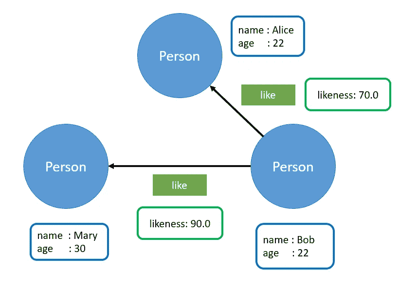

# 星云图数据库初学者指南

> 原文：<https://towardsdatascience.com/beginners-guide-to-nebulagraph-database-5d35bdee442f>

## 一个用于信息检索的开源图形数据库


[GuerrillaBuzz 区块链公关机构](https://unsplash.com/es/@guerrillabuzz_blockchain_pr_agency?utm_source=medium&utm_medium=referral)在 [Unsplash](https://unsplash.com?utm_source=medium&utm_medium=referral) 上的照片

通过阅读本文，您将了解 NebulaGraph(一个开源图形数据库)背后的基本概念。根据官方文档，NebulaGraph 是

> “…一个分布式、快速的开源图形数据库，具有横向可扩展性和高可用性。它是一个数据库，专门存储庞大的图形网络，并从中检索信息。”

在此之前，让我们探讨一下关系数据库和图形数据库之间的区别。

关系数据库将数据存储在表中。每个表都由自己的列和行定义。关系数据库需要联接来连接不同表。这种类型的数据库适合于以事务为中心的用例，例如会计和在线事务。

另一方面，图数据库由节点或边来表示。某些图形数据库使用术语顶点、边和属性来代替。它们被设计用来表示实体和实体之间的关系。图形数据库是欺诈检测和推荐系统的理想选择。

继续下一节的设置和安装。

# 设置和安装

本教程涵盖了以下软件包的安装:

*   `NebulaGraph server`—nebula graph 服务器的二进制文件
*   `Nebula Console`—nebula graph 服务器的命令行界面

## NebulaGraph (RPM 或 DEB 包)

在撰写本文时，NebulaGraph 仅在 Linux 操作系统(Ubuntu、CentOS)上受支持。根据期望的`release_version`下载期望的包:

```
//Centos 6
https://oss-cdn.nebula-graph.io/package/<release_version>/nebula-graph-<release_version>.el6.x86_64.rpm//Centos 7
https://oss-cdn.nebula-graph.io/package/<release_version>/nebula-graph-<release_version>.el7.x86_64.rpm//Centos 8
https://oss-cdn.nebula-graph.io/package/<release_version>/nebula-graph-<release_version>.el8.x86_64.rpm//Ubuntu 1604
https://oss-cdn.nebula-graph.io/package/<release_version>/nebula-graph-<release_version>.ubuntu1604.amd64.deb//Ubuntu 1804
https://oss-cdn.nebula-graph.io/package/<release_version>/nebula-graph-<release_version>.ubuntu1804.amd64.deb//Ubuntu 2004
https://oss-cdn.nebula-graph.io/package/<release_version>/nebula-graph-<release_version>.ubuntu2004.amd64.deb
```

例如，您可以运行以下命令来下载 3.2.1 版的软件包:

```
# CentOS 7.5
wget https://oss-cdn.nebula-graph.io/package/3.2.1/nebula-graph-3.2.1.el7.x86_64.rpm# Ubuntu 1804
wget https://oss-cdn.nebula-graph.io/package/3.2.1/nebula-graph-3.2.1.ubuntu1804.amd64.deb# Ubuntu 2004
wget https://oss-cdn.nebula-graph.io/package/3.2.1/nebula-graph-3.2.1.ubuntu2004.amd64.deb
```

下载完软件包后，运行以下命令安装 NebulaGraph:

```
# CentOS 7.5
sudo rpm -ivh nebula-graph-3.2.1.el7.x86_64.rpm# Ubuntu 1804
sudo dpkg -i nebula-graph-3.2.1.ubuntu1804.amd64.deb# Ubuntu 2004
sudo dpkg -i nebula-graph-3.2.1.ubuntu2004.amd64.deb
```

接下来，通过以下命令启动 NebulaGraph 服务器:

```
sudo /usr/local/nebula/scripts/nebula.service start all
```

您应该会看到以下输出，表明服务器已经启动:

```
[INFO] Starting nebula-metad...
[INFO] Done
[INFO] Starting nebula-graphd...
[INFO] Done
[INFO] Starting nebula-storaged...
[INFO] Done
```

以下命令可用于检查状态:

```
sudo /usr/local/nebula/scripts/nebula.service status all
```

它将输出进程 id 和 NebulaGraph 服务使用的相应端口:

```
[INFO] nebula-metad(ef6d6a0): Running as 713187, Listening on 9559
[INFO] nebula-graphd(ef6d6a0): Running as 713233, Listening on 9669
[WARN] nebula-storaged after v3.0.0 will not start service until it is added to cluster.
[WARN] See Manage Storage hosts:ADD HOSTS in [https://docs.nebula-graph.io/](https://docs.nebula-graph.io/)
[INFO] nebula-storaged(ef6d6a0): Running as 713262, Listening on 9779
```

除此之外，还有一个停止命令来停止 NebulaGraph 进程:

```
sudo /usr/local/nebula/scripts/nebula.service stop all
```

终端将打印出以下日志:

```
[INFO] Stopping nebula-metad...
[INFO] Done
[INFO] Stopping nebula-graphd...
[INFO] Done
[INFO] Stopping nebula-storaged...
[INFO] Done
```

> 请查看[下面的文档](https://docs.nebula-graph.io/3.2.1/2.quick-start/5.start-stop-service/#syntax)以获得关于所有可用语法的更多信息。

## 星云图(Docker 和 Kubernetes)

或者，NebulaGraph 也可用于 Docker 和 Kubernetes。对于标准安装，使用由官方仓库提供的以下[文档文件](https://github.com/vesoft-inc/nebula/tree/master/docker):

*   `[vesoft/nebula-graphd](https://hub.docker.com/r/vesoft/nebula-graphd)` :- `nebula-graphd`用`Dockerfile.graphd`构建的服务
*   `[vesoft/nebula-metad](https://hub.docker.com/r/vesoft/nebula-metad)`——`Dockerfile.metad`建成的`nebula-metad`服务
*   `[vesoft/nebula-storaged](https://hub.docker.com/r/vesoft/nebula-storaged)`:用`Dockerfile.storaged`构建的`nebula-storaged`服务
*   `[vesoft/nebula-tools](https://hub.docker.com/r/vesoft/nebula-tools)`:用`Dockerfile.tools`构建的星云工具

此外，您可以直接从 Docker Hub 获取 Docker 图片。只需前往[下面的链接](https://hub.docker.com/u/vesoft)并提取所需图像。例如，您可以使用以下命令来拉动`nebula-graphd`图像:

```
docker pull vesoft/nebula-graphd
```

对于 Kubernetes，请前往[以下链接](https://github.com/vesoft-inc/nebula-docker-compose/tree/master/charts/nebula)并遵循提供的说明。

## 星云控制台

NebulaGraph 服务器文件不附带 Nebula 控制台。Nebula 控制台提供了一个命令行界面来与 NebulaGraph 服务器进行交互。

请注意，如果您打算通过 NebulaGraph 自己的客户端 SDK (Python、Java、Go、C++)连接到 Nebula graph，则不需要 Nebula 控制台。然而，对于调试和测试来说，它是一个很好的工具。

根据您机器的操作系统和架构，从下面的 Github 库下载所需的二进制文件。您可以运行`lscpu`命令来识别架构。

> 为了方便起见，建议将二进制文件重命名为`nebula-console`。此外，您需要授予执行该文件的权限。你可以通过运行`chmod 111 nebula-console`来实现。请不要使用 chmod 777，因为任何人都可以读取、写入和执行该文件。

将工作目录改为与`nebula-console`可执行文件相同的目录。然后，运行以下命令启动命令行界面:

```
# syntax
./nebula-console -addr <address> -port <port> -u <username> -p <password># example
./nebula-console -addr 127.0.0.1 -port 9669 -u root -p root
```

*   `address` —设置图形服务的 IP 地址。默认地址是 127.0.0.1。
*   `port` —设置图形服务的端口号。默认端口号是 9669。
*   `username` —设置用户名。默认用户名是`root`。
*   `password` —设置的密码。如果未启用身份验证，您可以使用任何字符作为密码。

当您执行`nebula-console`文件时，您应该会看到以下输出:

```
Welcome to NebulaGraph!(root@nebula) [(none)]>
```

在下一节中，您将学习使用命令行界面执行 nGQL。

# 星云图查询语言(nGQL)

顾名思义，nGQL 是一种用于 NebulaGraph 的声明式图查询语言。当第一次连接到 NebulaGraph 服务器时，需要添加新的存储主机。

## 存储主机

确保您的终端通过`nebula-console`连接到 NebulaGraph 服务器。运行以下查询来标识所有可用的存储主机:

```
SHOW HOSTS;
```

您应该会看到一个空表，表明它当前是空的。通过以下查询添加新主机:

```
ADD HOSTS 127.0.0.1:9779;
```

再次运行`SHOW HOSTS;`查询。终端将输出以下结果:

```
+-------------+------+-----------+-----------+--------------+
| Host        | Port | HTTP port | Status    | Leader count |
+-------------+------+-----------+-----------+--------------+
| "127.0.0.1" | 9779 | 19669     | "ONLINE"  | 0            |
+-------------+------+-----------+-----------+--------------+
```

NebulaGraph 实例可以包含零个或多个图形空间。每个空间在物理上相互隔离，并有自己的模式。你可以把它想象成关系数据库中的一个数据库。

## (计划或理论的)纲要

空间的模式由以下组件表示:

*   `VERTEX` —代表一个实体。它可以有零到多个标签。
*   `TAG` —描述顶点的属性。
*   `EDGE` —表示两个顶点之间的有向关系
*   `EDGE TYPE` —描述边的属性

例如，请看下图，它展示了一个空间的模式:



作者图片

*   该空间包含三个`Person`顶点。
*   每个`Person`顶点都有`name`和`age`作为标签。
*   人的顶点由`like`边连接
*   每个 like 边都有`likeness`作为边类型。

因此，我们可以很容易地将上面的空间解释如下:

*   人物(姓名:鲍勃，年龄:22 岁)相似(相似度:90.0)人物(姓名:玛丽，年龄:30 岁)
*   人物(姓名:鲍勃，年龄:22 岁)相似(相似度:70.0)人物(姓名:爱丽丝，年龄:22 岁)

## 创造

让我们根据上面的用例创建一个新的空间和相应的模式。在控制台中运行以下查询:

```
CREATE SPACE IF NOT EXISTS test(vid_type=FIXED_STRING(30));USE test;CREATE TAG IF NOT EXISTS person(name string, age int);CREATE EDGE like (likeness double);
```

## 插入

之后，使用以下查询将新的`Person`顶点插入到空间中:

```
INSERT VERTEX person(name, age) VALUES "Bob":("Bob", 22), "Alice":("Alice", 22), "Mary":("Mary", 30);
```

现在，我们可以如下建立新创建的顶点之间的关系:

```
INSERT EDGE like(likeness) VALUES "Bob"->"Alice":(70.0), "Bob"->"Mary":(90.0);
```

## 阅读

NebulaGraph 提供了 4 种从图形服务器读取数据的不同方法:

*   `GO` —根据具体情况遍历数据库，获取所需信息
*   `FETCH` —从顶点或边获取属性
*   `LOOKUP` —根据索引搜索符合特定条件的数据
*   `MATCH` —描述基于索引的各种图形模式

本教程涵盖了`FETCH`和`GO`的功能。使用以下查询从名为`Bob`的`Person`顶点获取属性:

```
FETCH PROP ON person "Bob" YIELD vertex as node;
```

控制台将输出以下结果:

```
+---------------------------------------+
| node                                  |
+---------------------------------------+
| ("Bob" :person{age: 22, name: "Bob"}) |
+---------------------------------------+
```

对于 EDGE，您可以使用下面的查询来获取从`Bob`到`Alice`的`like`边的属性:

```
FETCH PROP ON like "Bob"->"Alice" YIELD edge as e;
```

您应该得到以下输出

```
+--------------------------------------------+
| e                                          |
+--------------------------------------------+
| [:like "Bob"->"Alice" @0 {likeness: 70.0}] |
+--------------------------------------------+
```

另一方面，`GO`语句可以用来遍历数据库。例如，你可以很容易地通过鲍勃识别出所有的`Person`顶点`like`:

```
GO FROM "Bob" OVER like YIELD properties($$).name AS Name, properties($$).age AS Age;
```

终端将打印以下文本:

```
+---------+-----+
| Name    | Age |
+---------+-----+
| "Alice" | 22  |
| "Mary"  | 30  |
+---------+-----+
```

> `$$`符号代表目标顶点。在这种情况下，查询将返回目标顶点的属性。您可以使用`$^`符号来获取源顶点的属性。

您可以使用如下的`WHERE`子句指定条件:

```
# Person liked by Bob that is over 25 in age
GO FROM "Bob" OVER like WHERE properties($$).age >= 25 YIELD properties($$).name AS Name, properties($$).age AS Age;# Person liked by Bob with less than 80 likeness
GO FROM "Bob" OVER like WHERE properties(edge).likeness < 80 YIELD properties($$).name AS Name, properties($$).age AS Age;
```

## 更新

要更新现有顶点和边，请运行以下查询:

```
# Update the age of Bob
UPDATE VERTEX "Bob" SET person.age = 25;# Update the likeness from Bob to Alice
UPDATE EDGE "Bob" -> "Alice" OF like SET likeness = 99.9;
```

## 删除

子句可以用来从数据库中删除一个顶点或边。按如下方式使用它:

```
DELETE VERTEX "Bob", "Alice";
DELETE EDGE like "Bob" -> "Mary";
```

> 查看[下面的备忘单](https://docs.nebula-graph.io/3.2.1/2.quick-start/6.cheatsheet-for-ngql/)了解更多关于 nGQL 的信息。

# Python 客户端

NebulaGraph 附带以下客户端 SDK:

*   C++
*   Java 语言(一种计算机语言，尤用于创建网站)
*   去
*   计算机编程语言

本教程介绍了一个用 Python 连接和管理图形数据库的简单示例。您可以在同一台机器上本地运行该脚本，也可以从远程机器上运行该脚本。

## Python 包

在此之前，让我们在目标机器中创建一个新的虚拟环境。激活它并运行以下命令来安装 NebulaGraph Python API。

```
pip install nebula3-python
```

接下来，创建一个名为`main.py`的新文件，并在其中添加以下代码:

函数将返回一个`ResultSet`对象。例如:

```
ResultSet(keys: ['node'], values: [("Bob" :person{age: 22, name: "Bob"})])
```

您可以使用以下代码将其转换为 Python 字典:

```
columns = result.keys()
d = {}
for col_num in range(result.col_size()):
    col_name = columns[col_num]
    col_list = result.column_values(col_name)
    d[col_name] = [x for x in col_list]
```

输出`dict`应该如下所示:

```
{'node': [("Bob" :person{age: 22, name: "Bob"})]}
```

# NebulaGraph 生态系统工具

NebulaGraph 还提供了一些有用的工具，作为其生态系统的一部分:

*   `[NebulaGraph Explorer](https://docs.nebula-graph.io/3.2.0/nebula-explorer/about-explorer/ex-ug-what-is-explorer/)` —基于浏览器的可视化工具，用于可视化与图形数据的交互。帮助显示图形数据以便快速分析。
*   `[NebulaGraph Dashboard](https://docs.nebula-graph.io/3.2.0/nebula-dashboard/1.what-is-dashboard/)` —监控 NebulaGraph 集群中机器和服务状态的可视化工具。它带有社区版和企业版。
*   `[NebulaGraph Exchange](https://docs.nebula-graph.io/3.2.0/nebula-exchange/about-exchange/ex-ug-what-is-exchange/)`—Apache Spark 应用程序，用于分布式环境中的数据流和集群数据到 NebulaGraph 的迁移。它带有社区版和企业版。

# 结论

让我们回顾一下你今天所学的内容。

本文首先简要介绍了 NebulaGraph。它还介绍了图形数据库和关系数据库之间的区别。

然后，它强调了在本地机器上设置和安装 NebulaGraph 服务器和 Nebula 控制台的步骤。

随后，它探索了 NebulaGraph 查询语言(nGQL)。本教程提供了与 CRUD 操作相关的详细解释和代码示例。

本文继续举例说明如何使用 Python 客户机来连接和管理 NebulaGraph 服务器。

最后一节讲了 NebulaGraph 提供的生态系统工具。

感谢你阅读这篇文章。祝你有美好的一天！

# 参考

1.  [星云图——官方网页](https://www.nebula-graph.io/)
2.  [星云图—文档](https://docs.nebula-graph.io)
3.  [NebulaGraph — Python 客户端](https://github.com/vesoft-inc/nebula-python)