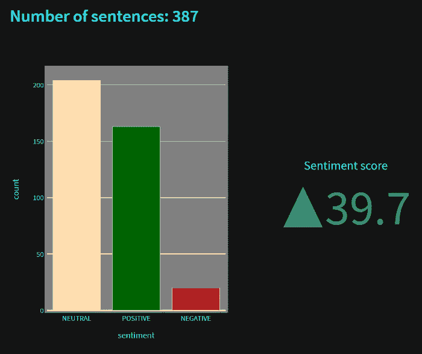
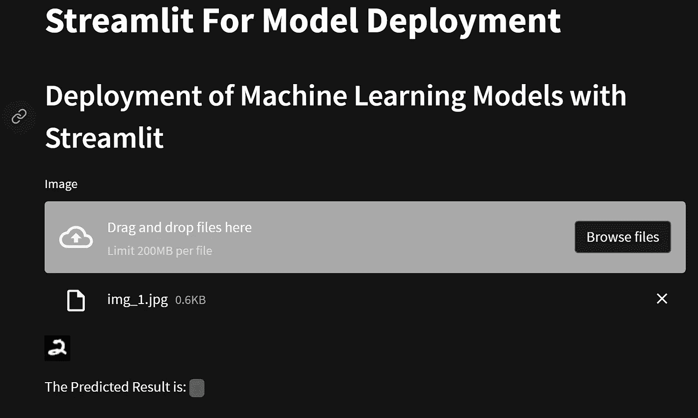

# 简化部署数据科学项目的初学者指南

> 原文：<https://towardsdatascience.com/beginners-guide-to-streamlit-for-deploying-your-data-science-projects-9c9fce488831>

## 使用 streamlit 轻松将您的机器学习和数据科学项目部署为 web 应用程序


伊戈尔·米斯克在 [Unsplash](https://unsplash.com?utm_source=medium&utm_medium=referral) 上的照片

宝贵的时间花费在构建数据科学项目上。在花费数小时并投入时间来开发这些机器学习和深度学习模型以成功解决特定任务之后，下一步是什么？

数据科学家可以构建他们的项目，以展示并与资源丰富的数据科学社区共享他们的项目。然而，大多数初学数据的科学家在开发出他们的机器学习或深度学习模型后，都很难找到最好的方法来进一步发展。

完成模型开发后，关键的一步是部署它们以供个人或社区进一步使用。您可以通过开发一个应用程序来部署这些模型，为系统传输创建一个可执行文件，或者使用我们将在本文中讨论的方法，为模型部署创建一个网站应用程序。

我们将利用 streamlit 为我们的数据科学项目部署机器学习或深度学习模型。Django 和 Flask 是此类网站部署模型的其他流行选项。然而，我们将在这篇文章中看到 streamlit，以及为什么我认为它是初学者数据科学家有效利用他们的项目的一个很好的选择。

如果观众对数据科学不太熟悉，我建议看看我以前的一篇文章。我提供了下面的链接，其中包含了一个简明指南，介绍了初学者在大约 12 个月内达到数据科学高级水平需要遵循的 12 个步骤。对于数据科学爱好者来说，这应该是一个最佳的起点。

[](/12-steps-for-beginner-to-pro-in-data-science-in-12-months-c6f6ba01f96e)  

# streamlit 简介:



作者图片

数据科学项目的部署是任何机器学习或深度学习管道的最终和关键步骤之一。正如前面所讨论的，有几种方法可以执行下面的操作(部署)，每种方法都有自己的优缺点。在我们进一步讨论 streamlit 之前，让我们先了解一下其他几种部署方法的优点和局限性。

部署机器学习模型的一种流行方式是以移动应用程序的形式。这些应用程序允许广泛的用户访问您的机器学习模型及其执行的任务。然而，对于为机器学习模型创建应用程序，您需要更加熟悉一些应用程序开发工具、TensorFlow Lite 移动库、嵌入式设备和其他此类工具。

另一种流行的项目部署方法是用机器学习模型创建软件，并将其部署为可执行文件。该应用程序通常通过使用 python 文件来开发。exe 转换器，可以与众多用户共享。但是，触及面通常没有移动应用多。对于初学者来说，转换时间以及整个可执行文件创建过程可能会稍微复杂一些。

Streamlit 不仅为您提供了一种部署机器学习模型的方法，还可以帮助您设计自己的网站。尽管对项目和设计结构的总体控制有一定的限制，但它为开发用户界面提供了最简单和直接的方法之一。借助其优化的工具，您可以创建和构建许多独特的项目，并相应地部署您的数据科学项目。

网站部署的其他方法是使用像 Flask 和 Django 这样的库，这允许用户更好地控制他们的项目，但是需要稍微多一点的编程。我推荐有兴趣用 streamlit 进一步探索更多项目的观众通过下面提供的链接查看我以前的一篇关于公司盈利电话情绪分析的文章。

[](/how-to-perform-sentiment-analysis-on-earnings-call-of-companies-122275f47e26)  

# 开始为数据科学项目部署机器学习模型:


[斯凯工作室](https://unsplash.com/@skyestudios?utm_source=medium&utm_medium=referral)在 [Unsplash](https://unsplash.com?utm_source=medium&utm_medium=referral) 拍摄的照片

文章的这一部分将分为两个重要的部分。在第一阶段，我们将涵盖 streamlit 的一些基础知识，以及它们在您自己的机器学习项目中的易用性。在第二阶段，我们将看看一种在服务器上部署模型的简单方法，并做出适当的预测。

请注意，在本文中，我们将只查看部署阶段的简单实用程序。在以后的博客中，我们将从头开始探索整个部署项目。让我们从 streamlit 的一些基本元素开始，轻松部署机器学习项目。

## Streamlit 的基础:

在本文的这一部分，我们将了解 streamlit 的一些基本概念，尤其是那些通常用于部署机器学习项目的概念。我们将首先导入我们将在这个小型项目构建中使用的必要库。

***导入必要的库:***

我们这个项目需要的主要库是用于部署模型的 streamlit 库、深度学习框架、用于处理图像的库和用于数学计算的库。读者可以利用 TensorFlow、PyTorch 或其他类似的深度学习框架来构建他们的特定构建。

我们将导入保存的模型，然后继续计算适当的预测。PIL 或 OpenCV 库可用于读取上传的图像。最后，如果您使用 pillow library 模块将图像转换为 numpy 数组形式以便进一步处理，则需要 numpy 数组。这个 skip 通常可以用 cv2 库跳过。下面的代码片段提供了必要的库导入。

```
# Importing the necessary librariesimport streamlit as st
import tensorflow as tf
from tensorflow.keras.models import load_model
from PIL import Image
import numpy as np
```

***为子栏目创建侧栏:***

在我们为你的网站设计探索基本的和不同的选择之前，我们将把我们的项目分成两个适当的子部分。我们将为项目添加一个标题，并为用户创建一个带有单选按钮选项的侧栏。

单选按钮的第一个选项允许用户掌握 streamlit 的一些基本概念，而第二个选项允许用户了解在本地主机服务上部署的深度学习模型的工作方式。下面提供了相同的代码。

```
# Adding an appropriate title for the test website
st.title("Streamlit For Model Deployment")# Creating a side bar radio option for selecting the required elements
_radio = st.sidebar.radio("",
                          ("Fundamentals of streamlit", "Model Deployment using streamlit"))
```

***细流的基本功能:***

在本节中，我们将简要介绍一些重要的 streamlit 组件及其各自的功能。streamlit 有几个组件可以为他们的用户提供快速的开发。我们可以在接下来的文章中讨论一些更独特的组件思想。

对于这个项目，我们将关注一些基本组件，这些组件将帮助读者相应地开发和部署他们的机器学习模型。下面是网站开发中必不可少的一些基本组件的代码块。按照下面的代码片段，我们将分别讨论这些元素。

```
if _radio == "Fundamentals of streamlit":
    # Creating a header in the fundamentals section
    st.header("Fundamental components of Streamlit") # Creating an appropriate subheader and looking at some of the basic elements
    st.subheader("Writing Elements") # Writing information
    st.write("Write Command: Writing details with the write command and the subheaders") # Creating a text box
    st.text("Text Component: This is a text box") # Display code
    with st.echo():
        import streamlit as st
        st.write("Writing Code") # Creating a button widget
    button1 = st.button("Click Here") # Creating additional text boxes
    if button1:
        st.markdown("*You clicked the button and the markdown is displayed*")
```

1.  标题—帮助创建 streamlit 网站的主标题。
2.  副标题—用于在网站上显示带有适当标题的副标题。
3.  编写——创建 streamlit 网站的主要功能之一。write 函数的工作方式类似于 Python 程序中的 print 命令，但所需的信息会显示在网站上。
4.  文本—与 write 命令类似，还有几个其他功能可用于显示信息。文本组件(也检查文本框和文本区域)相应地显示文本信息。
5.  Echo —该组件允许用户将他们的代码片段嵌入到 streamlit 中。嵌入类似于下面表示的代码块。
6.  按钮 streamlit 中的按钮命令允许用户单击小部件。单击按钮后，我们可以使用“if”条件语句来执行特定的操作。点击按钮后，我显示了降价信息。
7.  Markdown——类似于 Jupyter 笔记本中的 markdown 工作方式，您也可以使用他们的 markdown 命令来获得更多的交互性和 HTML 代码。

## 在 Streamlit 上部署和测试模型:

在本文的部署部分，我们将使用通过 TensorFlow 深度学习框架构建的经过训练的 MNIST 深度学习模型。该模型是预训练的，并与 MNIST 数据集相匹配。我们将在另一篇博客中介绍整个培训过程和步骤，以模拟部署。对于本文，让我们直观地了解如何在 streamlit 上部署训练好的模型来预测上传的图像。

第二个单选按钮将在 streamlit 的帮助下用于模型部署。我们将用 streamlit 库创建一个适当的标题来展示特定的作品。然后，我们将定义模型的路径，并用 TensorFlow 功能加载模型。借助 streamlit 中的上传器功能，我们将使用一个输入文件上传器来上传用户提交的各个图像。

如果文件上传程序成功解释了图像数据，我们可以继续显示用户提供的图像，并相应地做出适当的预测。如果用户没有输入图像，网站将等待所需的图像上传。我们将在另一篇文章中进一步详细介绍如何进行所需的预测和构建深度学习模型。下面是完成整个过程的代码片段。

```
elif _radio == "Model Deployment using streamlit":
    # Creating a header in the model deployment section
    st.header("Deployment of Machine Learning Models with Streamlit") # Loading the model
    model_path = "model_test.h5"
    model = load_model(model_path, compile = False)

    # Uploading an image
    img_data = st.file_uploader(label="Image", accept_multiple_files=True) # Making the required prediction
    if img_data is not None and len(img_data) > 0:
        # Assigning a random count
        count = 0 # Opening and displaying the image
        img = Image.open(img_data[count]) 
        st.image(img) # Converting into a numpy array
        img = np.array(img)
        img = np.expand_dims(img, 0) # Making the appropriate prediction
        prediction = model.predict(img)
        output = np.argmax(prediction) # Displaying the prediction
        st.write("The Predicted Result is: ", output)
        print(output) # While no image is uploaded
    else:
        st.write("Waiting For Upload of Image...")
```

## 完整代码:



作者图片

模型部署到网站后的预期结果如上图所示。我还提供了该项目的整个代码的要点，可以从下面提供的代码片段中获得。我建议用户可以自由地进一步探索代码，并尝试其他必要的属性和实验。

要运行上面的代码，请激活您的虚拟环境(如果有)，然后继续使用下面的命令通过 streamlit 运行 Python 文件。

```
streamlit run Website_Deploy.py
```

运行以下命令后，您应该能够打开到本地主机服务器的链接。按照所有的步骤，我们已经成功地在本地主机上部署了模型。在接下来的文章中，我们将研究处理 MNIST 数据集的完整代码结构和项目。我们还将把部署过程从您的本地主机系统扩展到互联网，以便广大用户能够访问。

# 结论:


Radek Grzybowski 在 [Unsplash](https://unsplash.com?utm_source=medium&utm_medium=referral) 上的照片

> 从文明的黎明到 2003 年，有 5eb 的信息被创建，但是现在每两天就有这么多的信息被创建。
> — ***埃里克·施密特***

在本文中，我们探讨了 streamlit 在网站设计和数据科学项目部署中的效用。首先，我们简要介绍了 streamlit 和其他一些用于部署机器学习和深度学习模型的流行方法。在接下来的部分，我们讨论了 streamlit 的基本概念以及网站设计的主要工具。

最后，我们部署了一个经过训练的机器学习模型，能够进行实时预测。本文旨在成为一个入门指南，帮助您开始使用 streamlit，并介绍模型部署的许多可能方法中的一种。在未来的博客中，我们将涵盖部署过程，并在深度学习框架和 streamlit 的帮助下，更深入地讨论 MNIST 项目的开发。

如果你想在我的文章发表后第一时间得到通知，请点击下面的[链接](https://bharath-k1297.medium.com/subscribe)订阅邮件推荐。如果你希望支持其他作者和我，请订阅下面的链接。

[](https://bharath-k1297.medium.com/membership)  

如果你对这篇文章中提到的各点有任何疑问，请在下面的评论中告诉我。我会尽快给你回复。

看看我的一些与本文主题相关的文章，你可能也会喜欢阅读！

[](/automate-your-emails-with-python-for-2022-and-beyond-2284054d1012)  [](/the-ultimate-replacements-to-jupyter-notebooks-51da534b559f)  [](/7-best-research-papers-to-read-to-get-started-with-deep-learning-projects-59e11f7b9c32)  [](/visualizing-cpu-memory-and-gpu-utilities-with-python-8028d859c2b0)  

谢谢你们坚持到最后。我希望你们都喜欢这篇文章。祝大家有美好的一天！