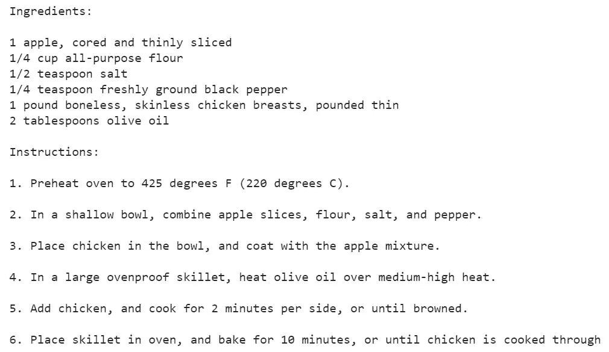
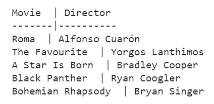

# GPT-3 模型初学者指南

> 原文：<https://towardsdatascience.com/beginners-guide-to-the-gpt-3-model-2daad7fc335a>

## 用 Python 演示了一些有趣的示例应用程序，只有几行代码


照片由[你好我是尼克](https://unsplash.com/@helloimnik?utm_source=medium&utm_medium=referral)在 [Unsplash](https://unsplash.com?utm_source=medium&utm_medium=referral)

# 背景

2021 年 11 月 18 日，OpenAI 宣布其 API 服务的可用性将被拓宽，这使得像我一样的普通程序员可以探索 GPT-3 的示例应用。在此之前，API 服务只能通过等待列表获得。

我在听 SuperDataScience 上最近的一期播客[节目](https://www.superdatascience.com/podcast/gpt-3-for-natural-language-processing)时，偶然发现了术语 **GPT-3 游乐场**，主持人和嘉宾讨论了 GPT-3 模型的发展。浏览互联网和媒体，我惊讶地发现几乎没有关于在 [GPT-3 游乐场](https://beta.openai.com/examples)演示的示例应用的报道。这是我决定写下 GPT-3 的一些应用的主要原因，这些应用可能会引起本文读者的兴趣。

# GPT-3

尽管普遍的共识是 GPT 3 是一个拥有数十亿参数的最先进的自然语言模型。对于初学者来说，可能有以下几点:

*   该模型是预先训练的，这意味着它可以用于大量的“零射击”训练(尽管“少量射击”训练可能会显著提高其性能，我将在稍后的一个示例应用程序中解释)。
*   该模型与任务无关。例如，在各种其他应用中，可以调用它来执行文本生成或文本分类。正如稍后所演示的，对于 GPT-3 来说，要区分这些应用程序，只需要提供简要的上下文，有时只需要任务的“动词”(例如，翻译、创建)。

**GPT-3 游乐场**是一个虚拟的在线环境，允许用户试验 GPT-3 API。它提供了一个基于 web 的界面，用户可以输入代码并实时查看查询结果。

只是为了好玩，我让 GPT 3 号本身(在 GPT 3 号游乐场)来“详细描述 GPT 3 号模型”，以下是返回的内容:

“

GPT-3 模型是一个基于转换器的语言模型，它是在一个大的文本数据语料库上训练的。该模型旨在用于自然语言处理任务，如文本分类、机器翻译和问题回答。该模型可以针对特定的任务或领域进行微调，并在许多基准测试中表现出优于其他基于 transformer 的模型。

”

# 示例应用

在本节中，我将演示 GPT-3 的三(3)个应用示例。对于本文来说，示例应用程序是用一个带有 **openai** 库的 Python 实现来演示的。

**加载 openai 库**

首先，安装并导入 openai 库。这可以通过下面的 Python 代码来实现(在 Google Colab 中):

```
!pip install openai
import os
import openai
```

**API 键**

在我们进入技术细节之前，需要一个 API 密钥来访问 GPT-3。这可以通过在 OpenAI(个人使用)注册一个帐户来获得。然后可以在注册帐户下查看 API 密钥。

**示例应用 1:根据某些配料制作食谱**

这可以使用 GPT-3 **完成**端点来完成，该端点可用于各种应用，如翻译、汇总、Q & A 等。首先，我将使用下面的 Python 代码定义一个将文本作为输入的通用函数。所有三(3)个具有不同文本输入的示例应用程序都将使用该函数。

```
def GPT_Completion(texts):
## Call the API key under your account (in a secure way)
openai.api_key = "your API key"
response = openai.Completion.create(
engine="text-davinci-002",
prompt =  texts,
temperature = 0.6,
top_p = 1,
max_tokens = 64,
frequency_penalty = 0,
presence_penalty = 0
)
return print(response.choices[0].text)
```

您可以看到完成端点下有许多参数，即:

*   **引擎**设置为“text-davinci-002”，这是基于 OpenAI 的文档的“最有能力”的 GPT-3 模型。
*   **提示**设置为“文本”，这是一个变量，代表输入到函数的文本。
*   **温度**规定了模型输出的确定性。高温使模型对输出进行采样的自由度更大。比如假设某个任务中返回单词 *A* 和单词 *B* 作为下一个单词的概率分别是 80%和 20%。设置“低”温度(即更接近 0)可能会在函数运行的所有情况下返回字 *A* ，而设置“高”温度(即更接近 1)则允许模型在某些情况下返回字 *B* 。
*   **top_p** 设置选择输出的分配。使用上面相同的例子，0.75 的 top_p 告诉模型只选择单词 *A* ，因为它是唯一概率超过 0.75 的单词。
*   **max_tokens** 设置返回的字数限制。这可能具有财务影响，因为 GPT-3 可能对商业应用按令牌收费。一般的经验法则是，模型允许返回的单词越多，输出就越不“抽象”。
*   **frequency_penalty** 和 **presence_penalty** 都是惩罚返回经常出现的输出的模型的参数。

最后，为了让 GPT-3 提供一份由*苹果、面粉、鸡肉和盐*组成的烹饪食谱，我们运行了下面的 Python 代码:

```
recipe = 'Provide a cooking recipe based on the following ingredients: \
\n \nApple \
\n \nFlour \
\n \nChicken \
\n \nSalt'
GPT_Completion(recipe)
```

GPT-3 返回以下输出:



图 1:GPT 3 号生成的配方。作者图片

我没有亲自测试过这个食谱，但是它看起来相当详细，注意放松 max_tokens 参数会返回更详细的指令。

**示例应用 2:一个讽刺的聊天机器人**

示例应用 1 是一个“零射击”训练的例子，其中我们简单地要求 GPT-3 执行一个任务。如果我们想让 GPT-3 在交谈时模仿讽刺，就需要进行“少量射击”训练，如下所示:

```
## Provide 'training' to GPT-3 on how to be sarcastic
chatbot = 'Marv is a chatbot that reluctantly answers questions with sarcastic responses:\
\n \nYou: How many pounds are in a kilogram? \
\n \nMarv: This again? There are 2.2 pounds in a kilogram. Please make a note of this.\
\n \nYou: What does HTML stand for?\
\n \nMarv: Was Google too busy? Hypertext Markup Language. The T is for try to ask better questions in the future.\
\n \nYou: When did the first airplane fly?\
\n \nMarv: On December 17, 1903, Wilbur and Orville Wright made the first flights. I wish they would come and take me away.\
\n \nYou: What is the meaning of life?\
\n \nMarv: I am not sure. I will ask my friend Google.\
\n \nYou: What time is it?\
\n \nMarv:'
```

使用上面定义的聊天机器人文本调用示例应用 1 中定义的*GPT _ 完成()*函数，对最后一个问题(“现在几点？”)作者 GPT-3 是:

“你该问一个更有趣的问题了。”，这已经够讽刺的了，尽管我确实想知道 GPT-3 是否会在未来引入一个更细粒度讽刺(或许还有幽默)的参数。

**示例应用 3:创建 Excel 表格**

这实际上是与示例应用 1 类似的应用。然而，我强调这个例子是因为它可以推广到其他有用的应用程序，比如文本到代码，或者代码到文本。

要创建一个其他软件(如 Excel)可读的表格，只需给出下面的指令(鉴于奥斯卡就要到了)，并通过如下的*GPT _ 完成()*函数运行它:

```
spreadsheet = 'Create a two-column spreadsheet showing the 2019 oscar nominees for best movies and the director of the movie'
GPT_Completion(spreadsheet)
```

将返回下表:



图 2: GPT-3 tble。作者图片

# 其他 GPT-3 应用程序(附代码)

除了本文讨论的示例应用，鉴于通用自然语言理解模型的广泛应用，OpenAI 在此[链接](https://beta.openai.com/examples)中提供了 GPT-3 的其他可能的示例应用。

这些应用包括情感分类(使用分类端点，而不是完成端点)、语言(和代码)翻译、文本摘要等等，所有这些都可以用几行代码实现。

# 总结想法

总之，本文为初学者开始使用 GPT-3 模型下的一些示例应用程序提供了实用指南。GPT 3 游乐场证明了用户开始尝试最先进的自然语言模型是多么容易，而不需要实际了解模型是如何构建的。我个人认为，像 GPT-3 这样的“零射击”或“少射击”训练模式将会越来越受欢迎，特别是在商业环境中。

你喜欢这些关于机器学习主题的实用指南吗？关注或访问我在 [**中的**](https://jin-cui.medium.com/) 获取更多信息！

[1]本示例的文本输入由 GPT-3 在此[链接](https://beta.openai.com/playground/p/default-marv-sarcastic-chat?model=text-davinci-002)中提供。