# 时间序列分析和预测入门

> 原文：<https://towardsdatascience.com/beginners-introduction-to-time-series-analysis-and-forecasting-c2c2918603d9>

## 平稳性、时间序列分解、ARIMA 建模等等


[迪安赫](https://unsplash.com/@di_an_h?utm_source=medium&utm_medium=referral)在 [Unsplash](https://unsplash.com?utm_source=medium&utm_medium=referral) 上拍照

最近迷上了时间序列这个话题。我觉得很有趣的是，我们在周围世界观察到的许多事情，也许我们有时认为理所当然的事情，实际上可以用时间来解释。

想想看，道路交通往往在一天中的某些时段达到高峰，冰淇淋的销量通常在夏季较高，或者最近，新冠肺炎病例的趋势如何随着时间的推移而变化。

通过简单地检查一个变量的行为和随时间的变化，你可以知道很多东西。在数据科学中，这就是我们所说的时间序列分析。时间序列是一系列按时间顺序排列的相关数据点，通常在连续且等距的时间点采集。

在这篇博文中，我将对时间序列做一个简单的介绍，并分享一些基本的术语和概念来帮助你进入这个令人兴奋的领域。具体来说，我们将涵盖:

*   平稳的概念
*   为什么平稳性在时间序列分析和预测中很重要
*   如何测试和生成平稳的时间序列过程
*   如何选择正确的 ARIMA 模型，测试模型的拟合度以及生成未来预测

本文附带的代码可以在我的 GitHub [这里](https://github.com/chongjason914/time-series/blob/main/time-series.ipynb)找到。

# 将数据转换为时间序列对象

为了正确处理 R 中的时间序列数据，我们首先必须使用`ts( )`函数将数据定义为一个时间序列对象。

```
testing.stationarity **=** read.table("testing.stationarity.txt")
head(testing.stationarity)
class(testing.stationarity)
```

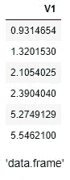

数据框对象；作者图片

```
testing.stationarity **=** ts(testing.stationarity)
head(testing.stationarity)
class(testing.stationarity)
```

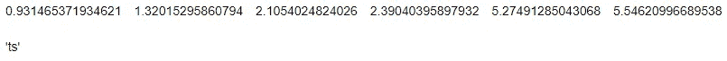

时序对象；作者图片

数据完全相同，只是在 r 中存储为不同的类。

# 测试平稳性

在我们开始探讨测试时间序列过程中平稳性的各种方法之前，先解释一下什么是平稳性是有帮助的。

平稳性是时间序列分析中的一个重要概念。大多数时间序列模型，如我们将在后面讨论的 ARIMA 模型，假设每个数据点都是相互独立的。换句话说，在我们可以用时间序列模型来拟合数据并使用该模型来生成预测之前，我们需要首先确保时间序列是稳定的。

如果时间序列满足以下三个条件，则认为它是平稳的:

1.  期望值(平均值)随时间保持不变
2.  随着时间的推移，时间序列的波动性(方差)在其平均值附近是恒定的
3.  时间序列的协方差只取决于时滞

如果这听起来令人困惑，不要担心，还有一些视觉线索可以帮助你快速识别一个时间序列是否是稳定的。实际上，有两个组成部分:趋势和季节性。如果数据中存在这些成分中的任何一个，时间序列就不是静止的。

趋势是时间序列的长期轨迹。例如，像标准普尔 500 指数这样的股票市场在过去的几十年里已经出现了整体上涨的趋势。

另一方面，季节性代表以固定和已知的频率发生的循环模式。例如，年度零售额往往会在圣诞节期间飙升。

有两种方法可以测试时间序列的平稳性:

1.  菲利普斯-佩龙单位根检验
2.  绘制样本 ACF

Phillips-Perron 单位根检验，`PP.test( )`用于检验时间序列是一阶积分的零假设，换句话说，时间序列需要进一步差分才能达到平稳性。

```
PP.test(testing.stationarity)
```

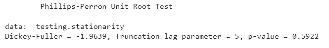

作者图片

由于 p 值大于 0.05，我们没有足够的证据拒绝零假设，因此得出结论，时间序列过程需要差分，不是平稳的。

或者，我们也可以绘制时间序列的自相关函数(ACF ),它告诉我们序列与其滞后值的相关性。

```
acf(testing.stationarity, main**=**"Data: testing.stationarity", ylab**=**"Sample ACF")
```

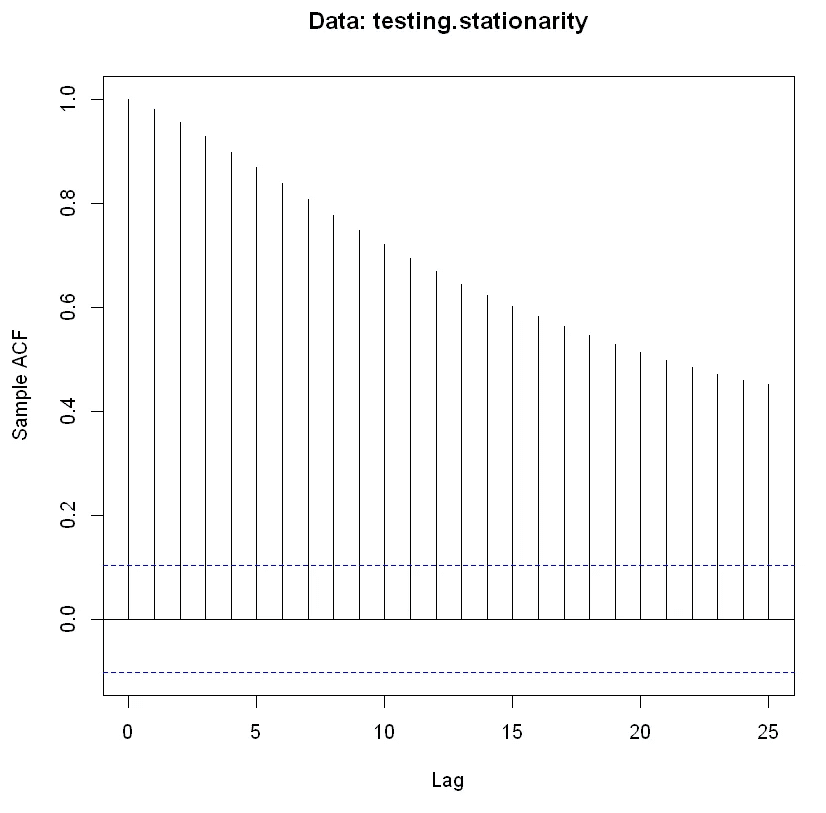

作者图片

正如我们从上面的 ACF 图中看到的，自相关性衰减缓慢，这表明时间序列不是平稳的。

# 移除趋势

既然我们知道趋势和季节性会导致时间序列不稳定，那么让我们探索消除它们的方法。

有几种方法可以从时间序列中移除趋势。在这里，我概述了两个最简单的方法:

1.  区别
2.  最小二乘趋势去除

## 1.区别

差分是指取给定滞后的数据点和前一个数据点之间的差值。

这里，除了它们各自的自相关函数之外，我们对比了我们从上面看到的时间序列和它的滞后 1 的差分替代。

```
*# Difference data using lag=1 and differences=1*
Xt **=** diff(testing.stationarity, lag**=**1, differences**=**1)

*# Plot original data, differenced data, and their respective sample ACFs* 
par(mfrow**=**c(2,2))
ts.plot(testing.stationarity, main**=**"Data: testing.stationarity",
        ylab**=**"Value")
ts.plot(Xt, main**=**"Differenced data", ylab**=**"Change in value")
acf(testing.stationarity, main**=**"", ylab**=**"Sample ACF")
acf(Xt, main**=**"", ylab**=**"Sample ACF")
par(mfrow**=**c(1,1))
```

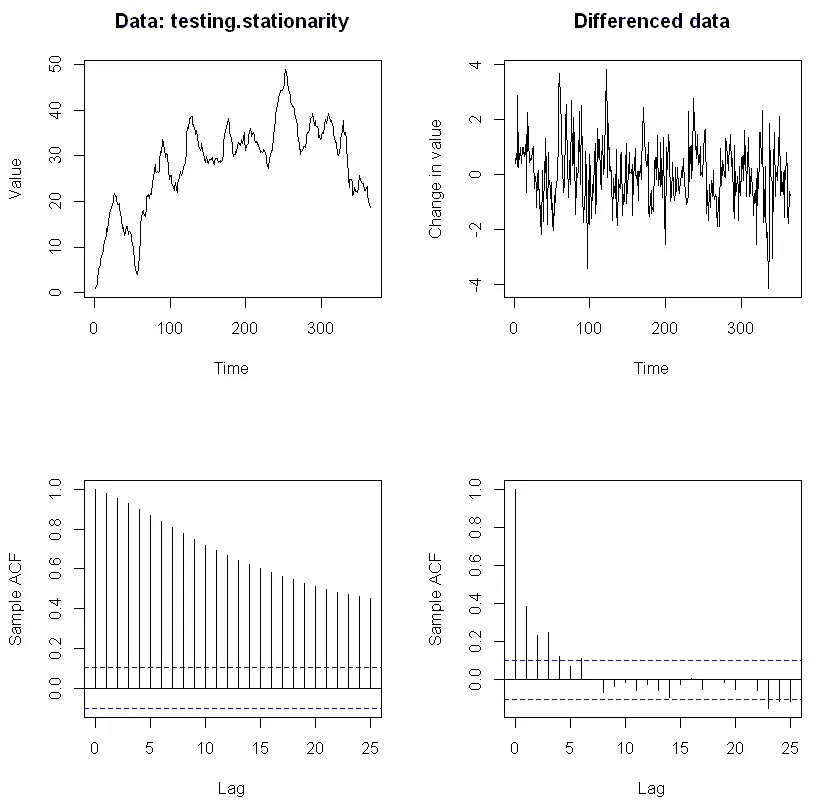

作者图片

我们可以清楚地看到，原来的时间序列中曾经存在的趋势现在已经没有了。此外，ACF 现在衰减得更快了。

让我们进行菲利普斯-佩龙单位根检验来证实我们的观察。

```
# Perform unit root test on differenced data 
PP.test(Xt)
```

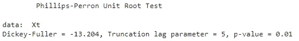

作者图片

差分数据的 p 值低于 0.05，表明我们应该拒绝零假设，并得出结论，时间序列不需要再次差分，现在是平稳的。

## 区别:奖金！

为了确定时间序列的差异次数，我们可以选择一个给出最低总体方差的时间序列。

```
*# Try difference values between 0-7 and store their respective variance as a data frame* 
ts.var **=** var(testing.stationarity)
for(i in 1**:**7) {
  diff **=** diff(testing.stationarity, lag**=**1, differences **=** i)
  ts.var[i+1] **=** var(diff)
}
ts.var.df **=** data.frame(diff**=**0**:**7, var**=**ts.var)

*# Plot variance against the number of times data is differenced* 
plot(ts.var.df, type**=**"l", ylab**=**"Variance", xlab**=**"d")
```

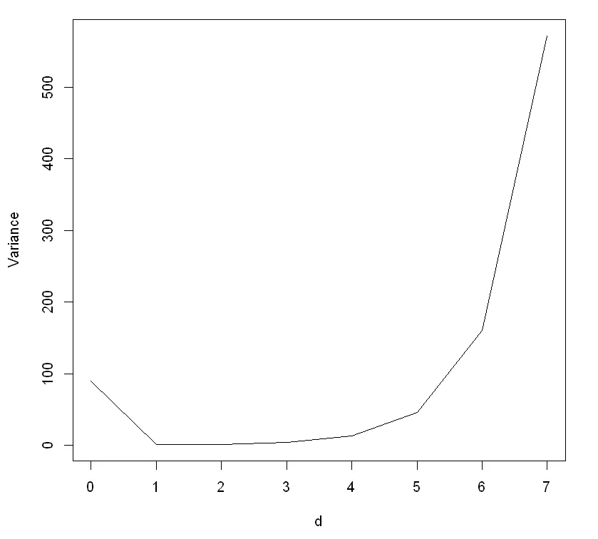

总方差在 d=1 时最低；作者图片

当时间序列过程仅差分一次时，方差最低，随后增加。因此，我们得出结论，数据不需要第二次差分。

## 2.最小二乘趋势消除

另一方面，最小二乘趋势移除涉及将线性模型拟合到时间序列，并从数据点中减去拟合值。

这里，我们有一个不同的时间序列，随着时间的推移，有一个向上的，积极的趋势。

```
*# Generate time series data* 
set.seed(123)
n **=** 1000
sim **=** arima.sim(list(ar**=**0.9), n)
xt **=** 2000**+**cumsum(sim)

*# Plot generated time series* 
ts.plot(xt, col**=**"blue", main**=**"Time series with trend", ylab**=**"Data")
```

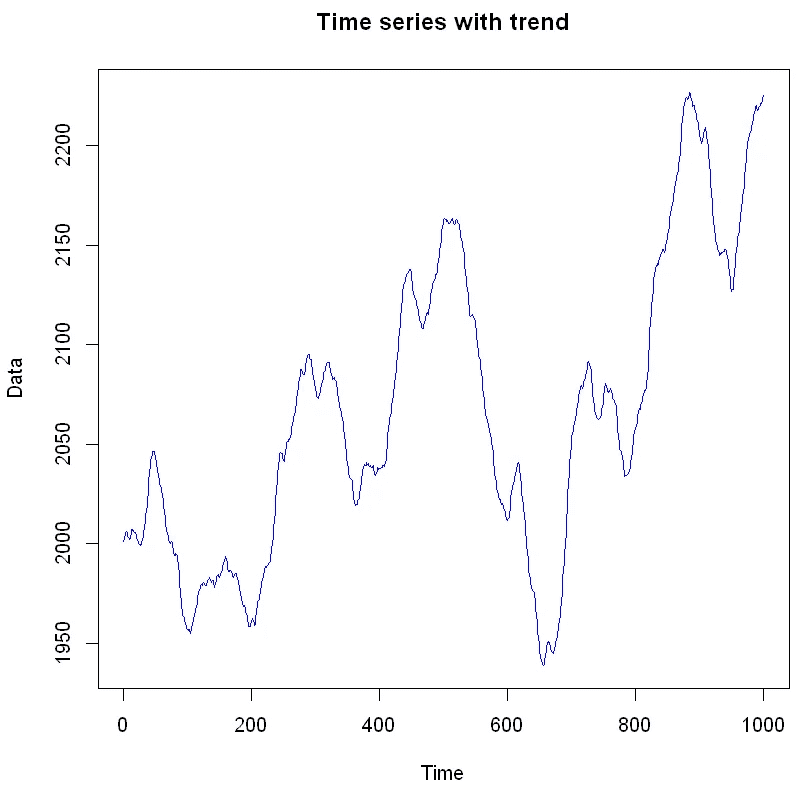

作者图片

我们可以看到模拟的时间序列有一个整体上升的趋势。为了消除这种趋势，我们将对数据拟合一个线性模型，然后从数据点中减去拟合值以获得残差。

如果处理得当，残差应该没有剩余趋势，或者换句话说，在一段时间内有一个恒定的平均值。

```
*# Fit a linear model on time series, extract fitted values and residuals* 
time **=** time(xt)
fit **=** lm(xt **~** time)
yt **=** fit**$**fitted.values
zt **=** fit**$**residuals

*# Plot time series with superimposed linear model and residuals* 
par(mfrow**=**c(2,1))
ts.plot(xt, col**=**"blue", main**=**"Regression example", ylab**=**"Data")
abline(fit, col**=**"red")
plot(xt**-**yt, type**=**"l", col**=**"green", xlab**=**"Time", ylab**=**"Residuals")
par(mfrow**=**c(1, 1))
```

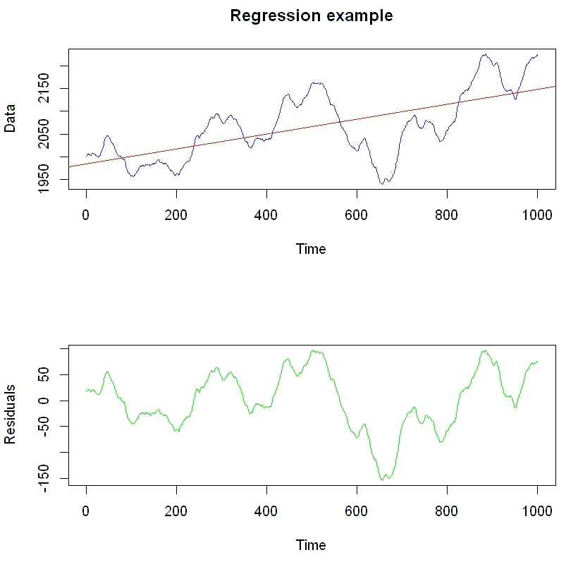

作者图片

# 消除季节性

除了趋势之外，季节性也可能导致时间序列变得不稳定。

在这里，我将演示三种方法来消除时间序列中的季节性:

1.  季节性差异
2.  季节性平均值
3.  移动平均法

在我们开始之前，让我们简要讨论一下 r 中的`ldeaths`数据集。它代表了 1974-1979 年间英国因支气管炎、肺气肿和哮喘每月死亡的人数，包括男性和女性。

```
*# Plot ldeaths* 
plot(ldeaths, main**=**"Monthly deaths from lung diseases in the UK", ylab**=**"Deaths")
points(ldeaths, pch**=**20)

*# Add red vertical line at the start of each year* 
abline(v**=**1974**:**1980, col**=**"red")

*# Plot sample ACF of ldeaths* 
acf(ldeaths, main**=**"Sample ACF of ldeaths", ylab**=**"Sample ACF", lag.max**=**36)
```

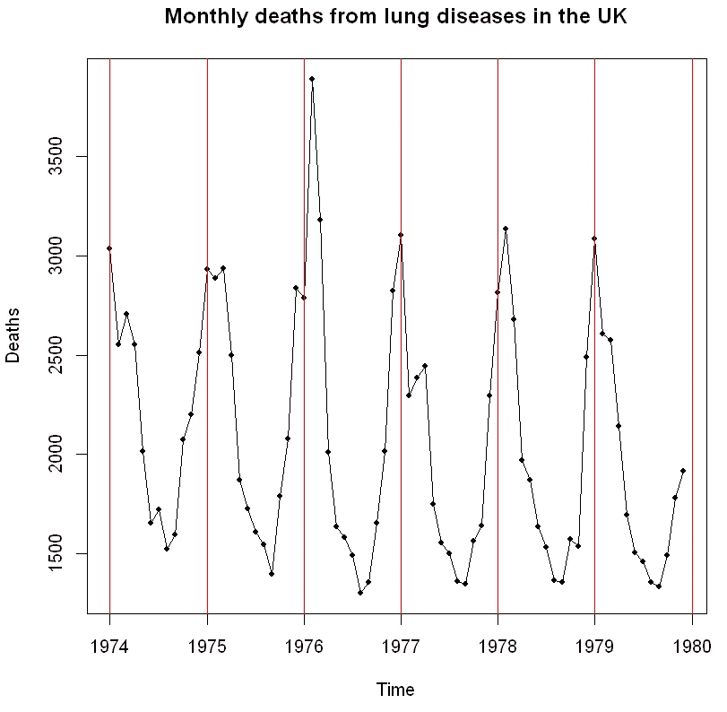

作者图片

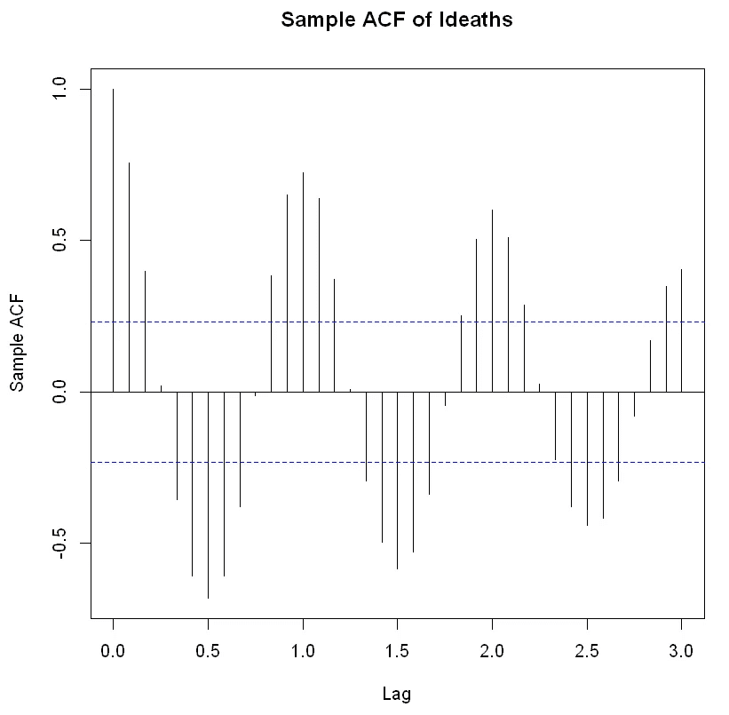

作者图片

图表中有一个非常明显的年度季节效应。尽管每年的最高点不一定与同一个月相对应，但是数据中仍然存在明显的年度趋势。

## 1.季节性差异

季节性差异意味着用固定滞后的前一个数据点减去每个数据点。

```
*# Difference ldeaths using lag=12 i.e. January 1975 minus January 1974, February 1975 minus February 1974, and so on* 
sdiff.ldeaths **=** diff(ldeaths, lag**=**12, differences**=**1)

*# Plot original data, differenced data, and their respective sample ACFs* 
par(mfrow**=**c(2,2))
ts.plot(ldeaths, main**=**"Data: ldeaths", ylab**=**"Number of deaths")
acf(ldeaths, main**=**"Sample ACF of ldeaths", ylab**=**"Sample ACF")
ts.plot(sdiff.ldeaths, main**=**"Data: sdiff.ldeaths", ylab**=**"Difference in number of deaths")
acf(sdiff.ldeaths, main**=**"Sample ACF of sdiff.ldeaths", ylab**=**"Sample ACF")
par(mfrow**=**c(1,1))
```

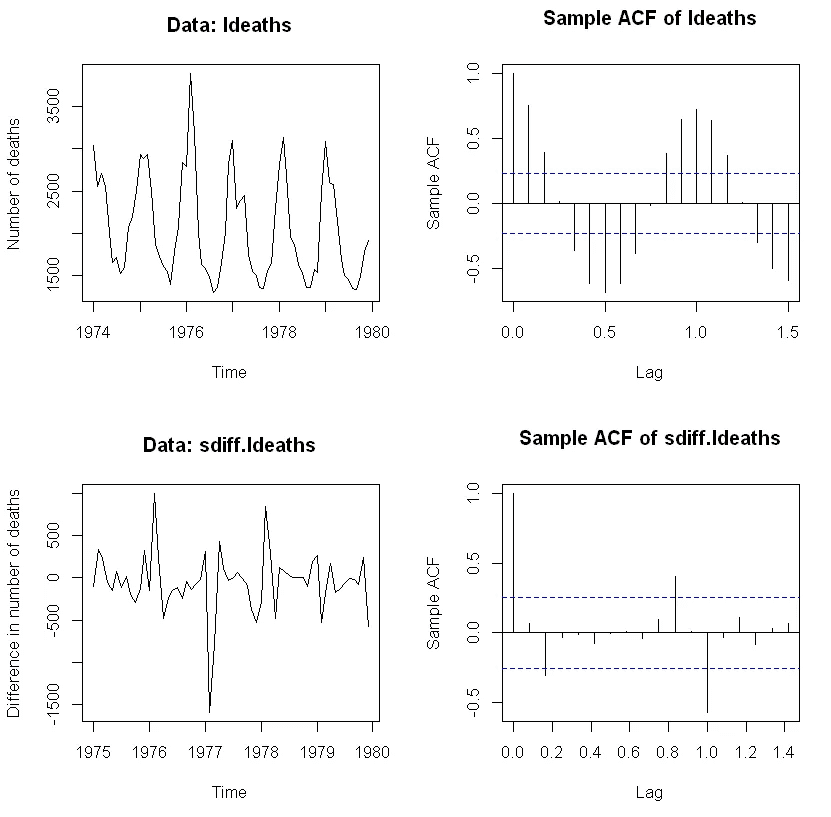

作者图片

## 2.季节性平均值

季节性均值包括将每个数据点减去其各自的组平均值，例如，在这个特定的场景中，是月平均值。

```
*# Generate ldeaths as dataframe* 
ldeaths.df **=** data.frame(year**=**rep(1974**:**1979, each**=**12),
                        month**=**rep(1**:**12, 6),
                        value**=**ldeaths)
head(ldeaths.df, 12)
```

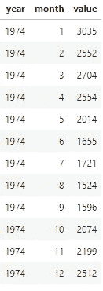

ldeaths 数据集的前 12 个数据点；作者图片

```
*# Monthly averages of ldeaths dataset* 
xbars **=** aggregate(value **~** month, data **=** ldeaths.df, mean)
xbars
```

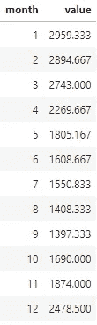

ldeaths 数据集的月平均值；作者图片

```
*# Subtract each month in ldeaths by their respective means*
yt **=** ldeaths **-** xbars**$**value

*# Plot ldeaths after subtracting seasonal means* 
par(mfrow**=**c(2, 1))
plot(yt, main**=**"Monthly deaths from lung diseases in the UK", ylab**=**"Deaths")
points(yt, pch**=**20)
acf(yt, main**=**"Sample ACF of the series ldeaths less seasonal means", ylab**=**"Sample ACF", lag.max**=**36)
par(mfrow**=**c(1, 1))
```

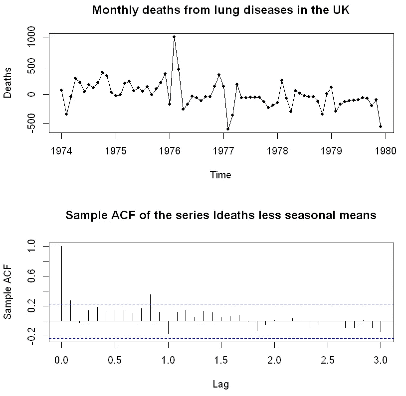

作者图片

从上述两种方法中我们可以看出，新的时间序列不再具有原来存在的季节性。

## 3.移动平均法

最后但并非最不重要的一点是，移动平均法涉及通过对整个时间序列进行移动平均来计算时间序列的趋势。

我们可以分解时间序列以分离出趋势、季节性和白噪声。

```
*# Decompose ldeaths into its trend, seasonal and random components* 
plot(decompose(ldeaths))
```

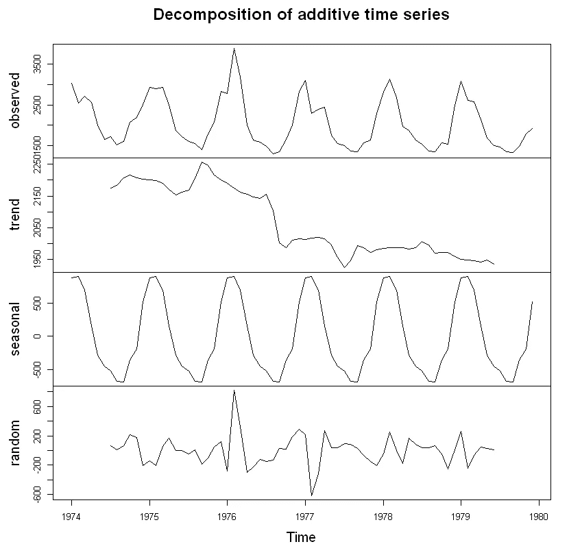

作者图片

```
*# Store trend, seasonal and random as individuals variables* 
decomp **=** decompose(ldeaths) 
trend **=** decomp**$**trend
seasonal **=** decomp**$**seasonal
random **=** decomp**$**random

*# Plot data, trend and seasonal + trend* 
ts.plot(ldeaths, ylab**=**"", main**=**"Components of time series: ldeaths", col**=**"grey")
lines(trend, col**=**"red")
lines(seasonal**+**trend, col**=**"blue")
legend("topright", legend**=**c("Data", "Trend", "Seasonal + trend"), col**=**c("grey", "red", "blue"), lty**=**1)
```

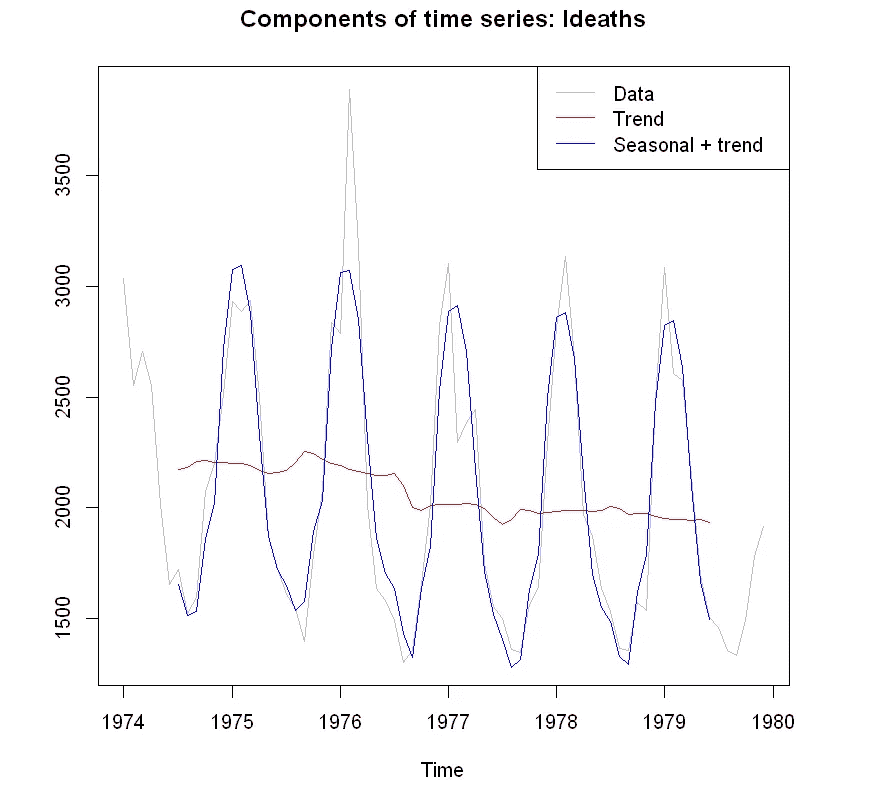

作者图片

# 模型拟合

ARIMA(p，d，q)模型是最常用的时间序列模型之一。它由三个超参数组成:

*   p =自回归(AR)
*   d =差异(I)
*   q =移动平均值(MA)

虽然在`forecast`包中已经有了像`auto.arima( )`这样的函数可以帮助我们确定这些超参数，但是在这一节中，我们将着重于一些例子来学习如何手动选择 p、d 和 q 的值

具体来说，我们将研究两个独立的时间序列过程的 ACF 和部分 ACF 图，以确定我们的 ARIMA 模型的超参数。

## 选择正确的 ARIMA 模式:示例 1

```
*# Read time series data* 
data **=** read.csv("fittingmodelEg1.csv", header**=**F)
data **=** ts(data[, 1])

*# Plot data, ACF and partial ACF* 
m **=** matrix(c(1, 1, 2, 3), 2, 2, byrow**=TRUE**)
layout(m)
ts.plot(data, ylab**=**"")
acf(data,main**=**"")
pacf(data,main**=**"")
par(mfrow**=**c(1,1))
```

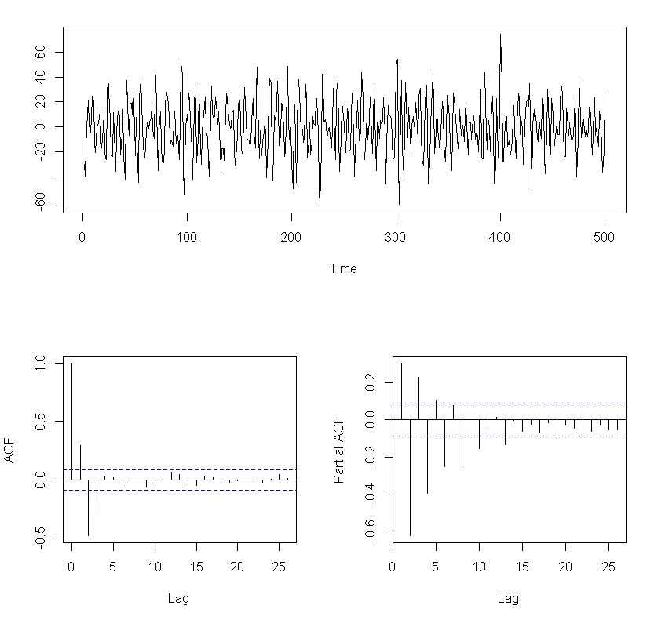

作者图片

我们之前讨论过什么是自相关函数(ACF ),它告诉我们序列与其滞后值的相关性。另一方面，部分自相关函数(PACF)测量前一个滞后中未考虑的下一个滞后值的残差的相关性。

通过观察上面的时间序列，我们可以看到，没有明显的趋势，方差也随着时间的推移而合理地保持恒定。

ACF 不会缓慢下降，因此表明该过程不需要进一步微分，换句话说，设置 d=0。此外，在滞后 3 之后，ACF 也在置信区间内突然下降。这就提示我们应该将移动平均超参数设置为等于 3，即 q=3。

另一方面，PACF 的衰落更加缓慢。

根据上面的信息，我们可以尝试用 MA(3)模型来拟合这个数据，或者等价地，用 ARIMA(p=0，d=0，q=3)来拟合。在实践中，我们会在决定最终拟合之前调查多个模型。

## 选择正确的 ARIMA 模式:示例 2

```
*# Read time series data* 
data2 **=** read.csv("fittingmodelEg2.csv", header**=**F)
data2 **=** ts(data2[, 1])

*# Plot data, ACF and partial ACF* 
m **=** matrix(c(1, 1, 2, 3), 2, 2, byrow**=TRUE**)
layout(m)
ts.plot(data2, ylab**=**"")
acf(data2,main**=**"")
pacf(data2,main**=**"")
par(mfrow**=**c(1,1))
```

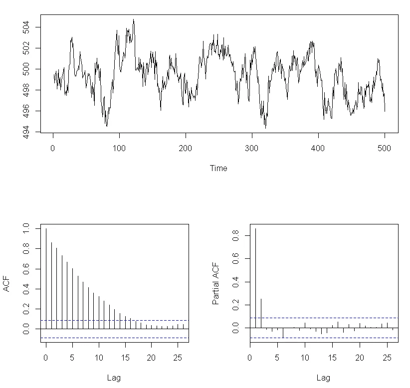

作者图片

与示例 1 类似，数据本身没有明显的趋势，变量似乎在一段时间内相当稳定。

ACF 没有显示出稳定下降的趋势，因此数据看起来是稳定的。因此，我们可以设置 d=0。

另一方面，PACF 在滞后 2 之后突然下降到置信区间内，这表明我们应该将自回归超参数设置为等于 2，换句话说，p=2。

基于上述信息，我们可以尝试用 AR(2)模型来拟合该数据，或者等效地，用 ARIMA(p=2，d=0，q=0)模型来拟合。

# 测试模型的拟合度

现在，我们简要地回顾了如何为特定的时间序列数据选择正确的模型，让我们讨论一下如何测试我们选择的模型是否真正合适。

在本节中，我们将研究三种不同的技术来测试时间序列模型的拟合度:

1.  残差图
2.  永盒试验
3.  赤池信息标准(AIC)

## 1.残差图

顾名思义，残差图绘制了模型未考虑的时间序列数据的残差。

除了具有相对稳定的随时间变化的方差之外，与数据拟合良好的模型将产生以零均值为中心的残差。

在将 MA(3)模型拟合到我们在之前的练习中看到的示例 1 后，请参见下面的残差图。

```
*# Fit MA(3) model to data and extract residuals* 
ma3 **=** arima(data, order**=**c(0, 0, 3))
residuals **=** ma3**$**residuals

*# Plot residuals and ACF of residuals* 
par(mfrow**=**c(2, 1))
ts.plot(residuals, main**=**"MA(3) residuals", ylab**=**"Residuals", col**=**"blue")
acf(residuals, main**=**"", ylab**=**"ACF")
par(mfrow**=**c(1, 1))
```

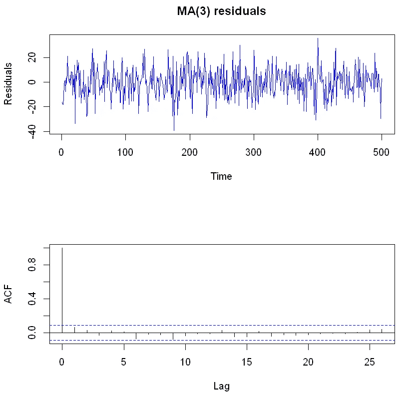

作者图片

残差图的均值和方差在很大程度上是恒定的。残差的 ACF 很小，没有明显的模式，因此我们可以得出结论，残差似乎是独立的。

因此，我们也可以得出结论，MA(3)模型为数据提供了良好的拟合。

## 2.永盒试验

容格检验是一种统计检验，用来衡量时间序列的一组自相关是否不为零。

```
Box.test(residuals, lag**=**5, type**=**"Ljung", fitdf**=**3)
```

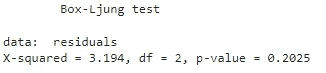

根据上面的输出，由于 p 值大于 0.05，我们不拒绝零假设，并得出结论，该模型与数据非常吻合。

## 3.赤池信息标准(AIC)

最后但并非最不重要的一点是，AIC 是一种衡量模型拟合优度和模型中使用的参数数量之间权衡的方法。

虽然具有许多参数的模型可以很好地拟合数据，但它不一定能准确预测未来。我们通常称之为机器学习中的过度拟合。相反，参数太少的模型可能不足以捕捉底层数据本身的重要模式。

因此，一个好的模型必须能够在这两种效应之间取得健康的平衡，AIC 帮助我们客观地衡量这一点。

在我们研究 AIC 在实践中是如何工作的之前，让我们为下面的新时间序列数据确定一个合适的模型。

```
*# Read time series data* 
data3 **=** read.csv("fittingmodelEg3.csv", header**=**F)
data3 **=** ts(data3[, 1])

*# Plot data without differencing and differenced data* 
m **=** matrix(c(1, 1, 4, 4, 2, 3, 5, 6), 2, 4, byrow**=TRUE**)
layout(m)
ts.plot(data3, main**=**"Data without differencing", ylab**=**"")
acf(data3, main**=**"", ylab**=**"Sample ACF")
pacf(data3, main**=**"", ylab**=**"Sample PACF")
d **=** diff(data3)
ts.plot(d, main**=**"Differenced data", ylab**=**"")
acf(d, main**=**"", ylab**=**"Sample ACF")
pacf(d, main **=** "", ylab**=**"Sample PACF")
par(mfrow**=**c(1, 1))
```

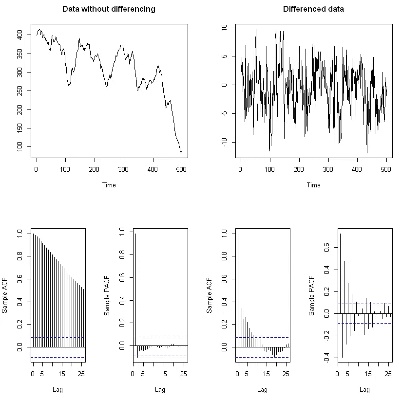

作者图片

上面输出的左半部分显示了与原始时间序列数据相关的三个图。数据显示出明显的下降趋势，这反映在缓慢衰减的样本 ACF 中。这表明我们需要对数据进行差分，以消除其趋势。

输出的右半部分涉及一次差分后的相同时间序列数据。我们可以看到，在差分后，我们设法消除了样本 ACF 中的缓慢衰减。

到目前为止，我们知道我们的 ARIMA 模型应该是 ARIMA(p，d=1，q)。为了帮助我们确定 p 和 q 的值，我们将部署 AIC。具体来说，我们将根据给出最低 AIC 值的值来选择 p 和 q 的值的组合。

```
*# Try values 0-2 for both p and q, record their respective AIC and put them into a data sframe* 
aic.result **=** numeric(3)
for (p in 0**:**2) {
  for (q in 0**:**2) {
    aic **=** arima(d, order**=**c(p, 0, q))**$**aic
    aic.result **=** rbind(aic.result, c(p, q, aic))
  }
}
aic.result **=** aic.result[-1, ]
colnames(aic.result) **=** c("p", "q", "AIC")
aic.result
```

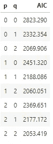

作者图片

我们可以看到，p=2 和 q=2 产生最低的 AIC，因此我们应该将 ARIMA(2，1，2)模型拟合到这个特定的数据。

# 使用 ARIMA 模型进行预测

我们的时间序列分析和预测练习即将结束。既然我们已经为数据确定了正确的模型，让我们用它来生成未来的预测。

为简单起见，让我们从原始时间序列过程中的最终数据点向前预测 100 步。

```
*# Fit ARIMA(2, 0, 2) to differenced data, since data has already been differenced, we can set d=0* 
fit **=** arima(d, order**=**c(2, 0, 2))*# Predict 100 steps ahead using ARIMA(2, 1, 2) model* 
predictions **=** predict(fit, n.ahead**=**100)
predictions **=** predictions**$**pred

*# Aggregate predictions with the final point of past data* 
predictions.with.trend **=** tail(data3, 1) **+** cumsum(predictions)
predictions.with.trend **=** ts(predictions.with.trend, start**=**501, frequency**=**1)

*# Plot past data and forecasts* 
xlim **=** c(0, 600)
ylim **=** c(floor(min(data3, predictions.with.trend)), ceiling(max(data3, predictions.with.trend)))
ts.plot(data3, xlim**=**xlim, ylim**=**ylim, col**=**"blue", main**=**"Past data and forecasts", ylab**=**"")
lines(predictions.with.trend, col**=**"red")
```

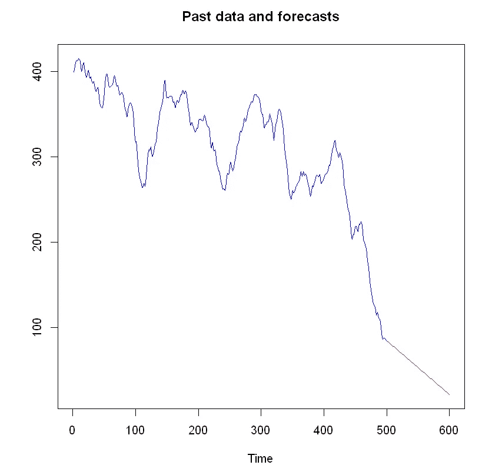

作者图片

我们在这篇博文中已经谈了很多。总而言之，我们首先学习了平稳性的概念，然后学习了如何通过观察时间序列的趋势和季节性来测试和发现时间序列是否平稳。我们还学习了一些从时间序列中去除季节性的简便技巧。

然后，我们继续探索时间序列预测，我们学习了如何为我们的数据选择正确的 ARIMA 模型，测试拟合优度，并最终根据我们选择的模型生成预测。

总之，在这篇博文中，我对时间序列分析这个庞大的主题只是略知皮毛，但尽管如此，我希望这已经足够有助于对这个主题的一般性介绍，并为您进一步探索奠定了初步基础。

如果你从这篇文章中发现了任何价值，并且还不是一个媒体会员，如果你使用下面的链接注册会员，这对我和这个平台上的其他作者来说意义重大。它鼓励我们继续推出像这样的高质量和信息丰富的内容——提前感谢您！

[](https://chongjason.medium.com/membership) [## 通过我的推荐链接-杰森·庄加入媒体

### 作为一个媒体会员，你的会员费的一部分会给你阅读的作家，你可以完全接触到每一个故事…

chongjason.medium.com](https://chongjason.medium.com/membership) 

不知道接下来要读什么？这里有一些建议。

[](/want-to-stand-out-as-a-data-scientist-start-practicing-these-non-technical-skills-9e38ed86703e) [## 想成为一名杰出的数据科学家吗？开始练习这些非技术性技能

### 仅仅擅长编码是不够的

towardsdatascience.com](/want-to-stand-out-as-a-data-scientist-start-practicing-these-non-technical-skills-9e38ed86703e) [](/battle-of-the-ensemble-random-forest-vs-gradient-boosting-6fbfed14cb7) [## 整体之战——随机森林 vs 梯度推进

### 机器学习领域最流行的两种算法，谁会赢？

towardsdatascience.com](/battle-of-the-ensemble-random-forest-vs-gradient-boosting-6fbfed14cb7) [](/lets-end-the-debate-actuary-vs-data-scientist-83abe51a4845) [## 让我们结束这场辩论——精算师 vs 数据科学家

### 哪个职业更好，为什么我选择两个都做

towardsdatascience.com](/lets-end-the-debate-actuary-vs-data-scientist-83abe51a4845)