# 神谕背后:格罗弗算法和振幅放大

> 原文：<https://towardsdatascience.com/behind-oracles-grovers-algorithm-amplitude-amplification-46b928b46f1e>

## 捕捉高层次的想法以及如何为 SAT 实例实施 oracle

特里·维里斯迪斯在 [Unsplash](https://unsplash.com?utm_source=medium&utm_medium=referral) 上的照片

在我开始量子计算之旅的时候，我对“甲骨文”是什么感到困惑。通常，您会读到这样的内容:

> “(……)然后，多亏了神谕，你才能够找到解决办法。”

最后，我唯一明白的是:

> “它能够(以某种方式)捕捉给定问题的解决方案”。

然而，我不知道怎么做。因此，出现了如下问题。

> **这个“甲骨文”长什么样？**
> 
> **如何识别我先验不知道的东西？**

？？？。[ [Gif via Giphy](https://giphy.com/) ]

**这些都是合理的问题！**我们会找出所有这些问题的答案！特别是:

*   我们将理解为什么神谕是重要的。
*   我们将抓住神谕背后的高层次直觉。
*   我们将展示如何定义一个能够解决布尔可满足性问题(SAT)的预言
*   此外，将提供 Qiskit 中的实现！

***在开始之前，你只需要几个先决条件:***

*   *叠加是什么。*
*   *H，X，CX 这样的量子门是什么？*
*   *什么是量子电路。*

> 本文的**目标**是提供 Grover 算法的**自包含**表示。我们将**尽可能避免数学细节**，从而提供这种量子算法能力的实际想法。

开始吧！[ [Gif via Giphy](https://giphy.com/) ]

# 为什么这么重要？

“神谕”是格罗弗算法的一部分:最具破坏性的量子算法之一，也是量子计算吸引大量兴趣的原因之一。

## 格罗弗算法的实力如何？

假设我们需要在一组非结构化的 **N** 元素中找到一个特定的目标元素。

在**经典计算**中，由于我们没有**关于这个目标元素位置的先验知识**，我们需要查看每一个元素。

*例如，假设在一个未排序的数组中寻找数字 3(图 1)。*

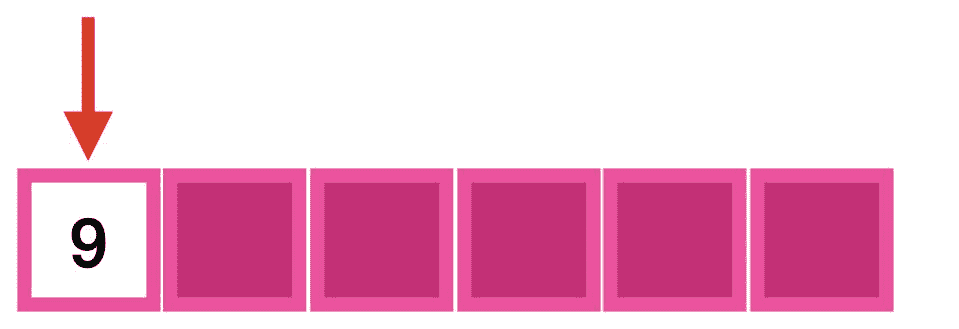

**图一。**寻找数字 3。[作者 Gif

代价是*O(****N****)*(即在最坏的情况下，我们需要扫描所有的 **N** 元素)。

在**量子** **计算**中，得益于 Grover 算法，可以在 **O** (√N) **中检索到解。**相对于经典计算，我们实现了**二次加速**(图 2)！

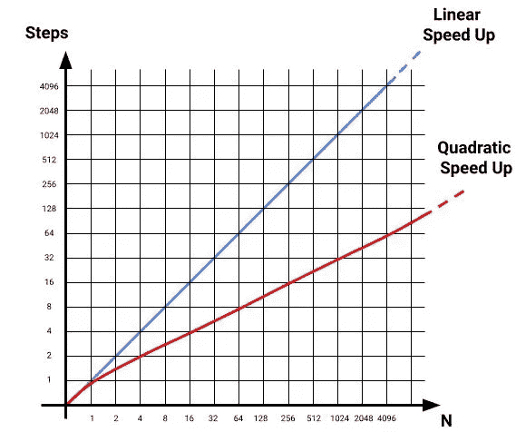

**图二。**二次 Vs 线性加速。[图片由作者提供]

## 一点背景

通常，量子计算机必须运行给定的量子算法不止一次。有时它们会返回正确的输出，有时则不会。

因此，我们的目标是增加(或"**放大**")获得正确输出的机会(图 3)。

> **重点是:**
> 
> 我们想要量子计算机输出的概率分布，使得在算法的给定运行中获得**解**的**概率**比获得**无效** **输出**的**高** **。**
> 
> ..因为得到错误输出的概率是非零的，所以可能需要更多的运行。

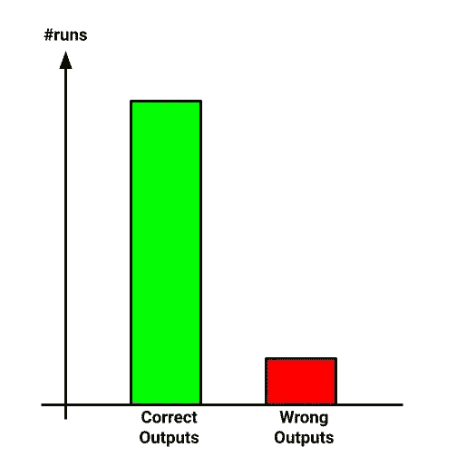

**图三。**概率分布。[图片由作者提供]

# 格罗弗的积木

格罗弗的算法由两部分组成:一个**甲骨文**和一个**扩散器**。

## **甲骨文**

*   **Oracle** “标记”解决方案(图 4)。

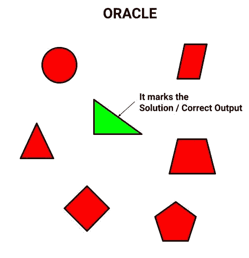

**图 4。**甲骨文标记解决方案。[图片由作者提供]

感谢 oracle，我们能够在非结构化数据集的所有 N 个元素中标记出正确的元素。(*不要爪子！我将很快告诉你神谕是什么样子的* ❤)

> 然而，仅有神谕是不够的。

其实神谕只是标记了正确的元素，并没有增加得到这个元素作为量子算法输出的概率。事实上，单独的神谕是没有用的，因为得到这个元素的概率是 1/N(也就是随机的！).

## 视觉示例

假设我们有 N=7 个元素，我们寻找元素“三角形矩形”(即我们的解)。于是，我们套用了标注“三角形长方形”的甲骨文。

但是得到**三角形矩形**的概率是 **1/7** (图 5)，和得到其他所有元素中的一个是一样的！:(

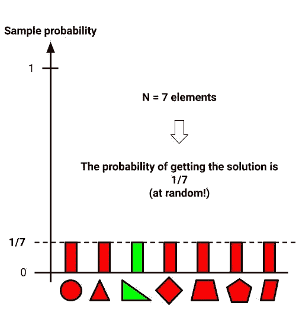

**图 5。**甲骨文不影响得到解的概率。[图片由作者提供]

扩散器来救援了！其实是能够增加得到**三角形长方形**的几率的！

## 扩散器

*   **扩散器**“放大”溶液(图 6)。

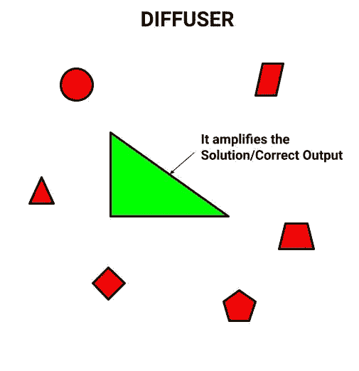

**图六。**扩散器放大溶液。[图片由作者提供]

为什么扩散工程，是超出了本文的范围。对于那些好奇的人，我会在本文的最后给你提供一些参考。

关键是它增加了 oracle 将元素标记为输出的机会(图 7)。

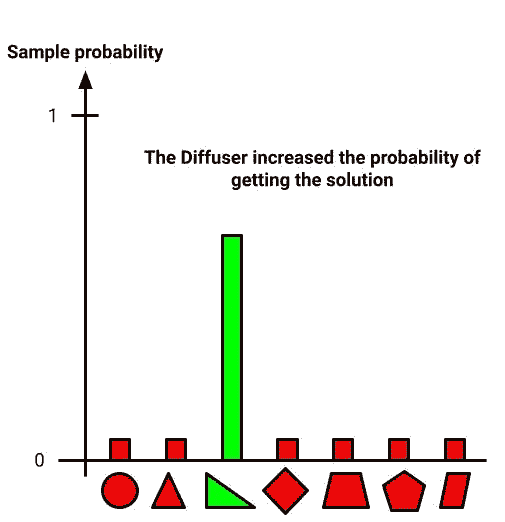

**图 7。**扩散器增加了将溶液作为输出的机会。[图片由作者提供]

但是，不要慌！每个 oracle 的扩散器实现都是相同的，我将在最后提供代码！保证！

**我们可以将扩散器放在一边，然后回答这个问题:**

> **“神谕长什么样”？**

是我！[ [Gif via Giphy](https://giphy.com/) ]

## 神谕背后

我发现“甲骨文”这个名字有点误导。似乎有人只要问一句:“解决方案是什么？”就能给你解决方案。

我更喜欢在脑海中描绘一个滤镜的形象！您可以手工制作一个过滤器，它具有您所寻找的元素的精确形状(图 8)！

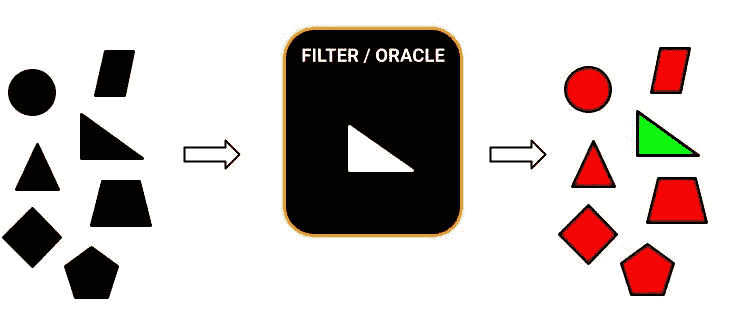

**图 8。**甲骨文作为过滤器。[图片由作者提供]

> 为什么是过滤器？

嗯，在运行 Grover 的算法之前，在某种意义上，你拥有所有的元素(我将在后面解释 ***如何*** ，但这相当简单)，你想过滤掉那些不是你的解的元素。

**但是，请记住，你**、*并且只有你*，仔细定义这个过滤器。

现在，可能会出现一个问题

> 我必须设计一个能够捕捉解决方案并拒绝所有其他元素的过滤器。但是为了能找到答案，我需要知道答案，对吗？
> 
> 因此，这意味着我已经知道了解决方案。所以…
> 
> 这个算法有什么意义？

这是一个合理的担忧！

## 后退一步

格罗弗算法的原名是“*一种用于数据库搜索的快速量子力学算法*”因此，我找到的例子是在一组数字中寻找一个数字。

如果你想在一个数据集中找到数字 3，你已经事先知道了答案。您正在定义一个 oracle，它捕捉到数字 3，输出是 3。一开始没什么太激动人心的，对吧？

> **【小注 1】**在 Grover 算法中，你需要先验地知道一个解的存在(实际上，你需要知道解的确切个数)。
> 
> **【小注 2】**还有其他的量子算法，找出给定问题的解的个数。然后，你可以使用格罗弗的算法。

## 向前两步

**转折点是神谕可以是一个函数**，而不仅仅是一个数字！在这种情况下，我们指的是幅度放大算法，我们可以将其想象为广义的 Grover 算法。

> 你对“神谕可以是一种功能”有什么打算？

比如我们可以问我们的量子计算机:“*那个大于 5 小于 6 的元素*是什么？

> x > 5 **∧** x < 6

精神上的一步很小，但重点是我们不需要知道解决方案，这将是你的神谕！因此，获得了相对于经典强力算法的二次加速！现在是时候停止空谈，开始行动了。

我们走吧！[ [Gif via Giphy](https://giphy.com/) ]

# 用二次加速法求解 SAT

SAT 问题在于找到一个变量赋值，使得它满足一个给定的布尔公式。(我回忆你 SAT 属于 [NP-complete](https://en.wikipedia.org/wiki/NP-completeness) 类，一个很有意思的问题！)

例如在(x1 **∧** x2)中，满足布尔公式的赋值为:

> ***x1 =假，x2 =真***

特别地，我们关注布尔公式的一种特殊形式，即**合取范式** ( **CNF** )或**子句范式。**

## CNF 刷新

CNF 由一个或多个**从句的**连接词**组成。**

*   每个子句包含一个或多个文字(布尔变量)。
*   一个 CNF 只包含运算符:(not) **，∨** (or)， **∧** (and)。
*   子句的**连接词**通过 **∧** 运算符获得。
*   每个**子句**的文字由**∩**操作符关联
*   运算符只能用作文字的一部分。

## CNF 的示例:

**(x ∨ y) ∧ y**

解决方案分配是:x =真，y =假

> 我们将定义解决上述 CNF 的量子电路。

在开始之前，让我们根据并使用德摩根规则重写上面的 CNF 实例(图 9)。 ***为什么？*** 只是因为后面会更容易描述神谕:)

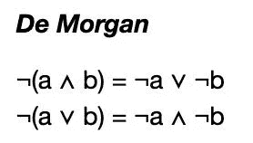

**图九。**德摩根规则。[图片由作者提供]

于是，我们将 **(x ∨ y) ∧ y** 改写为 **( x ∧ y) ∧ y** 。

**具体来说，我们将定义一个甲骨文，它标志着:**的解决方案

> **( x ∧ y) ∧ y**

> 为了简单起见，让我们假设我们已经知道上面的实例有一个单一的解决方案。在文章的最后，我会解释为什么我们会做出这样的假设。

# **量子电路**

*   1)为布尔公式生成所有可能的赋值: **( x ∧ y) ∧ y** 。
*   2)应用神谕。
*   3)应用扩散器。
*   4)进行测量。

> **注**
> 
> 通常，我们需要根据以下公式多次重复步骤 2)和 3):

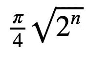

> 其中 **n** 是变量的个数。
> 
> 在我们的例子中， **n=2** (即 **x** 和 **y** ) **。**因此，重复次数为 **1** 。也就是说，我们只应用一次神谕和扩散器。
> 
> 如果你想进一步了解这个公式是如何得到的，我会在文章底部给你留一些参考资料。

## 步骤 1:为布尔公式生成所有可能的赋值

我们通过哈达玛门(图 10)将所有的量子位叠加起来！也就是说，我们为布尔公式生成所有可能的赋值。

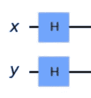

**图 10。哈达玛城门。[图片由作者提供]**

既然我们知道一个解存在，**，那么我们的解就在我们通过将所有量子位进行相等叠加而生成的赋值**(图 11)内。

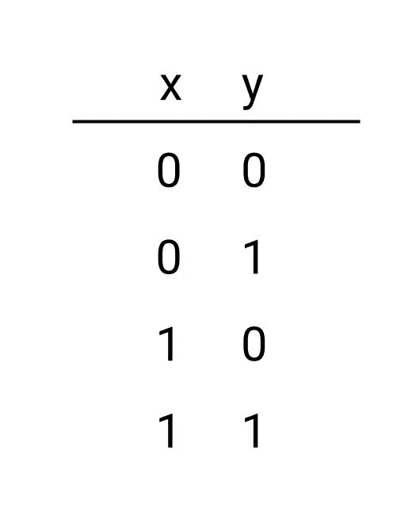

**图 11。**所有可能作业的叠加。[图片由作者提供]

## 步骤 2:应用 Oracle

我想强调的是，在这个例子中，我们不知道像例子“寻找数字 3”中的解决方案。

> 一般来说，通过定义 SAT 实例，我们只是定义了输入必须满足的**条件**作为我们的解决方案(即，您的**oracl**e/您的函数！)

遵循 oracle 电路(图 12)。

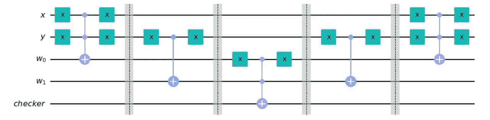

**图 12。**甲骨文电路。[图片由作者提供]

不要慌！我们将详细分析❤的整个电路

## 细节

我们在甲骨文电路中分别观察到 3 个额外的量子位:

*   2 个工作量子位 **w.**
*   一个量子位**检测器。**

## 工作量子位

> 我们添加了和 CNF 实例的子句数量一样多的工作量子位。工作量子位的范围是临时存储给定子句的输出。

在我们的例子中， **( x ∧ y) ∧ y** ，我们有 2 个子句，那么需要 2 个工作量子位 **w** 。

## 检验量子位

量子位**检验器**的目的是**标记**正确的解。也就是说，当一个变量赋值满足 oracle 条件时，那么**检查器**被翻转到 **1** 。

## **条款**

我们将 **( x ∧ y) ∧ y** 分解成三个部分(图 13):

*   **第 1 条。** w0 = x ∧ y
*   **第 2 条。** w1 = y
*   **结果。** w0 ∧ w1

> 注意 **w0** 对应的是 **x ∧ y** 而不是 **( x ∧ y)** ！
> 
> 我们把第一个推迟到w0 ∧ w1 **。**

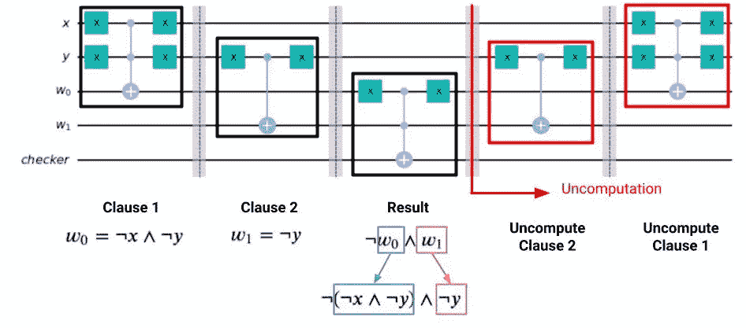

**图十三。**分解 **( x ∧ y) ∧ y.** 【图片由作者提供】

## 第 1 条**。w0 = x ∧ y**

条款 1 检查条件 **x ∧ y** (图 14)。通过*多控 X 门*实现，其中:

*   **x** 和 **y** 是控制量子位，
*   **w0** 是存储条件 **x ∧ y.** 结果的目标量子位

请注意，*多控 X 门必须在 **x** 和**y**时*触发，为此，我们将前置并附加**两个** **X 门**分别到 **x** 和 **y、**，从而取消它们。

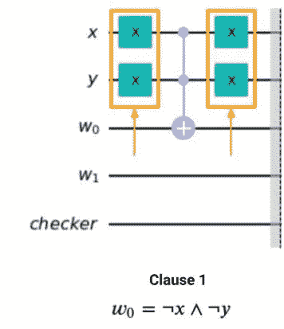

**图 14。** X 门否定 X 和 y【图片由作者提供】

## **第二条。** w1 = y

条款 2 检查条件 **y** (图 15)。通过*受控 X 门*实现，其中:

*   **y** 是控制量子位，
*   **w1** 是存储条件 **y.** 结果的目标量子位

如前所述，由于我们寻找子句 **y** ，因此我们否定受控 X 门中的量子位 **y** 。

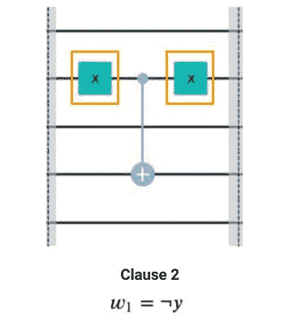

**图 15。** X 门否定 y【图片由作者提供】

## 结果**。** w0 ∧ w1

结果检查与我们的 CNF 实例 **( x ∧ y) ∧ y** 相对应的条件 **w0 ∧ w1** (图 16)。条件 **w0 ∧ w1** 通过*多控 X 门*实现，其中:

*   **w0** 和 **w1** 是控制量子位，
*   **checker** 是当 **w0 ∧ w1** 满足时**翻转到 1** 的目标量子位。

我们回忆一下 **w0** 对应的是 **x ∧ y** 而不是 **( x ∧ y)。**

**因此，我们需要对 w0 进行否定:(x ∧ y) = w0。**

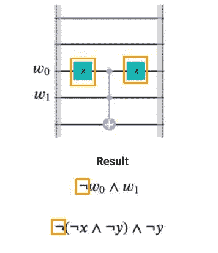

**图 16。** X 门求反 w0。[图片由作者提供]

## **未计算**

甲骨文的最后一步是释放工作量子位 **w0** 和 **w1** 。这是通过执行不计算来实现的(图 17)。

为了不计算 **w0** 和 **w1** ，以相反的顺序应用实现条款 1 和条款 2 的门就足够了。

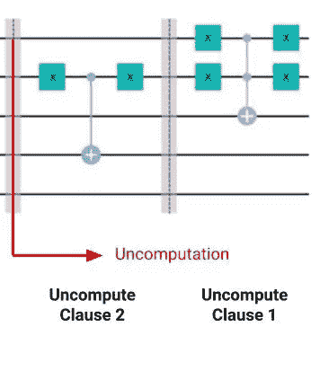

**图 17。**未计算 w0 和 w1。[图片由作者提供]

> 最终，我们手工制作了我们的神谕！魔力已经显现！

哒哒。[ [Gif via Giphy](https://giphy.com/) ]

## 步骤 3:应用扩散器

最后，我们应用**扩散器**算子，它放大了正确的解(图 18)。

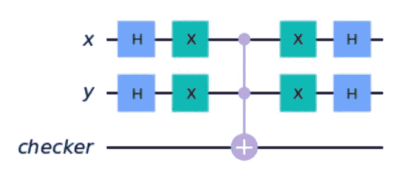

**图 18。**扩散器电路。[图片由作者提供]

## **第四步:测量**

最终，我们测量量子位 **x** 和 **y** (图 20) **。**

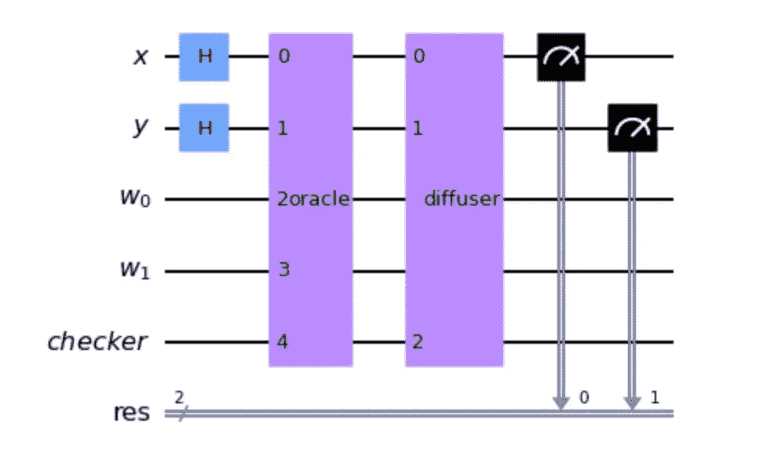

**图 20。**测量。[图片由作者提供]

输出分布如图 21 所示。

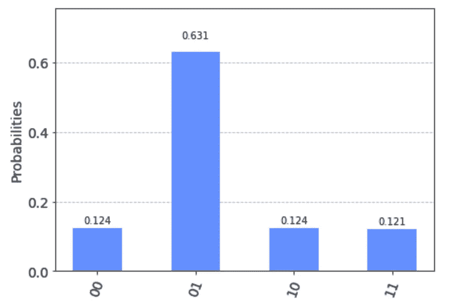

**图 21。**输出分配。[图片由作者提供]

最高概率对应赋值 **y=0(假)，x=1(真)(即 01)。**

特别是赋值 01 满足我们的 CNF 实例 **( x ∧ y) ∧ y！**

哇哦。[ [Gif via Giphy](https://giphy.com/) ]

# **结论**

本文的主要目的是给出一个 oracles 的自包含演示，以及如何使用 **Qiskit** 实现它们。特别是:

*   我们理解了神谕是什么。
*   扩散器的用途。
*   如何在 Qiskit 中有效地实现一个 Oracle 和一个扩散器？

在下面的参考资料中，您可以找到我的带有 Qiskit 实现的 Github 库，以便您可以使用它:)

> **啊！在给出的例子中，解的数量正好是 1。然而，对于一个给定的问题，我们可以有多个解决方案！在这些情况下，我们需要对计算 Oracle-Diffuser 对的重复次数的公式做一点小小的修改。特别是，公式变成:**

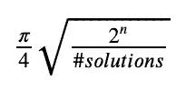

> 在 Github 资源库中，您还会发现一个 CNF 实例的例子，其中有多个解决方案可供使用。🎉

## 结束语

我故意避开技术细节，让你掌握大意💡。

当我开始研究量子计算时，我会很欣赏这种概述。这就是我决定写这篇❤.文章的原因

我真的希望你也欣赏它！万一，请随意留下掌声或评论。任何一种反馈都会超级重视！

让我们在 [LinkedIn](https://www.linkedin.com/in/aleberti/) 上保持联系吧！

## 参考

*   💻Qiskit 实现[这里的](https://github.com/Brotherhood94/behind_oracles_medium)****👈****
*   ****🔍格罗弗算法的详细介绍 [**此处**](https://quantum.country/search) 👈****
*   ****📚[为综合本书**此处**为](https://www.amazon.it/Quantum-Computation-Information-10th-Anniversary/dp/1107002176)👈****

****拜拜！ [ [Gif via Giphy](https://giphy.com/)****