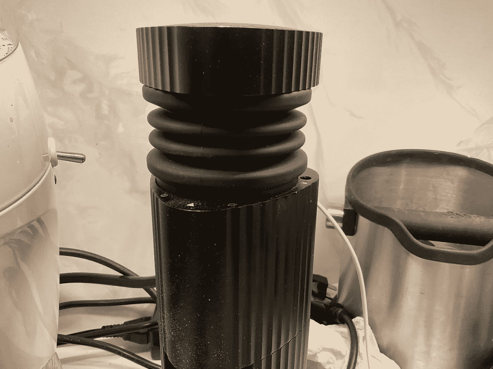
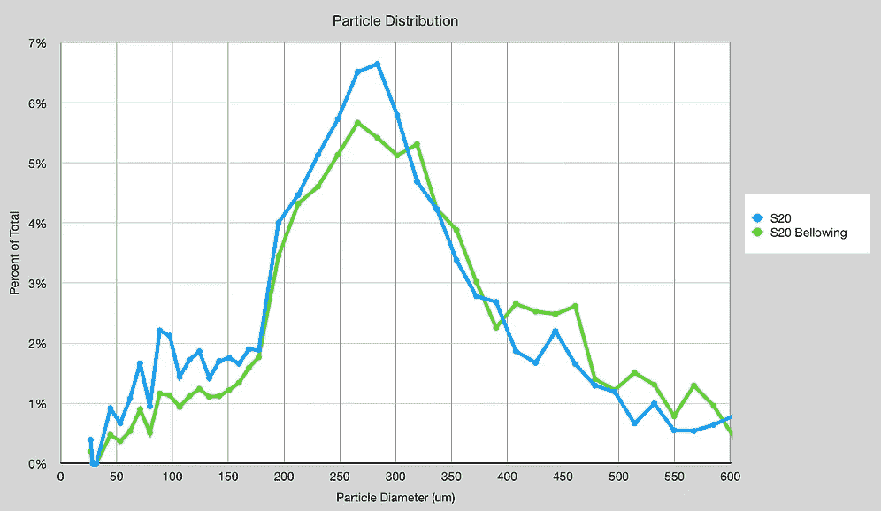
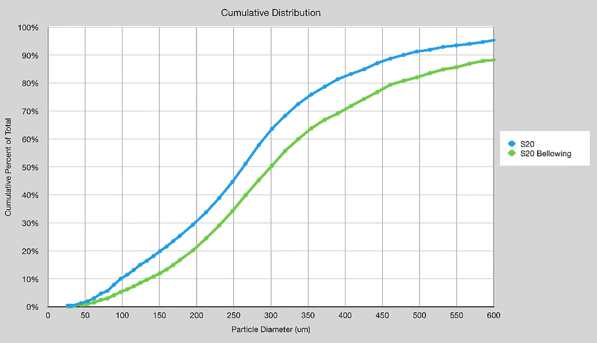
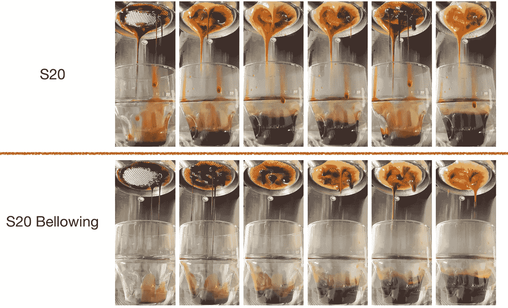
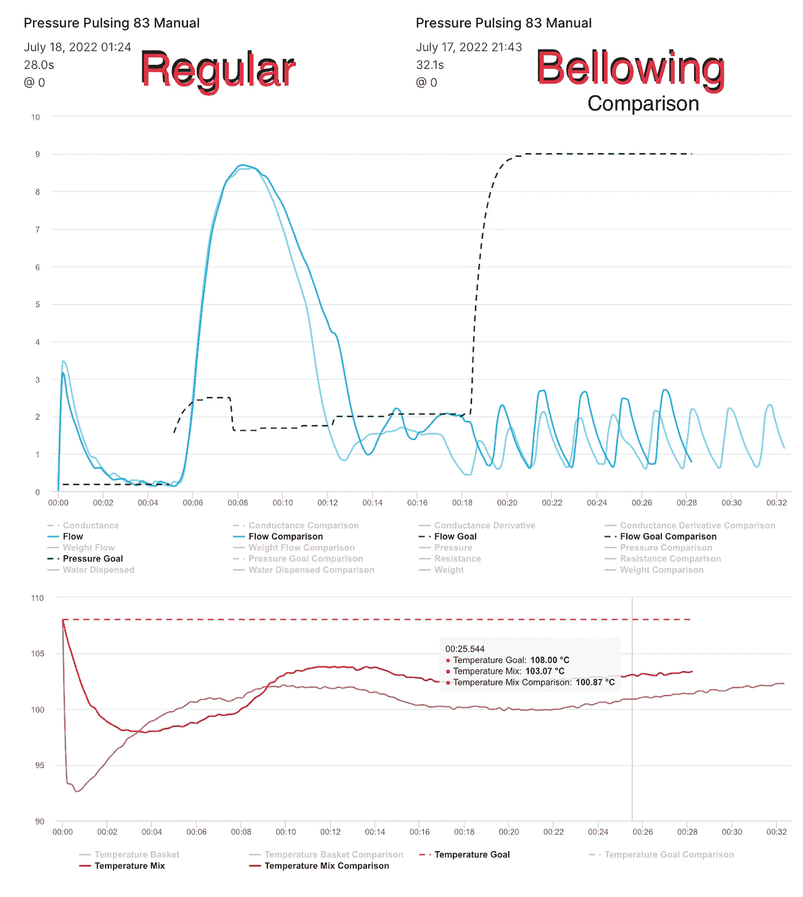
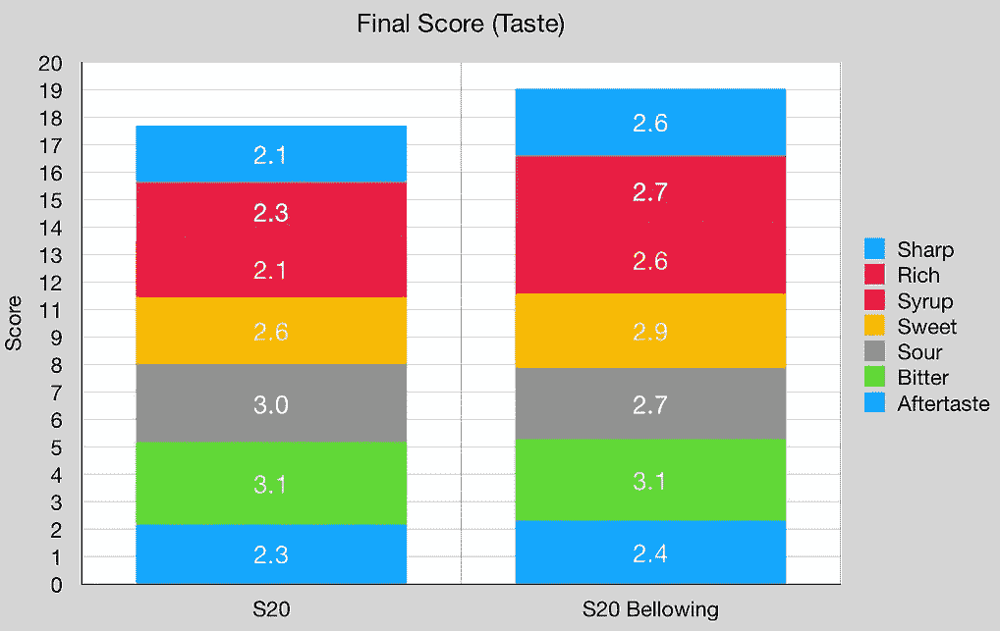
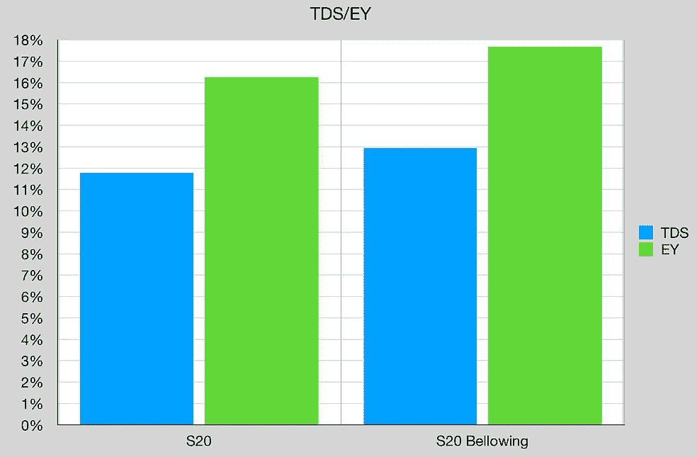
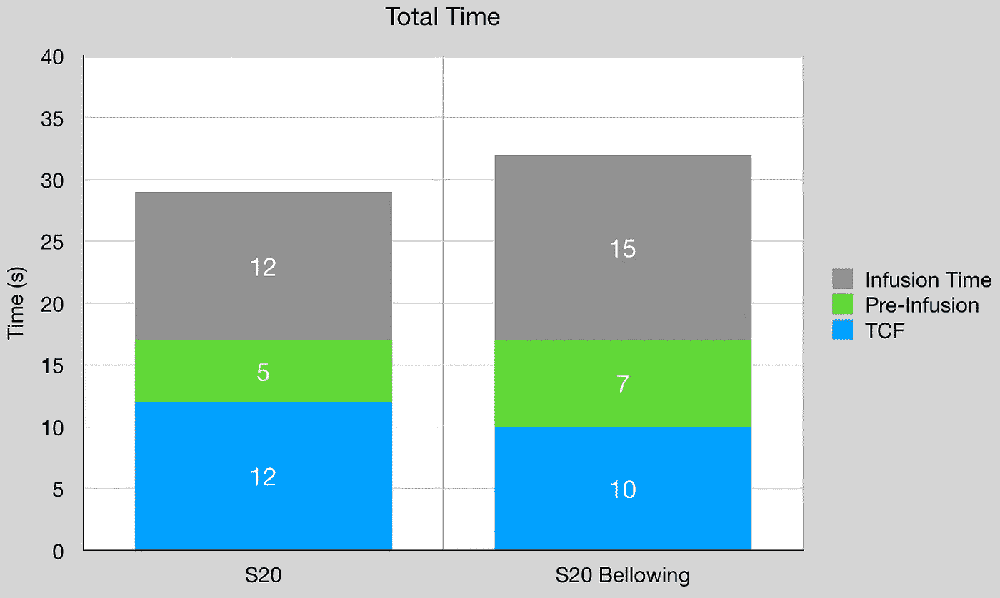

# 研磨咖啡时吼叫

> 原文：<https://towardsdatascience.com/bellowing-during-coffee-grinding-328e097be5b4>

## 咖啡数据科学

## 因果

我没有在我的其他磨床上使用风箱，我一直在犹豫是否要一个。然而，我买了一个新的研磨机( [SPK-38G](https://58espresso.com/products/sptk-38g?variant=41634375958720) )，它带有一个风箱。用了一个星期后，我开始想如果你在研磨时使用风箱会发生什么？

如果你在地面上不停地吼叫会发生什么？从理论上讲，可以进入毛刺之间的细小颗粒会被更快地推出，从而减少了再次研磨的机会。

所有图片由作者提供

我用两个镜头做了一个测试，我观察了粒子分布、提取率和味道。

对于粒子分布，吼叫可以大大减少微粒的数量。对于 200 微米或更小的颗粒，这是 8%的差异。

# 设备/技术

[浓缩咖啡机](/taxonomy-of-lever-espresso-machines-f32d111688f1) : [像样的浓缩咖啡机](/developing-a-decent-profile-for-espresso-c2750bed053f)

[咖啡研磨机](/rok-beats-niche-zero-part-1-7957ec49840d) : [SPK-38G](https://58espresso.com/products/sptk-38g?variant=41634375958720)

咖啡:[家庭烘焙咖啡](https://rmckeon.medium.com/coffee-roasting-splash-page-780b0c3242ea)，中杯(第一口+ 1 分钟)

镜头准备:[断奏夯实](/staccato-tamping-improving-espresso-without-a-sifter-b22de5db28f6)

[预灌注](/pre-infusion-for-espresso-visual-cues-for-better-espresso-c23b2542152e):长，约 25 秒

输液:[压力脉动](/pressure-pulsing-for-better-espresso-62f09362211d)

[过滤篮](https://rmckeon.medium.com/espresso-baskets-and-related-topics-splash-page-ff10f690a738) : 7g/20g VST

其他设备: [Atago TDS 计](/affordable-coffee-solubility-tools-tds-for-espresso-brix-vs-atago-f8367efb5aa4)、 [Acaia Pyxis 秤](/data-review-acaia-scale-pyxis-for-espresso-457782bafa5d)

# 绩效指标

我使用了两组[指标](/metrics-of-performance-espresso-1ef8af75ce9a)来评估技术之间的差异:最终得分和咖啡萃取。

[**最终得分**](https://towardsdatascience.com/@rmckeon/coffee-data-sheet-d95fd241e7f6) 是评分卡上 7 个指标(辛辣、浓郁、糖浆、甜味、酸味、苦味和回味)的平均值。当然，这些分数是主观的，但它们符合我的口味，帮助我提高了我的拍摄水平。分数有一些变化。我的目标是保持每个指标的一致性，但有时粒度很难确定。

# 两杯

两张照片在视觉上有相似的发展。

就流量和水温而言，它们有点不同。

就味道和提取而言，连续吼叫更好。

一个区别是波纹管注射覆盖过滤器(TCF)的时间更快，但注入时间更长。我希望更粗糙的研磨能让镜头整体跑得更快，但这两个时间度量之间的差异让我很感兴趣。

在整个镜头中吼叫对于每一个镜头来说都有点不切实际，但是可以让一个研磨机不断地推动空气通过研磨机来自动获得相同的效果。我不知道这会如何影响磨矿分布的单峰性，但它无疑指出了减少细粒的技术进步。

如果你愿意，可以在 [Twitter](https://mobile.twitter.com/espressofun?source=post_page---------------------------) 、 [YouTube](https://m.youtube.com/channel/UClgcmAtBMTmVVGANjtntXTw?source=post_page---------------------------) 和 [Instagram](https://www.instagram.com/espressofun/) 上关注我，我会在那里发布不同机器上的浓缩咖啡照片和浓缩咖啡相关的视频。你也可以在 [LinkedIn](https://www.linkedin.com/in/dr-robert-mckeon-aloe-01581595) 上找到我。你也可以关注我的[媒体](https://towardsdatascience.com/@rmckeon/follow)和[订阅](https://rmckeon.medium.com/subscribe)。

# [我的进一步阅读](https://rmckeon.medium.com/story-collection-splash-page-e15025710347):

[我未来的书](https://www.kickstarter.com/projects/espressofun/engineering-better-espresso-data-driven-coffee)

[我的链接](https://rmckeon.medium.com/my-links-5de9eb69c26b?source=your_stories_page----------------------------------------)

[浓缩咖啡系列文章](https://rmckeon.medium.com/a-collection-of-espresso-articles-de8a3abf9917?postPublishedType=repub)

工作和学校故事集