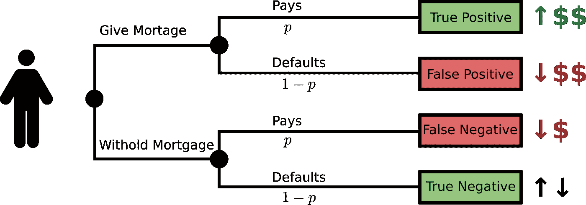
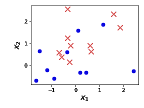
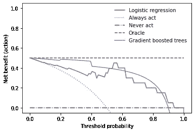

# 用决策曲线来衡量你的人工智能对现实世界的影响

> 原文：<https://towardsdatascience.com/benchmark-your-ais-real-world-impact-with-decision-curves-7d369a8a6832>


图 1:用人工智能做决策。图片作者。

行动是有后果的。人工智能的进步让我们在数据驱动的预测方面表现出色。但是没有行动的预测有什么用呢？人工智能以预测为中心的焦点为现实世界的影响和后果创造了一个盲点。但是有了做决定的权力，就有了权衡自己行为后果的责任。这就是决策曲线分析[1–4]发挥作用的地方。

决策曲线分析是一种图形方法，最初是为病人和医生设计的[1]。它将医学干预的好处和坏处——后果*——与医学测试的不确定性——预测*联系起来。决策曲线分析背后的关键创新在于，我们不必详尽地量化所有后果。我们需要问的是:在多大的可能性下，你会选择干预而不是不干预？**

# **例子**

****

**图 2:提供抵押贷款的决策树。借款人偿还贷款的概率为 *p，*。图片作者。**

**决策曲线分析并不局限于医学领域。它适用于我们基于二元预测任务采取行动的任何情况。例如，考虑一家提供抵押贷款的银行。为了实现利润最大化，银行不会向所有人发放抵押贷款。相反，它估计违约的可能性(*预测*)，以决定客户是否会获得抵押贷款(*行动*)。如果银行太严格，它会错过有利可图的客户。而过于宽容的银行家会招致更多的违约。使用如图 2 所示的决策树，我们可以遍历所有场景。通过估计每项成本，我们可以确定最佳策略。**

**在许多情况下，很难确定每种情况的利弊，或者成本很高。例如，当 CT 扫描本身可以在健康个体中导致癌症时，我们应该如何权衡癌症筛查的阳性检测？此外，每种情况的相对优点都是主观的:一个脆弱的老人可能会权衡癌症检测的后果，这不同于一个有年幼孩子的精力充沛的母亲。**

**让我们通过绘制你的第一条净收益曲线来应用这些概念！**

# **如何用 Python 绘制决策曲线**

**想象一下，你在银行工作。你的目标是预测哪些客户会偿还抵押贷款，哪些会违约。我们给出了 20 个带有两个特征的训练例子:收入和年龄。**

```
****from** matplotlib **import** pyplot as plt
**from** sklearn.datasets **import** make_blobscenters = [[0, 0], [1, 1]]
X_train, y_train = make_blobs(
    centers=centers, cluster_std=1, n_samples=20, random_state=5
)
X_test, y_test = make_blobs(
    centers=centers, cluster_std=1, n_samples=20, random_state=1005
)**
```

**查看数据(图 3)，我们发现我们无法用一条直线完美地将十字和圆圈分开。我们的预测器可能不错，但并不完美。**

****

**图 3:训练数据来预测将拖欠抵押贷款的客户。阳性标签用红叉表示，阴性标签用蓝圈表示。图片作者。**

**为了展示模型在优势上的差异，让我们训练两个模型。作为简单基线的逻辑回归模型和梯度增强树模型。**

```
****from** sklearn.ensemble **import** GradientBoostingClassifier
**from** sklearn.linear_model **import** LogisticRegressionbaseline_model = LogisticRegression(random_state=5)
baseline_model.fit(X_train, y_train)
tree_model = GradientBoostingClassifier(random_state=5)
tree_model.fit(X_train, y_train)**
```

**比较这两个模型，我们发现梯度增强树在测试集(90 %的准确度)上比逻辑回归模型(85 %的准确度)做得稍好。**

**接下来，我们使用 [statkit](https://gitlab.com/hylkedonker/statkit) 包中的`[NetBenefitDisplay](https://hylkedonker.gitlab.io/statkit/decision.html#statkit.decision.NetBenefitDisplay)`类来绘制净收益图。(要在 Linux 上安装 statkit，运行`pip3 install statkit`)。类似于 sci-kit learn，它有一个`from_predictions`方法来实例化来自地面真相标签(`y_test`)和预测的正类概率的情节。**

```
****from** statkit.decision **import** NetBenefitDisplayy_pred_base = baseline_model.predict_proba(X_test)[:, 1]
y_pred_tree = tree_model.predict_proba(X_test)[:, 1]NetBenefitDisplay.from_predictions(y_test, y_pred_base, name='Baseline model')
NetBenefitDisplay.from_predictions(y_test, y_pred_tree, name='Gradient boosted trees', show_references=False, ax=plt.gca())**
```

**这是一个相当忙碌的数字，所以让我们把它分成四个要点。**

****

**图 4:比较逻辑回归与梯度提升树模型和完美预测器(Oracle)的净收益曲线。为了比较，示出了对应于总是或从不行动/干预政策的净收益。图片作者。**

****越高越好**:排名比差距大小更重要【2】。由 **Oracle** 指示的线是可达到的最大净收益，对应于一个完美的预测值。现在看看蓝色逻辑回归和紫色梯度增强树曲线之间的排序。对于大多数可能的利益/危害偏好，梯度提升树优于逻辑回归模型。**

****净收益应该是正的**:理论上净收益可以是负的，意味着弊大于利。但是请注意**永不行动**政策(绿点虚线)的净收益为零。所以我们总是可以决定不行动(忽略模型)并获得至少零净收益。**

****更精确的模型可能会逊色**:对于银行来说，相对于付费客户的收益，房贷违约的危害很大。假设银行希望每十个客户中不超过一个违约。这对应于曲线的最右侧，概率阈值在 0.9 和 1 之间。记住梯度推进树比逻辑回归模型更准确。然而，看图 4，我们看到在这个范围内，逻辑回归实际上有更多的净效益。越不精确的模型对银行越有利可图！**

****模型可能是无用的**:在 0 到 0.1 的概率阈值范围内(图 4)，逻辑回归模型的净收益类似于**总是行动**策略。因此，如果你的“金发女孩”偏好恰好在这个范围内，那么逻辑回归模型就没有现实世界的影响。因此，净收益曲线有助于澄清你的模型是否有实际价值，考虑到人工智能产生的大量技术债务，这一点很重要[5]。**

# **理论**

**再次重申，决策曲线分析消除了详尽量化所有方案的优点的需要[1]。我们需要引出的只是一个**偏好** *π* :为了一个真正的阳性(癌症检测、抵押贷款支付)，我们愿意采取多少行动/干预(癌症筛查、抵押贷款)？这个概率阈值 *π* — *偏好* —就是我们放在决策曲线的 *x* 轴上的值。隐含地，preference *π* 将假阳性与假阴性的相对危害编成法典[1]。在医疗保健和金融等监管部门，这种偏好也可能受到法规遵从性和/或协议的限制。**

**给定一个偏好 *π* ，我们可以计算出 *m 个*样本的**净收益**如下[1–4]:**

**净收益=真阳性/ *m* —假阳性/*m**π*/(1-*π*)。**

**也就是说，从行动/干预中获利的个人减去从行动/干预中损失的个人乘以*汇率*【1–3】。汇率 *π* /(1- *π* )量化了我们如何评估从假阳性到真阳性的转换[2，3]。接下来是简洁的部分:通过追踪作为偏好 *π* 的函数的净收益，我们在所有可能的后果评估中评估模型的收益。结果的每个具体损益分配(如图 2 中的决策树)现在对应于 *π* 的值。单一图形中所有可能性的空间！**

# **结论**

**当你使用 AI 做决定时，重要的是权衡其后果的好处和坏处。这就是决策曲线分析的用武之地。净收益曲线作为一座桥梁，将模型世界和(校准的)预测与行动和结果连接起来，无需详尽量化所有情景。**

**矛盾的是，更精确的模型在现实世界的影响方面可能是劣势的。而且有时候还不如完全没有 AI！决策曲线帮助您在部署到生产环境之前，而不是之后，识别并避免这些常见的陷阱。因此，我们认为决策曲线分析应该是每个数据科学家工作流程的一部分。**

## **承认**

**感谢[布拉姆·范·埃斯](https://medium.com/u/6eef7d9a8ac6?source=post_page-----7d369a8a6832--------------------------------)、[里克·胡伊泽](https://huijzer.xyz/)和迪娜·波尔的校对。**

## **参考**

**[1]:维克斯、安德鲁 j 和埃琳娜 b 埃尔金。[决策曲线分析:评估预测模型的新方法](https://journals.sagepub.com/doi/abs/10.1177/0272989x06295361?casa_token=PxrNVdoM_ZIAAAAA:GlIx5SvTvEFWBUTVLAnadpnN5FVMllEk5EizCqjAaJCI7wa5YxzrAnFsFGiy75nL10AnvR8SMhQ)医疗决策 26.6(2006):565–574。**

**[2]:维克斯、安德鲁·j、本·范·卡尔斯特和埃沃特·w·斯特耶伯格。[解释决策曲线分析的简单、逐步指南](https://diagnprognres.biomedcentral.com/articles/10.1186/s41512-019-0064-7)。*诊断和预后研究*3.1(2019):1–8。**

**[3]:维克斯、安德鲁·j、本·范·卡尔斯特和埃沃特·w·斯特耶伯格。[评估预测模型、分子标记和诊断测试的净效益方法](https://www.bmj.com/content/352/bmj.i6.short) *bmj* 352 (2016)。**

**[4]:鲁松、瓦伦丁和托马斯·宗布伦。[重新审视决策曲线分析:总体净收益、与 ROC 曲线分析的关系以及在病例对照研究中的应用](https://bmcmedinformdecismak.biomedcentral.com/articles/10.1186/1472-6947-11-45)。 *BMC 医学信息学和决策*11.1(2011):1–9。**

**[5]:斯卡利、大卫等.[机器学习系统中隐藏的技术债务](https://proceedings.neurips.cc/paper/2015/file/86df7dcfd896fcaf2674f757a2463eba-Paper.pdf)*神经信息处理系统进展* 28 (2015)。**