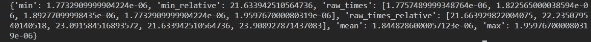
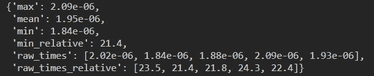

# 用最简单的方法对 Python 函数进行基准测试:perftester

> 原文：<https://towardsdatascience.com/benchmarking-python-functions-the-easy-way-perftester-77f75596bc81>

## PYTHON 编程

## 您可以使用 perftester 以最简单的方式测试 Python 函数


凯文·Ku 在 [Unsplash](https://unsplash.com?utm_source=medium&utm_medium=referral) 上的照片

最近，[我描述了](/benchmarking-python-code-with-timeit-80827e131e48)如何用`[timeit](https://docs.python.org/3/library/timeit.html)`模块进行时间基准测试。我解释了`timeit`构成了基准时间的基本 Python 方法，并向您承诺展示更多。这篇文章是我信守这个承诺的第一步。

我描述了`timeit`提供的两种 API:基于片段的和基于可调用的 API。前者是众所周知的，但后者不是，可能是因为它不太自然，需要您使用一个`lambda`函数。在这里，我将探索[的](https://github.com/nyggus/perftester) `[perftester](https://github.com/nyggus/perftester)` [包](https://github.com/nyggus/perftester)，它允许基准测试调用，就像后面的 API 一样；然而，与它不同的是，它提供了一个简单且感觉自然的 API。

然而，`perftester`带来的不仅仅是时间基准测试——它使您能够根据*执行时间*和*内存使用量*对可调用程序进行基准测试，但最重要的是——它是一个用于 Python 可调用程序性能测试的框架。

我们将从基准测试开始，一步一步地讨论这个丰富的产品。由于时间和内存这两种类型的基准测试非常不同，我们将在这里关注时间基准测试，而将内存消耗的基准测试放在一边；我们改天再讨论这个话题。然后我们将准备讨论作为测试框架的`perftester`——据我所知，这是*第一个用于测试可调用程序性能的* Python 框架。

# 基本用法

上述文章表明`timeit`模块易于使用。虽然这是真的，`perftester`可以更容易。它的 API 使您能够编写简洁明了的 Python 函数和其他可调用函数的基准。为了分析这个 API，让我们使用一个特定的例子。

假设我们有一个任何类型的项目列表`x`。我们希望以这样一种方式扩展列表，即给定整数`n`，我们将每个元素`n`相乘若干次。我们不仅仅通过将列表相乘(`x*n`)来实现，而是希望保持列表的顺序。

因此，我们预期以下行为:

```
>>> extend([1, 4, 'a'], 2)
[1, 1, 4, 4, 'a', 'a']
>>> extend([1, 4, 'a'], 3)
[1, 1, 1, 4, 4, 4, 'a', 'a', 'a']
>>> extend([2, 2, 4, 1], 2)
[2, 2, 2, 2, 4, 4, 1, 1]
>>> extend([1, -1, 1, -1], 3)
[1, 1, 1, -1, -1, -1, 1, 1, 1, -1, -1, -1]
```

这是该函数的一个版本:

```
# extender.py
def extend(x: list, n: int) -> list:
    """Extend x n number of times, keeping the original order.

    >>> extend([1, 4, 'a'], 2)
    [1, 1, 4, 4, 'a', 'a']
    >>> extend([1, 4, 'a'], 3)
    [1, 1, 1, 4, 4, 4, 'a', 'a', 'a']
    >>> extend([2, 2, 4, 1], 2)
    [2, 2, 2, 2, 4, 4, 1, 1]
    >>> extend([1, -1, 1, -1], 3)
    [1, 1, 1, -1, -1, -1, 1, 1, 1, -1, -1, -1]
    """
    modified_x = []
    for x_i in x:
        for _ in range(n):
            modified_x.append(x_i)
    return modified_x
```

如您所见，我添加了一个带有 doctests 的 docstring。如果你想了解这个有用的测试框架，你可以阅读下面的*走向数据科学*文章:

[](/python-documentation-testing-with-doctest-the-easy-way-c024556313ca)  

要运行测试，使用下面的 shell 命令，它假设您将上面的文件保存为`extender.py`，并且您就在 shell 中的这个文件夹中。

```
$ python -m doctest extender.py
```

没有输出意味着所有的测试都通过了。

好了，我们准备好测试`extend()`函数了。让我们创建一个`main.py` Python 文件来运行基准测试，它与`extender.py`文件位于同一个文件夹中:

```
# main.py
import extender
import perftester

if __name__ == "__main__":
    t = perftester.time_benchmark(
        extender.extend,
        [1, 1, 4, 4, 'a', 'a'],
        3
        )
    print(t)
```

这将使用`perftester.time_benchmark()`参数的默认值，即`Number=100_000`和`Repeat=5`。如果你想知道为什么会有人用大写字母作为参数名的第一个字母，你会在文章末尾的附录**中找到解释。**

上面的代码在我的机器上产生了以下结果:



我们不会关注实际结果，因为我们对它们并不特别感兴趣。在不同的机器上，我们会得到不同的结果。因此，`perftester`也提供了*相对的*结果，这些结果应该大致与机器无关。我们稍后将讨论这个问题。

然而，首先让我们仔细看看输出。可读性不太好吧？这就是为什么`perftester`为我们提供了一个很好的小解决方案，即`pp()`函数。它的名字代表*漂亮的印刷*，它的漂亮印刷基于两点:

*   内置`pprint`模块的`pprint()`功能，
*   现场包`rounder`中的`signif_object()`功能。

`[rounder](https://github.com/nyggus/rounder)`[包](https://github.com/nyggus/rounder)使你能够以一种非常简单的方式对任何 Python 对象中的数字进行舍入。如果你感兴趣，你可以阅读下面的文章:

[](/rounder-rounding-numbers-in-complex-python-objects-e4b6f3b563f8)  

我们来看看`perftester.pp()`用上面的字典做了什么。这是我们的`main.py`模块的代码:

```
import extender
import perftester

if __name__ == "__main__":
    t = perftester.time_benchmark(
        extender.extend,
        [1, 1, 4, 4, 'a', 'a'],
        3
        )
    perftester.pp(t)
```

这是输出结果:



很好，不是吗？我们只通过一个函数`perftester.pp()`获得了这个，所以你可能想记住它:`perftester.pp`就像 *perftester pretty print* 一样。

> `perftester.pp`如在 *perftester 漂亮的打印。*

我们现在可以分析输出。这就是我们现在的情况:

*   `min`、`mean`、`max`:这是在所有运行(有`repeat`次运行)中运行一个函数的最小、平均和最大*平均执行时间→所以这是函数*执行一次*的平均时间，不像`timeit.timeit()`和`timeit.repeat()`都显示它们的整个执行时间。因此，`perftester`基准在实验之间是可比较的；`timeit`基准测试不是——至少在没有额外计算的情况下不是。在这三者中，我们最感兴趣的是`min`，因为在基准测试中，我们应该寻找最佳结果(您可以在[中找到更多关于](/benchmarking-python-code-with-timeit-80827e131e48) `[timeit](/benchmarking-python-code-with-timeit-80827e131e48)` [基准测试](/benchmarking-python-code-with-timeit-80827e131e48)的文章)。*
*   这是我们兴趣的另一个价值。相对基准测试是根据空函数(即什么都不做，只有`pass`)的执行时间来执行的。具有相同操作系统的机器之间的相对基准应该或多或少是一致的，但是它们在不同的操作系统之间不太可能是一致的(即使是在同一台机器上，根据我的实验)。
*   `raw_times`和`raw_times_relative`:这两个显示原始值，即基准函数在每次运行中的平均执行时间(我们有`Repeat`运行次数)，和平均相对执行时间(所以，除以空函数的平均相对执行时间)。这些价值观很少引起我们的兴趣；不过，请看下面的例子。

> `perftester`基准在实验之间具有可比性；`timeit` 基准不

在某些情况下，我们可能希望查看`min`原始结果:这是因为它提供了我们机器上基准函数的最小执行时间。我们肯定会对这个值感兴趣。然后我们也可以看看`raw_times`，因为它们显示了这个函数在我们的机器中有多快，所有的后台进程都在运行，所以是在真实的场景中。我们看到，对于我们使用的参数，我们的函数平均需要`1.95e-06`秒；因此，运行一百万次将花费几乎 2 秒钟。在最好的运行中，平均执行时间是`1.84e-06`，所以并没有少很多。从`raw_times`中我们可以看出，变化似乎并不大。

通常，我们会针对各种参数组合对函数进行基准测试，以了解函数在各种场景中的表现。我们将在下面比较两个函数时这样做。

我想你们中的许多人认为我在编写这个函数的时候可以做得更好…你是对的！这并不是我一生中编写的最好的函数。创建列表的`for`循环？当然，列表理解应该做得更好，在性能方面也是如此；点击此处查看更多信息:

[](/a-guide-to-python-comprehensions-4d16af68c97e)  

那么，让我们改进一下`extend()`函数。但是因为我们想检查我们的更改是否提高了性能，我们将更改函数名，以便我们的`extender`模块有两个版本。下面是我们新函数`extend_2()`的代码:

```
# added to main.py

def extend_2(x: list, n: int) -> list:
    """Extend x n number of times, keeping the original order.

    >>> extend_2([1, 4, 'a'], 2)
    [1, 1, 4, 4, 'a', 'a']
    >>> extend_2([1, 4, 'a'], 3)
    [1, 1, 1, 4, 4, 4, 'a', 'a', 'a']
    >>> extend_2([2, 2, 4, 1], 2)
    [2, 2, 2, 2, 4, 4, 1, 1]
    >>> extend_2([1, -1, 1, -1], 3)
    [1, 1, 1, -1, -1, -1, 1, 1, 1, -1, -1, -1]
    """
    return [x_i for x_i in x for _ in range(n)]
```

所有的`doctest`都通过了，所以函数按预期工作。这个功能明显比原来的`extend()`更短、更清晰，也更优雅，这很好。

因此，让我们对这两个函数进行基准测试。但是因为我们想要比较两个函数，我们不应该只使用一个参数组合，因为对于小的`n`，增益(如果有的话)可能与大的`n`不同。下面是`main`模块的代码:

```
# main.py
import extender
import perftester

from collections import namedtuple

Benchmarks = namedtuple("Benchmarks", "extend extend_2 better")

if __name__ == "__main__":
    orig_list = [1, 1, 4, 4, 'a', 'a']
    results = {}
    for n in (2, 5, 10, 100, 1000, 10_000):
        number = int(1_000_000 / n)
        t = perftester.time_benchmark(
            extender.extend,
            orig_list,
            n,
            Number=number
            )
        t_2 = perftester.time_benchmark(
            extender.extend_2,
            orig_list,
            n,
            Number=number
            )
        better = 'extend' if t['min'] < t_2['min'] else 'extend_2'
        nn = f"{n: 6}"
        results[nn] = Benchmarks(t['min'], t_2['min'], better)
    perftester.pp(results)
```

这是输出结果:

```
{'     2': Benchmarks(extend=1.531e-06, extend_2=1.358e-06, better='extend_2'),
 '     5': Benchmarks(extend=2.185e-06, extend_2=1.739e-06, better='extend_2'),
 '    10': Benchmarks(extend=3.524e-06, extend_2=2.308e-06, better='extend_2'),
 '   100': Benchmarks(extend=2.513e-05, extend_2=1.288e-05, better='extend_2'),
 '  1000': Benchmarks(extend=0.0002717, extend_2=0.0001432, better='extend_2'),
 ' 10000': Benchmarks(extend=0.002942, extend_2=0.001435, better='extend_2')}
```

基于列表理解的新版本肯定更快；而且`n`越大，修正函数越快。对于`n=10000`，`extend_2()`比原来的`extend()`快两倍左右。

我们现在应该对不同长度的不同列表的函数进行基准测试，但是我在这里的目的不是比较这两个函数，而是向您展示如何使用`perftester`简单地对函数进行基准测试。因此，我将把这些额外的基准留给你们作为练习。

# 高级用法

`perftester`函数使用默认设置，这通常是我们需要的。有时，我们可能希望改变`Number`或`Repeat`，就像我们上面所做的那样，根据一个函数要完成的操作数来选择`Number`。有时我们也想改变`Repeat`。当我进行的基准测试很重要时，我通常会增加`Number`和`Repeat`。当我有小分歧时，我也会这样做；我增加了这两个参数，以使基准更加稳定。

如果您想对所有基准使用相同的`Number`和`Repeat`，您不必每次运行`perftester.time_benchmark()`功能时都手动这么做。您可以在`perftester.config`对象中修改它一次，它控制`perftester`函数的行为。

为了做到这一点，做以下事情就足够了:

```
perftester.config.set_defaults("time", Number=1_000_000, Repeat=10)
```

这将改变所有要进行基准测试的函数的默认值`Number`和`Repeat`；当用户在调用`perftester.time_benchmark()`函数时改变这些参数或其中一个参数的值时，它们将不会被使用。

上面的命令改变了每个要进行基准测试的函数的默认值。对于特定的功能，您也可以这样做。例如:

```
perftester.config.set(foo, "time", Number=1_000_000, Repeat=10)
```

将改变函数`foo()`的`Number`和`Repeat`——该函数之前必须已经定义过。因此，您不能更改尚未定义*或*的功能的设置。

您也可以只更改两个参数之一的默认值:

```
perftester.config.set_defaults("time", Number=1_000_000)
perftester.config.set(foo, "time", Number=1_000)
```

另一个——没有改变——将简单地保持不变；也就是说，等于默认设置。

如前所述，相对基准是针对空函数的性能进行的，存储为`perftester.config.benchmark_function`。这种方法是有意义的，因为这个函数代表了调用一个函数的开销。因此，剩余的执行时间花在了基准测试函数要做的事情上。

有时候，你可能想把这个空函数换成另一个；将根据该功能的性能进行相对基准测试。做起来很简单:你可以用另一个覆盖`perftester.config.benchmark_function()`；例如:

```
def foo():
    return [i for i in range(10)]

perftester.config.benchmark_function = foo
```

您可以从下面来自`perftester`仓库的文档文件中了解更多关于这个主题的信息:

[](https://github.com/nyggus/perftester/blob/implement-profiling-decorator/docs/benchmarking_against_another_function.md)  

# 结论

用`perftester`对 Python 函数和其他可调用函数进行基准测试很容易。其实比用`timeit`容易。足以调用`perftester.time_benchmark()`函数，其 API 简单直观。唯一要记住的是以大写字母开始参数`Number`和`Repeat`；这同样适用于`Func`参数，但是您很少将它用作关键字参数，因为它是`perftester.time_benchmark()`函数的第一个参数，提供了要进行基准测试的函数。因此，从下面的两个电话来看，前者会更频繁:

```
# Rather this:
t = perftester.time_benchmark(
        extender.extend,
        [1, 1, 4, 4, 'a', 'a'],
        3
        )
# than this:
t = perftester.time_benchmark(
        Func=extender.extend,
        [1, 1, 4, 4, 'a', 'a'],
        3
        )
```

这并不意味着`perftester`通常比`timeit` 函数、`timeit()`和`repeat()`简单。虽然`perftester`更容易对可调用程序的执行时间进行基准测试，但是`timeit`更容易对格式化为字符串的代码片段进行基准测试，比如`"[i**2 for i in range(1000)]"`。您可以使用`perftester`对这样的代码片段进行基准测试，但是您必须定义一个函数来完成这样的代码片段所做的事情。这意味着基准测试不仅会测量执行时间，还会通过调用函数来测量额外时间的开销。因此，当您有一个代码片段要进行基准测试时，您应该选择`timeit`模块。

> 虽然`perftester`更容易对可调用程序的执行时间进行基准测试，但是`timeit`更容易对代码片段进行基准测试。

然而，在基准可赎回性方面，`perftester`大放异彩。它的 API 专门用于这个场景，而`timeit`的 API 则不是。你可以这样做，但是你需要定义一个非参数 lambda。比较我们的`extend()`函数的这两个基准:

```
# perftester, using default settings
perftester.time_benchmark(extender.extend, [1, 1, 4, 4, 'a', 'a'], 3)
# timeit, using defaults settings
timeit.repeat(lambda: extender.extend([1, 1, 4, 4, 'a', 'a'], 3))

# perftester, changed settings
perftester.time_benchmark(
    extender.extend, [1, 1, 4, 4, 'a', 'a'], 3,
    Number=1000, Repeat=3,
)
# timeit, changed settings
timeit.repeat(
    lambda: extender.extend([1, 1, 4, 4, 'a', 'a'], 3),
    number=1000, repeat=3
)
```

对`perftester.time_benchmark()`的调用更加自然，乍一看也更容易理解。在`timeit`函数中使用`lambda`的必要性使得这个调用可读性更差。

还有一件事。您可以选择使用全名来导入`perftester`，就像我在本文中所做的那样。但是你也可以这样做

```
import perftester as pt
```

在软件包的存储库中使用。全名导入稍微清楚一点，但是肯定更长，所以选择你喜欢的。

请注意，在进行基准测试时，`perftester`使用与`timeit`完全相同的后端，因为前者实际上调用后者。所以区别只在于 API。这种差异不足以学习一个新的框架来测试一个函数。但是正如我在上面所写的，`perftester`带来的不仅仅是基准执行时间，这就是为什么我相信你不会后悔花时间学习这个包——以及阅读这篇文章。您不仅可以对时间进行基准测试，还可以对内存进行基准测试，但最重要的是，该包使您能够编写时间和内存方面的性能测试。我决定在不同的文章中讨论这些不同的用例，以便一次处理一个主题——并且使学习更容易。

感谢您的阅读。我希望很快发布关于`perftester`的下一篇文章，你将会看到`perftester`提供了一些你以前没有见过的东西:Python 调用的性能测试框架。

在此期间，您可以将其用于基准时间。如果你想了解更多关于这个包及其用途的信息，你可以在`perftester`的 GitHub 仓库中找到:

[](https://github.com/nyggus/perftester)  

# 附录

**上** `**Func**` **、** `**Number**` **和** `**Repeat**`

您可能想知道为什么这些参数(其中的`Number`和`Repeat`以及关键字参数)以大写字母开头。这是一个合理的问题，因为这似乎不合常理；我在这个附录中回答了这个问题，基于您可以在软件包的存储库中找到的解释。

这种方法最大限度地降低了要进行基准测试的函数与您计划使用的`perftester`函数同名的风险，在这种情况下，您将不得不使用一个参数两次——这将意味着`SyntaxError`。在 Python 代码库中，有很多函数都有一个名为`func`、`number`或`repeat`的参数。但是很少有函数有一个名为`Func`、`Number`或`Repeat`的参数。这就是为什么`perftester`的参数以大写字母开始。

然而，如果一个函数有一个参数`Func`、`Number`或`Repeat`，有一个解决方案。您可以定义一个`functools.partial()`函数并测试这个函数。你可以在这里阅读更多关于`functools.partial()`的信息:

[](https://docs.python.org/3/library/functools.html#functools.partial)  

下面，你会发现一个例子。假设你有一个函数`foo()`，它的参数是`Number`和`Repeat`。要使用`perftester.time_benchmark()`，您需要执行以下操作:

```
from functools import partial

def foo(Number, Repeat):
    return [Number] * Repeat

foo_partial = partial(foo, Number=20.5, Repeat=100)
perftester.time_benchmark(foo_partial, Number=1000, Repeat=10)
```

但是，首先你应该*而不是*使用`Number`和`Repeat`中的`foo()`参数。我展示这个解决方案是因为您可能会发现自己处于这样一种情况，您想要对别人编写的这样做的函数进行基准测试；安全总比后悔好。

`functools.partial()`在很多其他用例中都是非常有用的解决方案，不仅仅是这个。所以，反正知道这个功能就好了。

# 资源

[](/benchmarking-python-code-with-timeit-80827e131e48)  [](https://docs.python.org/3/library/functools.html#functools.partial)  [](https://github.com/nyggus/perftester)  [](https://github.com/nyggus/rounder)  [](/rounder-rounding-numbers-in-complex-python-objects-e4b6f3b563f8)  [](/a-guide-to-python-comprehensions-4d16af68c97e) 