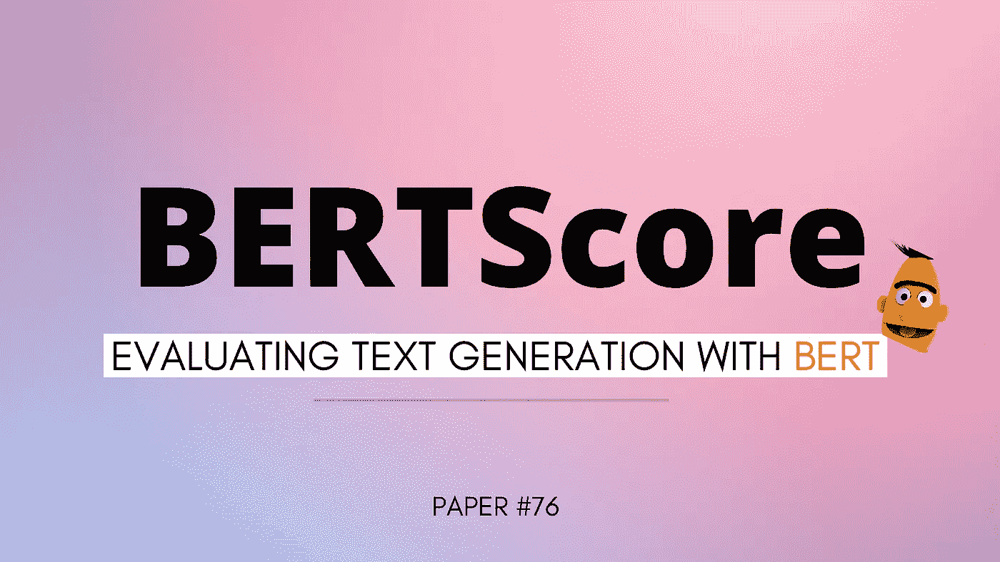
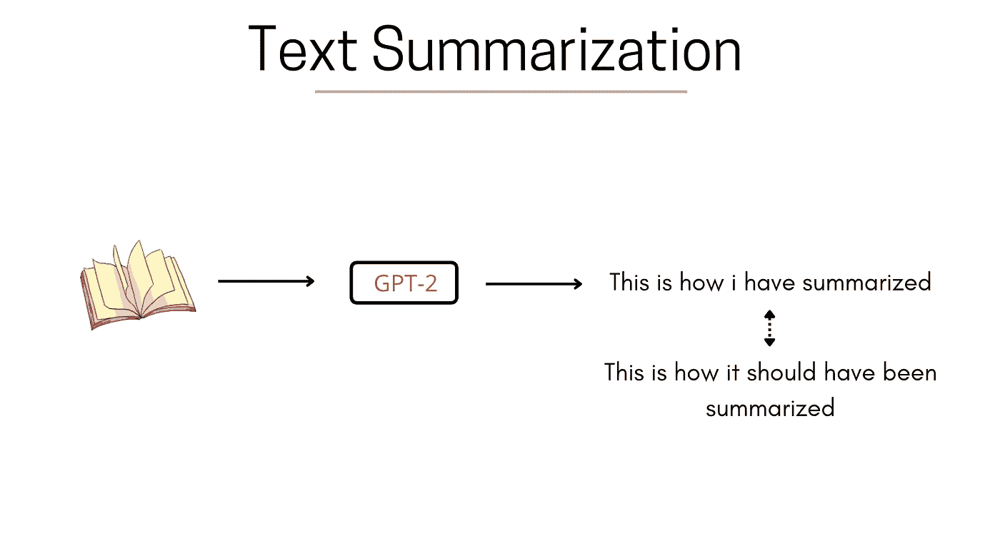
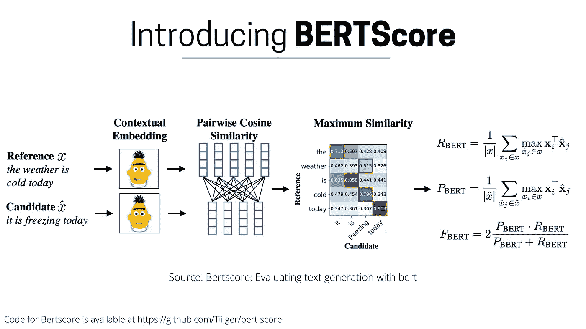
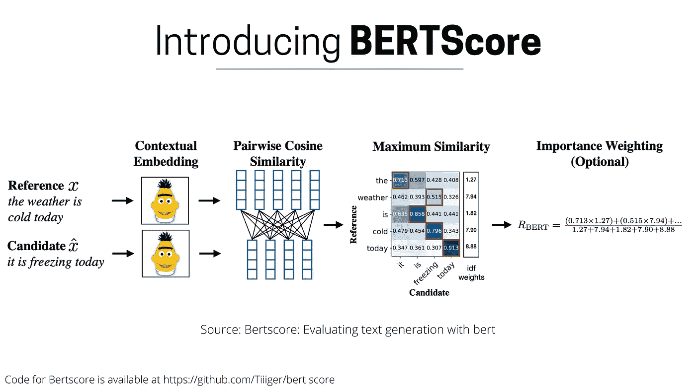

# BERTScore:用 BERT 评估文本生成

> 原文：<https://towardsdatascience.com/bertscore-evaluating-text-generation-with-bert-beb7b3431300>

## 机器学习研究论文摘要

作者图片

BERTScore 是一种自动评估标准，用于测试文本生成系统的优劣。与计算标记级句法相似性的现有流行方法不同，BERTScore 侧重于计算参考标记和假设标记之间的语义相似性。这篇论文的作者在机器翻译和图像字幕任务上测试了它，发现它与人类的判断更相关。

[更多这样的视频](https://www.youtube.com/c/TechVizTheDataScienceGuy)

让我们以总结系统为例，任务是通过 GPT2 模型对给定的书进行总结，假设模型说“这是我如何总结的”，但事实是“这应该是如何总结的”。

作者图片

为了评估系统已经生成的摘要的质量，可以使用现有的系统，例如 [ROUGE](https://en.wikipedia.org/wiki/ROUGE_(metric)) 和 [BLEU](https://en.wikipedia.org/wiki/BLEU) 度量，这些度量依赖于假设和参考之间的句法重叠，通过考虑单字、双字等。但是考虑到它们的局限性，即在假设和参考中存在确切的词，并且不能解码语义，引入了 BERTScore，其中的*思想是理解你已经生成的和应该生成的*的含义，然后进行比较。

作者图片

如上图所示，我们采用参考(基本事实)和候选(生成的)，并通过预训练的 BERT 模型，在输出端为每个单词生成上下文嵌入。一旦我们有了这些单词中每个单词的最终嵌入，我们就通过计算每个单词与候选单词中每个单词的参考相似度来进行 n 平方计算。我们从参考中找到并挑选与候选词最相似的词，并计算[精确度、召回率和 f 值](/accuracy-precision-recall-or-f1-331fb37c5cb9)(精确度和召回率的调和平均值)。

作者图片

本文作者还引入了权重的概念，用于计算每个单词的相似度。他们坚持基于大量离线文本数据得出的 [IDF](https://en.wikipedia.org/wiki/Tf%E2%80%93idf) 权重。因此，如果一个单词具有非常高的 IDF 权重，那么这不是一个在多个文档中使用的非常常见的单词，所以在进行相似性计算时，它可能值得您进行比较，不像具有低 IDF 的单词*(主要代表常见单词)*

所以，是的，这就是我的博客。我鼓励你也通读这篇论文，其细节将在下面提及—

*⏩* ***论文标题*** *: BERTScore:用 BERT 评估文本生成*

*⏩* ***论文****:*[【https://arxiv.org/abs/1904.09675】T21](https://arxiv.org/abs/1904.09675)

*⏩* ***作者*** *:张天翼、瓦莎·基肖尔、菲利克斯·吴、基连·q·温伯格、约夫·阿奇*

*⏩* ***组织机构****:ASAPP 康乃尔大学公司*

我希望你喜欢读这篇文章。如果你愿意支持我成为一名作家，可以考虑注册[成为](https://prakhar-mishra.medium.com/membership)中的一员。每月只需 5 美元，你就可以无限制地使用 Medium。