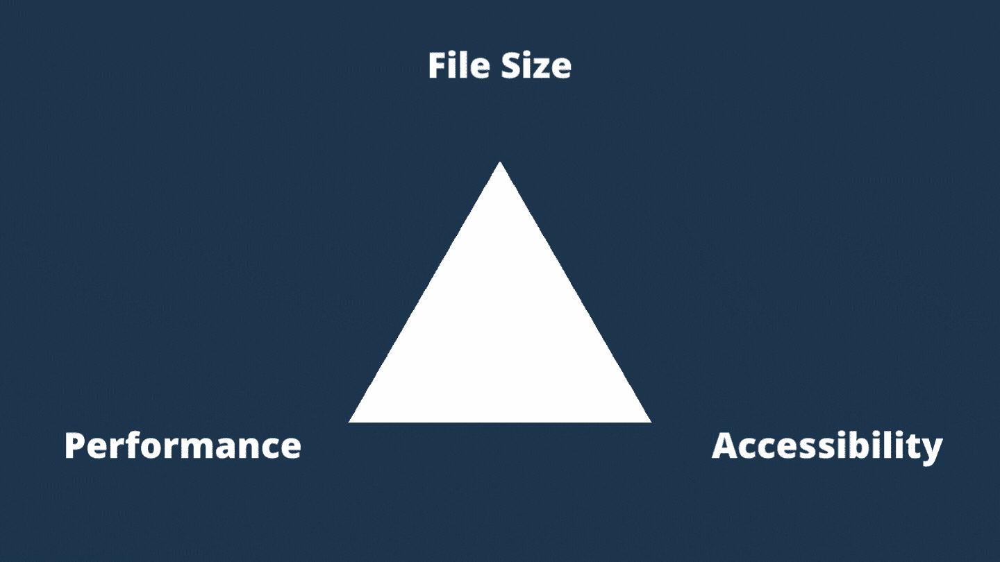
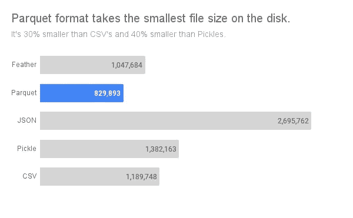
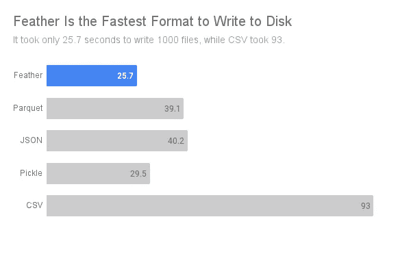

# CSV:为什么我放弃了他们的一些利益来获得其他利益

> 原文：<https://towardsdatascience.com/best-file-format-to-store-large-data-dfa47701929f>

## 我使用的替代方案允许更小的文件大小和更好的性能。


何塞·阿拉贡内塞斯在 [Unsplash](https://unsplash.com?utm_source=medium&utm_medium=referral) 上的照片

CSV 很好，但被高估了。

我使用 CSV 已经很长时间了。就像数据科学社区的其他人一样。然后[腌制](https://docs.python.org/3/library/pickle.html)一段时间。

CSV 可以在任何系统上工作，无需安装任何东西。毕竟，它们是一种带有逗号分隔符的纯文本文件。这个事实也让它们超级简单易懂。

但是我们已经在这个舒适区待了太久了。

大多数数据应用程序受益于放弃一点灵活性。我们可以通过多安装一个包来大大加快数据的读写速度。

在本帖中，我们将讨论…

[数据科学家的 CSV 问题；](#b910)
我对[用泡菜文件代替的想法；](#2e7d)
[CSV 和泡菜的更好替代品](#1b59)；
[对存储数据集的不同文件格式进行基准测试](#a2c7)

[](/python-3-11-is-indeed-faster-than-3-10-1247531e771b)  

您可以访问我在这篇文章中使用的用于基准测试的 [Colab 笔记本](https://colab.research.google.com/drive/1te6F2RCGohF-nQuOJ9jTxYRETJg5LOpJ?usp=sharing)。

# 数据科学家的 CSV 问题。

自从我们开始存储数据以来，CSV 就一直存在。它们与文本文件没有什么不同，只是 CSV 遵循可预测的逗号模式。

软件使用这些信息将数据集分成几列。专栏不是 CSV 文件本身的奇迹。

即使列标题和行在 CSV 文件中也没有区别。我们需要配置读取 CSV 的软件来选择标题和行号。

如果列的其余部分遵循不同的数据类型，一些软件足够智能地选择标题。但它们只是由某人编程的有根据的猜测。

简单在很多情况下都很有效。尤其是如果你不知道客户使用的是什么软件，CSV 是非常好的。分享然后忘记！

[](/image-data-augmentation-pipeline-9841bc7bb56d)  

但是 CSV 并没有针对存储或性能进行优化。

我们可以把可访问性性能和文件大小想象成一个三角形的三个角。你调一个；另外两个自我调整。



图片由[作者提供。](https://thuwarakesh.medium.com)

CSV 已经将可访问性节点提升到最大。它会降低性能和文件质量。在这篇文章的后面，我们将比较 CSV 和其他格式的文件大小、保存和加载时间。

CSV 的另一个缺点是当文本包含 Unicode 字符时。您可能需要显式地将编码参数设置为[众多支持值](https://docs.python.org/3/library/codecs.html#standard-encodings)中的一个。

这里有一个例子告诉你如何[在熊猫身上设置编码。](https://pandas.pydata.org/pandas-docs/stable/reference/api/pandas.read_csv.html)

```
df = read_csv('/path/to/file.csv', encoding = "ISO-8859-1")
```

如果您的数据集很大，而您不知道使用哪种编码器，那么您就有麻烦了。

我们需要一种存储文件元数据(如头和编码)的文件格式，它从磁盘读取和写入的时间最少，并且大小更小。

[](/become-a-data-scientist-or-data-engineer-without-coding-skills-fbf11ac8e278)  

# 用泡菜代替怎么样？

Pickle 是一种 Python 对象存储格式。它不是为存储数据帧而设计的，但在数据帧上运行良好。

Pickle 还可以存储数据帧的头、行号和其他元信息。因此，如果您使用 Pandas 读取数据帧，引擎不需要花费太多时间来确定数据类型和标题。

Pickle 到磁盘和磁盘到 pickle 与内存到磁盘和磁盘到内存几乎相同。

磁盘上 Pickle 文件的大小可能会有所不同。在大多数情况下，它比 CSV 略大，因为它们存储了更多关于数据集的信息。但是，Pickle 也存储转换成字节流的数据。它可能会使大小小于基于文本的 CSV。

此外，当您使用 Python 时，您不需要其他安装就可以从 Pickle 中获益。

```
df.to_pickle("./path/to/file.pkl") # to write a dataframe as pickledf = pd.read_pickle("./path/to/file.pkl") # to read a pickled dataframe
```

在我们的出发三角中，pickle 文件放弃了一点可访问性，以获得性能和文件大小方面的好处。因为您只能从 Python 程序中读取 pickle 文件。如果您组织中的其他人正在使用 R、Excel 或其他软件，它们可能无法很好地工作。

[](/how-to-serve-massive-computations-using-python-web-apps-590e51624bc6)  

酸洗可以解决文件存储的许多问题。但是，如果您愿意进一步缩小可访问性特征的范围，还有一个更好的方法。

## 对于数据科学家来说，Pickle 文件是一个理想的用例。

我们将在接下来的几节中讨论 CSV 和 Pickle 的强大替代方案。

然而，它们不能被完全抛弃。还没有！

因为 Pickle 文件是内存中对象的快照，所以存储经过训练的 ML 模型非常好。

例如，我们将机器学习模型及其权重存储为 pickle 文件。流行的库如 [scikit-learn](https://scikit-learn.org/stable/) 和 [Tensorflow](https://www.tensorflow.org/) 创建可选择的模型。

这里有一个张量流的例子。

```
import joblib
import tensorflow as tf

model = tf.keras.Sequential([
            tf.keras.layers.Input(shape=(5,)),
            tf.keras.layers.Dense(units=16, activation='elu'),
            tf.keras.layers.Dense(units=16, activation='elu'),
            tf.keras.layers.Dense(units=8, activation='elu'),
            tf.keras.layers.Dense(units=8, activation='elu'),
            tf.keras.layers.Dense(units=5, activation='softmax'),
        ])

model.compile(optimizer='adam', loss='categorical_crossentropy', metrics=['accuracy'])model.fit(df['predictorrs'], df['labels'], epochs=200, batch_size=8)joblib.dump(model, 'classifier.pkl')
```

# CSV 和泡菜的更好替代品

我使用 CSV 已经很长时间了。就像数据科学社区的其他人一样。然后腌制一段时间。如今，我更喜欢用其他二进制文件格式来存储数据。

尤其是其中的两个。[羽毛](https://arrow.apache.org/docs/python/feather.html) & [拼花](https://parquet.apache.org/)。

[](/how-to-speed-up-python-data-pipelines-up-to-91x-80d7accfe7ec)  

## 羽毛文件格式

feather 文件格式是一种快速的、与语言无关的数据帧存储，适用于 Python (pandas)和 r。

Feather 针对低存储空间和高性能进行了优化。这使得它比 CSV 更难访问。

虽然 CSV 可以在任何能够理解文本的机器上运行，但 Feather 只能在 Python 和 r 上运行。我们需要手动安装它。

如果您使用 Python，可以从 PyPI 存储库中获取它。

```
pip install feather-format
```

r 程序员可以使用下面的命令直接从 Git 库安装 Feather。

```
devtools::install_github("wesm/feather/R")
```

一旦你安装了这个包，对你现有代码库的改变是最小的。

使用羽化格式相当简单。

Pandas 库内置了羽毛格式的方法。您可以使用 [to_feather](https://pandas.pydata.org/docs/reference/api/pandas.DataFrame.to_feather.html) 和 [read_feather](https://pandas.pydata.org/docs/reference/api/pandas.read_feather.html) 在磁盘上保存和加载数据。

```
# Change this
df = pd.read_csv(...)# To this
df = pd.read_feather(...) # Change this
df.to_csv(...)#To this
df.to_feather(...)
```

## 拼花文件格式

Parquet 是另一种二进制文件格式，它比使用文本文件更有优势。

Parquet 使用在 [Dremel 论文](https://research.google/pubs/pub36632/)中描述的记录粉碎和组装算法。它在列存储中高效地表示嵌套结构。

因此，处理大量嵌套的查询比基于文本格式的查询执行速度更快。

拼花地板的文件大小通常小于文本格式。

在熊猫身上使用拼花地板就像羽毛一样简单。

```
# Change this
df = pd.read_csv(...)# To this
df = pd.read_parquet(...)# Change this
df.to_csv(...)#To this
df.to_parquet(...)
```

# 对存储数据集的不同文件格式进行基准测试

我想亲眼看看。我想测试每种文件格式的各个方面。

所以我写了一个小剧本。它从公开可用的数据集中获取数据。然后，它从原始文件创建 1000 个不同的 10，000 行的文件。为此，脚本在熊猫数据帧上使用随机抽样。

[](/how-to-detect-memory-leakage-in-your-python-application-f83ae1ad897d)  

然后，我们记录将所有这些文件写入磁盘所需的时间、磁盘上的文件大小，以及将所有这些文件读回内存所需的时间。

我们测量所有文件格式的上述三个值。这是结果。

## 拼花是最小型的文件格式。



不同文件格式的文件大小基准测试—图片由作者[提供。](https://thuwarakesh.medium.com)

拼花文件比 CSV 小得多。它们甚至比羽毛锉还要小。

另一方面，JSON 是在磁盘上存储文件的最差格式。它占用的文件格式空间是 CSV 的两倍多。

就文件大小而言，Feather 略小，Pickle 比 CSV 占用更多的空间。

## 羽毛是读写最快的。



比较不同文件格式存储数据集的文件读/写性能—图片由[作者提供。](https://thuwarakesh.medium.com)

羽毛的阅读表现令人印象深刻。它只需要 CSV 加载时间的一半。与 Feather 相比，即使是 Pickle 文件也要慢得多。

同样，JSONs 需要花费太多时间加载到内存中，因为它需要很大的磁盘存储空间。

羽毛在写作表现上也远胜 CSV。只有泡菜和羽毛的数量相对相似(仍然缓慢)。

[](/python-web-apps-are-a-terrible-idea-for-analytics-projects-36f1bd33e84b)  

# 最终考虑

如果你和其他人共享数据，并且你不确定他们是否安装了 Python 或者任何兼容的软件，那么使用 CSV 是可以的。

但在所有其他情况下，CSV 会严重伤害你。

如果您的主要目标是以非常低的成本存储数据，请使用 Parquet。它占用很少的磁盘空间，其读/写性能令人印象深刻。

如果您正在使用 Python 或 R，并且读/写性能是您的主要关注点，那么 Feather 要比 CSV 和 Pickle 好得多。它的体积也更小。

> 感谢阅读，朋友！在[**LinkedIn**](https://www.linkedin.com/in/thuwarakesh/)[**Twitter**](https://twitter.com/Thuwarakesh)[**Medium**](https://thuwarakesh.medium.com/)上跟我打招呼。
> 
> 还不是中等会员？请使用此链接使 [**成为**](https://thuwarakesh.medium.com/membership) 的会员，因为，在不为你额外付费的情况下，我为你引荐赚取一小笔佣金。