# arXiv 最佳—2022 年 2 月

> 原文：<https://towardsdatascience.com/best-of-arxiv-february-2022-62c2aea3b802>

## Zeta Alpha 每月 ML 论文精选:强化学习、多模态、语言模型即服务、计算机视觉、信息检索等。

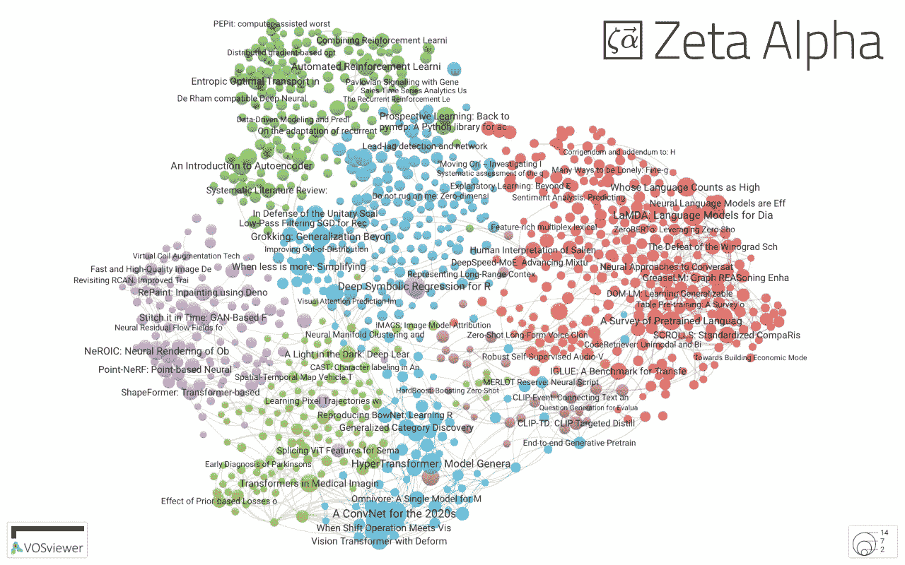

图片作者。

人工智能研究的世界已经全速进入 2022 年，过去几周的相关出版物和新闻数量可以证明这一点。让我们首先强调一些你不该错过的近期新闻:

*   [Meta 的新超级计算机](https://about.fb.com/news/2022/01/introducing-metas-next-gen-ai-supercomputer/)——AI 研究超级集群——宣布推出，是为了跟上大型机器学习模型日益苛刻的计算需求。这再次证明模特越来越多的趋势还远未结束。
*   [PyTorch 满 5 岁](https://twitter.com/PyTorch/status/1483861422668795907?s=20&t=oKTcs97VEh5coXoMVY7WeQ)！它已经成为最受欢迎的深度学习框架，不仅用于学术研究，还为当今的行业设定了标准。[看看 Meta 的迈克·斯科洛普夫(Meta 的首席技术官)、Soumith Chintala (PyTorch 的联合创始人)和 Yann LeCun(不需要介绍)对它的反思。](https://youtu.be/r7qB7mKJOFk)
*   FFCV 图书馆:一个计算机视觉加速数据加载系统，可以在你的模型训练中增加数据吞吐量。只需更换数据加载器和…🚀

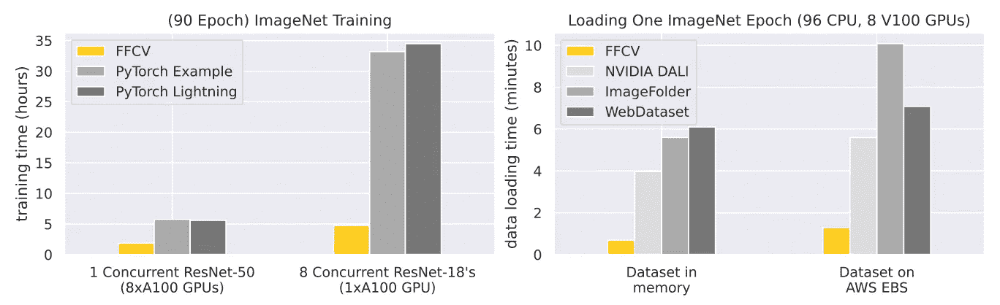

来源:[https://github.com/libffcv/ffcv](https://github.com/libffcv/ffcv)

# 🔬研究

[Zeta Alpha](https://search.zeta-alpha.com) 监测人工智能研究的趋势，帮助你确定什么值得阅读。在它的帮助下，**我们选择了 8 篇论文，这些论文体现了不同人工智能子领域的关键发展:**自动强化学习(AutoRL)、多模态语言模型(LMs)、计算机视觉中的 conv nets vs . Transformers(CV)、无监督神经信息检索(IR)等。尽情享受吧！

## [1。自动强化学习(AutoRL):综述和公开问题](https://arxiv.org/abs/2201.03916)

*作者:Jack Parker-Holder，Raghu Rajan，Xingyou Song 等人*

**❓Why →** 机器学习的主要目标之一是几个数据处理工作流和管道的自动化，允许非专家使用 ML 技术，因此像 AutoML 这样的主题很受欢迎。AutoRL 是强化学习世界中的模拟。

**💡关键见解→** 本文概述了这一领域，提供了有用的分类法来统一各种 AutoRL 方法。这对 ML 实践者特别有用，因为 RL 词汇表与 ML 词汇表有很大不同，使得跨领域的思想交叉传播更加困难。

讨论的主题包括不同目标的优化技术(如超参数、任务设计、架构等。):

*   随机与网格搜索驱动的方法
*   贝叶斯优化
*   进化(和/或基于群体的)方法
*   元梯度
*   黑盒优化
*   学习 RL 算法，环境设计

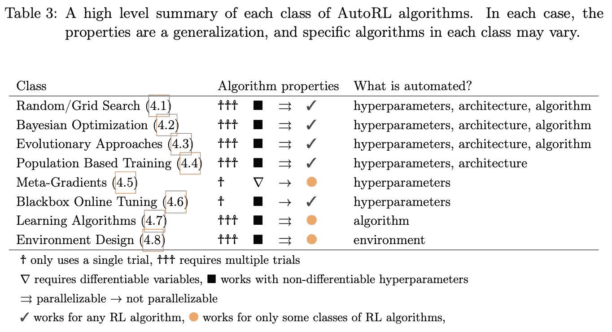

来源:https://arxiv.org/pdf/2201.03916.pdf

虽然总是开箱即用的 RL 的“梦想”似乎仍然很遥远，但这似乎并没有阻止研究人员进入它。

另一篇最近关于强化学习和语言模型交叉的论文可能很有趣，那就是[语言模型作为零射击计划者:为具体化代理提取可操作的知识](https://arxiv.org/abs/2201.07207)。

## [2。作为零射击计划者的语言模型:提取具体化代理的可操作知识](https://arxiv.org/abs/2201.07207)。

*作者:黄、彼得阿贝耳、迪帕克帕沙克和伊戈尔莫达契。*

**❓为什么→** NLP 技术跨越到 ML 的其他领域已经是过去几年反复出现的主题。下面是当你使用像 GPT-3 这样的预训练语言模型(LM)来为代理构建动作序列时会发生的情况。它…起作用了！

**💡关键见解→** 如果规模足够大并经过适当培训，大型 L:Ms 可以将高级任务分解为低级计划**，而无需进一步培训**(即仅使用冻结模型)。

然而，由自由形式的 LM 生成的计划可能是不可执行的，也就是说，可映射到一组现有的已知对象和动作。这就是作者建议引入从 LM 输出到有效动作的映射步骤的原因。这种映射由句子相似性转换器执行，该转换器在嵌入空间中找到最接近的有效低级动作。

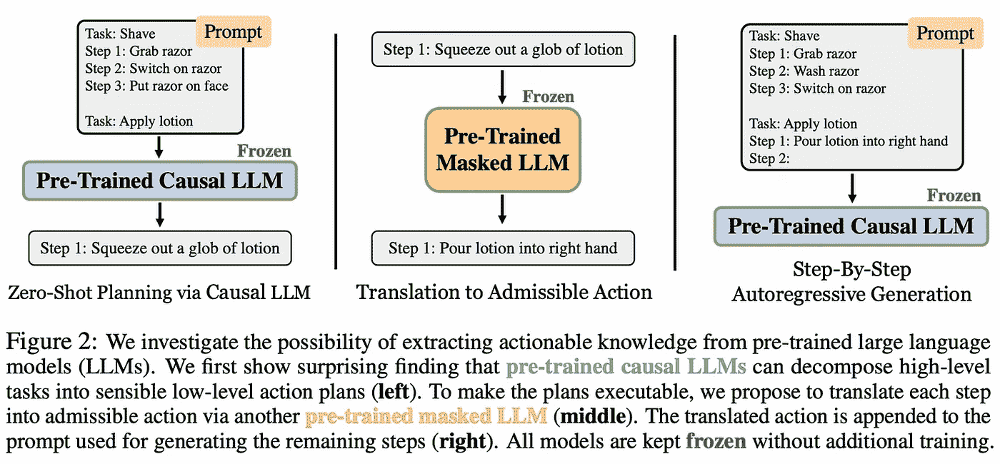

来源:[https://arxiv.org/pdf/2201.07207.pdf](https://arxiv.org/pdf/2201.07207.pdf)

虽然结果并不惊天动地，但它们证明了冻结的 LMs 包含了从高级指令中提取低级行动计划所需的信息。在这里你可以观看一些演示并检查他们的代码。

## [3。CM3:互联网的因果掩蔽多模态模型](https://arxiv.org/abs/2201.07520)

*阿尔门·阿加贾尼扬等人*

**❓为什么→** 多模态已经成为人工智能中一个快速发展的子领域，特别是自从巨大的数据饥渴变压器出现以来。虽然对于现有的基准来说，它们的表现可以说是乏善可陈，但在可预见的未来，关于该主题的研究数量肯定会不断增加。

**💡关键见解→** 这项工作的作者巧妙地设计了一个预处理任务，对包含文本和图像的 HTML 数据进行操作。但是，如何将图像编码成可以提供给模型的标记呢？与 OpenAI 的 DALLE 有些类似，他们使用 VQVAE-GAN 学习图像补丁的量化表示，可以将其视为离散的符号字典，就像常规的文本标记一样。

对于训练，他们使用从左到右和双向语言建模的组合，整个事情的规模很大，但对于今天的标准来说还不算大:1TB 的训练语料库，最大模型的最大参数为 13B。

他们在零镜头设置中的单峰和多峰任务上对其 CM3 进行了基准测试，显示了在图像字幕、图像生成、零镜头摘要、实体链接和其他几个 NLP 任务上的稳定(甚至在某些情况下是 SOTA)性能。

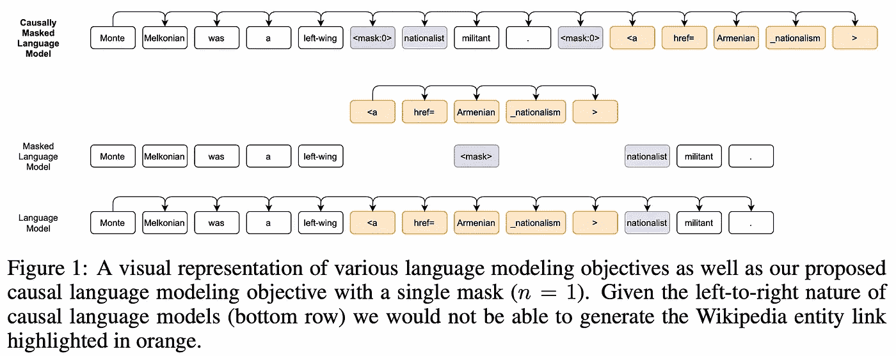

来源:[https://arxiv.org/pdf/2201.07520.pdf](https://arxiv.org/pdf/2201.07520.pdf)

最近关于多模态人工智能的类似工作包括: [data2vec:来自脸书的语音、视觉和语言自我监督学习的通用框架](https://scontent-amt2-1.xx.fbcdn.net/v/t39.8562-6/271974914_483120576492438_4239522333319653600_n.pdf?_nc_cat=107&ccb=1-5&_nc_sid=ae5e01&_nc_ohc=4-cMR5tUq4QAX9sODEo&_nc_ht=scontent-amt2-1.xx&oh=00_AT8Qp6fbOL7-R3gVXxYNvqekc2DKcEzrmlROnCdQd-Pewg&oe=61F3F7D1)(或参见他们的[博客文章](https://ai.facebook.com/blog/the-first-high-performance-self-supervised-algorithm-that-works-for-speech-vision-and-text/))和[用于监督跨模态检索的视觉语言预训练模型的综合实证研究](https://arxiv.org/abs/2201.02772)。

## [4。网络是你的牡蛎——知识密集型自然语言处理对一个非常大的网络语料库](https://arxiv.org/abs/2112.09924)

*亚历山大·皮克图等人*

**❓为什么** →当 GPT-3 在 2020 年 5 月问世时，一个常见的批评是，它对 Covid“一无所知”，因为它的训练语料库是在疫情开始之前创建的。包括这些知识将需要用新数据训练模型，无论是为了微调还是从头开始，这是非常昂贵的。让语言模型访问知识语料库是最近的一项发展，这使它们能够成为[更高效的学习者](https://deepmind.com/research/publications/2021/improving-language-models-by-retrieving-from-trillions-of-tokens)和[更准确的事实](https://openai.com/blog/improving-factual-accuracy/)，增加了能够更新知识而无需重新训练神经网络的好处。

**💡关键见解** →知识密集型自然语言处理任务被定义为在不查阅知识语料库(例如，一本书、网络)的情况下，人类无法解决的任务。本文提出了一个新的基准，精确地测量 LMs 在这方面的表现。它建立在现有的 [KILT 基准](https://ai.facebook.com/tools/kilt/)之上，主要基于维基百科语料库来构建事实检查、实体链接、槽填充、开放域 QA 和对话生成任务。

随着越来越多的检索增强语言模型被提出，拥有一个可靠的评估系统来比较它们变得越来越重要。这种模型的一些最近的例子包括 [WebGPT:具有人类反馈的浏览器辅助问答](https://arxiv.org/abs/2112.09332)(open ai)[通过从数万亿个令牌中检索来改进语言模型](https://arxiv.org/abs/2112.04426)(deep mind)[人工制品检索:具有知识库访问的 NLP 模型概述](https://arxiv.org/abs/2201.09651)(萨尔州大学)或 [LaMDA:对话应用的语言模型](https://arxiv.org/abs/2201.08239)(谷歌)。

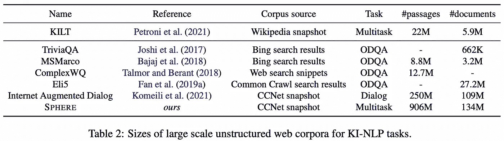

来源:[https://arxiv.org/pdf/2112.09924.pdf](https://arxiv.org/pdf/2112.09924.pdf)

## [5。LaMDA:对话应用的语言模型](https://arxiv.org/abs/2201.08239)

*Romal Thoppilan 等人*

❓Why → 尽管文本生成技术取得了巨大的进步，但你在那里发现的许多聊天机器人仍然很烦人，没什么用处。现代语言模型如何改善对话式人工智能？这是谷歌的最新提议。

**💡关键见解→** 这实际上是语言模型的另一个实例，它与知识库交互以回答用户的查询，基本上是一个检索增强的 LM。按照通常的谷歌方式，他们训练了一个庞大的 137B 模型，并使用人类的判断来评估它的敏感性和特异性等指标。不出所料，性能会随着规模的扩大而不断提高，不会饱和。

在概念层面上，这种方法很简单:使用 LM 的两种变体，LaMDA-Base 是一种在对话中训练的常规 LM，LaMDA-Research 是一种 LM 的变体，它被训练成与作者称为工具集(ts)的外部知识系统进行交互。这个工具集不仅包括一个信息检索系统，还包括一个用于算术查询的计算器和一个翻译器。

LaMDA-Base 和 LaMDA-Research 通过传递它们的输入并连接它们来保持全局上下文进行交互(见下图)。当然，这个模型成功的关键之一是作者管理的高质量训练数据集，除了通常的大规模自我监督预训练之外，它还包括超过 40k 个带注释的对话交互。

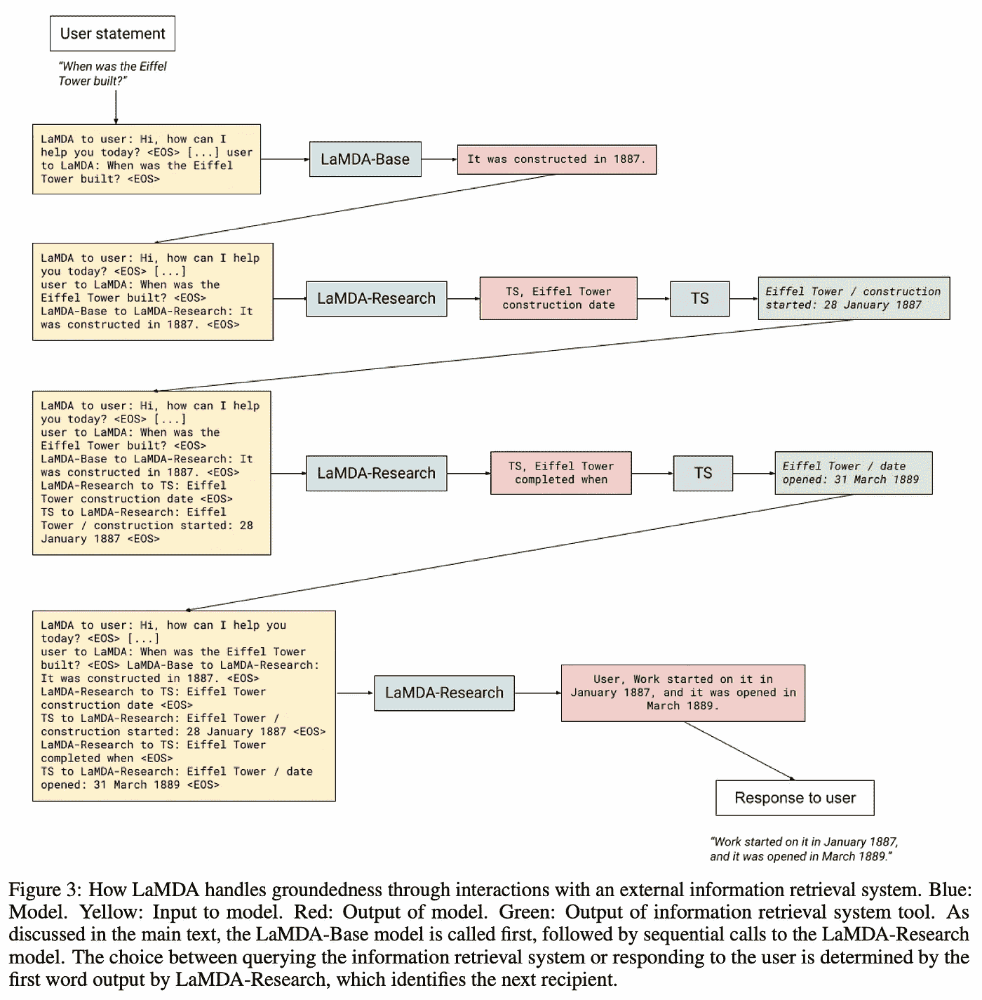

来源:https://arxiv.org/pdf/2201.08239.pdf

其他相关近期工作:[会话信息检索的神经方法](https://arxiv.org/abs/2201.05176)和[会话信息搜索](https://arxiv.org/abs/2201.08808)。

## [6。语言模型即服务的黑盒调优](https://arxiv.org/abs/2201.03514)

*孙天祥等*

**❓Why →** 随着大型变压器成为许多研究领域的标准，它们的使用方式也面临着挑战。不久以前，人们可以简单地下载一个几百兆字节大小的模型检查点，并在任何你想去的地方运行它。但是当检查点的大小接近 1tb 时…它需要在几台机器上运行，下载是不可行的！此外，对于 OpenAI 这样的公司来说，这样的大型模型已经成为非常有价值的知识产权，是他们提供服务的支柱，也是他们不愿意放弃的明显竞争优势。因此出现了作为服务的 ML 模型，它将 ML 模型公开为一个黑盒 API，在给定一组输入的情况下返回预测。现在，您能调优这样一个只能作为黑盒 API 访问的模型吗？

**💡关键见解→**black box API 的用户可以使用无导数算法调整他们的系统(记住，我们只能访问输入和输出，不能访问梯度！).特别是，他们使用进化算法在提示和超参数的空间中进行搜索，有效地学习优于*手动提示*和*上下文学习*的提示，这意味着在提示中包括训练示例，就像 GPT-3 对少量学习所做的那样。在某些情况下，他们的方法优于基于梯度的方法，如即时微调！

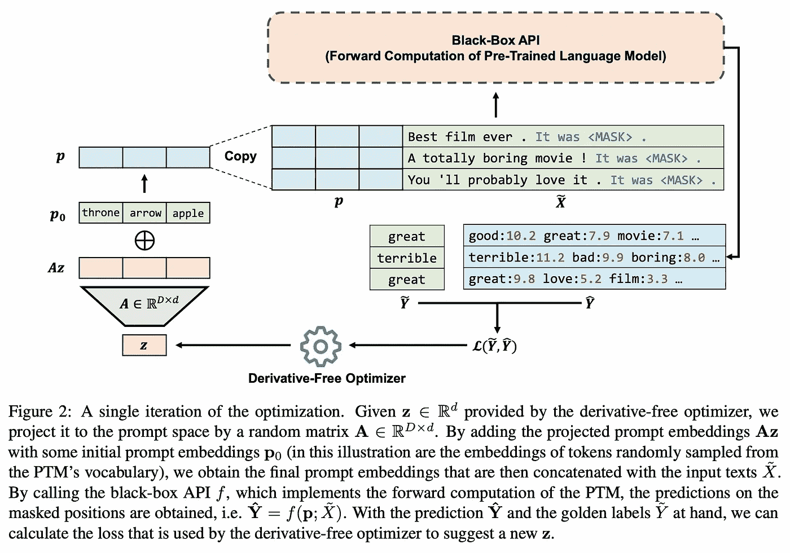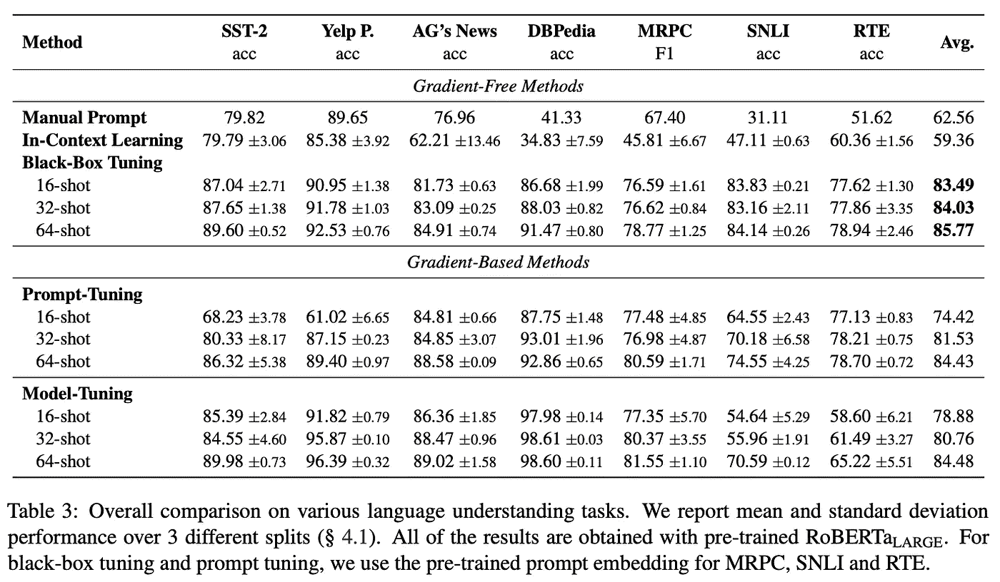

来源:[https://arxiv.org/pdf/2201.03514.pdf](https://arxiv.org/pdf/2201.03514.pdf)

优化纯界面模型领域的另一项相关工作是[内存辅助提示编辑，以改进部署后的 GPT-3](https://arxiv.org/abs/2201.06009)。

## [7。面向 21 世纪 20 年代的 conv net](https://arxiv.org/abs/2201.03545)

*刘庄等人*

**❓为什么** →深度学习在 2010 年代初的强劲势头在很大程度上可以归功于 AlexNet 在 2012 年 ImageNet 挑战赛中的巨大成功。从那以后的很多年里，卷积——这种神经网络的主要组成部分——独自统治了计算机视觉的世界。然而，随着变压器及其方便的可扩展性的引入，将它们应用于 CV 的方法——如[斯温 transformer⁴](https://arxiv.org/abs/2103.14030)——变得越来越流行；可以说威胁到了回旋保持了这么久的王冠。

**💡关键见解→** 回旋仍在摇摆。

本文认为，通过进一步优化，ConvNets 仍然比变压器有优势，从而产生了流行的 ResNets 的现代版本，与类似的基于变压器的架构相媲美。这些变化包括抛弃 BatchNorm 而支持 LayerNorm，从 ReLU 切换到 GELU，或者改变卷积核的大小等等。差不多就是这样，他们在 ImageNet 上的结果和缩放规则略高于基于 transformer 的架构。嗯，可能要到下周另一篇论文出来…

架构之战仍在继续，如果有一点是明确的，那就是人工智能领域肯定会从竞争中受益！

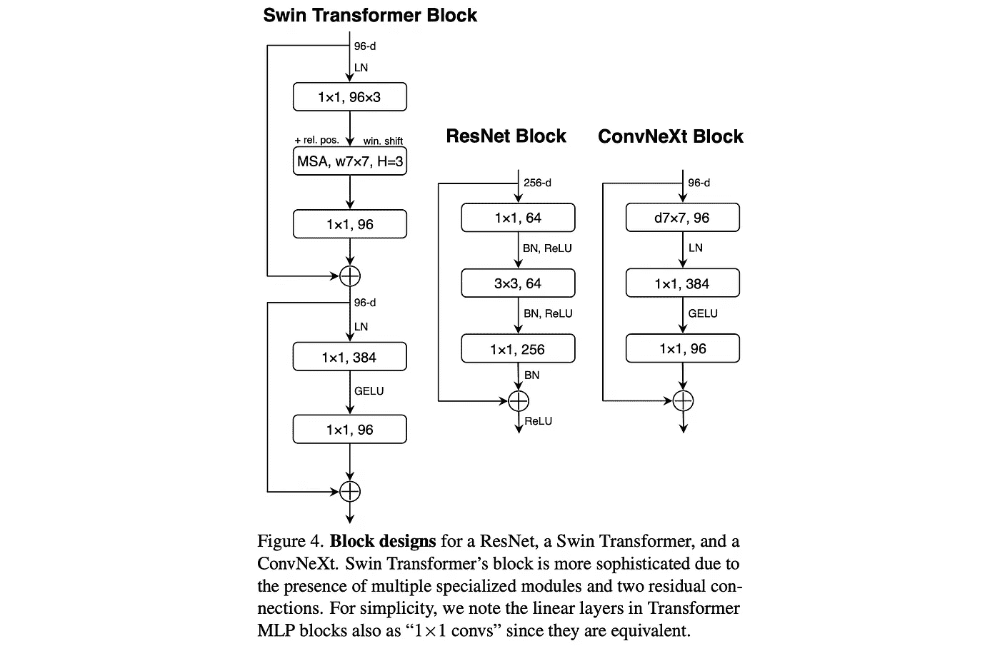

来源:[https://arxiv.org/pdf/2201.03545.pdf](https://arxiv.org/pdf/2201.03545.pdf)

## 8。GLIDE:使用文本引导扩散模型实现照片级真实感图像生成和编辑

*亚历克斯·尼科尔、普拉富拉·达瑞瓦尔、阿迪蒂亚·拉梅什等人*

**❓为什么** →自 2014 年 [GANs 推出以来，图像生成一直是深度学习的一个非常养眼的应用](https://papers.nips.cc/paper/2014/hash/5ca3e9b122f61f8f06494c97b1afccf3-Abstract.html)。然而，最近，诸如使用 [VQ-VAE](https://arxiv.org/abs/1711.00937) (例如[达尔和](https://openai.com/blog/dall-e/))的自回归生成和扩散模型等方法正在成为可行的甚至更好的替代方法。

**💡关键见解→** 简而言之，扩散模型通过在像素网格上迭代添加可微分噪声来生成图像，最终成为真实的图像。本文提出了一种在给定文本提示的情况下基于扩散模型生成和编辑图像的方法，该扩散模型非常好，击败了著名的 OpenAI 的 DALL E。然而，这些模型仍然存在一些缺点，例如生成每个图像所需的计算成本，这仍然阻止了它们在许多应用中得到广泛使用。

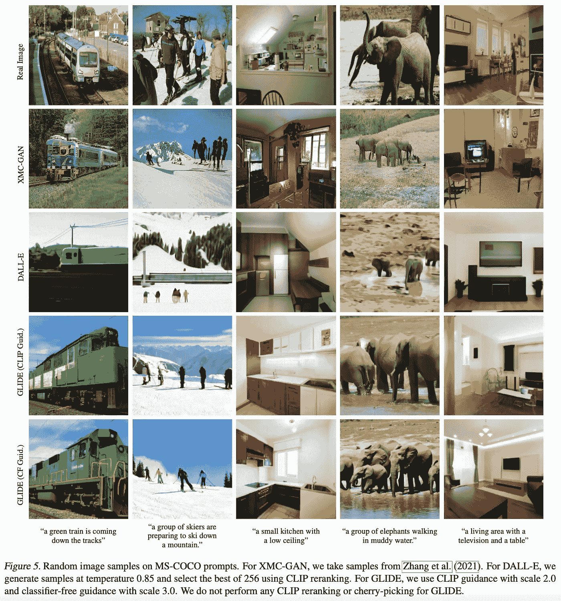

来源:[https://arxiv.org/pdf/2112.10741.pdf](https://arxiv.org/pdf/2112.10741.pdf)

## [9。通过对比预训练嵌入文本和代码](https://arxiv.org/abs/2201.10005)

*阿尔温德·尼拉坎坦、徐涛等人*

**❓为什么→** 神经信息检索是深度学习游戏的晚期，在某些方面仍然不如 BM25 等 20 多年前的算法！这个等式的一个关键部分是对大量标记数据的依赖:今天所有成功的神经检索方法都严重依赖于标签，如来自马尔科女士数据集的标签。这些模特在完全没有监督的情况下能训练出来吗？在过去的几个月里，出现了希望的迹象！

**💡关键见解→** 这是 OpenAI 的一个提议，以完全自我监督的方式学习文本的文本表示。这些表示(即嵌入)旨在成为包括信息检索在内的各种任务的可靠执行者。工作原理非常简单:使用相邻的文本片段作为正的伪查询文档对和批内否定。**非常**大批量必须我加。然而，并非所有闪光的东西都是金子:虽然完全无人监管的性能是可靠的，但你可以以低得离谱的成本使用只在几个公开可用的标签上微调的小模型来实现更好的性能，正如 SBERT 的创始人 [Nils Reimers 已经展示的](https://twitter.com/Nils_Reimers/status/1487014195568775173)。

总之，对于无监督的神经信息检索和表示学习来说，这是重要的一步，但不是像一些标题所暗示的那样，是一个解决所有问题的嵌入 API。这是只能通过付费 API 访问的模型的又一个例子，我们期望这样的例子会变得更加普遍。

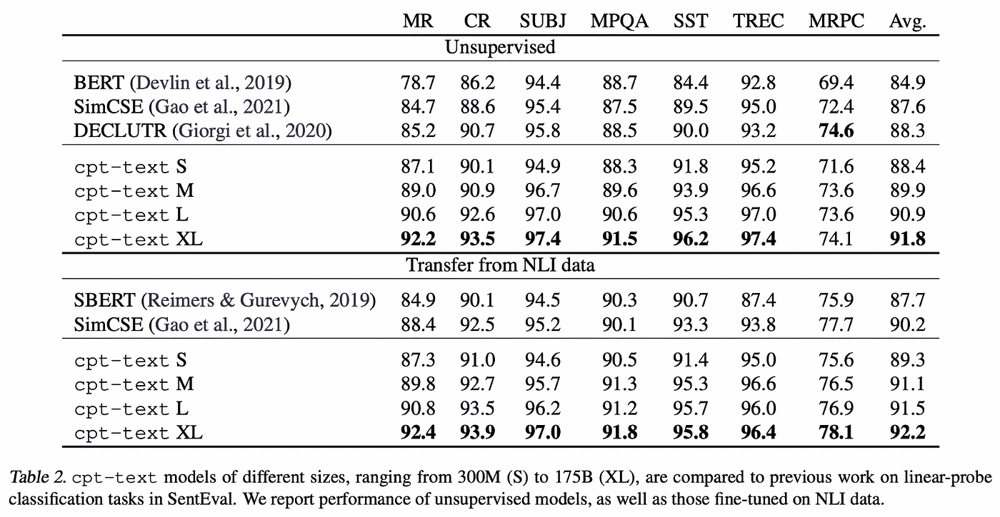

来源:[https://arxiv.org/pdf/2201.10005.pdf](https://arxiv.org/pdf/2201.10005.pdf)

最近其他类似的关于无监督信息检索的工作是[使用对比学习进行无监督密集信息检索](https://arxiv.org/abs/2112.09118)，[在没有监督的情况下学习检索段落](https://arxiv.org/abs/2112.07708)

## [10。DeepSpeed-MoE:推进混合专家推理和训练，为下一代人工智能量表提供动力](https://arxiv.org/abs/2201.05596) | [网站](https://www.deepspeed.ai/)

*Samyam Rajbhandari 等人*

**❓为什么→** 在过去的一年里，混合专家(moe)已经成为扩展大规模语言模型的首选策略。关键概念很简单:在推理过程中，只通过模型中的子路径传递输入，这样在每一步中只使用一小部分模型参数。这种系统的实现细节仍然是混乱的，并且包括关于密集模型的严重折衷，例如推理速度。

**💡Key insights →** DeepSpeed-MoE(即将在 GitHub 上[开源)是微软最新版本的 DeepSpeed 库，旨在使分布式深度学习训练变得简单高效，它是这项工作的实现骨干。](https://github.com/microsoft/DeepSpeed)

作者展示了 MoEs 与密集的同类相比是如何闪耀的:更有效的训练——大约 5 倍——和更好的参数效率。

本文还深入探讨了什么样的设计选择能让 MoEs 学得更好。例如，浅层的专家多一些好，还是深层的专家多一些好？要增加模型容量，应该增加每个专家的容量还是增加专家的数量？虽然这些问题还没有绝对的答案，但本文根据经验探索了这些设计选择的权衡，将它们包装在通用 PR-MoE(金字塔剩余 MoE)下。它们的 PR-MoE 的基本结构如下图所示，包括不同的“专家宽度”以及剩余的 MLP 连接。

虽然 moe 仍然不是主流，但是如果实现和设计的复杂性得到解决，它们有可能成为下一代大规模模型的标准。

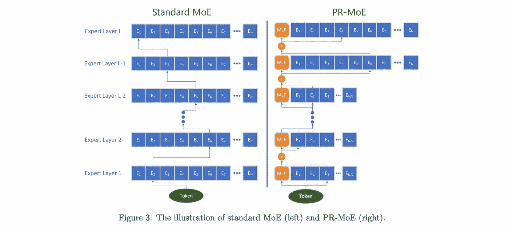

来源:https://arxiv.org/pdf/2201.05596.pdf

我们的月度评选到此结束；如果你想了解最新的研究，请在 Twitter [@zetavector](https://twitter.com/ZetaVector) 上关注我们，继续关注下一篇！

*参考文献:*

*1。Patrick Esser、Robin Rombach、bjrn Ommer 于 2021 年出版的《驯服高分辨率图像合成的变形金刚》*

*2。Aditya Ramesh 等人于 2021 年发表的“零镜头文本到图像生成”*

*3。法比奥·彼得罗尼等人的《苏格兰短裙:知识密集型语言任务的基准》，2020 年*

*4。“Swin 变压器:使用移位窗口的分层视觉变压器”，刘泽等人，2021 年*