# 计算和解释模型特征重要性的最佳实践

> 原文：<https://towardsdatascience.com/best-practice-to-calculate-and-interpret-model-feature-importance-14f0e11ee660>

## 以随机森林模型为例


来源: [Unsplash](https://unsplash.com/photos/w7ZyuGYNpRQ) (归功于凯文·Ku)

在机器学习中，大多数时候你希望模型不仅准确，而且可以解释。一个例子是客户流失预测-除了知道谁会流失，了解哪些变量在预测流失以帮助改进我们的服务和产品方面至关重要。

Scikit-learn 等流行的机器学习包为模型解释提供了特征重要性的默认计算。然而，我们经常不能相信那些默认的计算。在本文中，我们将使用来自 Kaggle 的著名的[泰坦尼克号数据和一个随机森林模型来说明:](https://www.kaggle.com/c/titanic/data)

*   为什么您需要一个**健壮的**模型和**排列重要性** **分数**来正确计算特性重要性。
*   为什么您需要理解**特性的相关性**来正确解释特性的重要性。

本文中描述的实践也可以推广到其他模型。

# 计算要素重要性的最佳实践

## 默认特征重要性的问题是

我们将使用一个示例来展示 Scikit-learn 中为随机森林提供的默认基于杂质的特征重要性的**问题。默认特征重要性是根据杂质的平均减少量(或基尼系数重要性)计算的，它衡量每个特征在减少不确定性方面的有效性。参见[这篇伟大的文章](/the-mathematics-of-decision-trees-random-forest-and-feature-importance-in-scikit-learn-and-spark-f2861df67e3)以获得特性重要性计算背后的数学的更详细的解释。**

让我们从 [Kaggle](https://www.kaggle.com/c/titanic/data) 下载著名的泰坦尼克号数据集。该数据集包含泰坦尼克号上 1309 名乘客的信息以及他们是否幸存。下面是对包含的列的简要描述。

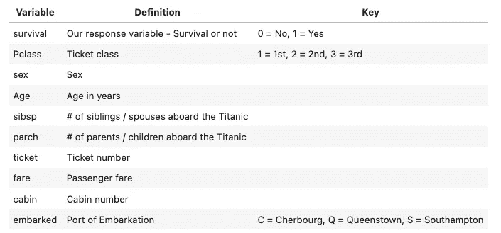

首先，我们加载数据，并将其分为预测集和响应集。在预测器集合中，我们添加了两个随机变量`random_cat`和`random_num`。因为它们是随机生成的，所以这两个变量应该具有非常低的特征重要性分数。

其次，我们对数据进行一些简单的清理和转换。这不是本文的重点。

第三，我们建立一个简单的随机森林模型。

```
RF train accuracy: 1.000.RF test accuracy: 0.814
```

该模型在训练数据上略有过度拟合，但在测试集上仍有不错的性能。现在让我们使用这个模型来说明默认特性重要性计算的一些缺陷。让我们来看看默认的特性重要性。

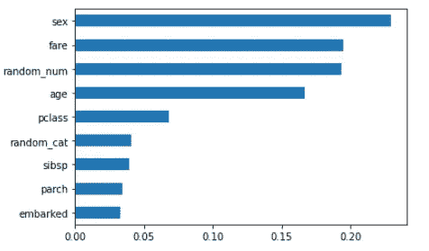

从默认的特性重要性中，我们注意到:

*   与`random_cat`相比，`random_num`具有更高的重要性分数，这证实了**基于杂质的重要性偏向于高基数和数字特征**。
*   非预测性`random_num`变量被列为最重要的特征之一，这没有意义。这反映了当您有一个过拟合模型时**默认特征重要性不准确。当模型过度拟合时，它会从训练集中拾取太多的噪声，从而无法对测试集做出一般化的预测。当这种情况发生时，特征重要性是不可靠的，因为它们是基于训练集计算的。更一般地说，**只有当您有一个可以合理预测的模型时，查看特性的重要性才有意义。****

## 救援的排列重要性

那么我们如何恰当地计算特性的重要性呢？一种方法是使用排列重要性分数。它通过以下步骤计算:

1.  训练一个基线模型，并在验证集上记录分数(在这个例子中我们使用准确性)。
2.  重新排列一个特征的值，使用模型再次进行预测，并计算验证集的得分。该特征的特征重要性是 1 中的基线和 2 中的置换得分之间的差异。
3.  对所有特征重复该过程。

这里我们利用 2019 年添加到 Scikit-learn 包中的 permutation_importance 函数。当调用该函数时，我们设置 n_repeats = 20，这意味着对于每个变量，我们随机洗牌 20 次，并计算准确度的下降，以创建箱线图。

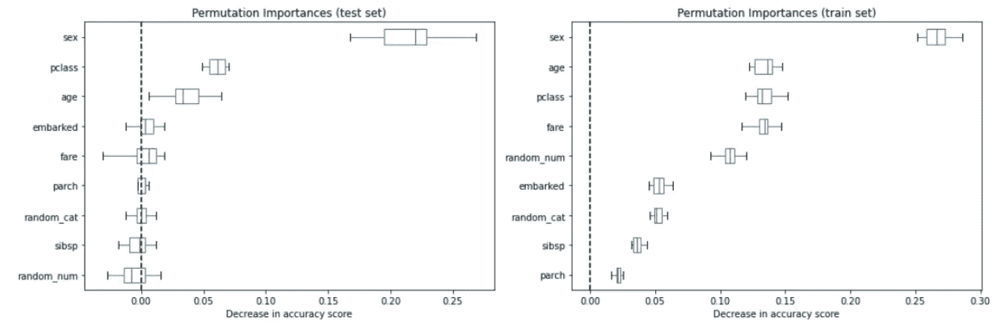

我们看到`sex`和`pclass`显示为最重要的特征，并且`random_cat`和`random_num`不再具有基于测试集上排列重要性的高重要性分数。箱线图显示了具有 N 次重复排列(在我们的例子中 N = 20)的准确度分数降低的分布。

让我们也计算训练集上的排列重要性。这表明`random_num`和`random_cat`获得了比在测试集上计算时显著更高的重要性排名，并且特性的排名看起来与测试集非常不同。如前所述，这是由于模型的过度拟合。

你可能想知道为什么 Scikit-learn 仍然包含默认的特性重要性，尽管它并不准确。RFs 的发明者 Breiman 和 Cutler 指出，这种“将森林中所有树木的每个变量的基尼系数减少相加的方法给出了一个快速的变量重要性，这通常与排列重要性度量非常一致。”所以缺省值意味着置换重要性的代理。然而，正如施特罗布尔等人在[随机森林变量重要性测量的偏差](https://bmcbioinformatics.biomedcentral.com/articles/10.1186/1471-2105-8-25)中指出的，“布雷曼的原始随机森林方法的变量重要性测量……在潜在预测变量的测量范围或类别数量发生变化的情况下是不可靠的。”

## 稳健的模型是获得准确重要性分数的先决条件

我们已经看到，当模式过度拟合时，从训练集和预测集中生成的特征重要性可能会非常不同。让我们通过设置 min_samples_leaf = 20 而不是 1 来应用某种程度的正则化。

```
RF train accuracy: 0.810RF test accuracy: 0.832
```

现在让我们再次看看特性的重要性。修复过度拟合后，根据训练集和测试集计算的特征重要性看起来非常相似。这给了我们更多的信心，一个健壮的模型给出了准确的模型重要性。

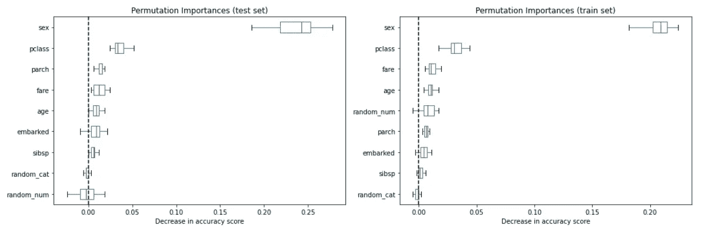

另一种方法是计算**删除列重要性**。这是计算特征重要性的最准确的方法。这个想法是用所有预测值计算模型性能，去掉一个预测值，然后观察性能的下降。特性越重要，我们看到的模型性能的下降就越大。

考虑到删除列重要性的高计算成本(我们需要为每个变量重新训练一个模型)，我们通常更喜欢排列重要性分数。但这是验证排列重要性的一个很好的方法。这两种策略的重要性值可能不同，但特征重要性的顺序应该大致相同。

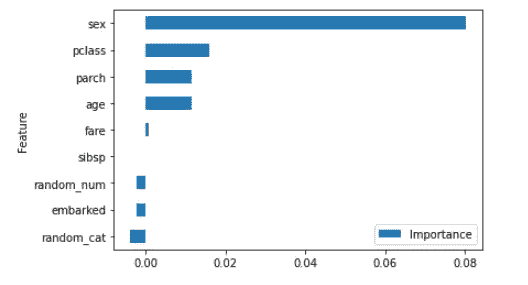

特征的排序类似于置换特征，尽管幅度不同。

# 解释特性重要性的最佳实践

## 特征相关性的挑战

在我们有了一个健壮的模型并正确地实现了正确的策略来计算特性重要性之后，我们就可以前进到解释部分了。

在这个阶段，相关性是我们解释特征重要性的最大挑战。到目前为止，我们所做的假设分别考虑了每个特性。如果所有的特征都是独立的，没有任何关联，那就很容易解释了。但是，如果两个或多个要素共线，将会影响要素重要性结果。

为了说明这一点，让我们使用一个极端的例子，复制列性别来重新训练模型。

```
RF train accuracy: 0.794
RF test accuracy: 0.802
```

当我们添加了一个没有添加任何信息的特征时，模型性能会稍微下降。

我们现在看到性特征的重要性现在分布在两个重复的性列之间。如果我们给复制的列添加一点噪声会发生什么？


让我们试着给性别添加 0-1 范围内的随机噪声。

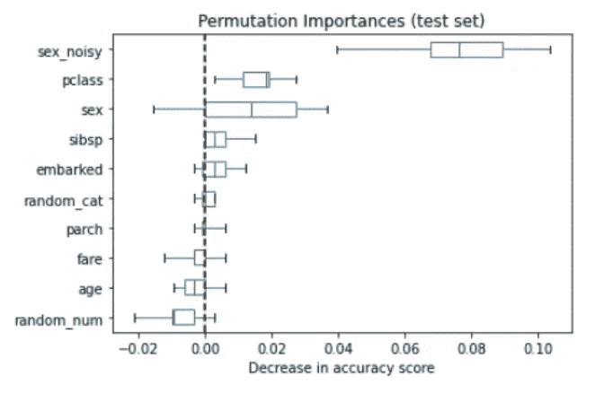

`sex_noisy`现在是最重要的变量。如果我们增加噪声的数量会发生什么？让我们将随机变量的范围增加到 0–3。

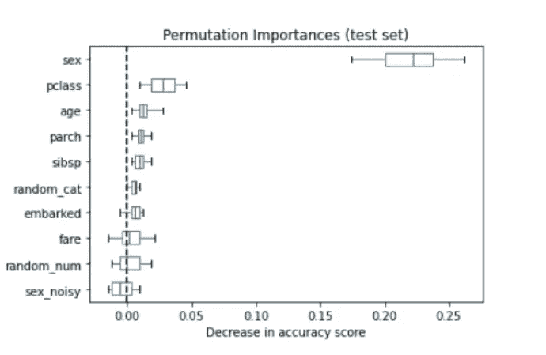

现在我们可以看到，随着更多的噪音加入，现在`sex_noisy`不再是排名第一的预测因素，性别又回到了首位。结论是在随机森林模型**上计算的排列重要性在共线变量**上传播重要性。分享的数量似乎是两者之间有多少噪音的函数。

## 处理共线要素

我们来看看特征之间的相关性。我们使用 rfpimp 包中的 feature_corr_matrix，它给出了 Spearman 相关性。Spearman 相关与标准 Pearson 相关的区别在于，Spearman 相关首先将两个变量转换为排名值，然后对排名变量运行 Pearson 相关。它没有假设变量之间的线性关系。

```
feature_corr_matrix(X_train)
```

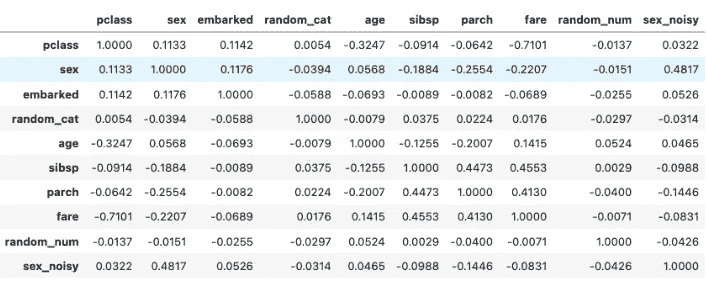

```
from rfpimp import plot_corr_heatmap
viz = plot_corr_heatmap(X_train, figsize=(7,5))
viz.view()
```

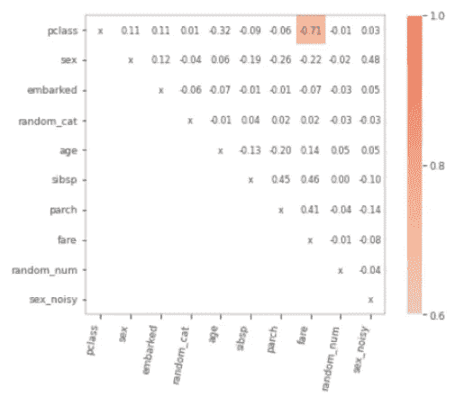

`pclass`与`fare`高度相关，这并不奇怪，因为舱位等级取决于你支付的费用。在业务中，我们经常在预测模型中使用多个相互关联的特征。从前面的例子中，我们看到，当两个或多个变量共线时，根据信噪比，计算的重要性在共线变量之间共享。

**策略 1:组合共线特征**

解决这个问题的一种方法是将彼此高度共线的特征组合起来形成一个特征族，我们可以说这个特征族一起排列为 X 最重要。为此，我们将使用 rfpimp 包，它允许我们一次混洗两个变量。

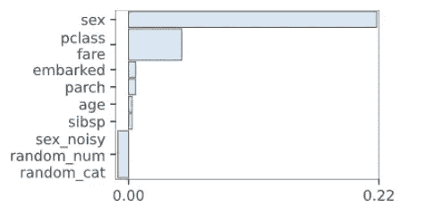

**策略 2:删除高度共线变量**

如果某个特征依赖于其他特征，这意味着可以使用所有其他特征作为独立变量来准确预测该特征。模型的 R 越高，特征的依赖性越强，我们就越有信心移除变量不会牺牲准确性。

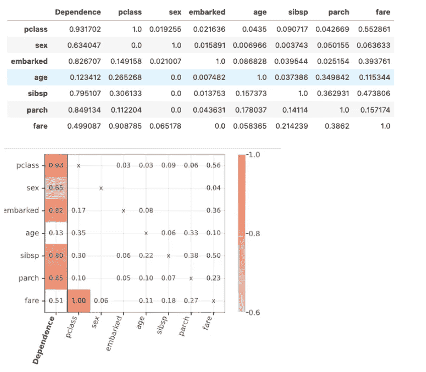

第一列 dependency 显示了依赖分数。使用其他特征完全可预测的特征将具有接近 1 的值。在这种情况下，我们可能会丢弃`pclass`和`fare`中的一个，而不会影响太多精度。

# 最后

一旦我们 1)有了一个健壮的模型，并实现了正确的策略来计算排列的重要性，2)处理了特性的相关性，我们就可以开始精心制作我们的消息来与利益相关者分享。

对于人们经常问的问题“特性 1 比特性 2 重要 10 倍吗？”，这时你可能明白了，只有当所有的特征都是独立的或者相关性很低的时候，我们才有信心进行论证。但在现实世界中，这种情况很少发生。建议的策略是将功能分配给高、中和低影响层，而不要过于关注确切的影响程度。如果我们需要显示特征之间的相对比较，请尝试将共线特征分组(或删除)到熟悉的特征，并基于分组进行解释，以使论点更加准确。

你可以在我的 Github 上找到这篇文章的代码。

# 参考

[1] [小心默认随机森林重要性](https://explained.ai/rf-importance/)

[2] [排列重要性与随机森林重要性(MDI)](https://scikit-learn.org/stable/auto_examples/inspection/plot_permutation_importance.html)

[3][sci kit-Learn 机器学习模型的特征重要性](https://github.com/parrt/random-forest-importances)

[4] [决策树、随机森林的数学特性在 Scikit-learn 和 Spark 中的重要性](/the-mathematics-of-decision-trees-random-forest-and-feature-importance-in-scikit-learn-and-spark-f2861df67e3)

[5] [以随机森林为例解释特征重要性](/explaining-feature-importance-by-example-of-a-random-forest-d9166011959e)

*除特别注明外，所有图片均为作者所有。*