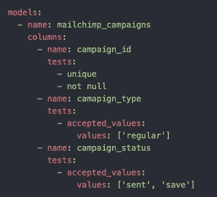
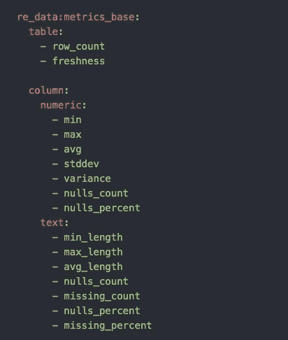
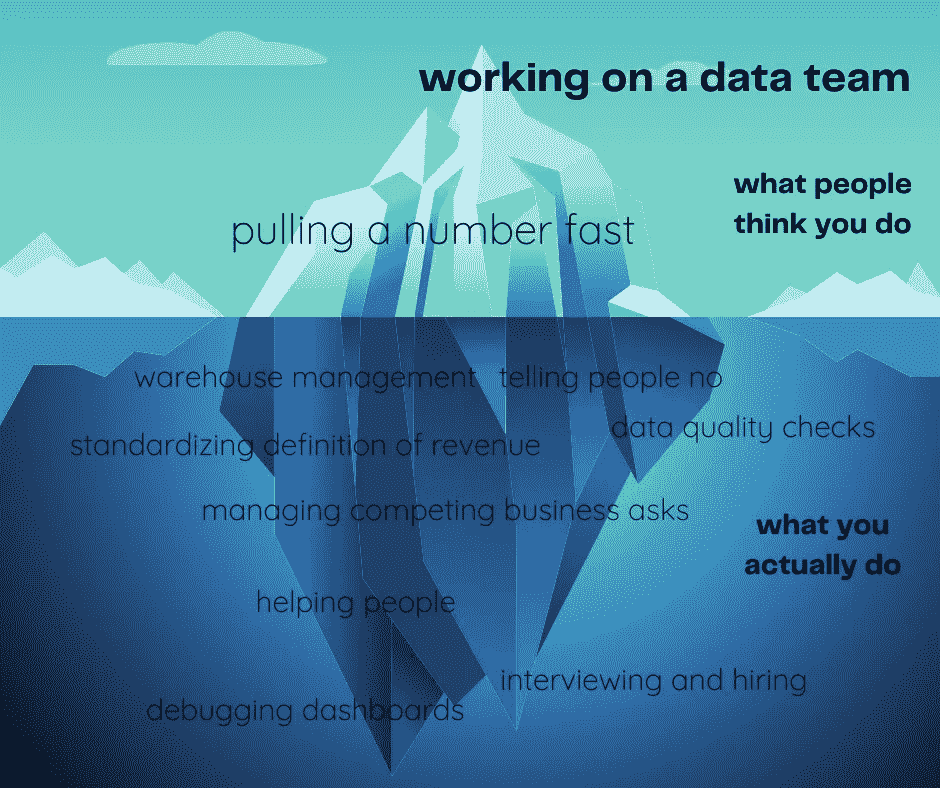

# 建立对数据信任的最佳实践

> 原文：<https://towardsdatascience.com/best-practices-for-building-trust-in-your-data-dda32b84e70e>

## 如何让你的利益相关者停止怀疑和质疑

迪伦·吉利斯在 [Unsplash](https://unsplash.com/s/photos/team-trust?utm_source=unsplash&utm_medium=referral&utm_content=creditCopyText) 上的照片

有多少次你收到来自业务利益相关者的懈怠信息，说仪表板坏了，数据一周没有更新，或者某些数字看起来*非常错误*？你看不到我，但我站得很高，手臂直直地举在空中。

这种情况已经发生了太多次了。这是为什么呢？因为对我们的旧数据堆栈缺乏信任。利益相关者有太多的问题，数据集被破坏，无法在他们需要时看到他们需要的洞察力。

构建现代数据堆栈时，您需要从一开始就慢慢建立信任。您需要实施正确的测试和检查，以确保数据符合您的期望。你需要开诚布公地对待你正在着手的计划，以及在这个过程中可能出错的事情。在做这些事情的同时，你还必须教育你的消费者，而不是当着他们的面把最终产品拍下来，告诉他们一切都很好。

# 设置测试，以便从源头提醒您数据质量问题。

测试和监控原始数据以及数据模型是检测数据中任何主要问题的关键。我喜欢用两个免费工具来做这件事。

## dbt 测试

[dbt 测试](https://docs.getdbt.com/docs/building-a-dbt-project/tests)内置于任何 dbt 项目中。它们允许您检查空值、主键和某些指定的值。您可以将这些添加到您的基础模型中，以在源位置检查您的数据，或者添加到您的核心数据模型中，以确保您得到了您期望的结果。

您只需在定义 dbt 模型的 yaml 文件中添加“tests”块。dbt 将在您的模型运行时运行这些检查，当模型中的某一列不符合您设置的检查时，会向您发出警告。

作者图片

## re _ 数据指标

我第一次发现 [re_data](https://www.getre.io/) 是在我寻找一种方法来监控每天摄入的数据量的时候。我需要一个适当的检查来确保我的所有数据都如预期的那样被接收。re_data 是一个开源的 dbt 包，允许您在列和表级别进行监控。它包括行数、新鲜度和空计数等指标。

作者图片

对于某些指标，re_data 会计算平均值，然后使用指定的 z 得分来检测数据中的异常。当数据量超出该 z 值时，您将收到警报。你可以通过查看[这个](/prevent-data-loss-with-this-free-dbt-package-a676c2e59c97)帖子来了解更多关于如何设置这些的信息。

# 抢先股东一步。

如果出了问题，在他们自己弄清楚之前说点什么！完全透明会大有帮助。如果你在事情破裂时开诚布公，你们会建立更好的关系，而不是试图掩盖问题，让他们自己发现。

这与设置测试以从源头上提醒您问题是齐头并进的。如果您在下游的任何事情受到影响之前收到警报，您可以找到根本原因并修复问题，或者您可以在其他团队使用下游模型或仪表板之前让他们知道。

在您的组织内创造透明度是重中之重。我知道当一切都不顺利的时候会很沮丧。从头开始构建新的数据文化很容易隐藏所有的问题。但是，这需要时间。你可以建立信任，同时也要传达这不是一个一蹴而就的过程。

# 教育你的数据和事情是如何做的。

甚至对业务团队进行数据流程培训也有助于建立数据的透明度和可信度。如果你能帮助他们理解你试图解决的所有问题，当他们的仪表板坏了时，他们可能会更感同身受。

这幅冰山图解释了数据团队的工作，再准确不过了。

作者图片

业务团队知道他们认为我们在做什么，但通常与我们实际做的相差甚远。所以让他们看看你到底在做什么！与他们分享你的未来路线图和目标。

我们最近在 Slack 上开设了一个洞察频道，公司内部的任何人都可以加入。在这里，我们分享了我们的路线图和每个计划背后的*为什么*。想想你的最终用户和他们关心的*。如果你以一种对他们重要的方式来看待事情，他们会在整个现代化过程中更加宽容。*

在与业务用户分享见解时，您应该记住什么？

*   解决当前的问题
*   解释*为什么*与*它们*的关系
*   用外行的话来说；他们可能不明白什么是仓库或管道。相反，使用诸如“数据存储在哪里”和“数据如何移动”这样的短语。

# 结论

在利益相关者和您的数据之间建立信任就像在任何关系中建立信任一样。一旦这种信任被打破，就很难重新建立起来。通过测试、透明度和教育，从一开始就慢慢地建立对数据的信任。这将创造开放和诚实的沟通，并在出现任何问题之前为问题留出空间。

[与我一起](https://madisonmae.substack.com/about)阅读 Substack 上的独家分析工程文章以及双周简讯，重点介绍该领域的最佳资源和主题。