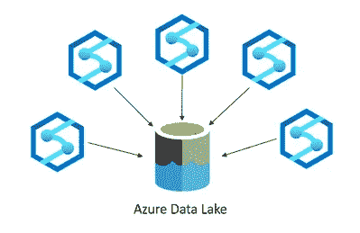
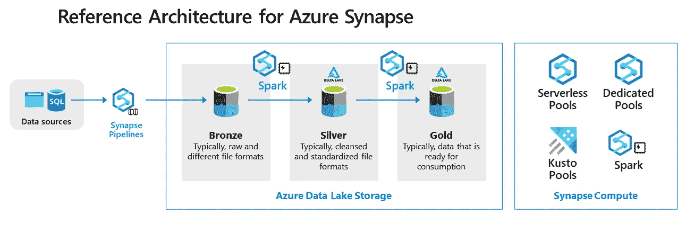

# 组织 Synapse 工作区的最佳实践

> 原文：<https://towardsdatascience.com/best-practices-for-organizing-synapse-workspaces-977fe14b1fdb>

## 对于简化的数据分析工作流，需要记住一些注意事项

Azure Synapse Analytics 原名 Azure SQL Data Warehouse，是一款具有企业数据仓库功能的大数据分析解决方案。它为不同的工作负载提供不同类型的计算环境。最常见的是 SQL compute，它有两种风格:无服务器和专用。另外两个计算选项是 Spark 和 Data Explorer(时序)。数据工程师可以根据自己的业务需求选择计算环境。

**工作空间考虑和配置**

计算环境依赖于一个“主”存储帐户，并在一个**工作区**的边界内一起管理，该工作区是一个集中处理所有工件的地方。这些工件可以是 SQL 脚本、笔记本、拼花文件和数据库。在为大规模环境规划 Azure Synapse Analytics 部署时，有一些常见的决策点会影响您如何创建和组织 Synapse 工作区:

*   **团队结构和职责:**在给定用例、数据分离或成本管理需求的情况下，您的数据工程团队在功能项目上的组织和协作方式。职能界限和灵活性问题会导致团队分离，从而产生更多的工作空间。
*   **发布工作流:**您的开发和发布工作流可能需要额外的环境:开发、测试和生产的分离。
*   **区域:**您的数据的位置以及您需要为其提供分析解决方案的受众。这种区域界限可能导致实施更多的工作空间。
*   **安全性:**所有权、安全性或法律界限可能会迫使团队相互分离。比如有些数据是永远不允许其他团队看到的。

在实施多个工作空间时，您需要在成本管理、生产效率和管理复杂性之间找到平衡。这种平衡可能导致不同的解决方案模式。例如，当活动仅与实验或 R&D 相关时，您可以选择只使用一个工作空间。这种模式减少了你的 Azure 足迹，降低了你的成本。另一种解决方案模式是为每个职能领域或项目创建工作区，这简化了协作、成本报告和预算要求。例如，一个包含四个不同工作负载的设置可能会创建 12 个工作区实例，每个工作负载都需要一个发布工作流。

**多工作区单湖拓扑**

另一个重要的驱动因素是工作和共享数据方式的凝聚力和效率。当您的团队有不断共享大型数据集的趋势时，您应该考虑**多工作区单湖拓扑**。

多工作区-单湖拓扑(约万·波波维奇)

这个模式首先由 [Jovan Popovic](https://techcommunity.microsoft.com/t5/azure-synapse-analytics-blog/the-best-practices-for-organizing-synapse-workspaces-and/ba-p/3002506) 描述，它极大地简化了管理、共享和安全配置。基本思想是，您有一个 Azure 数据湖存储实例和多个指向它的工作区实例。在这种情况下，隔离是通过使用单独的文件夹并将文件夹与工作区对齐来执行的。最佳实践是使用工作区名称作为文件夹名称。

**组织和管理数据湖中的数据**

在湖中组织数据时，必须考虑文件夹结构和文件格式的不同。许多组织使用不同的文件夹、容器或存储帐户对数据进行分层。在实现工作空间之前，在将数据放入数据湖之前，规划出数据的结构是很重要的。因此，如果您的进程主要读取按数据生命周期组织的数据，您应该考虑使用 */raw/、/enriched、/curated* 文件夹结构。在每个文件夹中，您可以有不同的文件夹: */application01、/application02、*等等。如果您的流程主要读取每个主题领域的数据，您可以考虑 */sales、/manufacturing* 等等。您也可以混合这些分层模式。例如，带有 */raw* 和 */enriched* 的数据仍然是与源系统对齐的，而 */curated* 中的数据是与消费者对齐的。

典型的数据湖结构(鸣谢:Piethein Strengholt)

在组织数据时，您还应该考虑访问控制模型。例如，容器只允许粗粒度的访问，因此继承了对文件夹和文件的访问。ACL 允许对数据集进行更细粒度的访问控制，但也带来了更多的管理开销。理想的数据湖结构在良好的逻辑分离和解决访问管理的开销之间取得平衡。

您应该考虑的另一个问题是如何应用数据生命周期管理。许多组织仅保留其完整数据加载的几个旧版本。他们通过建立缓慢变化的维度来压缩数据。回滚的典型时间窗口是 30 天。另一个考虑是审查交付模式。一些源系统保留了所有数据的完整历史，而其他系统只提供事务性数据。这种数据传递要求您执行覆盖或仅追加。这可能会导致更复杂的数据管道，这个主题您将在后面了解更多。

我选择什么样的数据格式？

数据通常以不同的文件格式到达，因为数据来源和接收文件格式的系统有很强的依赖性。您的一些源系统很容易提取，并直接允许现代文件格式的创建，如 Parquet 或 Delta。其他系统对传统导出功能的依赖性更强，例如，只能交付 CSV 或 XML 文件。因此，您的第一层摄取通常包含不同的文件格式。然而，当进一步处理时，人们非常喜欢允许更密集的查询模式的文件格式。对于 Synapse，您还必须注意其他一些事项:

*   目前，只有无服务器池支持增量文件。如果您打算使用外部桌子作为专用池，那么您应该考虑使用拼花地板。
*   当用 Spark 处理时，你可以创建 Spark [湖数据库](https://docs.microsoft.com/en-us/azure/synapse-analytics/database-designer/create-empty-lake-database)。这些数据库可以使用无服务器 SQL 池进行查询，但是它们是只读的。
*   当使用无服务器 SQL 创建 Lake 数据库时，这些数据库在 Spark 中是不可见和不可用的。

**数据处理方法**

你推荐什么样的数据处理工具或方法？这个问题的答案主要归结为你喜欢什么。以下是一些实地观察结果:

*   只需要提取和加载或简单转换的团队通常在 Azure Data Factory(Synapse Pipelines)内部处理。
*   需要复杂转换但不喜欢编码的团队通常使用数据流或调用存储过程。
*   需要复杂转换、喜欢编码的团队通常使用 Databricks 或 Azure Synapse Spark Pools。编排通常由 Synapse 管道完成。
*   喜欢将转换和依赖作为元数据或 YML 文件来管理的团队经常使用外部工具，如 [DBT](https://www.getdbt.com/) 。

一般建议是尽可能消除手动步骤。一个好的自动化数据管道可以实现平滑和可扩展的转换，而无需任何手动操作。另一个建议是对重复的转换步骤应用模块化设计。某些块，例如处理历史数据的块，应该被转换成一个可重用的模块([元数据驱动的摄取框架](https://piethein.medium.com/designing-a-metadata-driven-processing-framework-for-azure-synapse-and-azure-purview-33121a63ebc0))，然后可以应用于多个数据管道。最佳实践是使用几个代码库，并将功能设计与通用数据处理功能分开。另一个最佳实践是使用参数化。参数化允许更好的测试和更快的重新运行开发、测试和生产。

**结论**
组织您的工作空间和数据湖存储账户，使您在成本管理、生产效率和管理复杂性之间取得正确平衡，这一点很重要。不正确的体系结构可能会造成混乱，数据可能会在环境之间不断复制，或者访问管理成为一场噩梦。当许多团队依赖相同的数据时，尝试考虑多工作区单湖拓扑，或者当团队的目标发生冲突时，尝试使用多个工作区分开。