# 可视化聚类结果的最佳实践

> 原文：<https://towardsdatascience.com/best-practices-for-visualizing-your-cluster-results-20a3baac7426>

## 集群可视化和解释的成熟技术

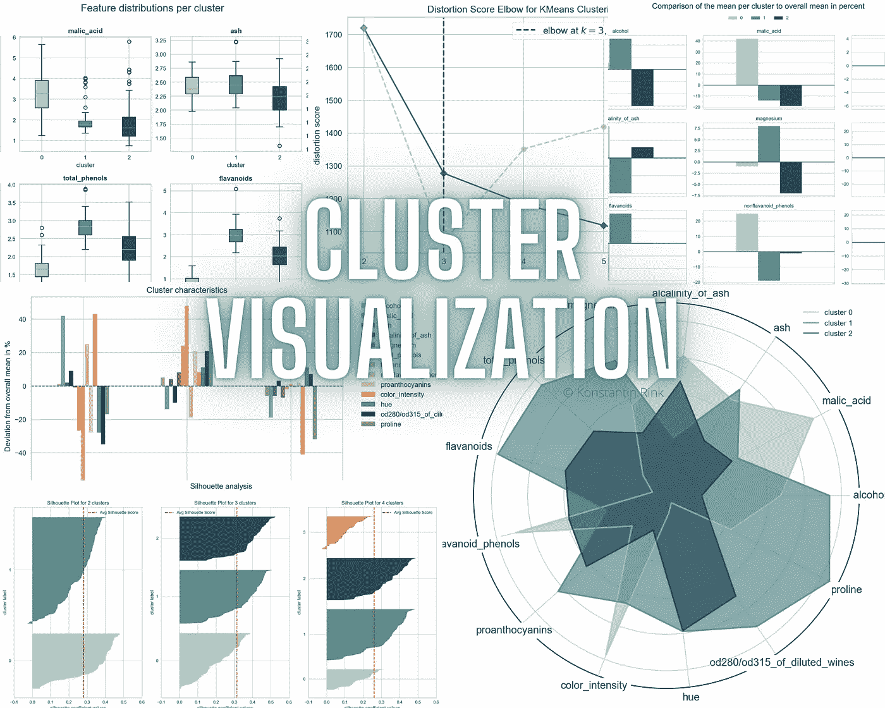

图片由[作者](https://konstantin-rink.medium.com/)提供。

C 聚类是数据科学中最流行的技术之一。与其他技术相比，它非常容易理解和应用。**然而**，由于聚类是一种无监督的方法，因此**对你来说**识别对你的商业客户来说**可理解**的不同聚类**是一个挑战**。

# 目标

本文为您的下一个集群项目提供了**可视化最佳实践**。您将学习**最佳实践**用于**分析**和**诊断**您的**聚类输出**、**正确可视化您的聚类**和 **PaCMAP** 降维，以及**呈现**您的**聚类的特征**。每个可视化都带有它的**代码片段**。你可以把这篇文章作为参考指南。

> 因为我的上一篇关于集群的文章已经涵盖了一些技术细节和解释，所以我将在这里保持简短的解释。

# 聚类选择和诊断

让我们从头开始。在您分析任何聚类特征之前，您必须**准备您的数据**并选择适当的聚类算法。为了简单起见，我们将使用众所周知的[葡萄酒数据集](https://archive.ics.uci.edu/ml/datasets/Wine)并使用 K 均值模型。然而，本文中展示的大多数可视化可以用于任何聚类算法。

上面的代码加载葡萄酒数据集，并使用**标准缩放器**来缩放整个数据集。

为了确保我们的集群以后的可视化总是使用正确和相同的颜色，我们定义了一个由六种不同颜色组成的列表**(图 1)。**

****

**图一。定义的聚类颜色。图片由[作者](https://konstantin-rink.medium.com/)提供。**

## **确定 k 个簇的正确数量**

**有几种方法可以确定(直观地)正确的聚类数。在下文中，我们将使用**肘图**方法、**(平均)轮廓评分**方法和**轮廓分析**。**

## **肘法**

**为了得到一个全面和适当的肘图可视化，我推荐使用 [**黄砖**](https://pypi.org/project/yellowbrick/) 包`pip install yellowbrick`。下面的代码将产生如图 2 所示的图形。**

**输出还画出了一个**建议**(虚线)，您应该选择哪个 k。如果它不能确定一个正确的数字，它将显示一个警告。**

**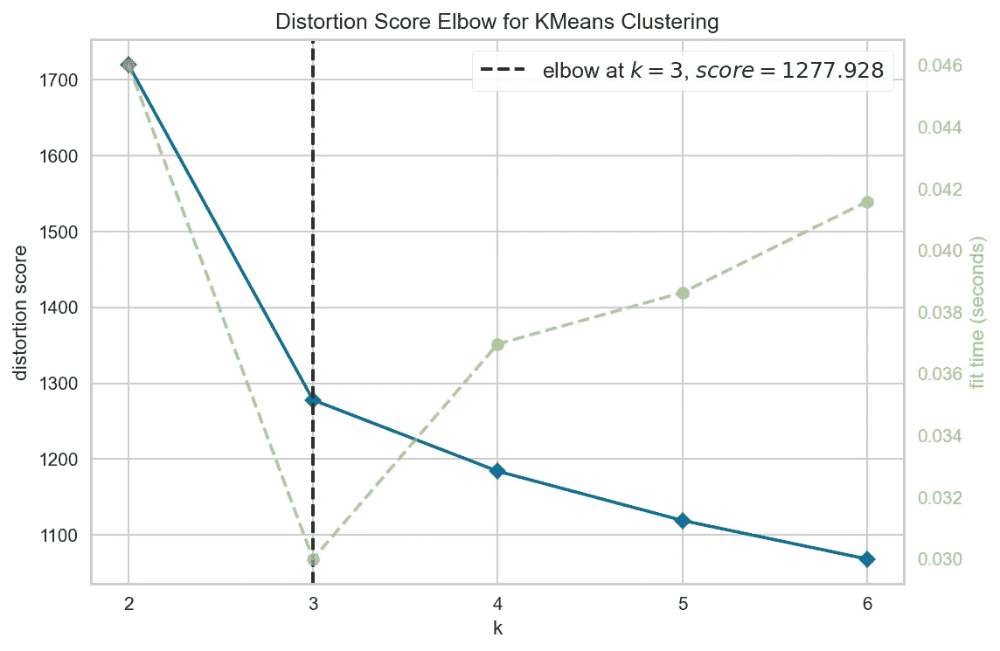**

**图二。肘图。图片作者[作者](https://konstantin-rink.medium.com/)。**

## ****剪影评分****

**另一种确定聚类数量的方法是**轮廓评分法**。下面的代码绘制了图 3 中的输出。**

**导出的结果(3)与肘图法的结果相同。**

**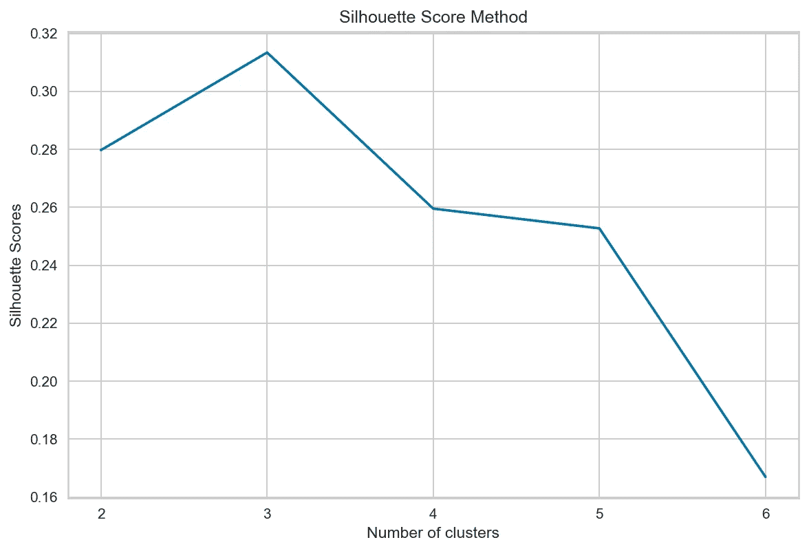**

**图 3。轮廓评分法结果。图片由[作者](https://konstantin-rink.medium.com/)提供。**

## ****剪影分析****

**最后但同样重要的是，我们可以使用**剪影分析方法**来确定最佳聚类数。这个想法和方法在这篇 sklearn [文章](https://scikit-learn.org/stable/auto_examples/cluster/plot_kmeans_silhouette_analysis.html)中有很好的解释。**

**上述文章中提供的代码绘制了**每行一个轮廓图**。然而，当你有大量的集群并且想要比较它们的相关轮廓图时，这可能是非常不清楚的。所以我写了下面的代码让**每行绘制三个图表**，让后面的对比(图 4) **清晰很多**。**

**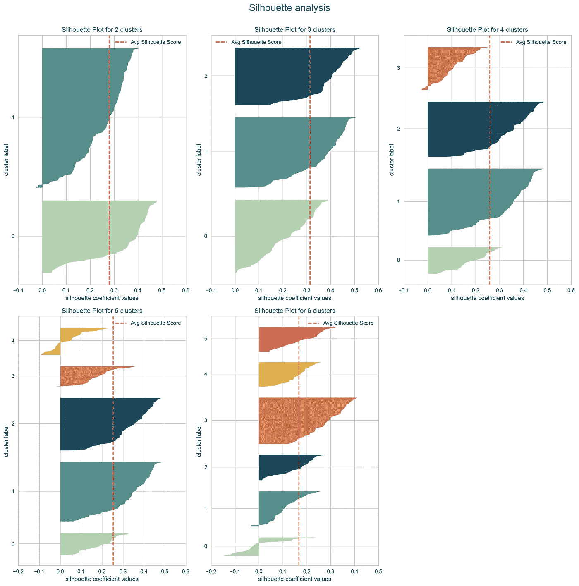**

**图 4。剪影分析。图片由[作者](https://konstantin-rink.medium.com/)提供。**

**在尝试了几种直观地确定 k 个集群的正确数量的方法之后，我们决定继续使用 k=3 来构建我们的集群。**

## **集群诊断**

**下一步是**根据它们的**大小**和**基数**来诊断**我们的集群。**

> **如果你不熟悉这些术语，可以看看我的[文章](/common-mistakes-in-cluster-analysis-and-how-to-avoid-them-eb960116d773)。**

**为了创建下面的图(图 5)，我们将使用[**data-science-utils**](https://pypi.org/project/data-science-utils/)包，它可以和`pip install data-science-utils`一起安装。**

**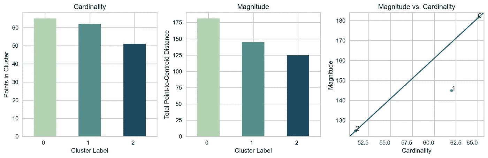**

**图 5。集群基数和数量级。图片由[作者](https://konstantin-rink.medium.com/)提供。**

# **集群可视化**

**为了在 2D 空间中可视化我们的集群，我们需要使用**降维技术**。许多文章和教科书都使用 PCA。最近的博客文章也推荐像 t-SNE 或 UMAP 这样的方法。然而，这里有**陷阱和误解**。**

****长话短说**:使用这些降维方法时，需要在保留局部结构和保留全局结构之间进行权衡。虽然 **PCA 保留全局结构，但是**它不保留邻域或局部结构。另一方面， **t-SNE 和 UMAP 保留了局部结构**而不是全局结构。**

**然而，有一种相对较新的技术声称**保留局部和全局结构** : **PaCMAP** 。**

**PCA 和 PaCMAP 将在下文中用于在 2D 空间中可视化我们的聚类。**

> **如果你想了解更多关于不同特征和 PaCMAP 的信息，请查看[为什么你不应该依赖 t-SNE、UMAP 或 Mathias Gruber 的 TriMAP](/why-you-should-not-rely-on-t-sne-umap-or-trimap-f8f5dc333e59) 。**

**运行代码后，您应该会得到下面的图(图 6):**

**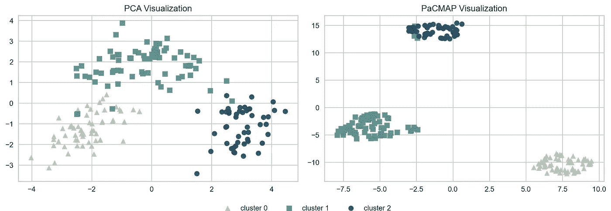**

**图 6。使用 PCA(左)和 PaCMAP(右)进行聚类可视化。图片由[作者](https://konstantin-rink.medium.com/)提供。**

# **集群特征**

**现在让我们把重点放在如何**形象化**和**呈现**每个集群的**关键特征**上，这样一个商务人士就可以很容易地理解每个集群代表什么。**

**在此之前，我们必须用一个*集群*列来丰富我们的标准化(X_std)和非标准化(X)数据。**

## **箱线图**

**第一种非常简单的方法是为每个特征生成一个箱线图**，以显示**在每个聚类**中的分布。****

**为了绘制下面的结果(图 7)，我们使用了**非标准化数据 X** 。使用标准化结果(X_std)会使**更难为商业用户解释**，因为其比例和单位已经改变。**

**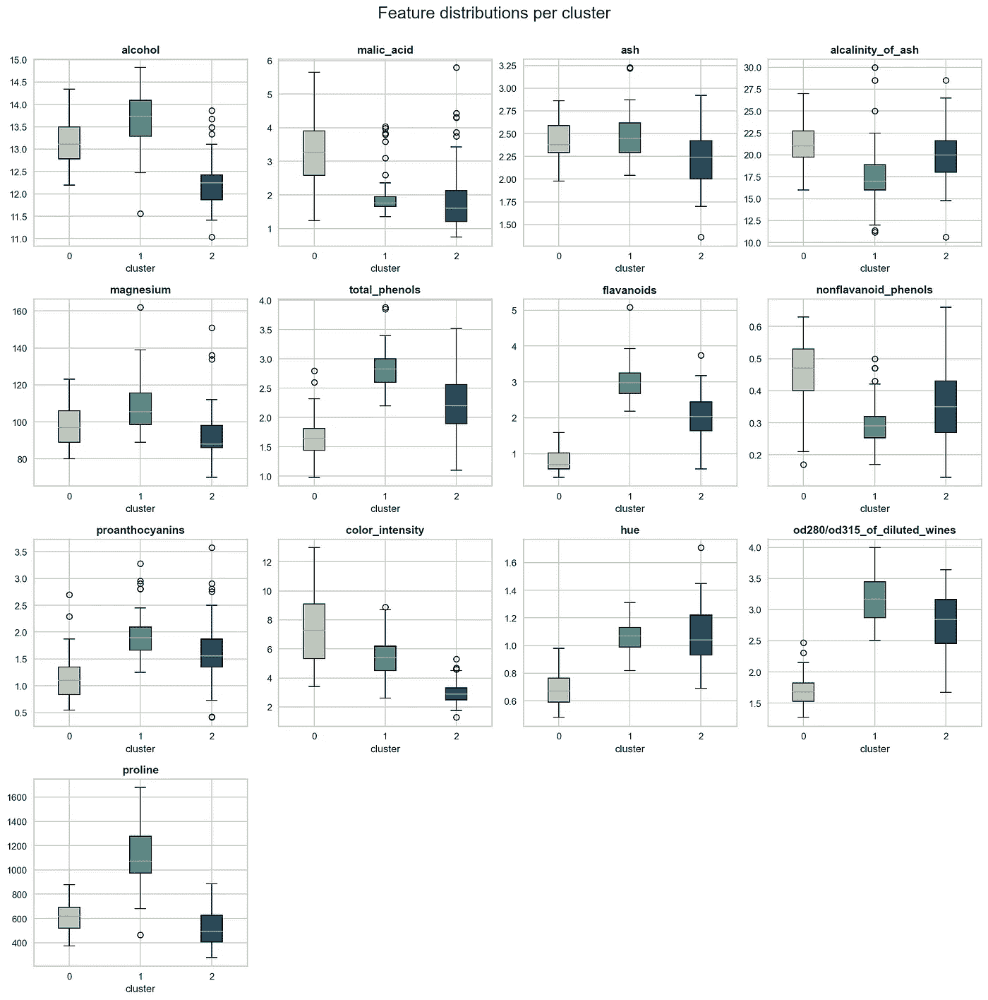**

**图 7。用箱线图可视化聚类结果。图片由[作者](https://konstantin-rink.medium.com/)提供。**

## **数据准备**

**在我们继续之前，我们必须为下面的可视化准备数据。下面的代码帮助我们更好地比较我们的集群。**

**首先，我们计算每个聚类的每个特征的平均值 ( *X_mean* ， *X_std_mean* )，这与上面的箱线图非常相似。**

**其次，我们计算每个聚类的每个特征的相对差异(以百分比计)**与每个特征的总体平均值**(聚类无关)**(*X _ dev _ rel*， *X_std_dev_rel* )。这有助于读者看到**每个聚类中的差异与每个特征的总体平均值相比**有多大。****

****图 8 举例说明了在准备步骤之后我们的数据是什么样子的。****

****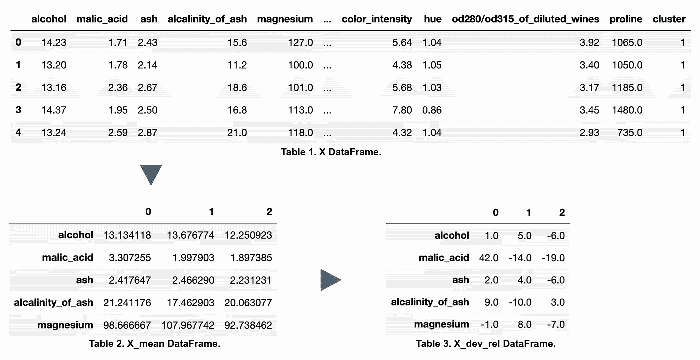****

****图 8。每个数据准备步骤的结果。图片由[作者](https://konstantin-rink.medium.com/)提供。****

****现在我们已经有了正确的数据，我们可以继续我们的可视化。****

## ****条形图****

****为了可视化相对差异，我们可以使用柱状图。以下代码绘制了每个要素的每个分类的差异。****

****结果如图 9 所示。****

****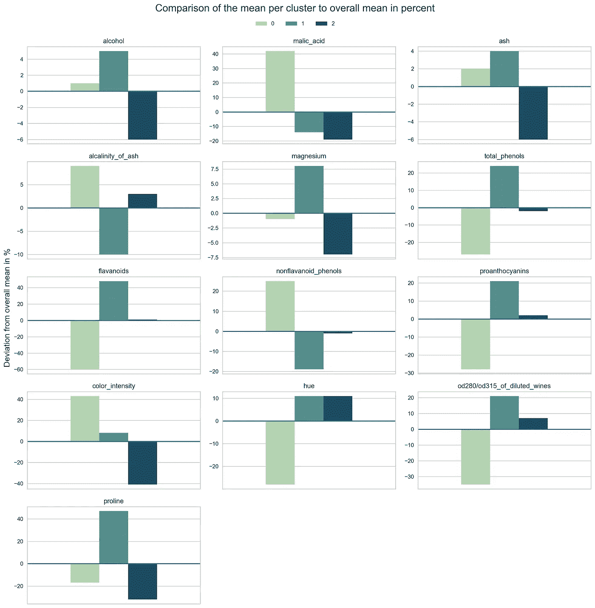****

****图 9。相对聚类差异用条形图显示。图片由[作者](https://konstantin-rink.medium.com/)提供。****

****如果你想展示每个星团的细节，上面的图很棒。然而，在许多情况下，在一个图表中总结所有相关结果和特征也是有意义的。下面的解决方案是做到这一点的一种方法。****

****我们在图 10 中直观地显示了每个特征相对于每个聚类的总体平均值的相对偏差。****

****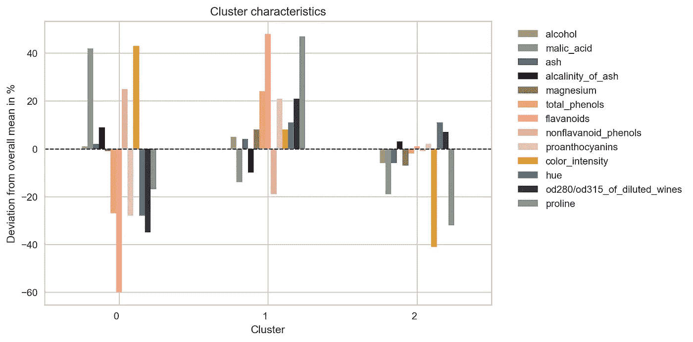****

****图 10。在一个条形图中总结集群特征。图片由[作者](https://konstantin-rink.medium.com/)提供。****

## ****雷达图****

******在一个图**中总结所有相关信息的另一种方式是使用**雷达图**。下面的代码绘制了标准化数据的计算平均值(X_std_mean)。****

****如果我们使用**非标准化版本**，不同的标度**会破坏可视化**(例如，脯氨酸的平均值远高于灰分的平均值)。因此，我建议用**相同的单位或至少在相似的数值范围**内绘制数值。最终结果如图 11 所示。****

****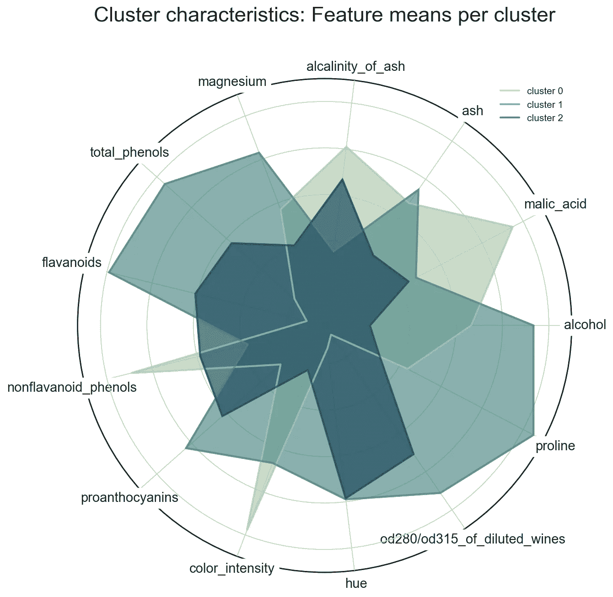****

****图 11。用雷达图可视化集群特征。图片由[作者](https://konstantin-rink.medium.com/)提供。****

# ****结论****

****本文的目标是为您提供集群诊断、可视化和解释方面的最佳实践。在 2D 空间中绘制聚类时，请考虑 PaCMAP。可以从不同的角度呈现聚类结果或特征。一种想法是显示每个聚类的每个特征的平均值。另一个选项是计算每个聚类的每个变量与每个特征的总体平均值的相对差异。向企业展示结果时，最好使用一个图表(例如，显示的雷达图或第二个条形图)。如果您想要调查每个聚类的每个要素的特征，可以使用多个图(例如，与 UX 设计师进行深入探讨)。****

# ****来源****

****[UCI 机器学习知识库:葡萄酒数据集](http://archive.ics.uci.edu/ml/datasets/Wine)。[知识共享署名 4.0 国际](https://creativecommons.org/licenses/by/4.0/legalcode) (CC BY 4.0)许可”。****

****王英凡，，辛西娅·鲁丁，亚龙·沙波什尼克，《理解降维工具如何工作:解读 t-SNE、UMAP、TriMAP 和 PaCMAP 用于数据可视化的实证方法》(2020)，【https://arxiv.org/abs/2012.04456】T4****