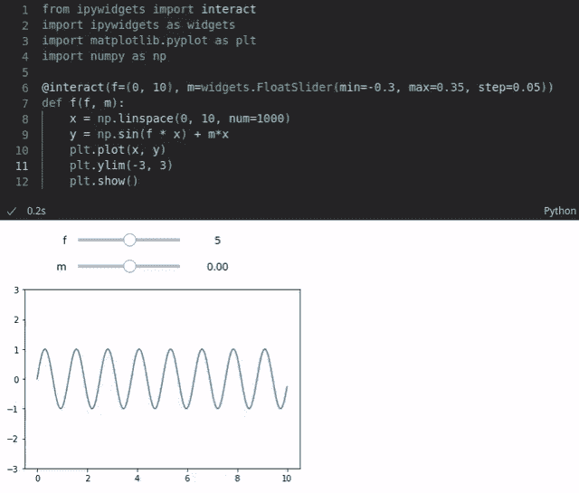
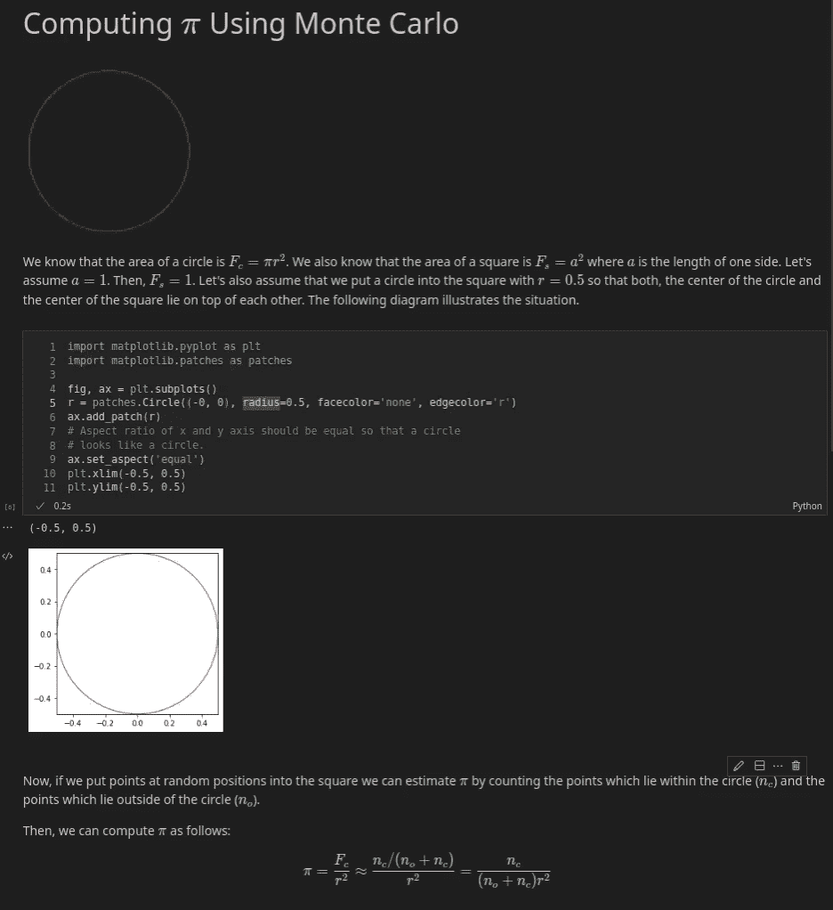
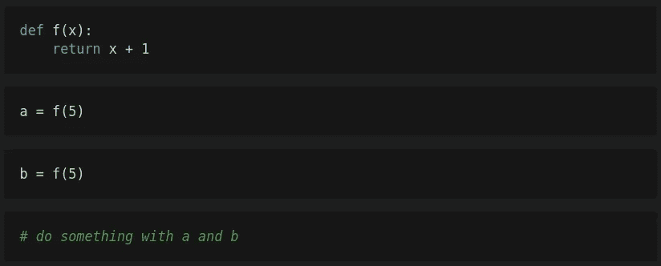

# 编写可复制和可维护的 Jupyter 笔记本的最佳实践

> 原文：<https://towardsdatascience.com/best-practices-for-writing-reproducible-and-maintainable-jupyter-notebooks-49fcc984ea68>

## 让您的 Jupyter 笔记本变得更棒的简单步骤

格伦·卡斯滕斯-彼得斯在 [Unsplash](https://unsplash.com/s/photos/notebook?utm_source=unsplash&utm_medium=referral&utm_content=creditCopyText) 上拍摄的照片

# 介绍

编写可复制、可维护、易于理解的 Jupyter 笔记本并不像您想象的那么容易。其实完全相反。其实真的很难。在本文中，我将解释为什么这么难，并为您提供一些帮助我实现更好的可再现性和可维护性的最佳实践建议。

# 什么是 Jupyter 笔记本

首先给大家简单介绍一下什么是木星笔记本。基本上，Jupyter 笔记本是一个交互式文档。您可以使用 [Markdown](https://daringfireball.net/projects/markdown/basics) 语法编写纯文本，也可以通过 LaTeX 语法使用数学公式。此外，您可以向笔记本添加代码，读者可以执行这些代码来产生一些输出，如可视化。

例如，您可以可视化一个基于各种参数的函数。读者可以使用滑块来更改这些参数的值，并且每次值更改时可视化都会更新(参见下面的示例)。您还可以添加代码，对一些数据库执行实时查询，以获取最新的销售数据，并将其绘制在饼图中。

交互式笔记本允许读者通过滑块改变参数。

代码通常是用 Python 编写的。但是支持 Java、R、Julia、Scala 等 100 多种编程语言。笔记本可以在浏览器中编写和执行。然而，即使在浏览器中写笔记本是可能的(存在基本的代码完成)，它也是有限的。幸运的是，您还可以使用 ide，如 Visual Studio Code 或 PyCharm(在专业版中),它们提供了更强大的功能。

也可以使用云服务来编写和执行笔记本。例如，谷歌提供了一个解决方案，允许你在云端运行笔记本，并与每个人分享。甚至 GPU 也可以在 Google Colab 中免费访问，用于密集型计算任务。

# Jupyter 笔记本示例

下面你可以看到一个 Jupyter 笔记本的例子，它解释了如何用蒙特卡罗方法近似计算 *π* 。你可以看到三个细胞。第一个单元格是减价单元格，它给出了笔记本的介绍。它包含文本、动画和一些简单的数学方程式，通过 [MathJax](http://docs.mathjax.org/en/latest/) 渲染。

第二个单元格是包含 Python 代码的代码单元格。如果执行这个单元格，代码会生成一个简单的正方形内的圆的绘图。

第三个单元格也是一个 Markdown 单元格，当执行该单元格时，它在编辑模式和呈现结果之间跳转。在编辑模式下，你可以看到简单的降价文本。

Jupyter 笔记本，带有代码和用蒙特卡罗逼近圆周率的减价单元格

# Jupyter 笔记本已经变得流行

Jupyter 笔记本已经非常受欢迎。2020 年 10 月，GitHub 上大约有[1000 万台公共笔记本](https://blog.jetbrains.com/datalore/2020/12/17/we-downloaded-10-000-000-jupyter-notebooks-from-github-this-is-what-we-learned/)。出于教育目的，笔记本在学术界尤其流行。此外，数据科学家大量使用笔记本电脑进行数据分析和探索性任务。

尤其是文本和代码的结合使它们非常有趣。它允许作者用表达性公式解释 Markdown 中的概念，同时可以在同一文档中以代码的形式显示实现。Jupyter 笔记本电脑的这一独特特性可以更好地再现研究成果和传播教育内容。

# 朱庇特笔记本批评

尽管 Jupyter 笔记本很受欢迎，但它一直受到批评(例如[我不喜欢笔记本](https://conferences.oreilly.com/jupyter/jup-ny/public/schedule/detail/68282.html))，因为你编写代码的方式可能会导致坏习惯。以下是一些例子:

**笔记本命名**

有时可以观察到的一个反模式是笔记本没有表达性的名称。相反，笔记本的名字有时以“无标题”开头或以“-Copy”结尾。这是由于浏览器中运行的 Jupyter 的默认行为。每次创建新笔记本时，都会创建一个无标题笔记本；每次创建现有笔记本的副本时，新笔记本都会带有后缀“-Copy”。

如果这是 Jupyter 的默认行为，您可能会认为许多笔记本名称都有这种反模式的问题。但令人惊讶的是，正如一项研究[1]所发现的，该研究分析的笔记本(从 GitHub 下载的笔记本子集)中，只有不到 2%的笔记本实际上有“无标题”，只有不到 0.7%的笔记本名称中有“-Copy”。所以这似乎不是什么大问题。

然而，同一项研究还发现，几乎 30%的受检笔记本的名称中含有 POSIX 完全可移植文件名指南不推荐的字符，该指南只允许使用字符[A-Za-z0–9。-_].具有不可移植文件名的笔记本可能会在某些系统上造成问题，因此应该避免使用。

**不明确的执行顺序**

Jupyter 笔记本中的单元格可以任意顺序执行。不必从第一个单元格开始，到最后一个单元格结束。您也可以从第二个单元格开始，跳回第一个单元格，然后执行第三个单元格。您也可以连续多次执行单元格。

这也是编写笔记本时的一种常见行为，因为通常你在一个单元中编写一些代码，执行该单元，然后一次又一次地修改和执行该单元，直到你对该单元的结果满意为止。有时，您还需要返回到以前执行的单元来重新初始化变量，或者因为您需要修改以前定义的函数。

因此，有时很难遵循执行顺序，这可能会对笔记本的再现性产生负面影响。

在之前引用的研究[1]中，发现模糊的执行顺序是许多笔记本的一个问题。14%的分析笔记本存在此问题。

让我们来看一个相关的例子，它演示了一个额外的问题。在下面你可以看到 4 个细胞。

首先，执行第一个单元格，这样就定义了函数 f。然后执行第二个单元格，之后变量`a`的值为 6。接下来，您正在编辑第三个单元格，但是决定稍微修改函数`f`的代码。函数应该将变量`x`增加 2，而不是将变量`x`增加 1。更改函数后，再次执行第一个单元格以使更改生效，然后执行第三个单元格。变量`b`将得到值 7。以下单元格正在处理这两个变量。

如果您与其他人共享此笔记本，这些人将无法复制您的结果，因为他们只能看到将变量`x`增加 2 的`f`版本。如果这些人一步一步地执行笔记本，变量`a`和`b`的值将分别为 7，而不是 6 和 7。

**缺少模块化**

在[1]中发现

*   只有 10%的分析笔记本有本地导入(即存储在存储库目录中的模块的导入)
*   54%的笔记本定义了功能
*   不到 9%的笔记本定义了类别

这些结果表明，模块化并不经常用于 Jupyter 笔记本电脑。这很有趣，因为模块化在软件工程中是一种成熟的模式，有很多好处。它有助于

*   减少代码(例如，减少复制和粘贴)
*   将复杂的代码分割成更容易理解的小块
*   编写更容易测试的代码
*   减少笔记本中全局变量的数量，这样可以降低内存使用量(局部变量更容易被释放，因为它们只存在于局部范围内)

然而，不使用模块化有很多原因。例如，没有功能的笔记本可能足够简单，因此不需要这种抽象。笔记本也可能不使用模块，因为作者想简化笔记本的发行。如果只需要分发一个文件，而不是多个文件(如果代码被移动到模块中，就会出现这种情况),这就更容易了。

**遗漏测试**

在软件工程中，测试是一种常见的实践。存在各种测试策略，例如集成测试、回归测试或单元测试。你可以在维基百科上找到关于不同方法的很好的概述。例如，单元测试是自动测试，它测试软件的小部分，通常是单个功能。

有各种框架可以用来编写单元测试。对于 Python 来说，模块 [unittest](https://docs.python.org/3/library/unittest.html) 已经被很好地建立并且易于使用。根据[1],只有少数笔记本电脑(不到 2%)导入了众所周知的测试模块，这可能是测试未被广泛使用的一个指标。

尽管没有测试通常是软件工程中的反模式，但对于大多数笔记本电脑来说，这可能是合理的。许多笔记本用于数据分析和探索，以检验假设，或用于教学目的，以演示一些东西。为这些应用程序编写测试通常没有多大意义，因为在分析和探索任务的情况下缺少基本事实，或者因为演示产生了预期的结果。

**缺少依赖关系**

Jupyter 笔记本通常依赖于各种库和包。在 Python 中，这些依赖关系是通过关键字`import`导入的。没有为导入指定版本，因此，不可能通过查看导入来识别包的所需版本。但是，如果依赖项的版本没有记录在其他地方，并且没有简单的方法来安装所有必需的依赖项，人们可能会在执行笔记本时遇到问题，因为他们可能无法设置运行笔记本所需的环境。

此外，依赖项不需要在笔记本的开头导入。相反，依赖项可以被导入到任何地方。因此，仅仅通过查看笔记本的开头可能很难确定所有需要的依赖项。相反，您必须扫描完整的代码。

最后，导入的名称可能不同于需要安装的包的名称。例如，为了解析 YAML 文件，PyYAML 被广泛使用。这个包可以通过`pip install pyyaml`安装。然而，要使用这个包，您必须导入`yaml`。

根据[1]，许多笔记本没有声明模块依赖关系。

**数据不可访问**

许多笔记本电脑都需要数据才能工作。例如，关于机器学习的笔记本通常需要一个用于训练的数据集。验证集用于确定模型对未知数据的性能。如果这些数据没有随笔记本一起分发并且不存在，笔记本的结果就不能被复制。

根据[1],数据的不可访问性是执行笔记本时出现错误的一个常见原因，已经确定了两个主要原因。要么数据根本不存在，要么在数据随笔记本分发的情况下，使用绝对路径来访问数据。

**再现性有限**

Jupyter 笔记本的一个基本理念是让结果具有可重复性。这个想法是笔记本在科学界如此受欢迎的原因之一。在这里，可再现性很重要，因为越容易再现结果，结果就越有可能产生新的见解，因为其他人可以重用和构建您的工作。

然而，根据[1]的说法，GitHub 上的许多分析笔记本无法重现。结果显示，只有 22%到 26%的笔记本可以成功执行，甚至只有 4.9%到 15%的笔记本产生相同的结果。

我们已经讨论过不可复制笔记本的三个基本原因:

*   缺少依赖项
*   无序执行(以及由此产生的隐藏状态)
*   数据不可访问性

# 最佳实践

为了确保笔记本易于理解、维护和重复使用，并进一步增加笔记本结果重现的可能性，以下建议可能非常有用:

*   为您的笔记本使用表达性的名称来描述您的笔记本正在做什么，并且只使用 POSIX 完全可移植文件名指南中包含的字符。
*   避免不明确的执行命令。为了确保您的笔记本可重现并创建预期的结果，请在共享笔记本之前重新启动内核并执行笔记本的所有单元。
*   如果合理，使用模块化(即模块、函数、类)。
*   如果合理，使用测试框架来测试你的代码。
*   确保笔记本中使用的所有数据都与笔记本一起分发(或者至少可以下载)，并且使用相对路径来访问数据。
*   创建 requirements.txt 来固定所有使用的依赖项的版本，并在笔记本的开头导入所有依赖项。
*   分发笔记本及其输出。这使得重现结果更加容易，因为每个执行笔记本的人都可以验证结果是相同的。
*   不要重新定义变量。

# 结论

Jupyter 笔记本很容易写，但各种研究表明，似乎很难写出可复制的笔记本。但是，如果您遵循一些常见的最佳实践，您的笔记本确实更有可能被复制，并且其他人可以在您的伟大工作的基础上进行构建。这些最佳实践也帮助我写出了好的笔记本。在我看来，最重要的是避免模糊的执行顺序，提供一个使用过的依赖项及其版本的列表，并使笔记本中使用的数据易于访问。

# 参考

[1] Pimentel，joo feli PE 等人，“了解和提高 Jupyter 笔记本的质量和再现性。”实证软件工程 26.4(2021):1–55。