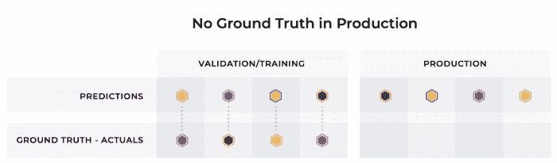

# 客户终身价值(LTV)模型的 ML 可观察性的最佳实践

> 原文：<https://towardsdatascience.com/best-practices-in-ml-observability-for-customer-lifetime-value-ltv-models-c5a2fc063f4c>

图片作者([艾瑞泽艾](https://arize.com/))

# 客户终身价值(LTV)模型的 ML 可观察性的最佳实践

## 提高 LTV 模型生产性能的技巧

古老的谚语仍然适用:客户永远是正确的，但有些人比其他人更正确(这是谚语，对不对？).虽然在任何组织中有许多指标可以评估客户的价值，但在评估公司整体销售活动的健康程度时，**客户终身价值(LTV)** 是一个需要考虑的重要指标。特别是在像包装消费品或零售这样的行业中，客户与企业的关系本质上是非契约性的，找到一种预测未来购买行为的方法对于提高组织的整体盈利能力至关重要。

客户终身价值就是客户在整个生命周期内与企业进行的交易或购买的总货币价值。这是对客户对公司价值的一种衡量，不仅仅是基于单次购买，而是在整个关系中。

简史:LTV 计算在 20 世纪 80 年代由沃顿商学院的 Peter Fader 博士首先创建，在 21 世纪初普及，并被翻译成机器学习模型，方便地打包到开源库**。*由于 LTV 是基于预测来评估参与模式的，因此使用 ML 是一个自然的选择。*

*LTV 模型被广泛应用于各种规模的行业来评估客户的预期价值。像任何估计一样，预测可能会出错。了解这些预测如何与现实世界结合以微调您的模型来获得最佳性能至关重要。*

# *事实真相:数学形式的 LTV*

*LTV =((平均销售✕购买频率)/流失率))✕利润率*

1.  *平均销售额=(总销售额)/(订单总数)*
2.  *购买频率=(订单总数)/(唯一客户总数)*
3.  *流失= 1 -保留率*
4.  *利润率=基于业务环境*

# *LTV 的意义*

*从提高整体业务盈利能力到预测创业收入，LTV 的主要应用围绕规划和预算。*

*根据 Criteo 的一项调查，81%的营销人员说监控 LTV 可以促进销售。在*营销度量*一书中提到，卖给新的潜在客户的概率是 5%–20%，而卖给现有客户的几率是 60%–70%。因此，通过预测 LTV，你可以让你的团队了解如何获得新客户并留住现有客户，同时保持可观的利润率。更具体地说，LTV 可以帮助组织:*

*   *定义营销目标*
*   *了解参与的正确渠道*
*   *计划支出以降低采购成本，并保持较高的保留率*
*   *寻找具有相似特质的顾客*
*   *获得客户反馈*
*   *提升客户忠诚度*

*如果使用得当，LTV 模型可以在商业中发挥重要作用。由于 LTV 模型的预测有助于构建和定义业务范围内的目标，因此对这些模型进行监控和故障排除以确保它们在生产中发挥最佳性能至关重要。*

# *监控 LTV 模型的挑战*

*那么，什么会出错呢？LTV 的主要关注点是寻找、培养和留住在一段不确定的时间内创造最大价值的客户:消费者的生命周期。因此，LTV 模型必须迭代并快速估计长期价值，而实际数据却明显滞后或根本没有。*

**

*图片来源: [ML 监测与可观测性](https://arize.com/resource/ebook-machine-learning-observability-101/)电子书，艾瑞泽 AI*

*在生产中监控模型时，设置适当的基线对于测量漂移和检测生产中模型行为的偏差是必不可少的。通常，使用训练或验证数据来设置基线，以测量不同环境中特征值分布、模型预测和基本事实的变化。如果没有有效的监控和可观察性工具来评估延迟地面实况场景情况下的代理指标，解决 LTV 模型在生产中的性能下降问题可能会被证明是昂贵且耗时的。*

# *如何对 LTV 模型使用监控和可观测性*

*根据前面提到的 Criteo 调查，采用 LTV 的最大障碍之一是它太复杂，难以监控。虽然这是历史上的情况，但实现 ML 可观测性可以显著地消除这一困难。*

*监控 LTV 模型的一个主要挑战是发现代理指标来代替延迟的实际值。LTV 模型通常在相当长的时间内评估客户的价值，因此将基础数据映射到模型的预测可能是一个挑战(在下面的部分中有更多关于代理指标的信息)。*

*为了让从业者在生产中轻松部署和改进他们的 LTV 模型性能，他们的 [ML 可观测性平台](https://arize.com/resource/arize-platform-demo/)应该:*

1.  *设置基线监视器*
2.  *评估特征、模型和实际/地面真实漂移*
3.  *衡量模型性能*

## *监控 LTV 模型*

*积极改进 LTV 模型的第一步是在生产中监控您的模型。那么，监督意味着什么呢？一个[有效的 ML 监控平台](https://arize.com/resource/machine-learning-observability-checklist/)应该*自动*配置最适合您的数据的监控器，以主动检测漂移、数据质量和性能问题。手动设置阈值和创建监视器的日子已经一去不复返了。*

## *通过特征和模型漂移验证模型性能下降*

*为了了解您的 LTV 模型的性能下降，监控功能和[模型漂移](https://arize.com/model-drift/)是有益的。这意味着在各种环境和版本之间分析您的模型，以识别 LTV 模式和异常分布行为。通过利用覆盖了您选择的指标的随时间漂移小部件，[模型性能管理](https://arize.com/blog/monitor-your-model-in-production/)变得更加高效和可行。虽然 LTV 模型的主要问题之一是延迟或没有真实数据，但您可以使用漂移作为代理指标来分析您的模型的相对表现。*

## *要测量的漂移类型:*

1.  ***特性漂移**:输入数据固有的变化(这是游戏的名字)。监控您的要素，以快速了解您的输入是否明显偏离您的模型的训练内容，以及您是否需要重新训练或构建新模型。*
2.  ***模型漂移**:测量您的模型的输出是否如生产中预期的那样执行。根据以下因素发现您的模型是否有偏差:*

*   *培训/验证环境*
*   *历史生产时期*
*   *滚动生产窗口*

## *揭示不准确预测的根本原因*

*假设你的 LTV 模型漂移了。您的监控解决方案触发了警报，现在由您来找出问题所在。下一步是什么？您将希望快速找到问题的根本原因来解决问题，通常是通过重新训练模型并将其与生产中的现有模型进行比较。*

*这可以通过 ML observability 来实现，ML observability 可以使用性能热图进行更深入的分析，以便更好地了解和直观地了解从哪里开始对与您的 LTV 模型相关的问题进行故障排除。对于最简单的工作流程， [ML observability](https://arize.com/ml-observability/) 允许您使用特征/值组合深入研究低性能切片，以便了解如何改进您的模型。*

## *模型性能*

*即使您对生产中的模型有最大的信心，积极地改进您的模型并监控模型性能有助于整体业务成果。*

*在 LTV 案例中，我们基于几个关键指标评估模型性能:*

1.  *[**【均方根误差】(RMSE)**](https://arize.com/glossary/root-mean-square-error-rmse/) **:** 模型预测值与实际值之差的平方根，经过平方并在整个数据集中取平均值。这种方法对重大错误给予更高的权重，因此，在企业可能希望严重惩罚大错误或异常值的情况下，这种方法可能会有所帮助。*
2.  *[**平均绝对百分比误差(MAPE)**](https://arize.com/glossary/mean-absolute-percentage-error/) **:** 衡量一个模型产生的误差的平均大小；MAPE 是 LTV 模型预测准确性的一个更常见的度量标准。*
3.  *[**平均绝对误差(MAE)**](https://arize.com/glossary/mean-absolute-error/) **:** 模型预测值与实际值之间的绝对值差，在整个数据集内取平均值。对模型性能的“第一印象”,因为它没有被一些预测的极端误差所扭曲。*

*当选择要测量的性能指标时，使用哪个指标没有统一的答案；它依赖于您的模型和它吸收的数据。一旦您决定了您的性能指标，每天或每周跟踪您的模型性能指标允许您确保性能不会从模型训练时或模型最初被提升到生产时急剧下降。ML 可观察性帮助您跟踪这些重要的指标，如果出现问题就触发警报，并通过自省来发现潜在的问题。*

***结论***

*通过发现漂移、了解模型性能并轻松识别潜在生产问题的根本原因，ML 工程师可以满怀信心地运输他们的 LTV 模型，并改善整体业务成果。虽然监控和观察生产模型似乎并不简单(剧透警告:事实并非如此),并且可能成为运输模型的障碍(确实如此), [MLOps 工具链](https://arize.com/blog/the-only-3-ml-tools-you-need/)中的解决方案可以简化[模型监控](https://arize.com/model-monitoring/)和故障排除。实现最大似然可观测性有助于确保 LTV 模型的预测通过自动监视器保持最佳状态，监视特征和模型漂移，并随时间可视化模型性能。作为额外参考，以下是 ML 可观察性平台如何帮助客户处理[客户终身价值模型监控](https://docs.arize.com/arize/resources/use-cases/customer-lifetime-value)和可观察性。*

# *联系我们*

*如果这篇博客引起了你的注意，并且你渴望了解更多关于[机器学习可观察性](https://arize.com/ml-observability/)和[模型监控](https://arize.com/model-monitoring/)，请查看我们的其他[博客](https://arize.com/blog/)和关于 [ML 监控](https://arize.com/ml-observability/)的资源！如果您有兴趣加入一个有趣的 rockstar 工程团队，帮助模型成功生产，请随时[联系](https://arize.com/contact/)我们，并在此处[找到我们的空缺职位](https://arize.com/careers/)！*