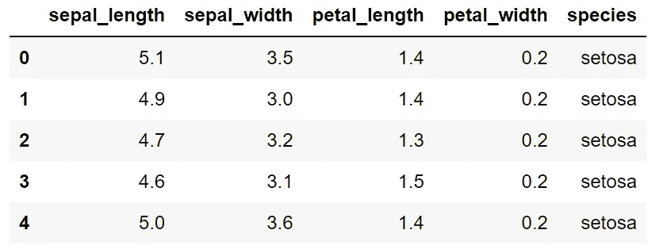
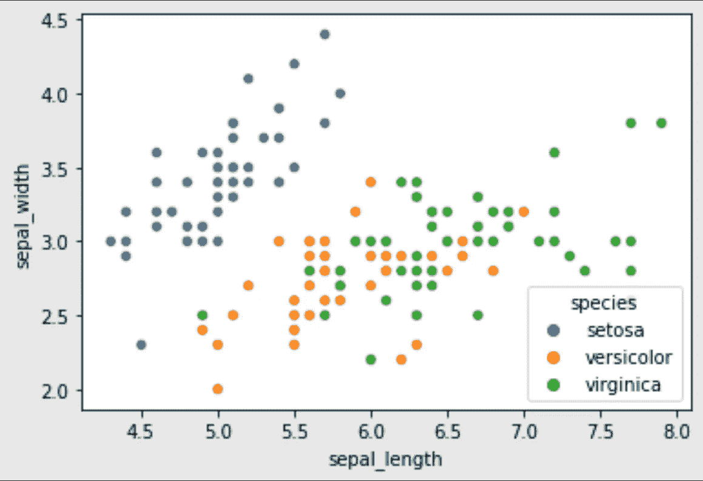
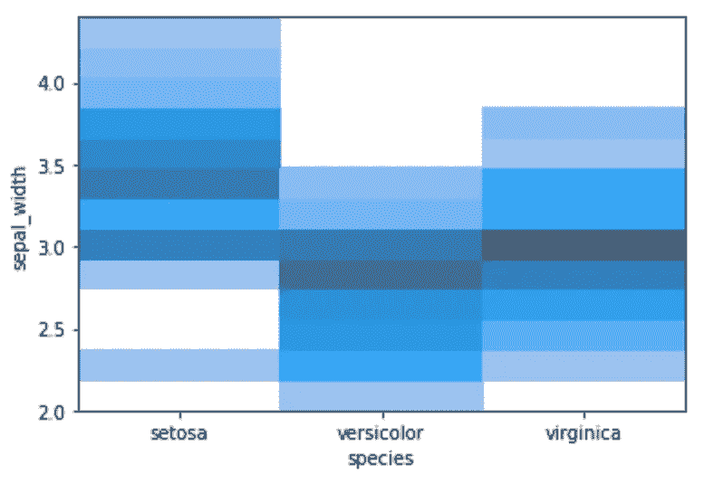
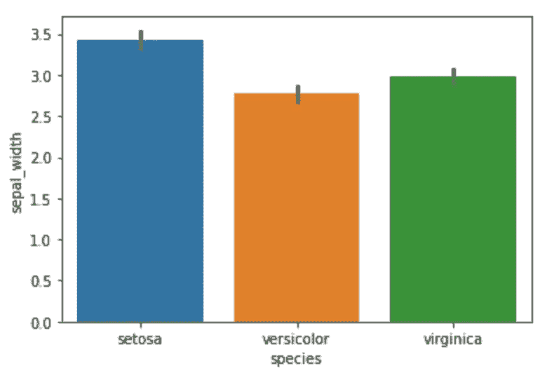
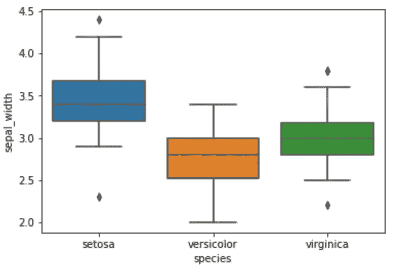
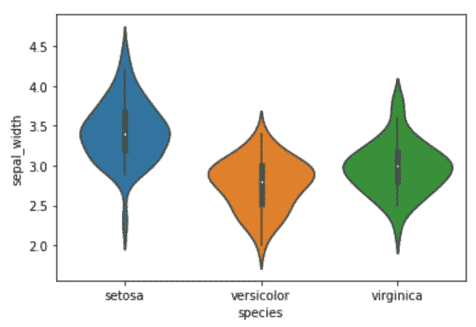
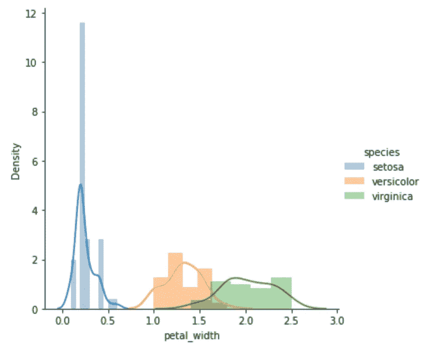
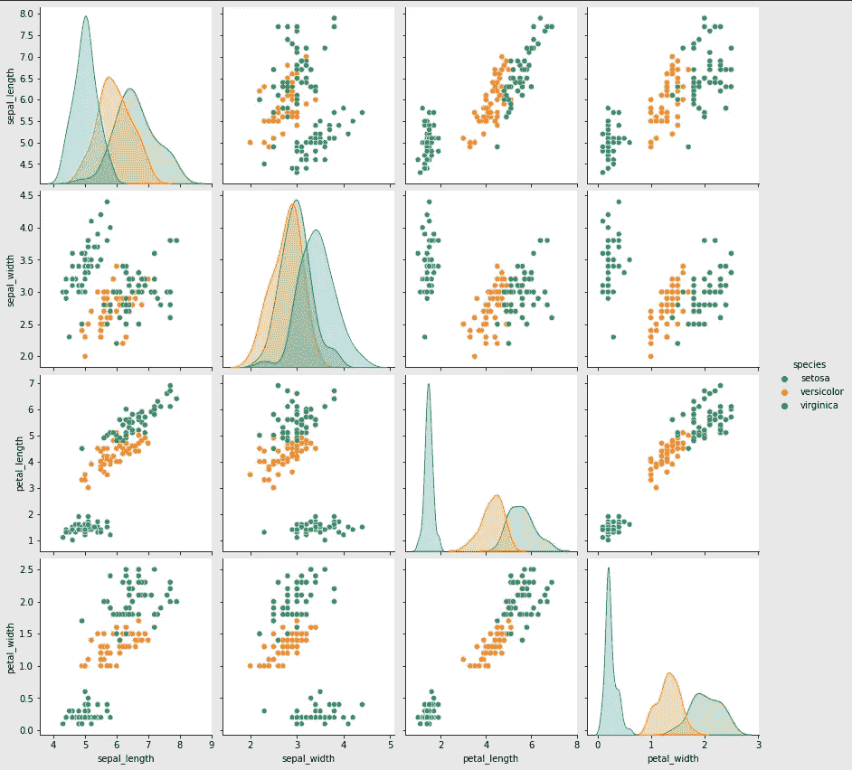
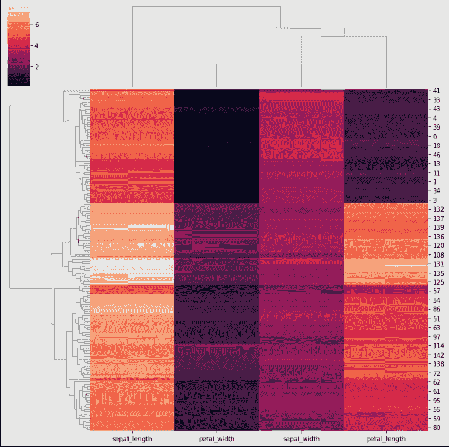
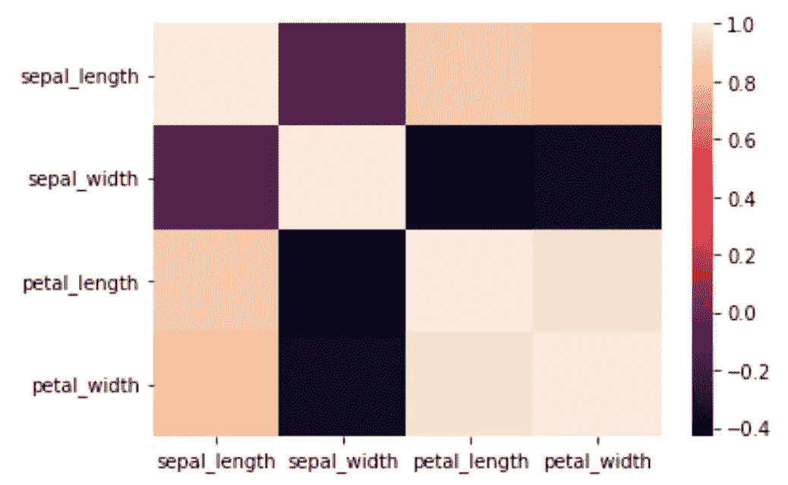

# 数据科学最佳 Seaborn 可视化

> 原文：<https://towardsdatascience.com/best-seaborn-visualizations-for-data-science-3d866f99c3a9>

## 使用 Seaborn 库探索数据科学项目的一些最佳可视化选项


汤姆·温克尔斯在 [Unsplash](https://unsplash.com?utm_source=medium&utm_medium=referral) 上的照片

任何人工智能或数据科学相关任务的最重要组成部分是 ***数据*** 。然而，如何理解如何有效地利用原始状态的数据呢？

查看数据和浏览一些次要细节可能并不总是足以准确地计算出解决方案。因此，我们需要可视化技术。

可视化在破译数据模式方面发挥着至关重要的作用，并帮助我们分析最有效的机器学习或深度学习方法，数据科学爱好者可以使用这些方法来获得高质量的结果。这些是探索性数据分析(EDA)计算理想解决方案时要遵循的最重要的步骤之一。

在我们开始这篇关于 seaborn 的文章之前，我建议从下面提供的链接中查看我以前的一篇关于 matplotlib 可视化技术的文章。这应该是更熟悉不同类型的可视化的一个很好的起点。

</8-best-visualizations-to-consider-for-your-data-science-projects-b9ace21564a>  

# 数据科学的 9 个最佳 Seaborn 可视化:

在本文中，我们将重点关注 seaborn 库。我们将学习该库中可用的众多可视化技术，我们几乎可以在每个项目中使用这些技术。Seaborn 是一个基于 matplotlib 的 Python 数据可视化库。它提供了一个高层次的界面来绘制有吸引力的和信息丰富的统计图形。

Seaborn 的简单性有助于简化复杂的可视化，并有助于增加额外的美学吸引力。除了 seaborn 拥有的所有令人惊叹的特性之外，它还构建在 matplotlib 库之上。因此，利用这两个库的组合，我们可以产生更强大和更高效的可视化效果。然而，在本文中，我们将只关注 seaborn 库。

## 开始使用:

让我们通过导入 seaborn 库来快速入门。下面的代码片段显示了如何根据需要导入库。一旦导入完成，我们就可以进行进一步的计算和可视化。

```
# Import the seaborn library for visualizationimport seaborn as sns
```

关于 seaborn 库最好的部分是它提供了一组默认数据集，通过这些数据集，您可以开始训练和测试您的可视化技术。虽然有几个数据集选项，如行星，小费，泰坦尼克号等。，在许多其他项目中，我们将在这个项目中使用 iris 数据集。下面是在 seaborn 库中加载 iris 数据集的代码片段。

```
# Load the Iris datasetiris_data = sns.load_dataset("iris")
```

在 Iris 数据中，我们有三种花，即 setosa、versicolor 和 virginica。我们的任务是可视化许多参数，如萼片宽度，萼片高度，花瓣长度和花瓣宽度，这些都与每一个物种有关。使用这些与每个提到的物种相关的特性，我们将使用 seaborn 库中的一些最佳选项来相应地区分它们。下面是对我们的数据集的简要介绍。

```
iris_data[:5]
```



作者图片

## 1.散点图:

```
sns.scatterplot(x = "sepal_length", 
                y = "sepal_width", 
                data = iris_data, 
                hue = "species")
```



作者图片

开始可视化的最佳技术之一是对可用数据应用散点图。散点图为用户提供了一个极好的选项，让用户可以看到数据之间的区别。从上面的散点图中，我们可以注意到很容易将 setosa 与 versicolor 和 virginica 区分开来。然而，云芝和弗吉尼亚似乎有一些相似之处。

为了在 seaborn 库中定义散点图，我们可以直接提到 x 轴和 y 轴参数，我们需要为可视化计算这些参数。一旦我们选择了 x 轴和 y 轴属性，我们就可以提到数据集并指定色调，以便为可视化绘图启用颜色编码。

## 2.直方图:

```
sns.histplot(x = "species", y = "sepal_width", data = iris_data)
```



作者图片

从之前的散点图中，我们已经能够生成大量关于虹膜数据集的信息。我们还可以使用其他图表，如直方图，从而使用户能够直观地了解一些特征的可区分性。上图显示了基于萼片宽度的物种直方图。

在上面的代码片段中，我们将 seaborn 库中的 histplot 函数用于 iris 数据集，相应地提到了物种和萼片宽度。强烈建议用户使用其他特征参数来测量物种的多样性。

## 3.条形图:

```
sns.barplot(x = "species", y = "sepal_width", data = iris_data)
```



作者图片

类似于直方图，我们也可以使用 seaborn 库中的条形图函数和 iris 数据集绘制条形图，相应地提到物种和萼片宽度。上面的可视化表示了一个柱状图，显示了每一个提到的物种的萼片宽度更加丰富多彩和美观。

## 4.箱线图:

```
sns.boxplot(x = "species", y = "sepal_width", data = iris_data)
```



作者图片

与前两个图不同，我们将关注另外两个图，这两个图将为我们提供一个更具体和适当的范围，不同品种的花的参数落在这个范围内。首先，我们将查看 seaborn 库中的方框图，它将为用户提供每个物种的特定范围。

中值、百分位数和分位数的概念在这些绘制图表的方法中使用。箱形图的末端代表在四分位数范围内构建的晶须。通过提及 iris 数据集、物种和特定参数，可以在 seaborn 库中绘制箱线图。

## 5.小提琴情节:

```
sns.violinplot(x = "species", y = "sepal_width", data = iris_data)
```



作者图片

为了简化箱线图和中值范围的概念，我们可以使用小提琴图，通过它我们可以更直观地了解特定功能的工作范围。与箱线图类似，通过提及 iris 数据集、物种和特定参数，可以在 seaborn 库中绘制 violin 图。

## 6.带 Distplot 的面网格:

```
from warnings import filterwarnings
filterwarnings("ignore")sns.FacetGrid(iris_data, hue="species", height = 5).map(sns.distplot, "petal_width").add_legend()
```



作者图片

在下一个可视化中，我们可以利用分布图(dist。绘图)以了解 iris 数据集中的数据分布。分布图有助于我们直观地了解物种的概率密度，即 x 轴上每单位的概率。我们可以为以下内容绘制图表，如上面的代码片段所示。

## 7.配对图:

```
sns.pairplot(iris_data, hue="species", height=3)
```



作者图片

seaborn 中最重要的可视化技术之一，尤其是对于 iris 数据集这样的任务，是对图的利用。上图详细展示了众多特征的配对图，也许是理解虹膜数据集的最详细视图。配对图有助于描述和区分两个特定变量之间的最佳特征。

上述代码片段可用于绘制 iris 数据集各种物种的配对图。配对图是分析二维数据的一些最佳选择。然而，当数据维数较高时，它们的效用会减弱，并且在数据集非常庞大的情况下，它们不是非常有用。

## 8.聚类图:

```
sns.clustermap(iris_data.drop("species", axis = 1))
```



作者图片

seaborn 中的聚类图允许用户将矩阵数据集绘制为分层聚类的热图。聚类图是确定特定区域中有多少数据点的重要工具。seaborn 中的聚类图功能可能有点复杂，但它允许用户详细了解数据集中提供的大多数要素。对于特定的项目和任务，聚类图可能是一种重要的可视化技术。

## 9.热图:

```
sns.heatmap(iris_data.corr())
```



作者图片

最后，我们将查看 seaborn 库中的热图函数，这是最有用的可视化技术之一。热图可视化帮助我们计算不同变量和参数之间的相关性。使用热图函数，我们可以简单了解几个变量之间的关系。

为了对 iris 数据集执行热图操作，最好使用 corr()函数获取 iris 数据的相关性。一旦我们有了一个关联表，我们就可以用上面代码片段中显示的命令来绘制它，以产生上图所示的结果。热图是机器学习模型的超参数调整的重要可视化技术。

# 结论:


约瑟夫·巴里恩托斯在 [Unsplash](https://unsplash.com?utm_source=medium&utm_medium=referral) 上拍摄的照片

> 正确问题的近似答案比近似问题的精确答案更有价值。
> ——**约翰·图基**

可视化和探索性数据分析(EDA)将始终是数据科学项目的一些基本组成部分。这些是唯一的方法，通过它们我们可以对我们在特定项目中处理的数据类型有一个比较好的理解。因此，每个数据科学家都必须学习并更加熟悉这些可视化技术。

在本文中，我们了解了 seaborn 库，它是用于数据科学任务和项目的 Python 可视化的最佳工具之一。Seaborn 在处理熊猫数据帧方面更加得心应手。它使用基本的方法集来提供 Python 中漂亮的图形。我们了解了 seaborn 库中各种不同的可视化技术，通过这些技术，我们对特定项目中使用的数据或数据集有了更好的理解。

如果你想在我的文章发表后第一时间得到通知，请点击下面的[链接](https://bharath-k1297.medium.com/subscribe)订阅邮件推荐。如果你希望支持其他作者和我，请订阅下面的链接。

<https://bharath-k1297.medium.com/membership>  

如果你对这篇文章中提到的各点有任何疑问，请在下面的评论中告诉我。我会尽快给你回复。

看看我的一些与本文主题相关的文章，你可能也会喜欢阅读！

</7-python-programming-tips-to-improve-your-productivity-a57802f225b6>  </develop-your-weather-application-with-python-in-less-than-10-lines-6d092c6dcbc9>  </python-project-how-to-hide-secret-data-in-images-2a835ed6b9b1>  

谢谢你们坚持到最后。我希望你们都喜欢这篇文章。祝大家有美好的一天！