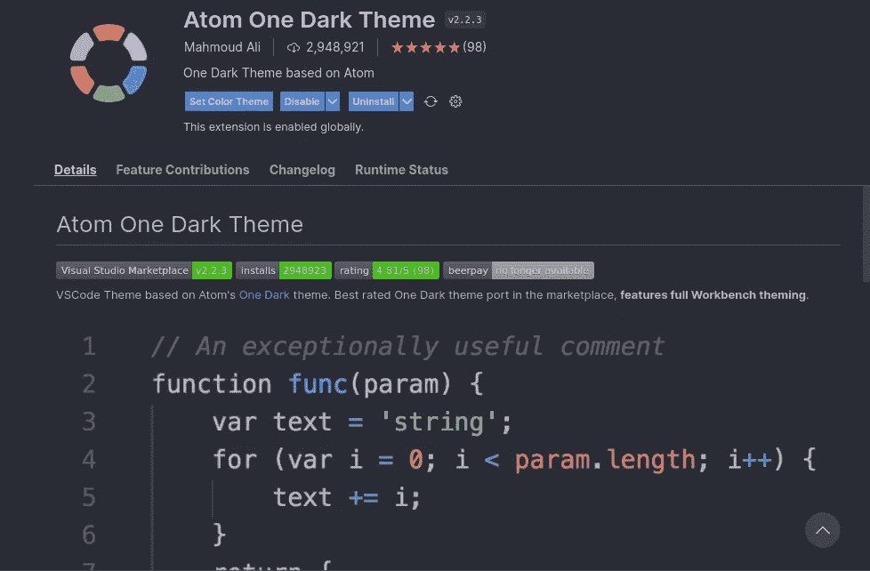
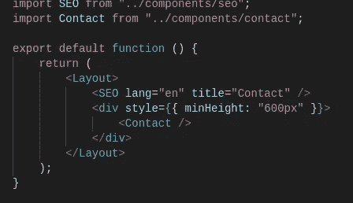
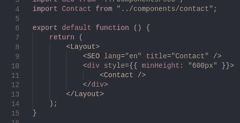
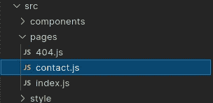
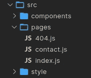
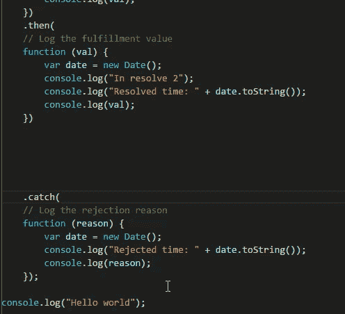
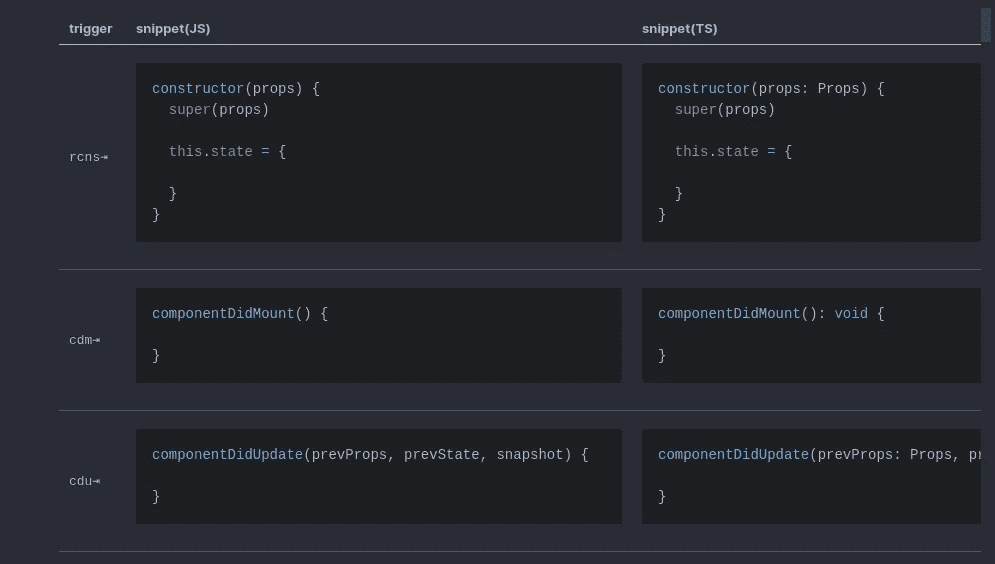
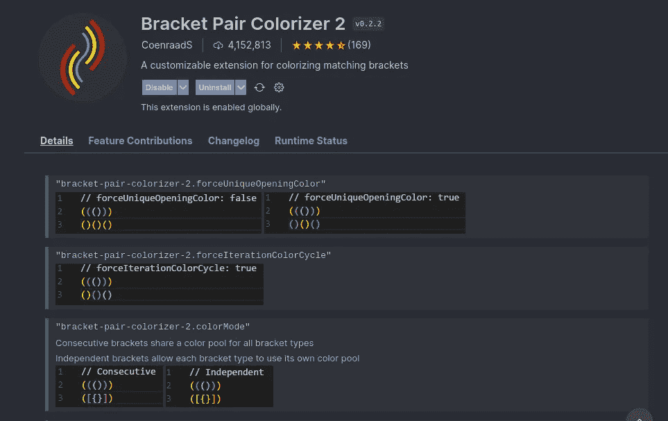

# 我最喜欢的 VS 2022 代码扩展

> 原文：<https://towardsdatascience.com/best-vs-code-extensions-of-2022-e9b49990cb4b>

## 作为一名软件工程师和学生


照片由[加布里埃尔·海因策](https://unsplash.com/@6heinz3r?utm_source=medium&utm_medium=referral)在 [Unsplash](https://unsplash.com?utm_source=medium&utm_medium=referral) 上拍摄

作为一名 web 开发人员、移动应用程序开发人员，以及最近作为一名 c 语言嵌入式系统开发人员，我几乎在任何事情上都使用 VSCode。

这里有一些我最喜欢的扩展，我用它们来使我的 VSCode 看起来像我想要的那样，并使我的生活变得更简单。

## 1. [Atom One 黑暗主题](https://marketplace.visualstudio.com/items?itemName=akamud.vscode-theme-onedark)

我尝试了很多主题和配色方案，但 Atom One 深色主题是我最喜欢的，因为颜色有有用的对比，看起来很棒。



来自 vscode [市场](https://marketplace.visualstudio.com/)的截图。



主题之前/之后的 React 代码示例。来自作者的代码

用`ext install akamud.vscode-theme-onedark`安装

## [2。VSCode 大图标](https://marketplace.visualstudio.com/items?itemName=emmanuelbeziat.vscode-great-icons)

比最常见的图标扩展 [vscode-icons](https://marketplace.visualstudio.com/items?itemName=vscode-icons-team.vscode-icons) 稍逊一筹，但却是我个人的最爱。我觉得这里的图标看起来比默认的好多了，文件夹图标让我更容易分辨我在哪个目录。



作者截图

用`ext install emmanuelbeziat.vscode-great-icons`安装

## [3。饿删](https://marketplace.visualstudio.com/items?itemName=jasonlhy.hungry-delete)

非常简单，但是非常方便。这在删除几个空行时很有帮助，可以去掉所有的空格。它让我不必选择多行或者总是点击`Ctrl-Backspace`。



将捕捉移动到顶部只需要一次 ctrl-backspace。Gif 取自[扩展列表](https://marketplace.visualstudio.com/items?itemName=jasonlhy.hungry-delete)。

`ext install jasonlhy.hungry-delete`

## [4。直播服务器](https://marketplace.visualstudio.com/items?itemName=ritwickdey.LiveServer)

这只是一个网页开发，但超级容易的静态和动态页面。对我来说，它最有用的特性是在修改时自动重载。


自动重装功能。Gif 取自[扩展列表。](https://marketplace.visualstudio.com/items?itemName=ritwickdey.LiveServer)

`ext install ritwickdey.LiveServer`

## [5。制表](https://marketplace.visualstudio.com/items?itemName=albert.TabOut)

像饥饿删除，这是一个方便的小键盘绑定，让您的光标离开括号，引号，和括号与一个标签。我发现这很有用，因为 VSCode 会自动为您补全括号；您可以按 tab 键而不是箭头键。

`ext install albert.TabOut`

## 6.片段

如果你不知道片段，你应该知道。当你在一门语言中倾向于重复代码块时，它们非常有用。

片段是来自扩展或您自己编写的小的预编程字符串，可以自动完成为更大的代码块。我发现这在编写 React 组件时特别有用，因为其中有大量重复的样板代码。



[React Snippets 扩展](https://marketplace.visualstudio.com/items?itemName=runningcoder.react-snippets)附带的一些代码片段

用`ext install runningcoder.react-snippets`安装如上所示的 React Snippets 扩展

## 7.[支架对着色机 2](https://marketplace.visualstudio.com/items?itemName=CoenraadS.bracket-pair-colorizer-2)

这个扩展通过用独特的颜色突出显示括号和圆括号，使我一眼就能看到我所在的上下文。当您选择右括号和左括号时，它还会在它们之间画一条线。

̶a̶v̶a̶i̶l̶a̶b̶l̶e̶̶h̶e̶r̶e̶,̶̶o̶r̶̶i̶n̶s̶t̶a̶l̶l̶̶i̶t̶̶d̶i̶r̶e̶c̶t̶l̶y̶̶b̶y̶̶o̶p̶e̶n̶i̶n̶g̶̶v̶s̶c̶o̶d̶e̶,̶̶t̶y̶p̶i̶n̶g̶̶c̶t̶r̶l̶+̶p̶̶t̶h̶e̶n̶̶p̶a̶s̶t̶i̶n̶g̶̶e̶x̶t̶̶i̶n̶s̶t̶a̶l̶l̶̶c̶o̶e̶n̶r̶a̶a̶d̶s̶.̶b̶r̶a̶c̶k̶e̶t̶-̶p̶a̶i̶r̶-̶c̶o̶l̶o̶r̶i̶z̶e̶r̶-̶2̶̶t̶o̶̶i̶n̶s̶t̶a̶l̶l̶̶d̶i̶r̶e̶c̶t̶l̶y̶.̶



来自 vscode [marketplace](https://marketplace.visualstudio.com/) 的截图。

**更新* *

有人在 2021 年 9 月的评论中向我指出，彩色括号是 VS 代码中的原生元素！要启用它，请在 settings.json 中更改这两行(或者只搜索它们)

```
{
    "editor.bracketPairColorization.enabled": true,
    "editor.guides.bracketPairs":"active"
}
```

# 奖金:

以下是我使用的或其他人发现有用的一些其他技巧或其他扩展:

1.  Vim 有一点学习曲线，但是一旦你习惯了，你可以更快地导航和编辑你的代码。
2.  [**自动结束标记**](https://marketplace.visualstudio.com/items?itemName=formulahendry.auto-close-tag) —自动完成 HTML 和 XML 结束标记。网页开发者必备。
3.  [**Git Graph**](https://marketplace.visualstudio.com/items?itemName=mhutchie.git-graph) —给出 git repo 中分支和变化的直观线性图形。您甚至可以直接从图中执行 git 操作！
4.  [](https://marketplace.visualstudio.com/items?itemName=smcpeak.default-keys-windows)**—也许更有经验的 Linux 用户知道这是否有充分的理由，但 Windows/Mac 上的大多数键盘快捷键使用的键比 Linux 上的少。我刚刚开始全职使用 Linux，并且习惯了 Windows 的键盘绑定。这使得转换更容易，这样我就不必重新学习任何键盘快捷键。**
5.  **[**快捷键**](https://code.visualstudio.com/shortcuts/keyboard-shortcuts-windows.pdf) —键盘快捷键是加速你编码的最好方法之一。VSCode 有大量有用的键盘快捷键，可以加快打字和编辑的速度。完整列表已链接，但以下是我最常用的几个:**

****查看器快捷键:****

**`Ctrl+`` —切换终端。**

**`Ctrl+B` —切换侧面板，以便为编辑器留出更多空间。**

**`Ctrl+Shift+P` —这将打开命令面板，其中包含大量与您的工作区相关的命令。**

****代码导航:****

**`Ctrl+Shift+O` —“转到符号”命令。这让你可以搜索你的函数和变量，这使得在一个文件中访问函数变得更快。**

**`Ctrl+Alt+Up/Down` —向上或向下复制您的行。**

**`Ctrl+X` —正常情况下使用选择，但在 VSCode 中，如果光标停留在一行上，它将剪切整行而不选择。Ctrl-C 也一样！**

**`Ctrl+Enter` —将光标移动到下面的新行。如果我在语句中间编辑完了什么，我会一直用这个。**

**`Ctrl+/` —不特定于 VSCode，但是您应该知道如何添加和删除行注释。**

****目录导航:****

**`Ctrl+P` —打开搜索以快速移动到项目中的其他文件。**

**同样的快捷方式，带有 Chrome 标签，可以让你前后移动到之前打开的文件。**

**再次和 Chrome 一样，关闭你打开的文件。**

**`Ctrl+Shift+F` —搜索整个项目，而不仅仅是打开的文件。**

**感谢阅读！请在评论中告诉我你最喜欢的代码扩展和快捷键。**